# Pre-Workshop Setup

### Please complete the following before the workshop:

- Join the workshop Google Group (for file sharing and GEE Cloud Project access)
- Make a SEPAL account and request additional resources (for days 1 and 5).
- Create a Collect Earth Online account and join the Liberia workshop institution (for day 2).
- Download Pix4Dmapper software to your computer, download the Pix4Dcapture app to your phone, and activate your free 14-day Pix4D trial (for days 2, 3, and 4).
- Install QGIS (for days 2, 3, and 4)
- Make a Google Earth Engine account (for days 1, 2, 4, and 5)
    - Joining the workshop Google Group will give you access to the **pc556-ncs-liberia-forest-mang** GEE Cloud Project, but you may also choose to make a *Workshop type* GEE Cloud Project of your own 
-  Download Google Earth Pro software to your computer (for day X).  

## Workshop Google Group

Sign in to [Google Groups](https://groups.google.com/) or click on the square of 9 dots at the top right of your gmail.

Set the search dropdown to “All groups and messages”.

Search for **Liberia_forest_workshop**.

Click on the group and then click the *Ask to join group* button.

## SEPAL Account

Create a SEPAL account and request additional resources to be able to access the stratified estimator analysis apps.

Go to this page:
[S E P A L](https://sepal.io/)

Click `Launch` and then `Sign Up`.

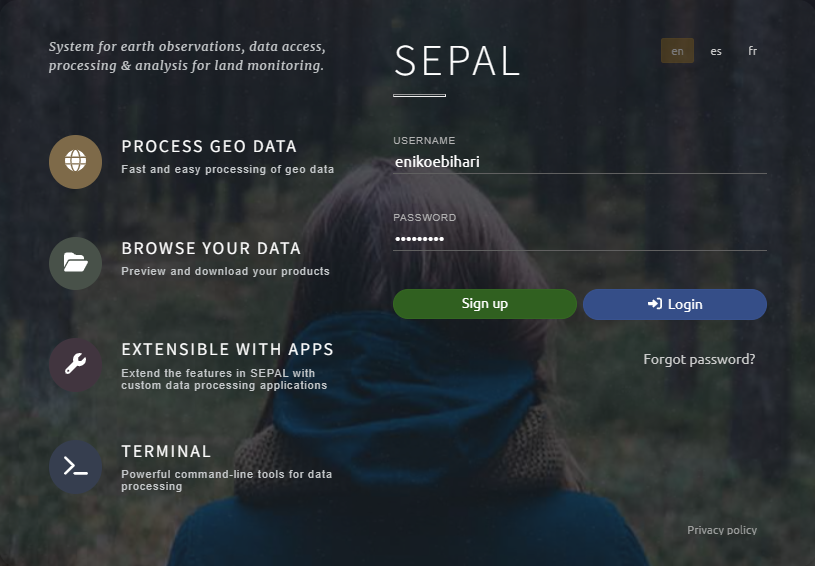

Fill out the information and follow instructions to create and activate an account.

You should then receive an email with a link to confirm your email.  Click this link and create a password.

Log in to your SEPAL account.

On the lower right corner of the SEPAL page, click on the button that says `$ 0/h`.

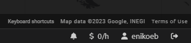

On the new page, click `Request additional resources`.

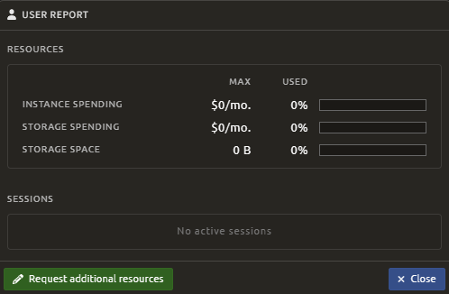

On the new page, fill out each field with the following values: $15, $15, and 30 GB (these are just dollar estimates of the amount of resources you will be using with your analyses on SEPAL - YOU DO NOT HAVE TO PAY THIS AMOUNT).  Also, fill out this brief message with your own information about what you are using SEPAL for:

“I am a [YOUR PROFESSION/JOB TITLE] and I work for [YOUR EMPLOYER] in Liberia.  I am attending one of  SERVIR's  geospatial analysis workshops at the  University of Liberia?, and we will be using SEPAL to learn about sample-based area estimation and accuracy assessment.”

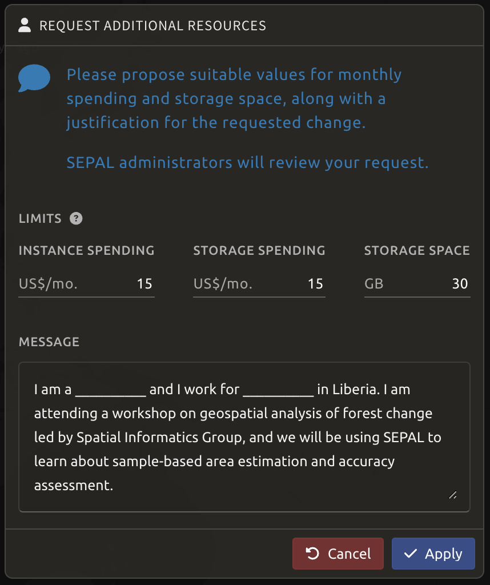

Within a few days, SEPAL admins should grant you these resources, which will allow you to use SEPAL apps for free.

## Collect Earth Online Account

Create a Collect Earth Online Account and request to join the Guyana Workshop institution.

Go to this page:
[Collect Earth Online Home - Collect Earth Online](https://www.collect.earth/)

Click `Register` at the top right.

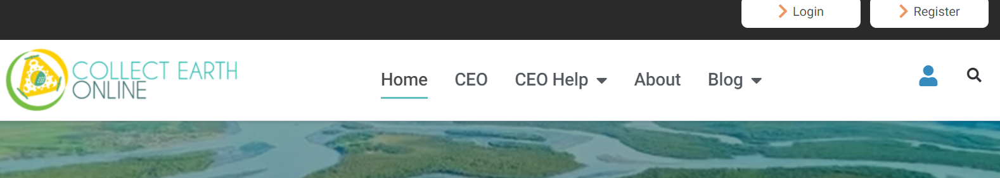

Fill out the information and follow instructions to create and activate an account.

You should then receive an email with a link to confirm your email.  Click this link.

Log in to your CEO account.

On the main CEO page, in the search bar at the top left, search for an institution called “Liberia Geospatial Workshop.” Click `Visit`.  is it called Liberia Geospatial Workshop? 

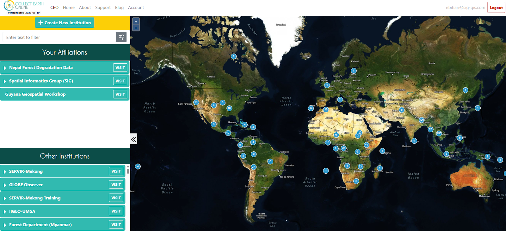

On the institution’s home page, go to the `Users` tab and click `+ Request Membership`.

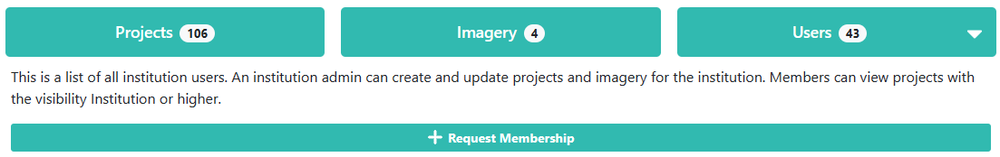

Admins of the institution can then add you as either a member or an admin.

## Pix4D Software

Create a Pix4D account, activate the free 15-day trial, download Pix4Dmapper to your laptop and download Pix4Dcapture to your phone.

#### 1. Create a Pix4D account

Go to this page:
[Professional photogrammetry and drone mapping software | Pix4D](https://www.pix4d.com/)

Click `Login`.

Click `Create an Account`.  Fill out the information and follow instructions to create and activate an account.

You should then receive an email that looks like this.  Activate your account by clicking `confirm`.

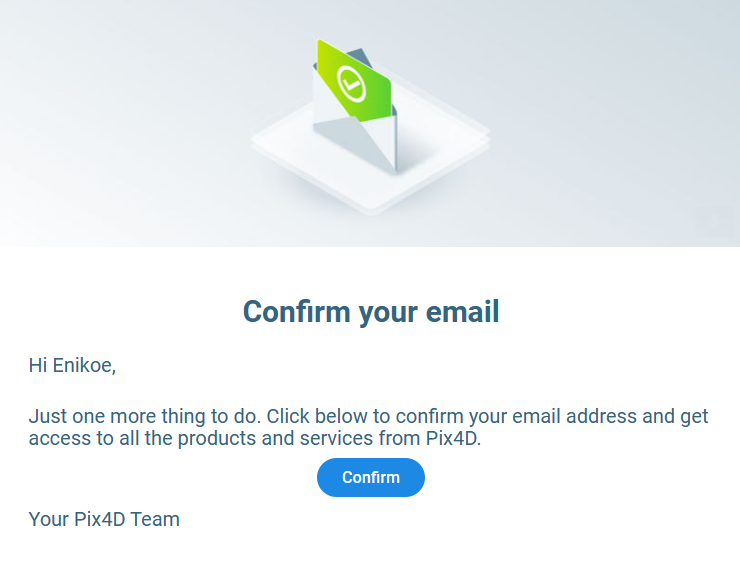

Log in to your Pix4D account again.

Go to `Account` at the very top of the screen under your name.

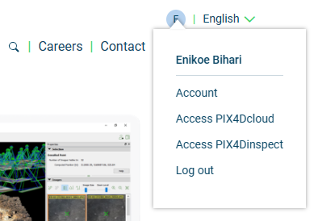

On the Account page, click the`Plans and Licenses` tab on the left, then the `Licenses` tab at the top, and then the `Manage licenses` button.

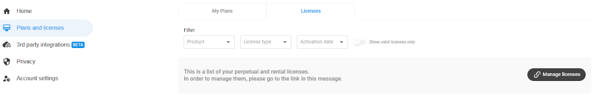

Now, it should take you to a page that looks like this.  Click `Get a free trial`.

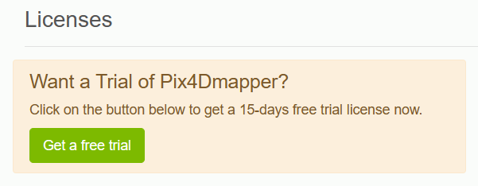

Now, on the Licenses page, you should see your 15-day free trial.  You should be able to use Pix4Dmapper for free for 15 days.

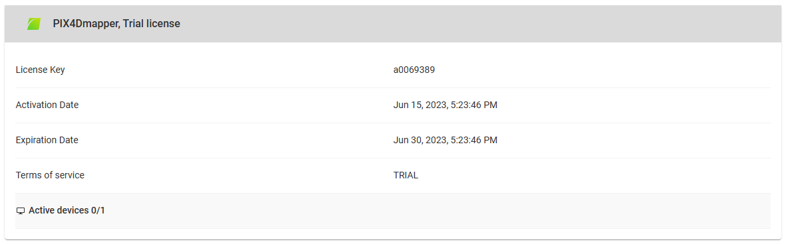

#### 2. Download Pix4Dmapper onto your computer

Log in to your Pix4D account.

Click `Try for Free` at the very top left of the screen.

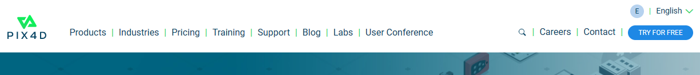

On the new page, scroll down to the `Pix4Dmapper` section and click `Start you 15-day trial`.

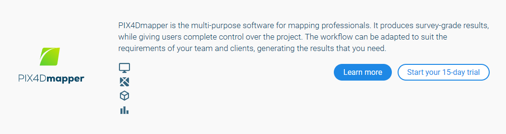

On the new page, click `Download`.

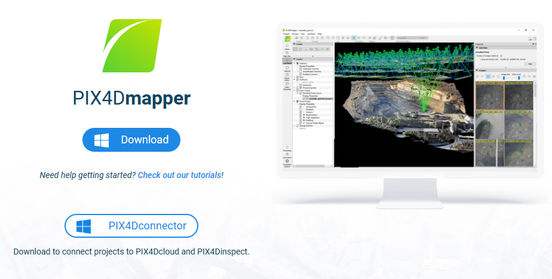

Open the `.msi` file that is downloaded.

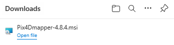

Click through the Pix4Dmapper Setup Wizard, and follow instructions on how to install the software.  Unless you want to change them, you can keep most of the default settings.  

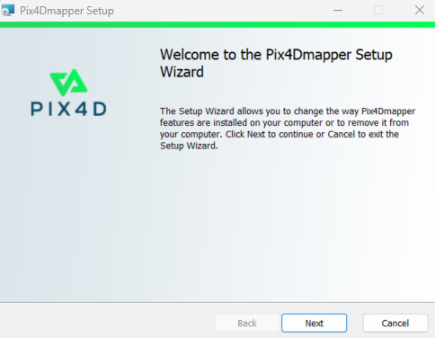

When it is done installing, click `Finish`.

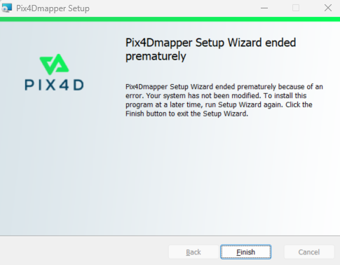

#### 3. Activate  the free 15-day trial

Open Pix4Dmapper on your computer

Sign in with your Pix4D login information you created in step 1.

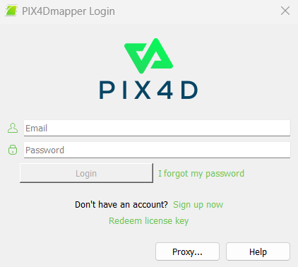

Accept the License Agreement.

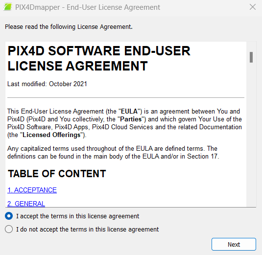

Select the free trial you just activated on your Pix4D account.

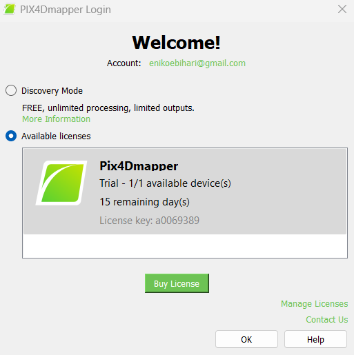

You should now see the Pix4Dmapper home screen.

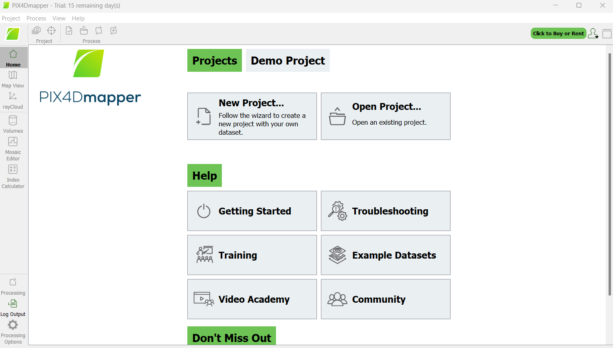

#### 4. Download Pix4Dcapture onto your phone

In your App Store/Play Store, search for “Pix4Dcapture”.

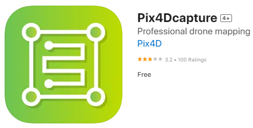

Download it onto your phone and open it.

Sign in with your Pix4D login information you created in step 1.

## QGIS Software

Download and install QGIS on your computer.

Go to the official [QGIS Download Page](https://qgis.org/download/).

Scroll down to the appropriate section based on your operating system (Windows, macOS, Linux).

For Windows: 
- Click on **Long Term Version for Windows**.
- After downloading the installer, double-click the `.exe` file and follow the installation wizard.

For macOS: 
- Select **Long Term Version for Mac OS**.
- After downloading the installer, open the `.dmg` file and drag QGIS to your Applications folder.

Once installed, launch **QGIS** from your applications menu.

**QGIS** should now be installed on your computer.

## GEE Account

Create a [Google Earth Engine account](https://code.earthengine.google.com/register). 

You will need a [Google account](https://accounts.google.com/signup). 

Create a GEE account for non-commercial purposes.

 join a non-commercial google cloud project? 

## Google Earth Pro Software

 needed? 

Download Google Earth Pro Software to your computer.

Go to this page:
[Earth Versions – Google Earth](https://www.google.com/earth/versions/)

Scroll down to the bottom of the page and click `Download Earth Pro on Desktop`.

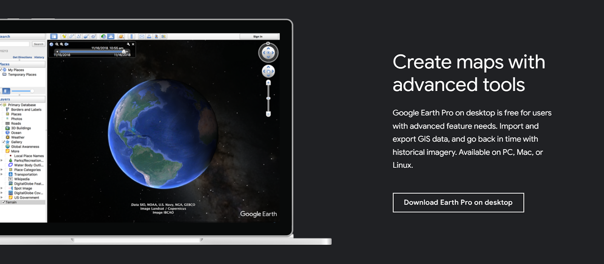

Open the `.exe` file that is downloaded.

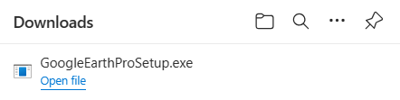

Google Earth Pro should now be downloaded to your computer.

