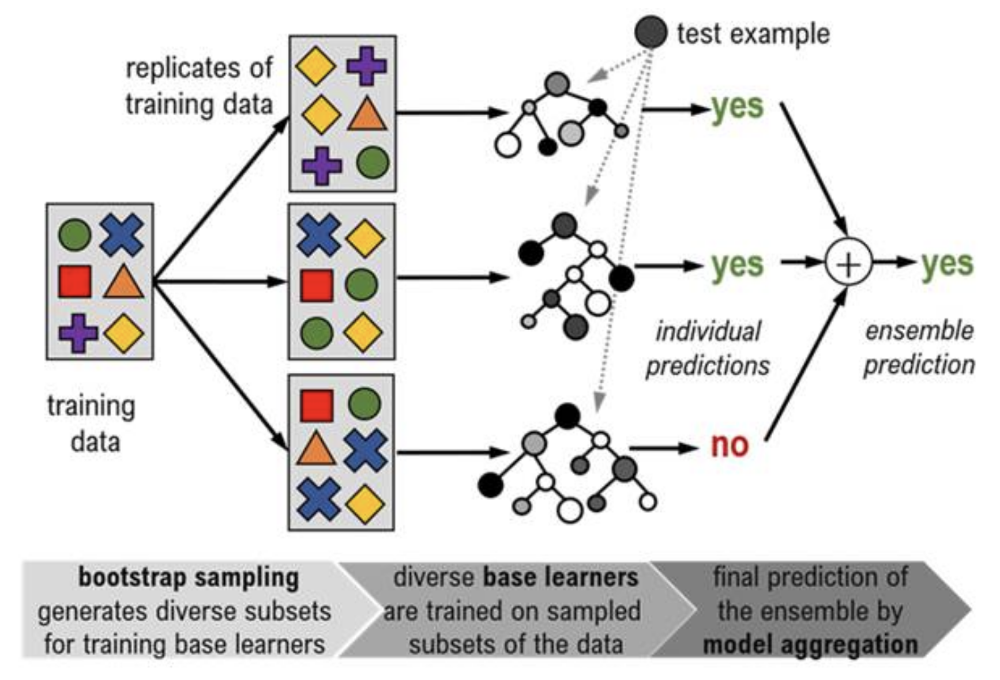

# Introduction to Machine Learning
Machine Learning (ML) is a type of artificial intelligence (AI) 
where computers learn patterns from data to make predictions or decisions without explicit programming. 

It involves training algorithms on large datasets to identify patterns and relationships between input variables, which can then be used to make predictions or decisions, improving prediction accuracy over time.

**Random Forest** is a simple type of ML.

## Terms to Know

- Training Data – The dataset used to train an ML model. 
    - Sometimes called "reference data".

- Testing Data – A separate dataset used to evaluate the model’s performance.
    - This is usually proportionally much smaller than the training data. 

- Decision Tree – A model that makes predictions by splitting data into branches based on feature values.
    - Random Forest is an ensemble learning method that builds multiple decision trees and combines their outputs for better accuracy and robustness.

- Features - The input variables used in a machine learning model to make predictions. Features provide the information that models use to learn patterns and make predictions.
    - In our case, the *features* are the available *bands* of the composite image we give the ML model.

- Feature Importance – A score that indicates how valuable each feature is in making predictions.

- Overfitting - This happens when a machine learning model learns too much detail and noise from the training data, making it perform very well on the training set but poorly on new (unseen) data. This means the model is too specific to the training data and does not generalize well.
    - Random Forest is quite resistant to overfitting, but it is still possible if: 
        - Model is Too Complex – It captures patterns including random noise rather than just meaningful trends.
        - Too Many Features – If the model uses too many irrelevant features, it can learn patterns that don’t apply to new data.
        - Not Enough Data – A small dataset may not represent the full range of possible inputs, causing the model to memorize rather than learn.

# Random Forest

A model is the mathematical function or algorithm that learns patterns from data and makes predictions. One of the things a model can be used for is **classification**, for our case it will be image classification.

**Random Forest** is a machine learning model that makes predictions by combining multiple decision trees. It is called a "forest" because it consists of many trees, and each tree votes to make the final decision.

In machine learning, a **classifier** is an algorithm that automatically sorts data into categories or classes. The goal of a classifier is to learn from training data and make accurate predictions about new data.

A **Random Forest Classifier** is a model trained to classify images into categories like "forest" or "non-forest".

It performs well in predicting most classes, but may struggle with classes that have similar characteristics.

### General Steps of Random Forest

1. **Prepare the training data**
    - Establish the input variables (the feature, which are bands of your training image)
    - Establish the target labels (e.g., land cover classes)
    - Create a set of sample points with given target labels and extract feature values from the image
2. **Split the sample dataset into training and testing sets**
3. **Create and train several decision trees**
    - All trees are each a bit different as they are trained independently
    - Bootstrap sampling: A different random selection from the training data is used to train each tree
    - Random feature selection: At each node of the tree a random set of input variables (features) is chosen on which to base the decision of that node

4. **Predict class labels for an image**
    - Given an image where none or only some of the pixel labels are known, each tree makes a predition for every pixel
    - (e.g., Is this forest or non-forest?)
5.  **Aggregate the trees' predictions to reach a final decision** 
    - (e.g., majority answer)
5. **Evaluate the model using the testing dataset**

## Advantages of Random Forest
- **High Accuracy** – Random Forest is one of the most accurate machine learning algorithms, often outperforming simpler models on various datasets.
- **Handles Large Datasets Efficiently** – It works well with large datasets and high-dimensional data, making it scalable for big data applications.
- **Handles High-Dimensional Data** – It can process thousands of input variables without requiring feature selection, automatically determining the most important ones.
- **Feature Importance Estimation** – It provides rankings of feature importance, helping to identify which variables contribute most to predictions.
- **Built-in Error Estimation** – As trees are added, the model generates an unbiased estimate of generalization error using out-of-bag (OOB) samples.
- **Robust to Overfitting** – Unlike single decision trees, Random Forest reduces overfitting by averaging multiple trees, leading to better generalization.
- **Works Well with Missing Data** – It has built-in methods for handling missing values and can still perform well even when a significant portion of the data is missing.
- **Handles Unbalanced Data Well** – By averaging multiple models, it is less biased toward dominant classes in imbalanced datasets.

## Disadvantages of Random Forest
- **Potential Overfitting** – While Random Forest reduces overfitting compared to individual decision trees, it can still overfit in cases where the data is very noisy, leading to poor generalization.
- **Not Ideal for Small Datasets** – When working with very small datasets, a simpler model like a single decision tree or logistic regression might perform just as well or better, with less complexity and computation.
- **Features with many unique categorical variables can be overvalued** - Complex categorical features tend to look more important than they actually are which can mislead feature importance scores and feature selection.
- **Struggles with Out-of-Distribution Samples** – Random Forest does not extrapolate well for unseen data points outside the training distribution, making it less effective in situations requiring generalization beyond the training data range (e.g., extreme values in regression tasks).
- **High Computational Cost** – Since Random Forest involves training multiple decision trees, it requires more computational resources and longer training times, especially for large datasets.
- **Memory-Intensive** – Storing multiple decision trees can be memory-consuming, especially when working with very large datasets.
- **Less Interpretable Than a Single Decision Tree** – Unlike a simple decision tree, where the decision-making process is easy to follow, Random Forest operates as an ensemble, making it harder to interpret and explain decisions.

## Sources
- Analytics Vidhya. (2021, June). Understanding Random Forest Algorithm With Examples. Retrieved from https://www.analyticsvidhya.com/blog/2021/06/understanding-random-forest/
- Breiman, L. (2001). Random Forests. Machine Learning, 45(1), 5–32.
- Coursera. (2024, December 9). What are the advantages and disadvantages of Random Forest? Coursera. Retrieved February 7, 2025, from https://www.coursera.org/articles/advantages-and-disadvantages-of-random-forest
- GeeksforGeeks. (n.d.). Random Forest Algorithm in Machine Learning. Retrieved from https://www.geeksforgeeks.org/random-forest-algorithm-in-machine-learning/
- Great Learning. (2023, June 15). Random Forest Algorithm in Machine Learning. Great Learning. Retrieved February 7, 2025, from https://www.mygreatlearning.com/blog/random-forest-algorithm/
- Hastie, T., Tibshirani, R., & Friedman, J. (2009). The elements of statistical learning: Data mining, inference, and prediction (2nd ed.). Springer.
- Ho, T. K. (1995). Random Decision Forests. Proceedings of the 3rd International Conference on Document Analysis and Recognition, 278–282.
- Liaw, A., & Wiener, M. (2002). Classification and Regression by randomForest. R News, 2(3), 18–22.
- Rebellion Research. (2023, February 7). What are the advantages and disadvantages of Random Forest? Rebellion Research. Retrieved February 7, 2025, from https://www.rebellionresearch.com/what-are-the-advantages-and-disadvantages-of-random-forest
- [image] MyGeoBlog. (2019, October 18). Using artificial intelligence for satellite image classification. MyGeoBlog. https://mygeoblog.com/2019/10/18/using-artificial-intelligence-for-satellite-image-classification/
- [image] Manning Publications. (n.d.). Bagging. Manning LiveBook. Retrieved February 6, 2025, from https://livebook.manning.com/concept/machine-learning/bagging

