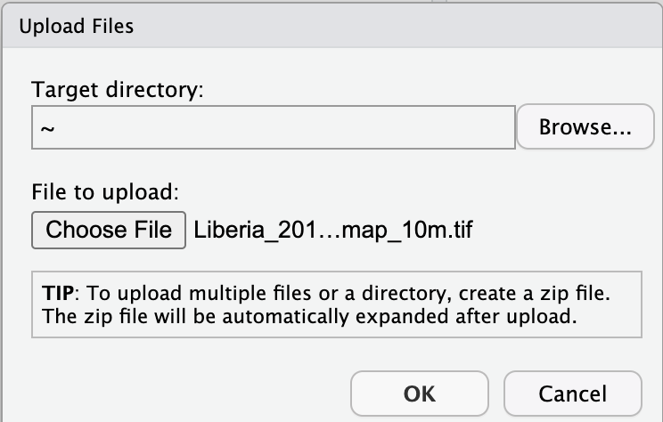

# Sampling Design using SEPAL

These instructions are adapted from [OpenMRV](https://www.openmrv.org/web/guest/w/modules/sepal-ceo/sample-design-and-stratification) and ....

Use [this resource](https://docs.google.com/document/d/1IlhoZKPuslPBu968-u3oaErL0sremN1Hekp3cctFQlA/edit?usp=sharing).

We will use the SEPAL SAE-Design tool to distribute sample points usind a stratified random sampling approach. The SAE-Design tool will generate a set of stratified random points that are placed in each of the different map classes (which we will now call strata)represented in your map. 

## Pre-requisites
- A SEPAL account and a Collect Earth Online (CEO) account. 
- A previously generated map to use for stratification.
    - For this workshop you will need to first need to download the map to your local machine, and then upload it to SEPAL following the instructions below.
- If you have a large AOI, you may need to first increase the size of your instance for faster processing.

# 1. Uploading your stratification map
You will need to upload a stratification map to SEPAL. 

There are two tools that can be used to upload files. The first is RStudio, and the second is the File transfer Management app.

For either approach, first select the purple wrench Apps button. If you have an existing tab open, you may need to click the plus sign in the top right.

To use RStudio, choose the R Studio application. You may be prompted to enter your SEPAL username and password to enter R Studio.

 

a. This will open an instance of RStudio, an IDE for the R programming language.

b. You should see a ‘Files’ tab in the lower right window.

If not, you may need to adjust the window layout. To do this, move your mouse to the right-hand side of the window where a four-way arrow will appear. Click and drag your mouse to the left to reveal the right pane.

 

c. Click the Upload button that is located in the lower right side of the R Studio interface (see below).

 

d. In the Upload Files window, click Choose File.

e. Navigate to the correct location on your drive, select your map and click Open.

f. Once you’ve selected this file, click OK to complete the upload (see below).

 

g. You will see your file appear in the list of files in the lower right-hand pane.

 

h. You may now close the RStudio instance by clicking the tab’s x.

 

To use the File transfer manager, select the File transfer management application.

a. Under Upload to Sepal, click on the drop down Select table type menu. Click on the correct file type for your map.

b. Click on the paperclip icon.

c. Navigate to the correct location of your map on your drive, select your map and click Open.

d. Click Import

# 2. Creating a stratified random sample

*NOTE: You can view a demonstration of creating a stratification on this [YouTube demo video](https://www.youtube.com/watch?v=mbskeQNjj7A).*

We will use SEPAL to create a stratified random sample 

