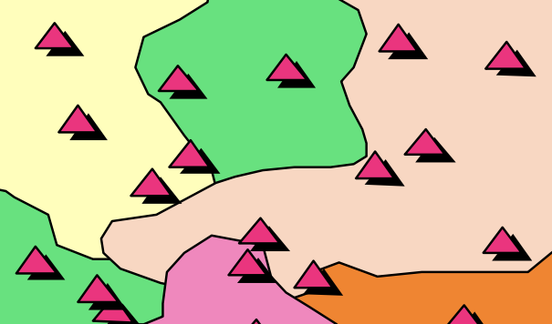

# Overview: What is Sampling Design?

Sampling design refers to the structured approach used to select a subset of data points or observations from a larger population or dataset. A well-thought-out sampling design ensures that the selected sample is representative of the broader population, reducing bias and improving the reliability of results.

Sampling design has uses in many fields, but we will be focusing on three main use cases:
- Gathering samples for training machine learning algorithms
- A statistical approach used to infer the characteristics of a larger area or population by analyzing data from a representative subset (sample) of that area
    - Namely, *sample-based area estimation*, for estimating areas of a feature and quantifying uncertainties, avoiding the bias inherent in using maps for area estimation
- Extracting samples for quality control / accuracy assessment

# What are the goals of a good sampling design?

1. **Representativeness**
- Ensure the sample accurately reflects the population or area of interest.
- Include all key subgroups or characteristics to avoid bias.
- Achieve proportional representation where needed, such as in stratified sampling.
- Avoid over-representing specific regions or under-sampling others.
- Ensure variability within each class is captured in the sample.
2. **Efficiency and Practicality**
-  Maximize the accuracy and reliability of the estimates while minimizing resource use, such as time, cost, and effort.
- Estimate the available resources and the number of samples needed to achieve goals early on in your design.
- Some methods for improving efficiency include stratified sampling and systematic sampling.
3. **Unbiased Estimation**
- Avoid systematic errors in selecting or measuring samples.
- Use probability-based methods to ensure each unit has a known and non-zero chance of selection, which should be recorded for later analyses.
4. **Flexibility**
- Allow for adaptability to unforeseen challenges during sampling, such as planning for iterative additional sampling.
- Plan for potential integration of additional samples or modifications without compromising the design's integrity.
5. **Statistical and Model Validity**
- Allow for robust statistical analysis and meaningful inference about the population.
- Ensure the sample size is adequate for achieving reliable estimates and uncertainties (when applicable).
    - For most statistical analyses important to our use case, at least 30 samples from the class of interest are necessary for reliable results.
- Avoid over-fitting or under-fitting a machine learning model.
    - Overfitting occurs when a model learns patterns, noise, or anomalies specific to the training data, rather than generalizable patterns relevant to the entire population.
    - Underfitting occurs when a model fails to learn sufficient patterns from the data, resulting in poor model performance.
6. **Reproducibility**
- Design a sampling process that can be repeated by others for consistency and verification.
- Use clear, documented procedures for sample selection and measurement.

For training machine learning algorithms, sampling design is critical to ensure that the data used to train the model covers the variability in the dataset, preventing overfitting or underfitting. Techniques like stratified sampling can be employed to ensure balanced representation of different classes, especially in imbalanced datasets. Random sampling can help ensure that the training data is unbiased, while techniques like cross-validation split the data into training and testing subsets to evaluate model performance effectively.

In sample-based area estimation, such as estimating forest cover, a representative sampling design ensures accurate population metrics while minimizing variance and resource use. Probability-based designs, where every location has a known chance of being sampled, are essential for unbiased estimates. Geographical balance is also crucial to ensure all regions within the study area are adequately represented. Common techniques include systematic sampling, stratified random sampling, and cluster sampling, each tailored to the study's objectives and constraints.

A carefully designed sample can yield reliable estimates of key population parameters, such as the percentage of forest cover. The primary aim of sampling is to obtain an unbiased estimate of a population characteristic (e.g., area proportion) while minimizing variance, considering available resources. When planning a sample design, two important considerations are: first, whether the design is probability-based, ensuring every location has a chance of being sampled; and second, whether it is geographically balanced, ensuring representation across all areas within the study region.

## Stratified Random Sampling

There are several different ways to sample an area in order to achieve a representative sample or the landscape and the variations within it. Sample data gathered in CEO can be used for a variety of purposes, including map validation.

 

**Systematic Sampling**: observations are placed at equal intervals according to a strategy

 

**Simple Random Sampling**: observations randomly placed

 

**Stratified Random Sampling**: Using a map to inform the design, a minimum number of observations randomly placed in each category

Stratified random sampling has two key benefits
* Updates map-based areas to increase precision (reduces uncertainty)
* Helps increase chance of having plots in rare classes

We will use stratified random sampling to perform a map validation analysis. You can use different tools, such as Google Earth Engine, to generate the locations of the sample points. 

We will use the map you developed in another training to illustrate this process. This is an image of multi-temporal change detection differences, highlighting the flooded regions in blue and areas that converted from water to dry land in red. This product was generated for October 2021, using January 2023 as reference for dry land.

 

We have pre-calculated approximate pixel counts of the map classes using Google Earth Engine.

| Map Value | Readable Map Class | Pixel Count      | % of Total   |
|-----------|--------------------|------------------|--------------|
| 1         | no change          | 157,468,716      |  99.11%      |
| 2         | flood              | 278,136          |  0.18%       |
| 3         | water removed      | 1,141,884        |  0.72%       |

If we had used systematic or random sampling we might only get a flooded or water removal point in less than 1 out of every 100 points we collect. That is super inefficient for looking at the classes of interest. With stratified random sampling I can put a minimum value on the number of points in each map class, or strata. We have pre-prepared a set of points with 30 in the smaller two stratas and the remaining 40 points in the area mapped as no change from flooding, for a total of 100 sample points. 
The stratified random sampling was performed in GEE using this [script](https://code.earthengine.google.com/0d872d5d419349fadd40399620f397f1), which exports a CSV of sample locations ready to be imported into CEO. 

*Download that CSV file [here](https://drive.google.com/file/d/1pkTgPXJFrJp7FePiz8UwcB6xEoFEWfYr/view?usp=share_link).*

The included 100 samples are distributed within the assigned map strata.
 

## Map Validation

Map validation can be performed by comparing the map classes of representative sample points to reference labels at those locations, which are collected using human interpretation and are considered to be ‘correct’ labels for these points. If the rates of agreement between the map labels and the interpreter reference labels are very high then we can infer the map is a good representation of the mapped characteristics. 

### Confusion Matrix

We can quantify the accuracy of the map using a confusion matrix (error matrix). The reference data dictates the actual value (the truth) while the left shows the prediction (or map classification).
    - True positive and true negative mean that the classification correctly classified the labels (e.g., a flood pixel was correctly classified as flood). 
    - False positive and false negative mean that the classification does not match the truth (e.g., a flood pixel was classified as no-flood) 

 

Let’s fill in this confusion matrix with example values if 100 points were collected.
 

**Producer’s Accuracy**

* The percentage of time a class identified on the ground is classified into the same category on the map. The producer’s accuracy is the map accuracy from the point of view of the map maker (producer) and is calculated as the number of correctly identified pixels of a given class divided by the total number of pixels in that reference class. The producer's accuracy tells us that for a given class in the reference pixels, how many pixels on the map were classified correctly.  **The percentage of time a class identified on the ground is classified into the same category on the map.**
* Producer's Accuracy (for flood) = True Positive / (True Positive +False Positive)
* Producer's Accuracy (for no-flood) = True Negative / (True Negative +False Negative)

**Omission Error**

* Omission errors refer to the reference pixels that were left out (or omitted) from the correct class in the classified map. An error of omission will be counted as an error of commission in another class. (complementary to the producer’s accuracy)
* Omission error = 100% - Producer’s Accuracy
* (Flood) Omission Error is when ‘flood’ is classified as some ‘other’ category. 

**User’s Accuracy**

* The percentage of time a class identified on the map is classified into the same category on the ground. The user’s accuracy is the accuracy from the point of view of a map user, not the map maker, and is calculated as the number correctly identified in a given map class divided by the number claimed to be in that map class. The user’s accuracy essentially tells us how often the class on the map is actually that class on the ground.  **The percentage of time a class identified on the map is classified into the same category on the ground.**
* User's Accuracy (for flood) = True Positive / (True Positive +False Negative)
* User's Accuracy (for no-flood) = True Negative / (True Negative +False Positive)

**Commission Error**

* Commission errors refer to the class pixels that were erroneously classified in the map. (complementary to the user’s accuracy)
* Commission error = 100% - user’s accuracy.
* (Flood) Commission Error is when ‘other’ is classified as ‘flood’.

**Overall Accuracy**

* Overall accuracy = (True Positive + True Negative) / Sample size
* The overall accuracy essentially tells us what proportion of the reference data was classified correctly

## Unbiased Area Estimation

Often we create classification or change maps to estimate the amount of area that has a certain land cover type or underwent a certain type of change.  

Pixel counting approaches simply sum up the area belonging to each class. However, simple pixel counting is not the most precise or accurate way to do this, since classification maps have errors (both small and large) - originating from data noise, pixel mixing, or poor separation of classes by the classification algorithm.  Thus, pixel counting will produce biased estimates of class areas, and you cannot tell whether these are overestimates or underestimates. 

Sample-based approaches use manually collected samples and statistical formulas based on the sampling design to estimate class areas (essentially scaling up the data collected in samples to the entire area of interest).  They create unbiased estimates of area and can also be used to calculate the error associated with your map.  These approaches help quanitfy and reduce uncertainty, making the estimates more robust.  

