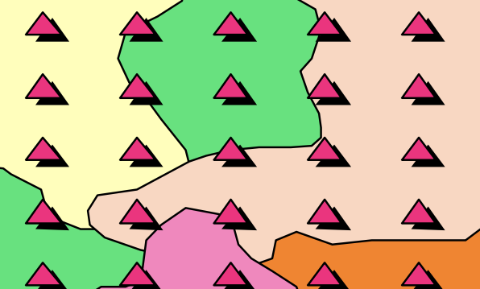

# Overview 

## What is Sampling Design?
Sampling design refers to the structured approach used to select a subset of data points or observations from a larger population or dataset. A well-thought-out sampling design ensures that the selected sample is representative of the broader population, reducing bias and improving the reliability of results. 

The design includes several key dedision points such as the: 
- total sample size (number of samples)
- sampling unit (size and shape of each sample)
- sampling technique (e.g. random, gridded, proportional allocation across strata) 
- method of sample distribution (tool used to assign sample locations)

## How is sampling used?
Sampling design has uses in many fields, but we will be focusing on three main use cases:
- Gathering samples for training machine learning algorithms
- A statistical approach used to infer the characteristics of a larger area or population by analyzing data from a representative subset (sample) of that area
    - Namely, *sample-based area estimation*, for estimating areas of a feature and quantifying uncertainties, avoiding the bias inherent in using maps for area estimation
- Extracting samples for accuracy assessment of a map

## What are the goals of a good sampling design?

1. **Representativeness**
- Ensure the sample accurately reflects the population or area of interest.
- Include all key subgroups or characteristics to avoid bias.
- Achieve proportional representation where needed, such as in stratified sampling.
- Avoid over-representing specific regions or under-sampling others.
- Ensure variability within each class is captured in the sample.
2. **Efficiency and Practicality**
-  Maximize the accuracy and reliability of the estimates while minimizing resource use, such as time, cost, and effort.
- Estimate the available resources and the number of samples needed to achieve goals early on in your design.
- Some methods for improving efficiency include stratified sampling and systematic sampling.
3. **Unbiased Estimation**
- Avoid systematic errors in selecting or measuring samples.
- Use probability-based methods to ensure each unit has a known and non-zero chance of selection, which should be recorded for later analyses.
4. **Flexibility**
- Allow for adaptability to unforeseen challenges during sampling, such as planning for iterative additional sampling.
- Plan for potential integration of additional samples or modifications without compromising the design's integrity.
5. **Validity for Analysis (Statistical and/or ML Model)**
- Allow for robust statistical analysis and meaningful inference about the population.
- Ensure the sample size is adequate for achieving reliable estimates and uncertainties (when applicable).
    - For most statistical analyses important to our use case, at least 30 samples from the class of interest are necessary for reliable results.
- Avoid over-fitting or under-fitting a machine learning model due to the number of training samples.
    - Overfitting occurs when a model learns patterns, noise, or anomalies specific to the training data, rather than generalizable patterns relevant to the entire population.
    - Underfitting occurs when a model fails to learn sufficient patterns from the data, resulting in poor model performance.
6. **Reproducibility**
- Design a sampling process that can be repeated by others for consistency and verification.
- Use clear, documented procedures for sample selection and measurement.

# Some Well Known Sampling Techniques

There are several different ways to sample an area in order to achieve a representative sample or the landscape and the variations within it. Here are a few ways to distribute samples.

 

**Systematic Sampling**: observations are placed at equal intervals according to a strategy

 

**Simple Random Sampling**: observations randomly placed

 

**Stratified Random Sampling**: Using a map to inform the design, a minimum number of observations randomly placed in each category

Stratified random sampling has two key benefits
* Updates map-based areas to increase precision (reduces uncertainty)
* Helps increase chance of having plots in rare classes

# Use cases for sampling

## Use 1: How samples are used as training data for a machine learning algorithm
In simple terms, training data is the information a machine learning algorithm uses to "learn" how to make predictions or decisions. 

- The training samples are like the examples to a teacher provides to a student. The sample data includes:
    - the *inputs*, which are the features and/or associated variables for the sample, 
    - and the "outputs", which are the correct labels for the samples.

- The algorithm looks at the training data and tries to figure out the rules or patterns that connect the inputs to the outputs

- Using the patterns it finds, the algorithm builds a model. A model is like a set of rules or a formula that can predict the output for new, unseen inputs.

- Once the model is sufficiently trained, it can be used to make predictions on new data that does not have provided labels.

In summary, a machine learning algorithm uses training data to learn patterns and create a model that can predict/classify new information.

#### Simple Example 
Imagine teaching a child to identify apples:

- **Training Data**: You show the child pictures of apples and oranges and tell them which is which.
- **Learning**: The kid notices patterns (apples are round, red or green, and have a stem).
- **Model**: The kid forms a mental "rule" to identify apples.
- **Prediction**: When shown a new fruit, the kid uses their rule to decide if it’s an apple.

### Sampling design considerations for ML algorithm training
For training machine learning algorithms, sampling design is critical to ensure that the data used to train the model covers the variability in the dataset, preventing overfitting or underfitting. Sometimes the full data set of samples is split into training and testing subsets to evaluate model performance, but separate sampling design for the validation data can also be done. Anything you want the ML algorithm to learn, should be provided as an example in the training samples.

## Use 2: Inferring characteristics of a population based on a sample (e.g. sample-based area estimation)
Historically, maps have been used to quantify the area of each class by pixel counting. Pixel counting approaches simply sum up the area belonging to each class. However, simple pixel counting is not the most precise or accurate way to do this, since classification maps have errors (both small and large) - originating from data noise, pixel mixing, or poor separation of classes by the classification algorithm.  Thus, pixel counting will produce biased estimates of class areas, and you cannot tell whether these are overestimates or underestimates. 

Sample-based approaches use manually collected samples and statistical formulas based on the sampling design to estimate class areas (essentially scaling up the data collected in samples to the entire area of interest). They create unbiased estimates of area and can also be used to calculate the error associated with an existing map. These approaches help quanitfy and reduce uncertainty, making the estimates more robust. 

These samples are often called *reference data*. For forest and land cover analysis applications, these sample data are typically collected in a program like CEO. 

## Sampling design considerations for quantifying the characteristics of a popultation
Probability-based methods of sampling are used to ensure each unit has a known and non-zero chance of selection, which is required for statistical analysis and uncertainty estimations. The major objective of the sample is to provide information that is representative of the full population.

In sample-based area estimation, such as estimating forest cover, a representative sampling design ensures accurate population metrics while minimizing variance and resource use. The selected type of sampling design is tailored to the study's objectives and constraints. 

A map is not necessary for selecting sample locations but it makes the representative sampling process far more efficient when you are looking at a characteristic of interest with a geographically small area within the population, reducing the total number of points you need to collect to meet your desired level of uncertainty in your estimates.

## Use 3: Map validation (accuracy assessment)

Map validation can be performed by comparing the map classes of representative sample points to reference labels at those locations, which are collected using human interpretation and are considered to be ‘correct’ labels for these points. If the rates of agreement between the map labels and the interpreter reference labels are very high then we can infer the map is a good representation of the mapped characteristics. 

This type of accuracty assessment is often done using a confusion matrix (also called and error matrix). See further explanation of this process below, but it will be covered in detail at the end of the workshop.

## Sampling design considerations for map accuracy assessments
When assessing the accuracy of a map, a random sample allows for a simple analysis in a confusion matrix. However, if you have rare classes you may only have a few points with which to analyze their accuracy in the map. Best practices suggest that sample sizes for each class should be at least 30 to ensure more robust and statistically meaningful results. You may need to gather your validation samples using a stratified approach to achieve this.

If you gather your validation samples using a stratified approach, you must account for this in your confusion matrix. These unequal sample sizes that can come with stratified sampling where a minimum sample size was employed, do not reflect the actual proportions of the classes in the map or study area, complicating the calculation of unbiased overall accuracy. 

While stratification may be helpful for class-specific accuracy (allows >30 points per strata), it can skew overall accuracy assessments if not correctly weighted to account for the actual area of these rare classes. To compute overall accuracy you must completed a *weighted accuracy assessment*, the accuracy within each class must be weighted by its proportion in the study area (rather than the number of samples).

Note, the samples you are using for map validation **CANNOT** also be used for training the machine learning algorithm or for area estimation. This must be a completely separate set of points. When you validate with training data, the accuracy is typically much higher than it would be for new, unseen data because the model is evaluated on the same information it was trained to replicate.

 
 

## Futher explanation of statistical details 

### *The >30 samples rule*
The Central Limit Theorem states that, for a sufficiently large sample size (commonly 30 or more), the sampling distribution of the sample mean approaches a normal distribution, regardless of the population's actual distribution. This normality assumption is crucial for many statistical tests and confidence interval calculations used in accuracy assessments. With smaller sample sizes, the estimates of accuracy (e.g., overall accuracy, producer’s accuracy, user’s accuracy) can vary widely, leading to unreliable or unstable results.

### Using a Confusion Matrix (simple unweighted example)

We can quantify the accuracy of the map using a confusion matrix (error matrix). The reference data dictates the actual value (the truth) while the left shows the prediction (or map classification).
    - True positive and true negative mean that the classification correctly classified the labels (e.g., a flood pixel was correctly classified as flood). 
    - False positive and false negative mean that the classification does not match the truth (e.g., a flood pixel was classified as no-flood) 

 

Let’s fill in this confusion matrix with example values if 100 points were collected.
 

**Producer’s Accuracy**

* The percentage of time a class identified on the ground is classified into the same category on the map. The producer’s accuracy is the map accuracy from the point of view of the map maker (producer) and is calculated as the number of correctly identified pixels of a given class divided by the total number of pixels in that reference class. The producer's accuracy tells us that for a given class in the reference pixels, how many pixels on the map were classified correctly.  **The percentage of time a class identified on the ground is classified into the same category on the map.**
* Producer's Accuracy (for flood) = True Positive / (True Positive +False Positive)
* Producer's Accuracy (for no-flood) = True Negative / (True Negative +False Negative)

**Omission Error**

* Omission errors refer to the reference pixels that were left out (or omitted) from the correct class in the classified map. An error of omission will be counted as an error of commission in another class. (complementary to the producer’s accuracy)
* Omission error = 100% - Producer’s Accuracy
* (Flood) Omission Error is when ‘flood’ is classified as some ‘other’ category. 

**User’s Accuracy**

* The percentage of time a class identified on the map is classified into the same category on the ground. The user’s accuracy is the accuracy from the point of view of a map user, not the map maker, and is calculated as the number correctly identified in a given map class divided by the number claimed to be in that map class. The user’s accuracy essentially tells us how often the class on the map is actually that class on the ground.  **The percentage of time a class identified on the map is classified into the same category on the ground.**
* User's Accuracy (for flood) = True Positive / (True Positive +False Negative)
* User's Accuracy (for no-flood) = True Negative / (True Negative +False Positive)

**Commission Error**

* Commission errors refer to the class pixels that were erroneously classified in the map. (complementary to the user’s accuracy)
* Commission error = 100% - user’s accuracy.
* (Flood) Commission Error is when ‘other’ is classified as ‘flood’.

**Overall Accuracy**

* Overall accuracy = (True Positive + True Negative) / Sample size
* The overall accuracy essentially tells us what proportion of the reference data was classified correctly

