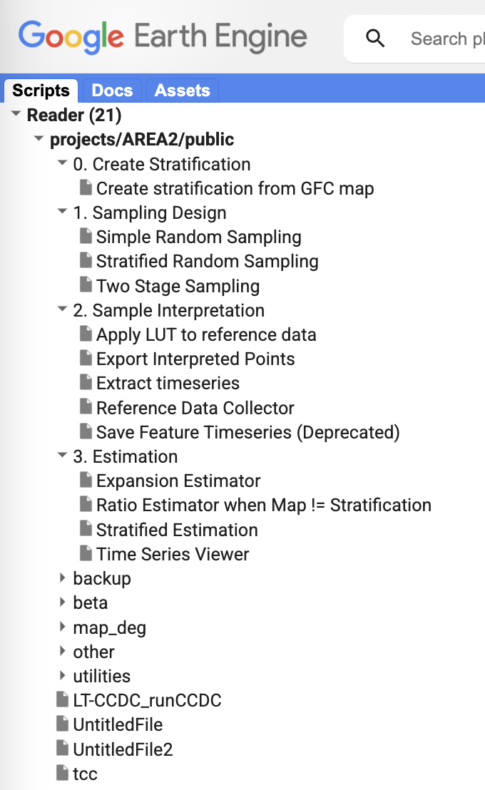
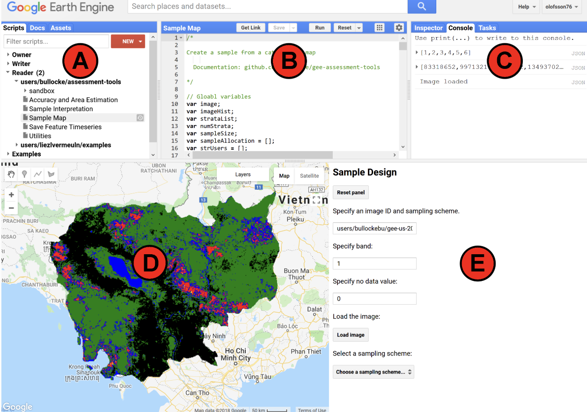

# Sampling Design using AREA2
AREA2 (Area Estimation & Accuracy Assessment) is a graphical user interface publicly available in GEE for sampling design. It works much the same as the SEPAL tool. The difference between the two is more a matter of preference, and the AREA2 has the opportunity to adapted with small code alterations. Several sampling design methodologies are included as options. Note, the necessary aspects of the tool are available but the repository is no longer being regularly updated.

See the full ['Read the Docs' website](https://area2.readthedocs.io/en/latest/overview.html) for more details on the tool.

## Pre-requisites
- A GEE account and access to a GEE cloud project. 
- A previously generated map to use for stratification uploaded as a GEE asset
- AOI?

## Getting Started with AREA2
1. Add the tool to your personal GEE repository by clicking this link: [https://code.earthengine.google.com/?accept_repo=projects/AREA2/public](https://code.earthengine.google.com/?accept_repo=projects/AREA2/public).
2. On the left side of your GEE code editor under the scripts tab you will now see **projects/AREA2/public** listed under the **Reader** access repositories. You can click the drop down arrow to view the included scripts.
 

*The further directions below are directly from https://area2.readthedocs.io/en/latest/getting_started.html*.

3. To run a script, highlight it in Script Manager (A), which displays the code in the Code Editor (B), and click the Run button (located in the Code Editor).
4. When running the scripts in AREA 2, a Dialog Pane will appear (E). The Dialog Pane is where you specify the information required for each step of the sampling design, response design, and analysis. Note that after communicating via the Dialog Pane (loading a map for example), **Earth Engine does not indicate if the application running. Therefore, push the buttons only once and wait for the application to respond before continuing.**
6. The Console (C) displays output specified by script. If errors occur while running a script, the error messages are displayed here.
7. The Map (D) is where spatial data is displayed.

 

# 1. Uploading your stratification map
For now we have pre-loaded a stratification map as a GEE asset for you. You will learn how to upload your own assets later in the workshop.

# 2. Creating a stratified random sample

> **_NOTE:_** 
>
>*You can view a demonstration of creating a stratification on this [YouTube demo video](https://www.youtube.com/watch?v=mbskeQNjj7A).*

## Part 1: Creating a stratified random sample
We will use SEPAL to create a stratified random sample. To begin, you can use the test dataset available in SEPAL or you can use a raster of your classification loaded into SEPAL using the instructions in Part 1.

A well-prepared sample can provide a robust estimate of the parameters of interest for the population (percent forest cover, for example). The goal of a sample is to provide an unbiased estimate of some population measure (e.g. proportion of area), with the smallest variance possible, given constraints including resource availability. Two things to think about for sample design are: do you have a probability based sample design? That is, does every sample location have some probability of being sampled? And second, is it geographically balanced? That is, are all regions in the study area represented.

These directions will provide a stratified random sample of the proper sampling size:

 |Numeric code         |  Class name     |
 |:-------------:|:-------------:|
 | 0  | nodata |
 | 1  | forest_80 |
 | 2 | forest_30_80 |
 | 3 | forest_30 |
 | 4 | mangroves |
 | 5  | settlements |
 | 7  | water |
 | 8  | grassland |
 | 9  | shrub |
 | 10  | baresoil |
 | 11 | sand |
 | 25 | clouds |

  ii. Specifying the expected user accuracy helps the program determine which classes might need more points relative to their area. 
   
   > *  Some classes are easier to identify--including common classes and classes with clear identifiers like buildings. 
   >
   > * Classes that are hard to identify include rare classes and classes that look very similar to one another. Having more classes with low confidence will increase the sample size.

  iii. Select the value for classes with high expected user accuracy with **the first slider**. This is set to 0.9 by default, and we’ll leave it there.

  iv. Then, select the value for classes with low expected user accuracy with **the second slider**. This is set to 0.7 by default, and we’ll leave it there as well.

 

 a. The final step will select the random points to sample.

 b. Select **Generate sampling points** and wait until the progress bar in the bottom right finishes. Depending on your map, this may take multiple minutes. A map will pop up showing the sample points. You can pan around or zoom in/out within the sample points map.

  i. The resulting **distribution of samples** should look similar to the below image. These values will vary depending on your map and the standard error of expected overall accuracy you set. 

