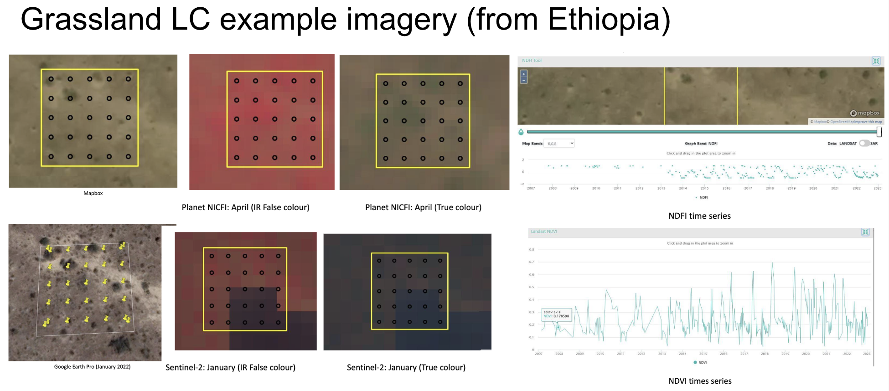

# Reminders from Workshop 1 on Interpretation Key Generation

 

[*Link to Workshop 1 Google Drive*](https://drive.google.com/drive/folders/1G9PdSQWQzkpUaXD0BISQ-NT9mfd1l7vM?usp=sharing)

| **Topic** | **Materials** |
|---|---|
| Project and Procedure Planning | [InterpretationProjects_CEO_and_InterpretationPlanning](https://docs.google.com/presentation/d/1B3UEeHB9tPPmkhozLUVLoM6L_SaCyRsOpH6MvLdO5WM/edit?usp=drive_link) |
| Overview of Key template | [Template Option](https://docs.google.com/document/d/1NtC8SD27o-6qHWA--XFO11_fMT2WUzRG-s7Kpnvhr-c/edit?usp=sharing) |
| Overview on how to continue gathering examples for the key | [Examples of images for interpretation](https://docs.google.com/presentation/d/1-i7fFr6rzjbcj8r4lAcYCOw54IEiVik-1psdN8-Iw_Y/edit?usp=drive_link) |
| Interpretation Practices Quick Overview | [Best practices for interpretation](https://docs.google.com/presentation/d/1c1qLd8eFGWZMoXAn3chOi0h0VlidBnnHKF7Wy1DSQaU/edit?usp=drive_link) / [Interpretation Procedures](https://docs.google.com/document/d/11FwTS1ov9nhVtcYmq3gLTfupqaMnjYGIDafK5ZomPAY/edit?usp=drive_link) |

# Reminder of Goals

## Purpose of a Key
1. **Creating consensus/consistency** – Helps team build a shared understanding of what each land cover type or event is and how to identify it. 
2. **Creating documentation** – Important for justifying QA/QC in funding, publishing, and for referencing at a later date.
3. **Creating institutional knowledge** – Helps new team members start collecting data and contributing to your project quickly and accurately.

# Interpretation Key Recommendations
Here is a [link](https://drive.google.com/drive/folders/15wtjNl-YhMMw3111k0K6nYmySClJ8LtD?usp=sharing) to Liberia's current Interpretation Key in Google Drive. 

Key areas that can always be improved and should be revisited:
1. Make sure your definitions are clear and that the requirements relate to characterisitics visible in remote sensing imagery.
2. Add example imagery! Try to include examples for each type of label you want your interpreters to make (e.g., land use type, canopy cover percentage, or change event type). Give examples with various types of imagery, maybe even at different scales if that is helpful. Include your best examples, but also the ones that show the variance of the item to be labeled. Showing examples of the difficult cases is also super helpful. 
3. Make sure to include and protocol for interpreters (update if if your survey or goals change). This ensures repeatability and quality assurance accross the team of interpreters.

Time to discuss the key and make improvements together.

| **Interpretation Elements** | **Description** |
|---|---|
| Tone/Color | Color variation within different band combination |
| Texture | Smoothness or roughness |
| Shape | Form of structure of individual objects or groups |
| Location | Typical occurrence in context |
| Pattern | Physical distribution of elements |
| 3D Indicators | Indications of height from shadows |
| Time-Series  | Patterns in time-series graphs of indices |
| Variations | Seasonal variations |