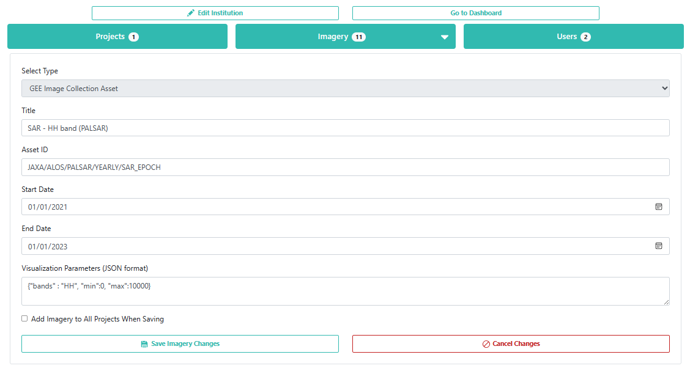
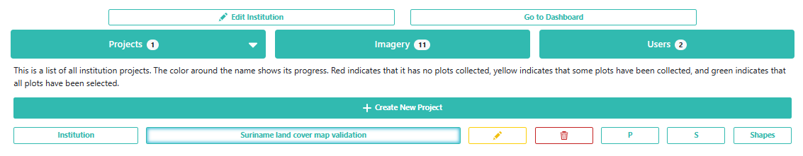
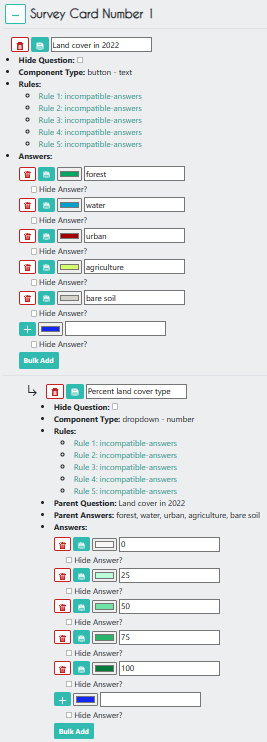
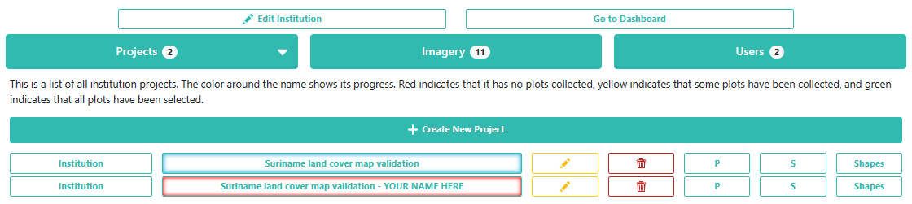

# Collect Earth Online (CEO)
This hands on session assumes you have some previous experience with CEO from past trainings. 

## Ensure you have an account and have joined the institution
 [Make CEO Accounts and Join Institution](https://docs.google.com/presentation/d/1B3UEeHB9tPPmkhozLUVLoM6L_SaCyRsOpH6MvLdO5WM/edit?usp=drive_link) 

Log in to CEO.  On the main CEO page, in the search bar at the top left, search for an institution called “[The Environmental Protection Agency of Liberia (EPA).](https://app.collect.earth/review-institution?institutionId=4290)” Click `Visit`.

# Potential Uses of CEO
Gathering samples for...
- **training a machine learning model**
- **calculating accuracy of a map**
- performing sample-based area estimation
- pre-work designing an efficient field campaign
- comparison to field data
- validating near-real-time alerts of landscape disturbances
- creating high quality sample data that can be readily shared with others [DOI creation in CEO](https://www.collect.earth/introducing-dois-for-ceo/)
- ...

# CEO Project Creation

## Add Imagery to the CEO Institution

On the institution's home page, click on `Imagery`.

Click on the `edit` button for the last imagery on the page called "Global Mangrove Forests Distribution".  Here, you can see how to add a new type of imagery to a project.  There are some data sets already available in CEO, like Sentinel and Planet, but you can also import any public GEE `Image` or `ImageCollection` or any private GEE asset.  You just need its asset ID, a start and end date, and some parameters for its visualization.

### *Tip for visualization parameters*
Look for the imagery resource on the GEE library. There is often a sample visualization which you can use directly or adapt for your needs by adjusting the visualization using the GEE Map panel. You can adjust the parameters or apply an automatic stretch for your area to get something reasonable, then import the visualization and copy it by clicking the small blue box at the top of the code editor. Do not include the semicolon at the end of the copied parameters.

These blogs have further information on adding imagery in CEO:
- [Setting up multiple imagery sources in CEO](https://www.collect.earth/setting-up-multiple-imagery-sources-in-ceo/)
- [Using your own data in CEO: Connecting GEE raster data](https://www.collect.earth/connecting-gee-raster-data/)

## Create a CEO Project

On the institution’s home page, go to the `Projects` tab and click `+ Create New Project`.  The workflow for creating a new project should appear. 

On this first `Project Overview` page, under `Select Template`, you can select a project that is already present in the institution or any Public project created by others who use CEO, and click `Load`.  All of the project parameters should now be identical to the project that was copied.  

Under *Copy Options* you can chose to check "Copy Template Plots and Samples" (which will use the same lat/long locations for plot areas and their interal samples), and/or check "Copy Template Widgets" (which will copy the Geo-Dashboard set up), or check neither (which will still copy the imagery selection, survey questions, and rules).

You can also create a project from scratch, but for the sake of simplicity, we will use this project template that has already been made for you.  If you want to model a CEO project off of another project but create entirely new plots/samples or survey questions, you can uncheck `Copy Template Plots and Samples` and `Copy Template Widgets`.

For this workshop, **add YOUR NAME to the beginning of the project name**.  This way, everyone in the workshop will have their own project to work in and it can easily be distinguished as a test project later.  

Click `Next`.

On the `Imagery Selection` page, you can change the imagery that will be available when collecting data.  You will see the default CEO imagery data sets under `Public Imagery`, as well as the imagery data sets you or someone else manually uploaded to your institution under `Private Institution Imagery `.  

On the `Plot Design` page, if you previously selected `Copy Template Plots and Samples` the you cannot change the plot design parameters. See example below of a pre-filled page. 

If `Copy Template Plots and Samples` was not checked, this page would look something like this, and you would need to upload a .csv file with the points (PLOTID, LON, LAT) that was exported from elsewhere (e.g., GEE, SEPAL, QGIS), a upload a shapefile of plot areas, or use CEO's built-in plot design options.

The Quality Control set-up of your project is also done on this page. Think about: 
- how your team works together, 
- how you want to divide the work, 
- the availability of your interpreters,
- the current confidenc you have in the training/consitency of your interpreters, and
- any QA/QC requirements you must follow.

###  *Tip About Quality Control*
- If you have a very large data collection, consider dividing up your points into a series of smaller projects. Then, for the earlier projects, you can implement more intensive QA/QC procedures in the design to use it as a form of training for your team. Reviewing overlapping interpretations together on these smaller projects, will allow you to icrease your team's consistency and lead to having higher confidence in your later interpretations even if those projects do not have as stringent a QA/QC process (e.g. only single interpretations instead of 100% overlapping interpretations).
- If you set up your project with *Equal Assignments* for the users, and then one interpreter leaves the project before finishing, these points can be interpreted by an Admin User instead.

Click `Next`.

On the `Sample Design` page, you also cannot change the parameters if `Copy Template Plots and Samples` was checked on the `Project Overview` page.   

Uncheck `Copy Template Plots and Samples` on the `Project Overview` page if you want to use your own CSV, shapefile of points, or CEO built-in option. If `Copy Template Plots and Samples` was not checked, this page would look like this, and you have the option of multiple samples within each plot.

Click `Next`.

On the `Survey Questions` page, you can create various types of sruvey questions related to your plots and samples. You can create parent and child questions so that certain questions only appear if the parent question was answered in a certain way.  You can also organize your questions into survey cards that are presented separately. You can somewhat control the possible responses between survey cards using *rules* in the next step, but this is often trickier than using the *parent/child question* option. 

As you design the questions on the left you can see and test what they will look like to the user on the rigth-side panel.

### *Tips for Survey Question Design*
- Try to keep your questions short so they are not cut off on smaller screens, e.g. "LC in 2014" instead of "What was the land cover in 2014?"
- Avoid punctuation if possible, especially commas, to reduce complications in your analysis when you have saved the results as a CSV.
- You can use the *Bulk Add* feature or the *Copy Question* option to save time if you have a lot of repeatedly used answer sets or similar questions.
- Using the *Parent/Child* quesiton option can be helpful for reducing clicks and saving time for interpreters, so you do not have to answer non-relevant questions.

Click `Next`.

On the `Survey Rules` page, you can create rules related to your survey questions.  Use rules for quality control. It is best not to assume there will be no human errors. Catching possible errors in the survey design will save a ton of time compared to having to find and fix those errors after the data collection is completed.

*See here for futher details on rules:* 
[Blog - Using rules to collect better data in CEO](https://www.collect.earth/using-rules-to-collect-better-data-in-ceo/)

Click `Next`.

On the `Review` page, you can check that everything looks good and create the project.  Check the box agreeing to the terms and conditions, and click `Create Project`.

At this point, you can still edit the project.  In order to start collecting data, you will need to click `Publish Project` on the next page, but you will now lose your ability to edit the plot and sample design. You also will not be able to change the list of interpreters and any other paratmeters you set up under the Quality Control section of the `Plot Design` page.

**Don't forget you still have the Geo-Dashboard to make!**
Open the Geo-Dash via the Project Edit page through the `Configure Geo-Dash` button. You can copy the Geo-Dash from another project or you can make your own by using the `Add Widget` button. Then you can choose the type of widget tool you would like and set the parameters. `Create` the widget and then resize it as you wish.

### **Tip for the Geo-Dashboard*
*The Degradation Widget is especially useful because you can view the time series graph and immediately inspect the Landsat imagery for any points along that graph.

Publish your project when you have tested it's functionallity using the draft `Collect` button on on the project editing page and have finalized your design. Most features of the project cannot be changed once you publish, but worst case scenario if you make a mistake and need to make a change, you can use the project you made as a starting *Template* for a new project.

 

## Collect Data in the CEO Project

Now that you have published your project, go back to the institution home page and click on your project you just created to start collecting data.  It should be red before you start collecting data, yellow after you start collecting data, and green when you finish collecting data for all plots.

Select `Collect` and click `Go to First Plot`.

It should take you to the first plot.  Here, you can view the original map classiciations in `Plot Information`, as well as all the imagery that was selected for this project in `Imagery Options`.  

If you want some more high resolution imagery to help in your decision, click `Download Plot KML`.  Now, open this file, and Google Earth Pro will open with the plot geometry already loaded in on top of Google Earth imagery.

Once you have opened Google Earth Pro, click on the clock icon on the toolbar at the top of the screen.  A bar showing a timeline of dates will appear at the top left corner of the screen.  You can use this bar to look at all historical and current Google Earth imagery available for this location. 

Go back to the CEO project. Exambine the available imagey and the Geo-Dashboard until you can answer all the survey questions. 

### *Tip about finalizing an interpretation*
- Use all the resources available to you. A good interpretation is usually informed by multiple sources, such as the Google Earth Pro imagery, the imagery in CEO from multiple days, and/or the graphs in the Geo-Dashboard. 
- Follow a standardized procedure for interpretation across your team, referencing your Interpretation Key. See this [recommended interpretation procedure example](https://docs.google.com/document/d/11FwTS1ov9nhVtcYmq3gLTfupqaMnjYGIDafK5ZomPAY/edit?usp=drive_link) and update it for your needs.
- **Always record the confidence** of your interpretation (making sure your team is using the 0-100 Confidence values in the same way), and record your reasoning and points of confusion for later reference during QA/QC reviews. The *Confidence Slider* values can be used automatically selecting points for quality review.

Click `Save`.  

**It is very important to click `Save` after EVERY plot you finish!**  

When you click `Save`, it should take you to the next available/assigned plot. When you are done for the day (and have saved each plot individually), click `Quit` to exit data collection mode.

## Exporting Data from CEO
Now that you have finished collecting data in your project, go back to the institution home page and click the `S` button to the right of your project.  This will download the data as a CSV file. The file you download will retain the original metadata columns from any Plot Design file uploaded to CEO as a CSV (`pl_` is added to the column names for the original metadata).

You can also export the results as a Plots file `P` or as a `shapefile`. This is the same information in different formats. The shapefile results can be joined to the CSV files using the "plotid" and "sample_internal_id" columns.

 
 

## Sources 
Material for this overview was gathered and modified from:

* https://www.collect.earth/
* https://www.collect.earth/ceo-guides/#:~:text=Data%20Collection%20Manual%20(English)
* https://www.collect.earth/ceo-guides/#:~:text=Institution%20%26%20Project%20Creation%20Manual%20(English)
* https://blog.collect.earth/index.php/2022/04/21/connecting-gee-raster-data/
* https://www.collect.earth/ceo-guides/#:~:text=Project%20Development%20Theory

 
 

## Exercise
Next, let's practice out our CEO interpretation skills in the demo project in your CEO institution!

An example Plot Data CSV for making your own project is available [here](https://drive.google.com/drive/folders/13aQi8Sz0vKfKY8wOEAuu6vNWlpG9Vs_m?usp=drive_link).

