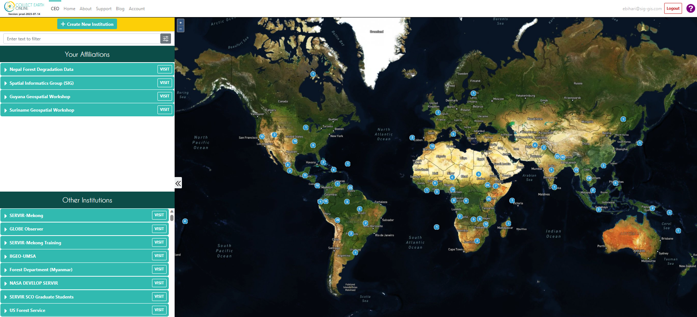
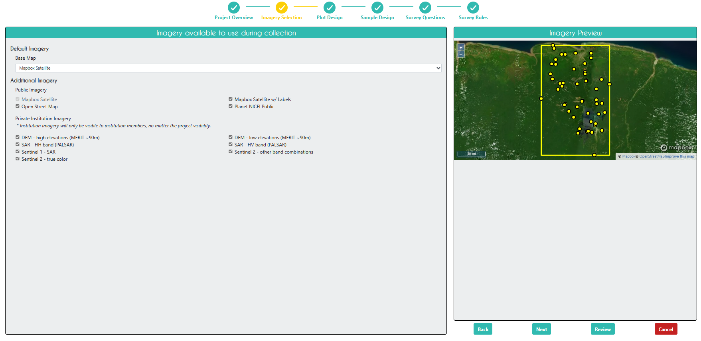
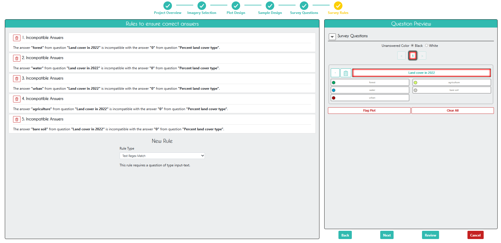

# Collect Earth Online (CEO)
This hands on session assumes you have some previous experience with CEO from past trainings. 

## Ensure you have an account and have joined the institution
 [Make CEO Accounts and Join Institution](https://docs.google.com/presentation/d/1B3UEeHB9tPPmkhozLUVLoM6L_SaCyRsOpH6MvLdO5WM/edit?usp=drive_link) 

Log in to CEO.  On the main CEO page, in the search bar at the top left, search for an institution called “[The Environmental Protection Agency of Liberia (EPA).](https://app.collect.earth/review-institution?institutionId=4290)” Click `Visit`.

# Potential Uses of CEO
Gathering samples for...
- **training a machine learning model**
- **calculating accuracy of a map**
- performing sample-based area estimation
- pre-work designing an efficient field campaign
- comparison to field data
- validating near-real-time alerts of landscape disturbances
- creating high quality sample data that can be readily shared with others [DOI creation in CEO](https://www.collect.earth/introducing-dois-for-ceo/)
- ...

# CEO Project Creation

## Add Imagery to the CEO Institution

On the institution's home page, click on `Imagery`.

Click on the `edit` button for the last imagery on the page called "Global Mangrove Forests Distribution".  Here, you can see how to add a new type of imagery to a project.  There are some data sets already available in CEO, like Sentinel and Planet, but you can also import any public GEE `Image` or `ImageCollection` or any private GEE asset.  You just need its asset ID, a start and end date, and some parameters for its visualization.

### *Tip for visualization parameters*
Look for the imagery resource on the GEE library. There is often a sample visualization which you can use directly or adapt for your needs by adjusting the visualization using the GEE Map panel. You can adjust the parameters or apply an automatic stretch for your area to get something reasonable, then import the visualization and copy it by clicking the small blue box at the top of the code editor. Do not include the semicolon at the end of the copied parameters.

These blogs have further information on adding imagery in CEO:
- [Setting up multiple imagery sources in CEO](https://www.collect.earth/setting-up-multiple-imagery-sources-in-ceo/)
- [Using your own data in CEO: Connecting GEE raster data](https://www.collect.earth/connecting-gee-raster-data/)

## Create a CEO Project

On the institution’s home page, go to the `Projects` tab and click `+ Create New Project`.  The workflow for creating a new project should appear. 

On this first `Project Overview` page, under `Select Template`, you can select a project that is already present in the institution or any Public project created by others who use CEO, and click `Load`.  All of the project parameters should now be identical to the project that was copied.  

Under *Copy Options* you can chose to check "Copy Template Plots and Samples" (which will use the same lat/long locations for plot areas and their interal samples), and/or check "Copy Template Widgets" (which will copy the Geodashboard set up), or check neither (which will still copy the imagery selection, survey questions, and rules).

You can also create a project from scratch, but for the sake of simplicity, we will use this project template that has already been made for you.  If you want to model a CEO project off of another project but create entirely new plots/samples or survey questions, you can uncheck `Copy Template Plots and Samples` and `Copy Template Widgets`.

For this workshop, **add YOUR NAME to the beginning of the project name**.  This way, everyone in the workshop will have their own project to work in and it can easily be distinguished as a test project later.  

Click `Next`.

On the `Imagery Selection` page, you can change the imagery that will be available when collecting data.  You will see the default CEO imagery data sets under `Public Imagery`, as well as the imagery data sets you or someone else manually uploaded to your institution under `Private Institution Imagery `.  Here, we have already imported several useful data sets, such as some elevation, PALSAR and Sentinel 1 radar, and Sentinel 2 optical imagery.

On the `Plot Design` page, you cannot currently change the parameters because `Copy Template Plots and Samples` was checked on the `Project Overview` page.  There are 50 plots centered on our validation points exported from GEE.  They are square and 30m in width because the Landsat data used for our classification has a resolution of 30m.

If `Copy Template Plots and Samples` was not checked, this page would look something like this, and you would need to upload a .csv file with the points (PLOTID, LON, LAT) that was exported from elsewhere (e.g., GEE, SEPAL, QGIS), a upload a shapefile of plot areas, or use CEO's build in plot design options.

Click `Next`.

On the `Sample Design` page, you also cannot change the parameters because `Copy Template Plots and Samples` was checked on the `Project Overview` page.  Each plot corresponds to a single sample located in the center of the plot.

If `Copy Template Plots and Samples` was not checked, this page would look like this, and you would be able to create multiple samples within each plot.

Click `Next`.

On the `Survey Questions` page, you can create various types of sruvey questions related to your plots and samples. You can create parent and child questions so that certain questions only appear if the parent question was answered in a certain way.  You can also organize your questions into survey cards that are presented separately, which is particularly helpful when looking at land use change for different time periods.

For this exercise, we have two simple survey questions asking about what the land cover type is and what the percentage of that land cover type is.  On the right, you can see an example of what the survey question will look like when collecting data.

Click `Next`.

On the `Survey Rules` page, you can create rules related to your survey questions.  For this exercise, we have just created 5 rules that prevent the user from answering 0% for any of the possible land cover classes (this is not a very useful rule since the 0%, 25%, and 50% options don't make any sense - assuming that you would need at least 50% coverage for the plot to be classified as that specific land cover type - but it is a good example of the general functionality of rules).  You can also set the rules so that CEO only accepts answers with certain values/strings or does not accept certain answers if the other questions were answered in a certain way.

*See here for futher details on rules:"* 
[Blog - Using rules to collect better data in CEO](https://www.collect.earth/using-rules-to-collect-better-data-in-ceo/)

Click `Next`.

On the `Review` page, you can check that everything looks good and create the project.  Check the box agreeing to the terms and conditions, and click `Create Project`.

At this point, you can still edit the project.  In order to start collecting data, you will need to click `Publish Project` on the next page, but you will now lose your ability to edit the plot and sample design.

## Collect Data in the CEO Project

Now that you have published your project, go back to the institution home page and click on your project you just created to start collecting data.  It should be red before you start collecting data, yellow after you start collecting data, and green when you finish collecting data for all plots.

Select `Collect` and click `Go to First Plot`.

It should take you to the first plot.  Here, you can view the original map classiciations in `Plot Information`, as well as all the imagery that was selected for this project in `Imagery Options`.  

If you want some more high resolution imagery to help in your decision, click `Download Plot KML`.  Now, open this file, and Google Earth Pro will open with the plot geometry already loaded in on top of Google Earth imagery.

Once you have opened Google Earth Pro, click on the clock icon on the toolbar at the top of the screen.  A bar showing a timeline of dates will appear at the top left corner of the screen.  You can use this bar to look at all historical and current Google Earth imagery available for this location. 

Go back to the CEO project.  In `Survey Questions`, select the land cover type of the plot and the percentage of that land cover type within the plot, and click `Save`.  

**It is very important to click `Save` after EVERY plot you finish!**  

When you click `Save`, it should take you to the next plot.  Go through all 20 plots and select whether it was mangrove or not.  When you are done (and have saved each plot individually), click `Quit` to exit data collection mode.

Now that you have finished collecting data in your project, go back to the institution home page and click the `S` button to the right of your project.  This will download the data as a .csv file.  The file you download will retain the original columns from the sample points we generated in GEE and uploaded to CEO as a .csv (with `pl_` added to the column name).

 
 

## Sources 
Material for this overview was gathered and modified from:

* https://www.collect.earth/
* https://www.collect.earth/ceo-guides/#:~:text=Data%20Collection%20Manual%20(English)
* https://www.collect.earth/ceo-guides/#:~:text=Institution%20%26%20Project%20Creation%20Manual%20(English)
* https://blog.collect.earth/index.php/2022/04/21/connecting-gee-raster-data/
* https://www.collect.earth/ceo-guides/#:~:text=Project%20Development%20Theory

