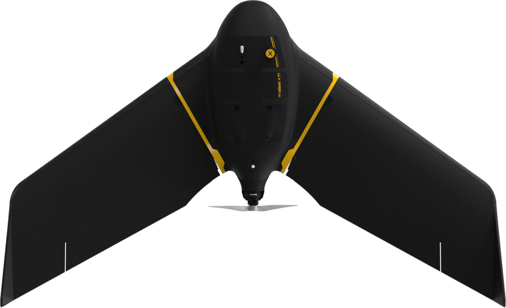
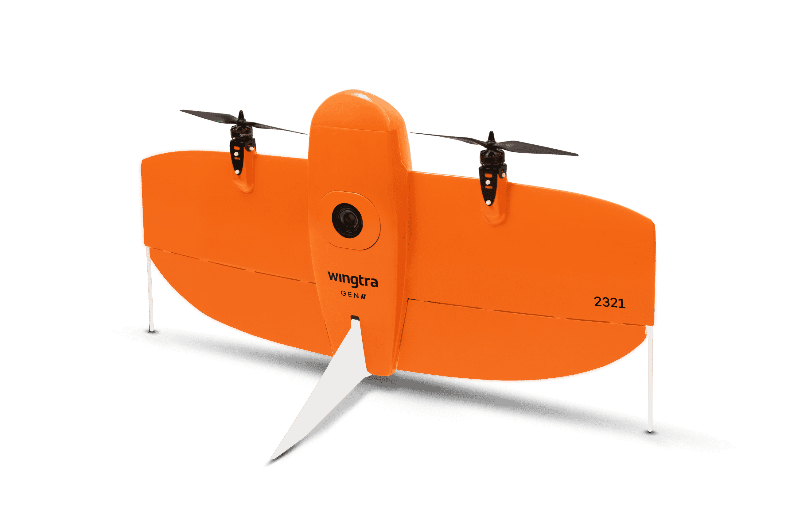
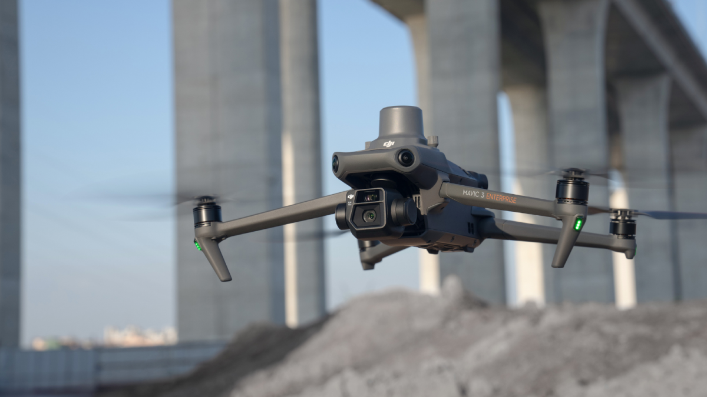

# Types of UAS Platforms

In this section, we will go over the types of Unoccupied Aircraft Systems (UAS, also known as drones) and their advantages and limitations.

# Overview 

## Fixed Wing UAS

### Characteritics
* Rigid wings, fuselage and propellers
* Nadir (straight-down) data collection 
* Ability to glide 
* Lands similar to manned aircraft by gliding down a "runway"
* Circles over a fixed location for holding pattern

### Advantages
* Highly efficient
* Ability to cover a large area in a single flight

### Limitations
* Requires a large area for landing (similar landing pattern to manned aircraft).
* Struggles in high wind conditions - gusts can affect stability and data collection.
* Cannot hover, these types of platforms must remain in motion, holding in a circular flight pattern

#### Example:
AgEagle eBee X

## Vertical Take Off and Landing UAS (VTOL)

### Characteristics
* Rigid wings, fuselage and propellers
* Nadir (straight-down) data collection
* Ability to glide 
* Takes off and lands straight up and down
* Ability to hover in place for holding pattern

### Advantages
* Relatively efficient
* Ability to cover a large area in a single flight
* Ability to land in a small area
  
### Limitations
* Struggles in high wind conditions

#### Example:
WingtraOne

## Multi-Rotor UAS

### Characteristics
* Three or more propellers
* Body connecting propellers
* Landing support
* Highly maneurverable 
* Baility to hover in place

### Advantages
* Versatile and operates will in high winds
* great for precision tasks and areas with obstacles

### Limitations
* Shorter flight times; covers smaller area per flight
* More motors mean more maintenance requirements

#### Example:
DJI Mavic 3 Enterprise

