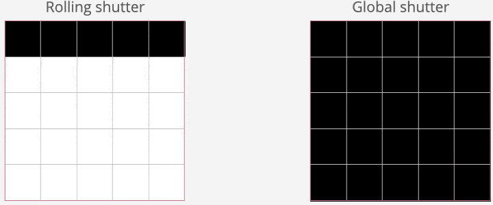

# UAS Sensors

In this section, we will go over the types of UAS sensors and their different applications.

## True Color or RGB
These sensors colelct three bands for each image, red, green and blue, all of which are on the bisible light spectrum

## Thermal
These sensor detect infrared radiation emitted from objects

## Multispectral
These sensors collect data across multiple spectral bands, these include visible and non-visible light.  Typically, these bands are specific so users must be aware of the data needed to capture when considering these sensors.

## Light Detection and Ranging (LiDAR)
These sensors use pulses of light as lasers to measure distances.  These pulses can have multiple returns so it can show canopy cover as well as forest floor from a single flight

## Global Shitter vs. Rolling Shutter
This refers to the way that the camera captures data, it can also be referred to the exposure method.  Rolling shutters capture data by exposing the sensor's pixels row by row, the top top the image is exposed slightly before the bottom of the image.  A global shutter, also known as a mechanical shutter, captures all pixels at once.  Global shutters are more ideal for photogrammetry as there will be less blur in the images.  There are settings in the photogrammetry software that can correct for rolling shutters but even with the correction prducts do not come out as well.  
