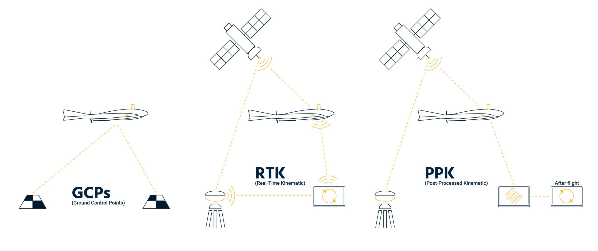

# Location Corrections

Most drones utilize GPS for location, however without corrections, the drones internal GPS units are not very accurate.  There are a few methods to correct for this issue.

### Real Time Kinematics (RTK)

This method makes the location corrections in real time while the drone is flying.  This method requires a GPS base station in a fixed location near the flight location and typically an additional module on the drone.  While flying the base station communicates with the flight control device and overhead satellites to properly triangulate the drone's location.

### Post Processing Kinematics (PPK)

This method of correction is done after flying and corrections are made as an additional step using data downloaded from a virtual base station.  This steps can be used when a base station is not available or proper satellite connection is unattainable. Similarly to RTK, an additional module is typically needed on the drone.

### Ground Control Points (GCP)

This method makes corrections during the photogrammetry processing step.  To use this method, a surveyor places targets in known locations that are evenly distributed across a project area, a minimum of three targets are required.  

