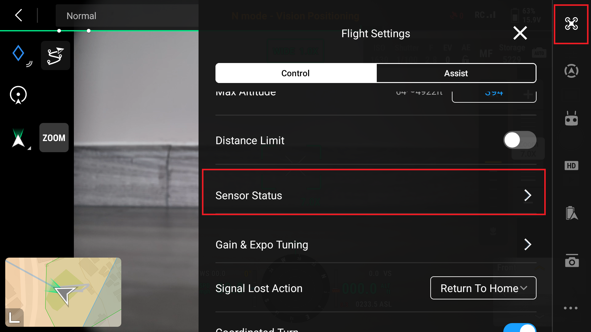
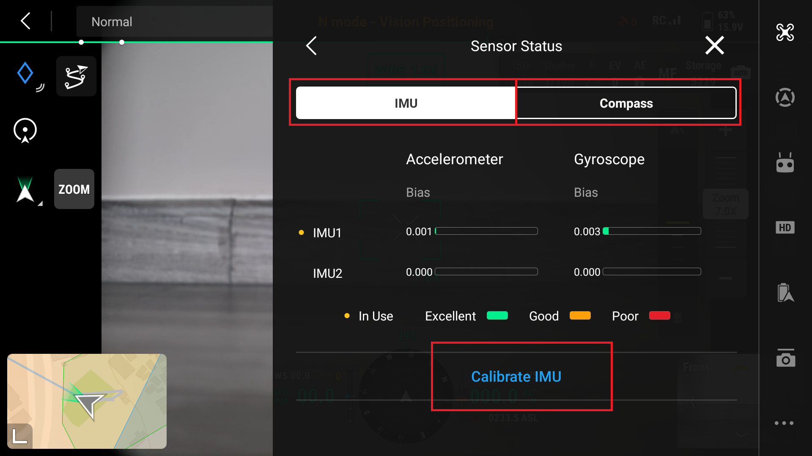

# Before Flying 

When flying to collect data to process through photogrammetry there are a few considerations for conditions to produce the best products.  These conditions will not prevent data collection but will make the photogrammetry process difficult and could cause holes or no data areas in the final products.  

### Ideal Flying Conditions
* Diffused light (overcast skies) or full sunlight (no clouds)
* High sun angle (midday)
* Low wind (stable flight)
* Good visibility (maintain visual contact with the drone)

### Imperfect Flying Conditions
* Rain and low cloud cover/fog (moisture is not good for the drone)
* Partial cloud cover (shadowy light)
* Low sun angle (early morning or late afternoon - these conditions cause shadows)
* High winds (less stable flights, if drone gets pushed around GPS can struggle keeping the system on track)
* Extreme heat or cold (effects drone battery performance) 

### Before Flying
Before flying there are a few checks that should be completed prior to launch
* Weather conditions
* Airspace - flight should not take place in restricted airspace or airspace occupied by manned aircraft.  Be sure to inspect sectional charts and any temporary flight restrictions
* Inspect Drone - make sure the drone is in working order and there is no damage to any of the components

##### Assign roles of personnel involved
* Pilot in Command
* Visual Observers (Spotters)
###### Ensure clear lines of communication between all involved

## Calibration

Prior to flight ensure the the Internal Measurement Unit (IMU) can Compass are both calibrated.  This process is different on all systems, consult the manufactures proceedure to complete this.

The DJI Mavic 3E is calibrated using the following steps:
1. Power on the drone and the remote control
2. Enter Camera View
3. Open the options by selecting the three dots in the top right corner of the screen open the flight settings
4. Open the "Senor Status" settings

5. Highlight IMU and then select "Calibrate IMU"
6. Follow the on screen instructions that will show you a series of images with the drone's position

7. Highlight Compass and select " Calibrate Compass" 
8. Follow the instructions on the screen showing you the way the drone needs to be moved to complete calibration