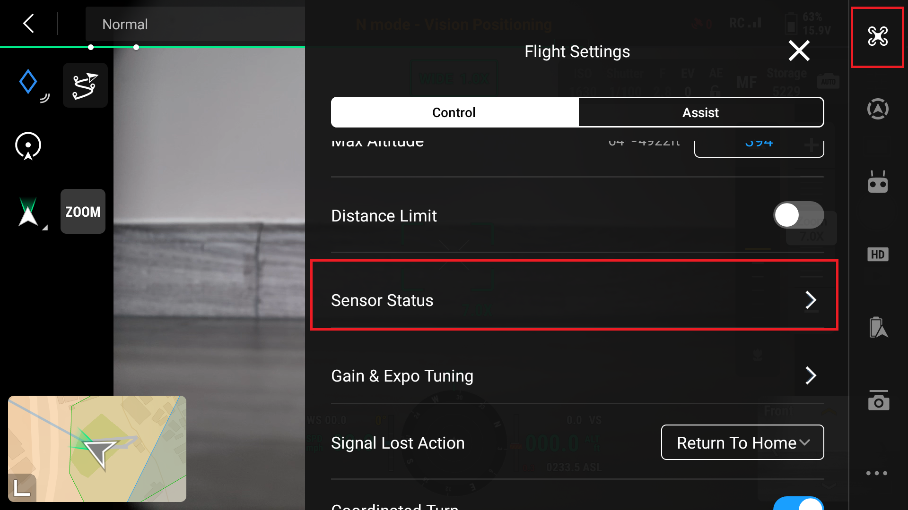
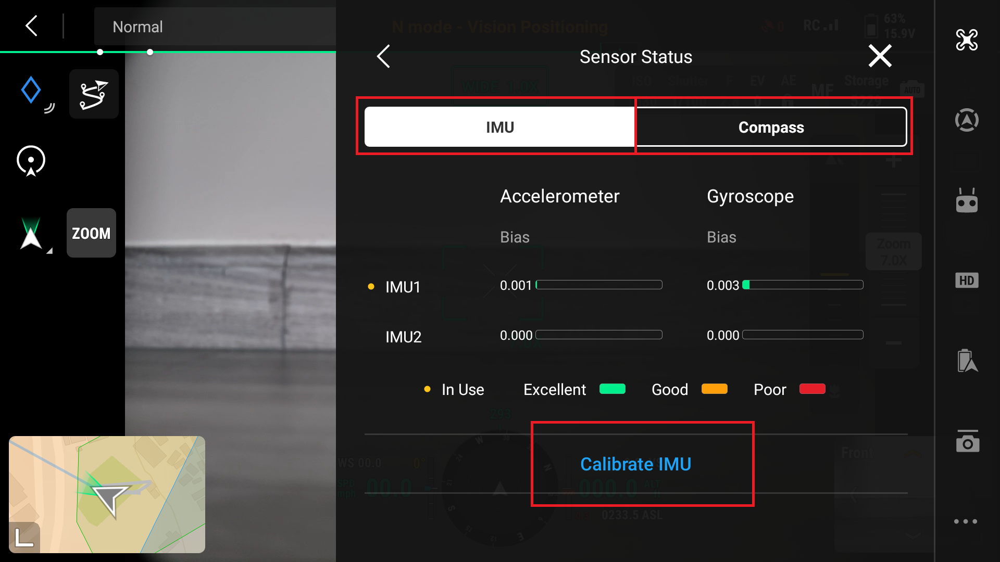
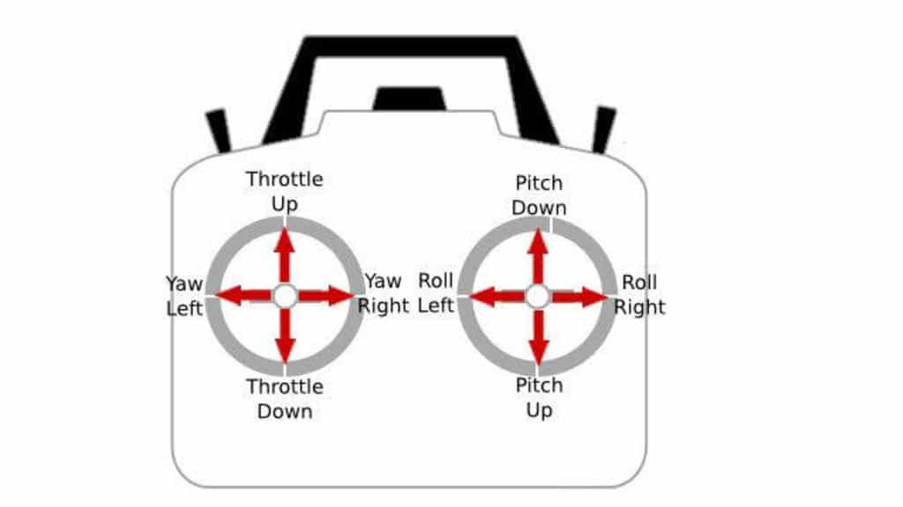
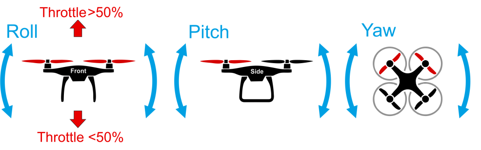

# Manual Drone Flight

## Calibration

Prior to flight ensure the the Internal Measurement Unit (IMU) can Compass are both calibrated.  This process is different on all systems, consult the manufactures proceedure to complete this.

The DJI Mavic 3E is calibrated using the following steps:
1. Power on the drone and the remote control
2. Enter Camera View
3. Open the options by selecting the three dots in the top right corner of the screen open the flight settings
4. Open the "Senor Status" settings

5. Highlight IMU and then select "Calibrate IMU"
6. Follow the on screen instructions that will show you a series of images with the drone's position

7. Highlight Compass and select " Calibrate Compass" 
8. Follow the instructions on the screen showing you the way the drone needs to be moved to complete calibration

## Controls

* Throttle - Moves drone up and down
* Yaw - Moves drone around Z-axis
* Pitch - Moves drone around Y-axis
* Rolls - Move drone around X-axis

### Manually Launching and Landing DJI Drones
#### Launching:
1. Push RC controls down and toward the center at a 45⁰ angle
2. Throttle up drone after propellers start spinning for a few seconds

#### Landing: 
1. Throttle down drone to lower altitude 
2. Orient drone so that it is facing the same direction as you
3. Continue to lower drone down until you are above landing area
4. Once drone is in position, hold down on throttle to automatically land drone

#### Best practices
* Level surface
* Clear around surface
* Free of obstacles above

