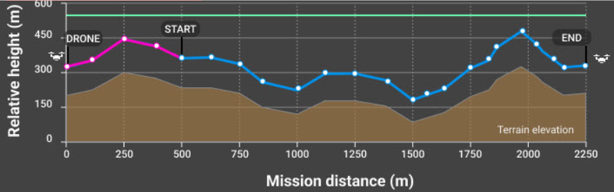

# Flight for Photogrammetry

## Single Grid
This type of flight creates a mission that has the drone fly parallel lines in a rectangular or polygon boundary.  Products produced from this type of flight are 2D mapping products like orthomosaics and digital elevation models (DTM and DSM).  Data collection for these types of flights are typically nadir (camera pointing straight down).

## Double Grid
Similar to the single grid flight, this type of flight creates a mission that has the drone fly parallel lines however it is different in that the drone does a second parallel grid pattern that is perpendicular to the first.  These flights collected data with a slightly oblique sensor angle.  Products produced from this type of flight is generally 3 dimensional models (point clouds and meshes)

## Corridor
Corridor flights are a type of single grid flight that collects data of long stretches and with one or two flight lines.  These types of flights collect data with the sensor in the nadir position.  Products produced are two-dimensional mapping products, like those produced by the single grid flights.  This type of flight is used for inspections of roads or airport runways. 

## Circular
This type of flight collects data in an oblique sensor angle with an ellipsoid flight path around an object like a single tree or building.  It is suggested that multiple flights are done using the same ellipsoid at multiple altitudes.  This type of flight produces three dimensional products (point clouds and meshes).

## Free Flight
This type of flight is not ideal for surveying, data is collected completely manually, data collection intervals and sensor angle are determined by the pilot in command.  However, this type of flight can be useful in complex terrain like urban environments or when infrastructure is a concern.  

## Ground Sampling Distance (GSD)
Ground Sampling Distance refers to the amount of ground/surface area that is covered by a single image in a flight measured in cm/pixel.  Ground sampling distance determines the altitude that the flight will be flown.  Higher ground sampling distance refers to a high flight altitude and lower image resolution and typically a shorter flight time to cover an area.  Lower ground sampling distance translates to lower flight altitude and higher resolution images but typically increases flight time.  Depending on the type of terrain being surveyed, different ground sampling distance is recommended, for example forested areas it is recommended to fly a higher ground sampling distance.  

## Terrain Awareness

The drone’s ability to follow variations in terrain (go up and down accordingly) to create consistent overlap and ground sampling distance between all images taken in a flight.  This parameter should be turned on if you are flying in a very hilly area. It is very important to know that buildings, trees, towers, and other objects that are ABOVE the ground are NOT considered part of terrain awareness.  Terrain awareness is based purely on elevation information from Pix4D’s existing maps, and these might not be 100% accurate or precise in your flight AOI.  Leave plenty of buffer between your drone and the surfaces you are flying over to account for these issues.  Not all flight planning platforms have terrain awareness capability, and offline maps have to be downloaded in Pix4Dcapture to activate terrain awareness.  

## Overlap
Overlap refers to the amount of overlap in coverage of each image collected.  More overlap means longer flight times especially with higher side overlap as more flight lines are added but there is the potential for more tie points between images.

### General
* 75% frontal and 60% side overlap

### Agrculture
* 85% frontal and side overlap

### Forest and Dense Vegetation
* 85% fronal and side overlap

### Corridors
* 85% frontal and 60% side (if flying multiple flight lines) overlap

## Speed 
Flight speed refers to the rate of travel of the drone.  Higher speeds allow the drone to cover more area but use more battery.  Higher speed can also cause motion blur in images especially when there are high winds.  Ideal speed is typically specific to each system, for the DJI Mavic 3 Enterprise, collecting images at 15 mph is the recommended speed.  

#

## Emergency Maneuvers
These occurrences are rare, but can still happen and should be taken into consideration before flying.  Below is a chart with potential emergencies and resolutions:
To interupt normal pre-planned flight patterns in DJI products, change the flight mode on the remote controller.

| Emergency| Resolution|
| -------- | -------- |
| Loss of GPS | Return to home function is initiated until link is restored |
| Low Battery| Return to home function is initiated and cannot be overridden |
| Loss of data link connection | Return to home function is initiated until link is restored |
| Bird Intrusion | Manual flight is utilized to avoid intrusion |
| Manned Aircraft Intrusion | Manual flight is utilized to avoid intrusion |
