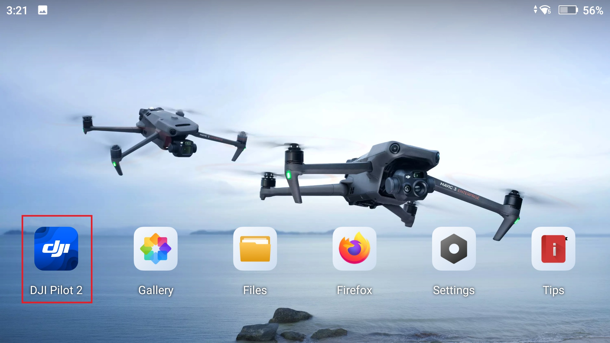

# Flight for Photogrammetry

## Automated Flight Patterns

### Single Grid
This type of flight creates a mission in which the drone autonomously flies parallel lines within a rectangular or polygon boundary.  Products produced from this type of flight are 2D mapping products like orthomosaic images and digital elevation models.  Data collection for these types of flights are typically nadir (camera pointing straight down).

### Double Grid
Similar to the single grid flight, this type of flight creates a mission in which the drone flies parallel lines however it is different in that the drone does a second parallel grid pattern that is perpendicular to the first.  These flights collect data with a slightly oblique sensor angle.  Products produced from this type of flight are generally 3 dimensional models (point clouds and meshes)

### Corridor
Corridor flights are a type of single grid flight that collects data of long stretches and with one or two flight lines.  These types of flights collect data with the sensor in the nadir position.  Products produced are two-dimensional mapping products, like those produced by the single grid flights.  This type of flight is used for inspections of roads or airport runways. 

### Circular
This type of flight collects data with an oblique sensor angle in an elliptical flight path around an object like a single tree or building.  It is suggested that multiple flights are done using the same ellipse at multiple altitudes.  This type of flight produces three dimensional products (point clouds and meshes).

### Free Flight
This type of flight is not ideal for surveying or photogrammetry, data is collected completely manually, data collection intervals and sensor angle are determined by the pilot in command.  However, this type of flight can be useful in complex terrain like urban environments or when infrastructure is a concern.  

## Ground Sampling Distance (GSD)

Ground Sampling Distance refers to the amount of ground/surface area that is covered by a single image in a flight measured in cm/pixel.  Ground sampling distance determines the altitude that the drone will be flown.  Higher ground sampling distance refers to a high flight altitude and lower image resolution and typically a shorter flight time.  Lower ground sampling distance translates to lower flight altitude and higher resolution images but typically increases flight time.  Depending on the type of terrain being surveyed, different ground sampling distance is recommended, for example forested areas it is recommended to fly a higher ground sampling distance.  

## Terrain Awareness

The drone’s ability to follow variations in terrain (go up and down accordingly) to create consistent overlap and ground sampling distance between all images taken in a flight.  This parameter should be turned on if you are flying in a very hilly area. It is very important to know that buildings, trees, towers, and other objects that are ABOVE the ground are NOT considered part of terrain awareness.  Terrain awareness is based purely on elevation information from existing elevation data and these might not be 100% accurate or precise in your flight area.  Leave plenty of buffer between your drone and the surfaces you are flying over to account for these issues.  Not all flight planning platforms have terrain awareness capability and offline maps have to be downloaded in DJI Pilot 2 to activate terrain awareness.  

## Overlap

Overlap refers to the amount of overlap in coverage of each image collected.  More overlap means longer flight times especially with higher side overlap as more flight lines are added but there is the potential for more tie points between images.

### General
* 75% frontal and 60% side overlap

### Agrculture
* 85% frontal and side overlap

### Forest and Dense Vegetation
* 85% fronal and side overlap

### Corridors
* 85% frontal and 60% side (if flying multiple flight lines) overlap

## Speed 

Flight speed refers to the rate of travel of the drone.  Higher speeds allow the drone to cover more area but use more battery.  Higher speed can also cause motion blur in images especially when there are high winds.  Ideal speed is typically specific to each system, for the DJI Mavic 3 Enterprise, collecting images at 15 mph is the recommended speed.  

# Automated Flight with the DJI Mavic 3 Enterprise

## 1. Open DJI Pilot 2 App on Remote Control

## 2. Select "Flight Route" on DJI Pilot 2

## 3. Create a Route by selecting the plus icon in the top left of the screen or if no other routes have been flown, select the "Create Route" icon in the center of the screen

## 4. Select "Area Route" 

## 5. Plan a flight by using your finger to create the mapping area by tapping verticies on the map

## 6. Finalize mapping area by pressing the blue check mark in the top left corner of the map

## 7. Ensure that the drone is connected to the RC and press "OK"

## 8. Give the route a name

## 9. Select the "Ortho Collection" option

## 10. Select "AGL" for the Altitude Mode option
### This ensure that the drone will use terrain following when collecting images

## 11. Download the DSM files from the internet

### Elevation data can also be downloaded prior flight either to an SD card or to the RC itself.  The SD card option will allow the user to download multiple areas or larger areas without using the RCs internal storage. 

## 12. Adjust the flight altitude
### This can be done by either changing the "Ortho GSD (Ground Sampling Distance)" or the "Terrain Follow Altitude" (this value also known as Above Ground Level or AGL)

## 13. Adjust flight speed
### Remember slower is better, 15 mph is recommended

## 14. Select "Advanced Settings" for more flight options

## 15. In "Advanced Settings", set the overlap parameters and change the "Photo Mode" to "Distance Interval Shot"
### You can choose either option here but I found when testing these that "Distance Interval Shot" gave a better result over "Time Interval Shot"

## 16. Close the "Advanced Settings" and open the Syetems settings by clicking the three dots in the upper right corner of the screen

## 17. Select the GPS settings on the right side of the screen by clicking the satellite icon

## 18. Ensure "RTK Positioning" is turned on and select the RTK Service Type which will be "D-RTK2 Mobile Station"

## 19. Ensure connection is made with station 

## 20. If there is another D-RTK2 Mobile station near by make sure to select the correct one

#### **Note the connection to the D-RTK Mobile Station is over wifi, ensure that the connection is strong and that the RC does not wander too far from the station*

## 21. Set the "Course Angle" fpr most efficient flight

#### This is important if there are high winds, it is best practice to fly with the wind or against it as to not have a cross wind that could push the drone off its flight path.
#### **This is not as important for multirotor systems like the Mavic 3 Enterprise but should still be taken into consideration*

## 22. Start the autonomous flight by closing all settings and clicking the blue play button in the upper left corner

#### You will then be prompted to go through a pre-flight check before uploading the mission to the drone and autonomous flight occurs.

## 23. Upon completition of the Route the drone will automatically fly back to the launch site and land. 

## Emergency Maneuvers
These occurrences are rare, but can still happen and should be taken into consideration before flying.  Below is a chart with potential emergencies and resolutions:
To interupt normal pre-planned flight patterns in DJI products, change the flight mode on the remote controller.

| Emergency| Resolution|
| -------- | -------- |
| Loss of GPS | Return to home function is initiated until link is restored |
| Low Battery| Return to home function is initiated and cannot be overridden |
| Loss of data link connection | Return to home function is initiated until link is restored |
| Bird Intrusion | Manual flight is utilized to avoid intrusion |
| Manned Aircraft Intrusion | Manual flight is utilized to avoid intrusion |
