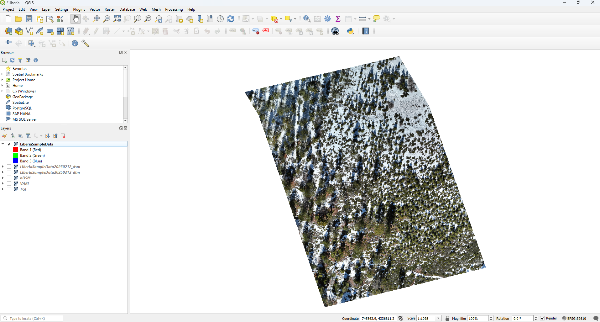
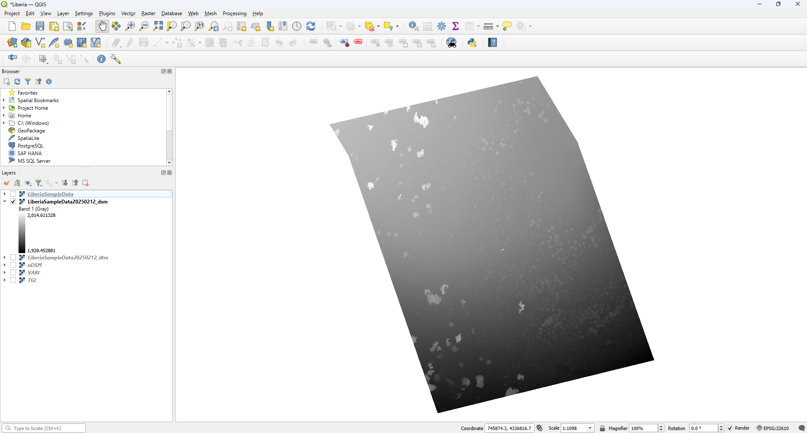
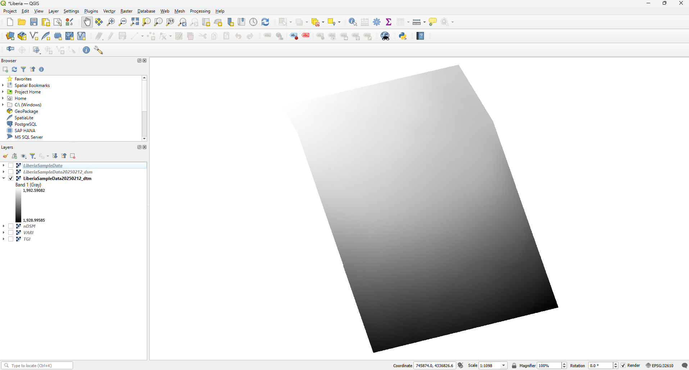
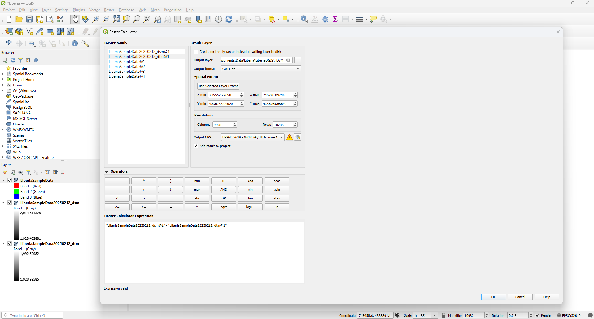
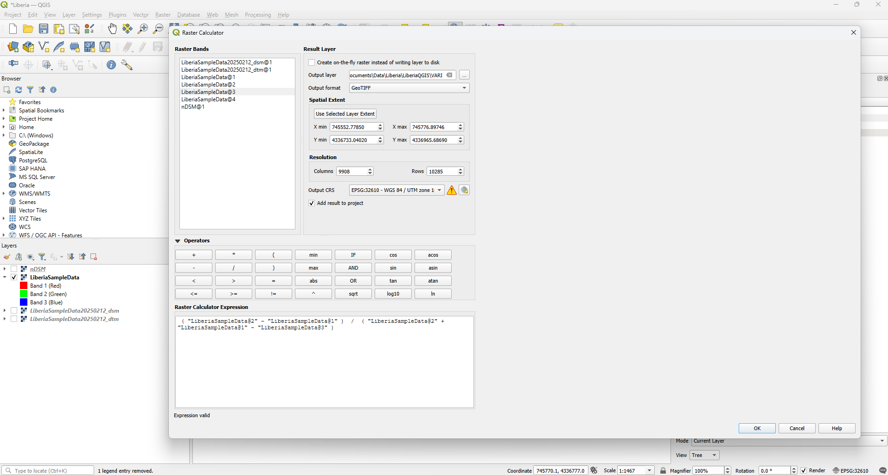
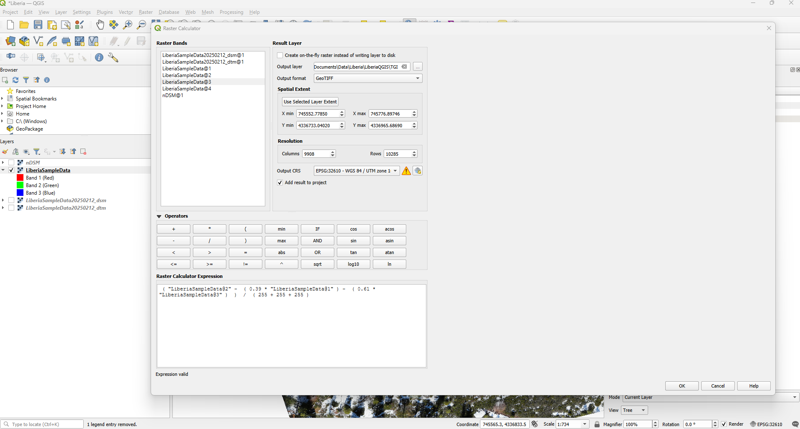

# Products

## True Color Orthomosaic

This is a high resolution geometrically corrected (orthorectified) image created by stitching together the overlapping images captured by the UAS.  These images have a uniform scale and accurate georeferencing meaning it is free of distortions caused by perspective differences. True color orthomosaics are three band rasters with a band for Red, Green and Blue.

## Digital Surface Model (DSM)

This is a type of elevation model represents the earth’s surface including features such as vegetation, buildings and infrastructure.  It captures the highest elevation return. The raster pixel values represent elevation above sea level. DSMs are single band rasters with the pixel value representing elevation.

## Digital Terrain Model (DTM)

This type of elevation model represents the bare-earth surface with vegetation, buildings and other objects removed.  These are created by filtering out non-ground points from the point cloud in the photogrammetry processing.  The raster pixel values represent elevation above sea level.  DTMs are single band rasters with the pixel value representing elevation.

# Data Analysis

In this section we will discuss some of the options for data analysis with the data created from drone flights.  All of our data analysis will be done using the raster calculator in QGIS

## Elevation data

### normalized Digital Surface Model (nDSM)

From the elevation data produced by the drone imagery a normalized digital suface model (nDSM) can be created.  The elevation data that is created by the drone flight represents elevation above sea level, creating a nDSM represents the relative height of features above the surrounding ground surface.  

#### nDSM =  DSM - DTM

## True Color data 

In this section we will discuss transforming the true color data into difference spectral indicators.

### Visible Atmospherically Resistant Index (VARI)

This index enhances the ability to detect coloration differences between plants and can help assess vegetation health.

#### VARI = (Green - Red) / (Green + Red - Blue)

A high positive value translates to high presence of vegetaion, while low positive values indicate moderate vegetation cover.  Negative values translate to non-vegetated areas like bare earth or water.  

### Triangular Greenness Index (TGI)

This index represents chlorophyll sensitivity from true color data.

#### TGI = (Green - (0.39 * Red) - (0.61 * Blue)) / (Max. Red + Max. Green + Max. Blue) 

Higher positive values indicate green, healthy vegetation while negative values indicate areas with little to no vegetation.  Relatively lower positive values may indicate potentially stressed plants.  