*Objectives: Basics of Google Earth Engine (GEE) for RS data analysis; JS, **GEE library***

## What is Google Earth Engine?

GEE combines a multi-petabyte catalog of satellite imagery and geospatial datasets with planetary-scale analysis capabilities. We use GEE to detect changes, map trends, and quantify differences on the Earth's surface. GEE is available for commercial use, but remains free for academic and research use.

The processing infrastructure automatically parallelizes analysis across many processors on many computers in Google data centers, reducing  processing times by orders of magnitude. In addition, the data is all centralized in the cloud. GEE provides a friendly interface to explore, retrieve and visualize satellite imagery without the need to download data.


<font size=2> Source: Google </font>


### Introduction to JavaScript (JS)
JavaScript (JS) is a programming language used to write and debug code, visualize data, and develop online applications in GEE. The Python language is also available, however we will focus on JS as it is the most developed and easiest programming language to use when getting started. In case it is needed, a translation from JS to Python (or vice versa) is easy to be implemented, and there are tools available to do this automatically.

### Analyzing programming structure
The online code-editor allows mostly a structured-procedural programming paradigm. It means the code has a simple sintaxis and can be divided into functions. Main JS reserved words and commands that you will get familiar with are:

- *var*: to declare new variables or functions
- *Import* and *Export*: to import and export datasets
- *addLayer*: to visualize new data layers.
- *function*: to create a new function that performs a specific task
- *map*: to apply a function over an image collection
- *clip*: to shape a raster or vector layer by a geometry or polygon

## Data Catalog

Earth Engine's public data archive includes more than forty years of historical imagery and scientific data sets, updated and expanded daily.

- More than 800 public data sets
- More than 70 petabytes of data
- More than 100 data sets added annually
- 1+ PB of new data every month

*These numbers are always being updated*

Types of data:

- Images from different satellites
- Geophysical data (topography, hydrology)
- Land use and cover
- Climate and weather
- Vector data (Basins, transportation network, etc.)

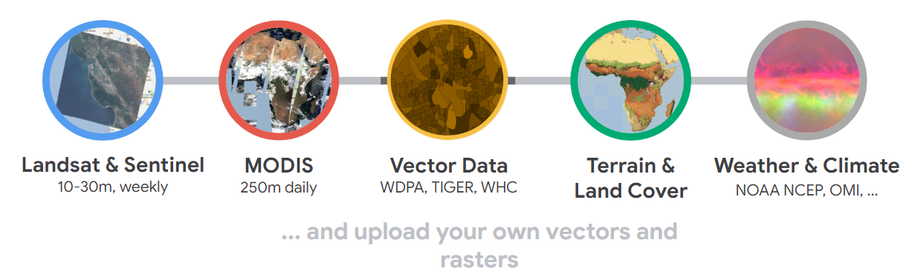

<font size=2> Source: Google </font>

To explore all datasets:

- [https://developers.google.com/earth-engine/datasets](https://developers.google.com/earth-engine/datasets)
- [https://developers.google.com/earth-engine/datasets/catalog](https://developers.google.com/earth-engine/datasets/catalog)

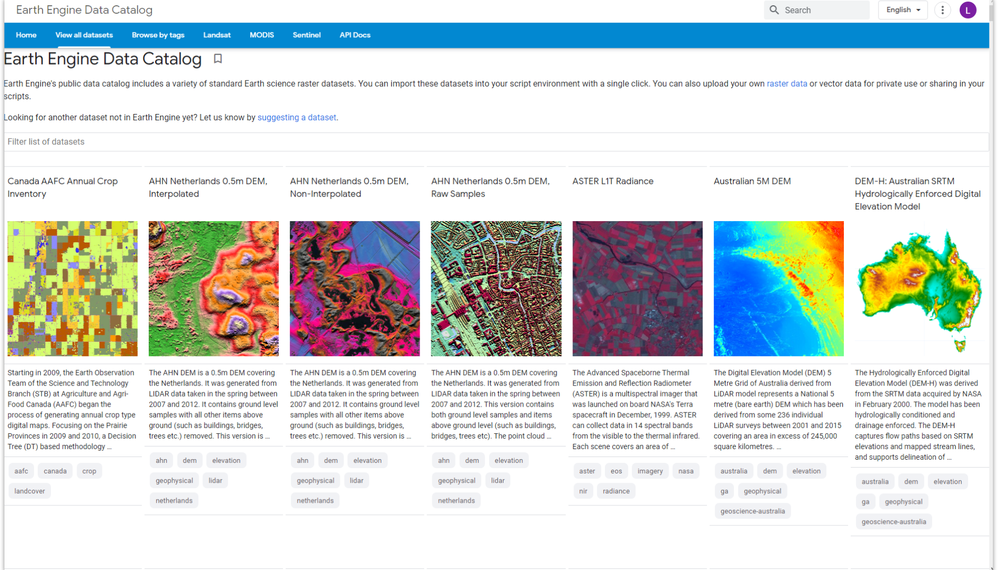

<font size=2> Source: Google </font>

## Application Programming Interface (API)

An (API) is a way to communicate with GEE servers. The API is designed so that users don't need to worry about distributing computation across computers and later assembling results. As users, we simply specify what should be done, which makes GEE very accessible to users who are not familiar with writing code.

## Apps

Codes can be converted into applications maintained on GEE:


<font size=2> Earth Engine Application: MODIS Ocean Temperature - Time Series Inspector. Source: https://google.earthengine.app/view/ocean. </font>

Some of GEE's applications include:

- Land Use Land Cover Classification
- Forest loss mapping
- Land Use Land Cover Change Detection
- Crop mapping
- Fire mapping
- Air quality monitoring
- Surface water mapping


Examples of applications:

- [Fire Monitoring in the Amazon](https://gis-acca.users.earthengine.app/view/amazon-fire-tracker) - Monitoring of the Andean Amazon Project
- [Global Forest Change](https://glad.earthengine.app/view/global-forest-change) - University of Maryland
- [Global Forest Watch](https://www.globalforestwatch.org/) - World Resources Institute
- [Global Surface Water](https://global-surface-water.appspot.com/map) - Joint Research Center (JRC)
- [Tiger Habitat Monitoring](https://www.science.org/doi/10.1126/sciadv.1501675) - University of Minnesota and others
- [Map of Life](https://species.mol.org/species/map/Perdix_dauurica)
- [Malaria Risk Mapping](http://www.shrinkingthemalariamap.org/) - University of California San Francisco
- [MapBiomas](https://mapbiomas.org)

## Interface

The Code Editor is an integrated development environment for the Earth Engine JavaScript API. It offers an easy way to write, debug, run, and manage code. 

Once you have registered an Earth Engine account, you can open the [Code Editor](https://code.earthengine.google.com/) and you'll see a screen like the one below.

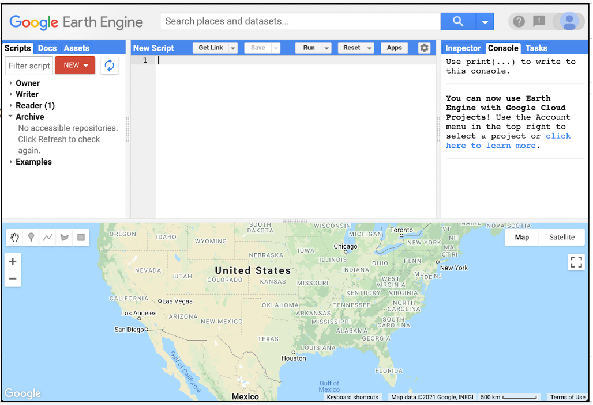

The menu on the left consists of three tabs: `Scripts`, `Docs`, `Assets`: 
- In the `Scripts` section you have all your code stored in repositories, folders and files. You can organize your scripts by project, and also share access with other GEE users. 
- `Docs` is the [API Documentation](https://developers.google.com/earth-engine/) with functions and their explanations. 
- In `Assets` you can store and organize files that you upload from your computer or download from GEE. 

In the center, you'll find the web-based code editor where you can insert your JS code without any prior software installation. With the `Apps` button, you can develop small automated applications to process and display data in a more user-friendly manner and interface. The `Run` button executes the code. 

On the right, we have three main panels: `Inspector`, `Console` and `Tasks`. In the Console area we can see code errors or printed values, this allows us to debug our script.

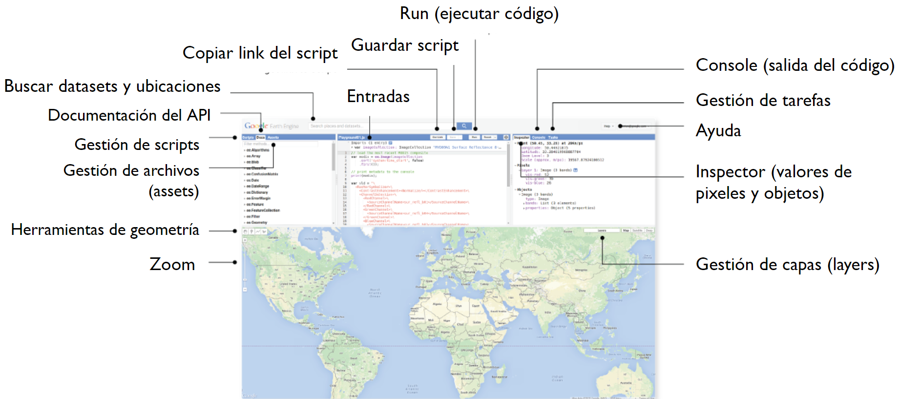

## Exercise: my first script

The Code Editor allows you to write JavaScript code and run it. Let's try to display the words "Hello World". Copy the following code in the middle panel.

```javascript
print('Hello World');
```

The above line of code uses the JS print function (`print`) to print the text "Hello World" to the screen. Once you enter the code, click the `Run` button. The output will be displayed in the top right panel under the `Console` tab.


Now you know where to write your code, how to run it, and where to look for the result. You've just written your first Earth Engine script, so let's save it. Click the `Save` button.

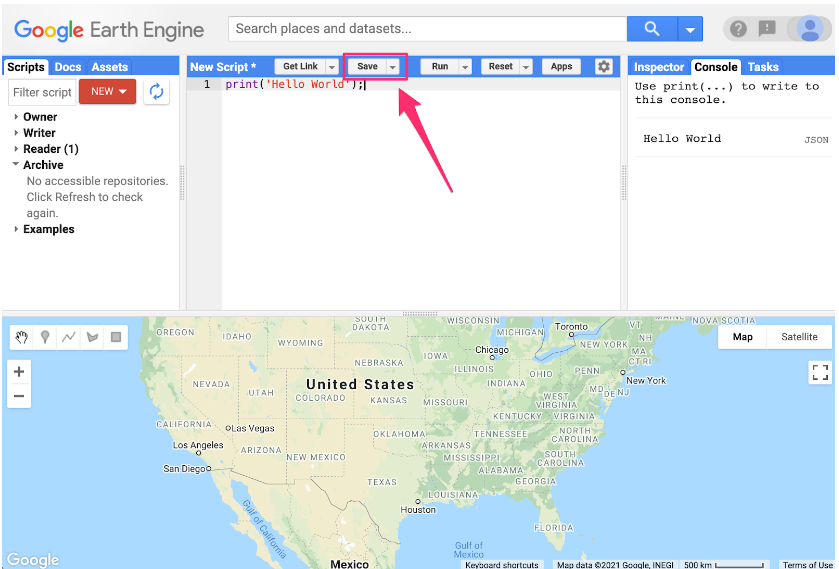

If this is your first time in Code Editor, a screen will appear to create your home directory: a unique ID. From here you can create folders and code repositories. You can choose a name of your choice, but remember that it cannot be changed and will always be associated with your account. A good choice for the name would be the username of your Google account.


Once your home folder is created, you will be prompted to enter a new repository. A repository can help you organize and share code. Your account can have multiple repositories and each repository can have multiple scripts inside it.

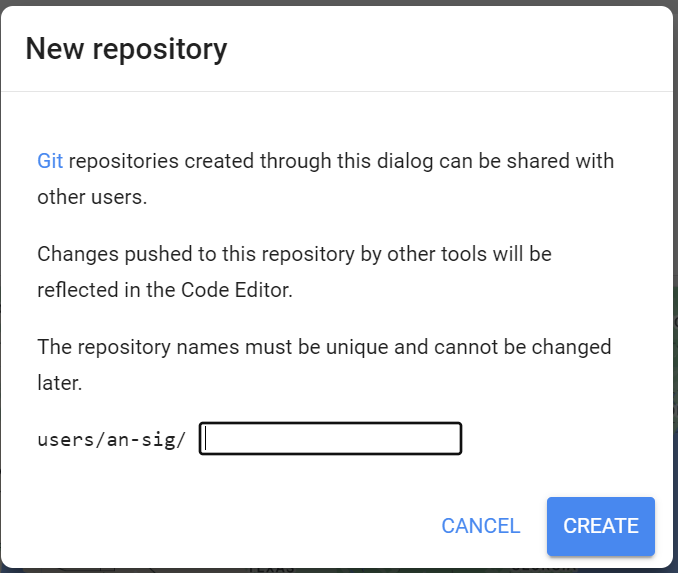

Finally, you will be able to save your script inside the newly created repository. Enter the name of your choice and click `OK`.


Once the script is saved, it will appear in the script manager panel (under `Owner`). Scripts are saved in the cloud and will always be available to you when you open the Code Editor.

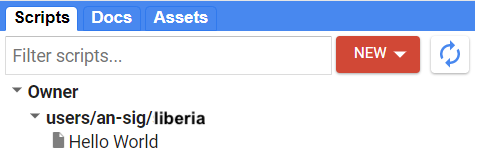

Congratulations! You have created your first script.

# Repository

<font color = red> update the link below </font>

All the codes created in this workshop are available in this repository: [https://code.earthengine.google.com/?accept_repo=users/an-sig/suriname](https://code.earthengine.google.com/?accept_repo=users/an-sig/suriname).


## Javascript and Earth Engine Concepts

This section covers JavaScript (JS) syntax and basic data structures in Earth Engine.

When you learn to program on Earth Engine, you don't need to learn JavaScript or Python in depth, they are just ways to access the Earth Engine API.

### Variables

In JS, variables are used to store data values and are defined using the keyword `var` followed by the name of the variable. The following code assigns the text "Monrovia" to the variable named `city`. 

> **_Note:_**
>
> The text string in the code must be enclosed in quotes. You can use ' (single quotes) or " (double quotes), and they must match at the beginning and end of every string, but it's good to be consistent throughout a given script. 

Every code line should normally end with a semicolon, although Earth Engine's code editor does not require it.

```javascript
var city = 'Monrovia';
```

If you print the variable `city`, you will get the value stored in the variable (Monrovia) printed to the Console.

```javascript
print(city);
```

When you assign a text value, the variable is automatically assigned the type *string*. 

You can also assign numbers to variables and create variables of type *number*. The following code creates a new variable called `population` and assigns a number to it as its value.

```javascript
var population = 1700000;
print(population);
```

### Lists

It can be useful to store multiple values in a single variable. JS provides a data structure called a "list" that can contain multiple values. We can create a new list by using the brackets [] and adding multiple values separated by a comma.

```javascript
var cities = ['Monrovia', 'Gbarnga', 'Buchanan', 'Ganta'];
print(cities);
```

If you look at the output in the Console, you'll see "`List`" with an expand arrow next to it, which if clicked, show you the contents of the list. 

You'll notice that along with the four list items, there is a number next to each value. This is the index of each article which allows you to reference each item in the list by a numeric value indicating its position in the list.


### JavaScript Objects

Lists store multiple values in a single variable but aren’t ideal for structured data. Instead, JavaScript objects store key-value pairs, allowing access by `key` rather than position. Objects are created using `{}`. The example below defines an object `cityData` with details about Monrovia.

```javascript
var cityData = {
    'city': 'Monrovia',
    'coordinates': [-10.8119, 6.3161],
    'population': 1700000
};
print(cityData);
```

The object will be printed to the `Console`. You can see that instead of a numeric index, each element has a label. This is known as the `key` and can be used to retrieve the value of an object.


> **_NOTE:_**
>
> Objects can span multiple lines, with a semicolon (;) marking completion.
>
> The variable name `cityData` follows "camel case," where the first word is lowercase, and subsequent words start with uppercase letters. This convention, used in the Earth Engine API, improves code readability.


### Functions

In Earth Engine, you will need to define your own functions, which take user input, use it to perform some calculations, and send an output. Defined using the `function` keyword, they allow grouping a set of operations and repeating the same operations with different parameters without having to rewrite them each time. 

The following code defines a function called `greeting` that takes input called `name` and returns a greeting prefixed with `Hello`. We can call the function with different inputs and generate different outputs with the same code.

```javascript
var greet = function(name) {
    return 'Hallo ' + name;
};
print(greet('Wereld'));
print(greet('Deelnemers'));
```

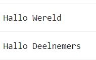

### Comments

As you type the code, it's helpful to add some text to explain the code. It is a good practice to add comments in your code explaining each step. In JavaScript, you can prefix any line with two forward slashes `//` to make it a comment. If commented out, this part of the code will not execute.

```javascript
// This is a comment!
```

A comment can be added by selecting multiple lines and using a shortcut (`Ctrl + /` on Windows, `Cmd + /` on Mac). It can also be useful when debugging code to stop the execution of certain parts of the script.


### Complete code


<font color = red> update the link below </font>


"`2 Introduction to JS`" script from the repository and the `T1 & T2` folder or direct link:
[https://code.earthengine.google.com/5f07daa42a251db03cf84bc5ebe99716](https://code.earthengine.google.com/5f07daa42a251db03cf84bc5ebe99716)

## Earth Engine API Basics

The Earth Engine API is extensive, providing objects and methods to do everything from simple math to advanced algorithms for image processing. 

You can switch to the `Docs` tab to see the API functions grouped by object types (or in the [Earth Engine documentation](https://developers.google.com/earth-engine/apidocs)). API functions are prefixed with `ee` (for Earth Engine).


Fundamental Earth Engine Concepts regarding remote sensing include:

- Image (`ee.Image`): The fundamental raster data type in Earth Engine. Image with a stack of georeferenced bands. Each band has its own Mask, Projection, Resolution, and a list of properties including date, bounding box, etc.

     

- Image Collection (`ee.ImageCollection`): A collection of images

     

- Geometry (`ee.Geometry`): The fundamental vector data type in Earth Engine. Line / Point / Polygon / etc.

     

- Feature (`ee.Feture`): A geometry with properties. Line/Point/Polygon/etc,
Property List

     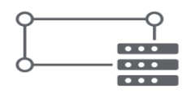

- Features Collection (`ee.FeatureCollection`): A collection of Features (geometries with properties)

     

- Reducers (`ee.Reducer`): Object used for aggregations and numerical calculations (for bands, time series, features)

     
     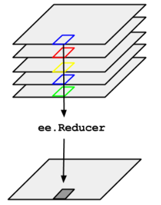

For more information access the [EE objects and methods site](https://developers.google.com/earth-engine/guides/objects_methods_overview).

### Practice

Let's learn how to use the API. Suppose you want to add two numbers, stored in variables `a` and `b`. Create a new script and enter the following:

```javascript
var a = 1;
var b = 2;
```

To do calculations in Earth Engine, you would not write `var c = a + b` to add the two numbers. Instead, the Earth Engine API gives you functions to do this, and it is important that you use the API functions whenever you can, as they will help you avoid timeouts and create efficient code.

Looking at the `Docs` tab, you will find a group of methods that can be called on an `ee.Number`. Expand to see the various functions available for working with numbers. In the function list, there is an addition function (`add`) to add two numbers. That's what you use to add `a` and `b`.


The following code shows the syntax and prints the result, which of course is the value 3.

```javascript
var result = ee.Number(a).add(b);
print(result);
```


Let's say you're working on a task where you need to create a list of years from 1980 to 2020 with an interval of five years. The first step is to switch to the `Docs` tab and open the `ee.List` module to browse through the features. You will notice a function `ee.List.sequence`. Clicking on it will bring up the documentation for the function.

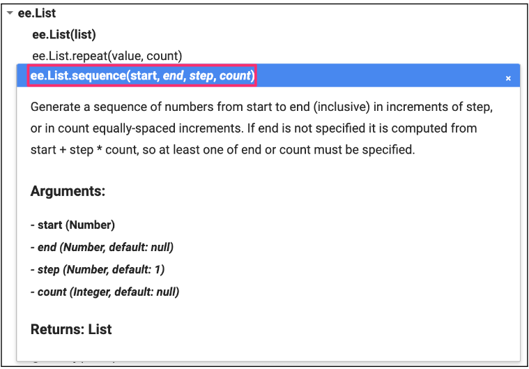

The `ee.List.sequence` function can generate a sequence of numbers from a given `start value` to the `end value`. It also has an optional parameter `step` to indicate the increment between each number. We can create an `ee.List` of numbers representing the years from 1980 to 2020, counting by 5: `start` = 1980, `end` = 2020 and `step` = 5.

```javascript
var yearsList = ee.List.sequence(1980, 2020, 5);
print(yearsList);
```

The output printed to the `Console` will show that the `yearList` variable contains the list of years with the correct interval.

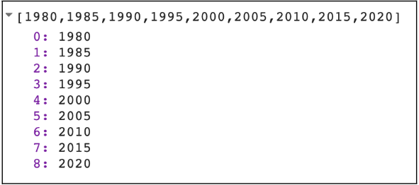

Now let's look at an example of reduction (`ee.Reducer`). `ee.Reducer` is the object used for aggregations and calculations. We can create a list with numbers from 1 to 5 and calculate the average of these numbers. For that, we use the `reduce()` function for lists and choose the `ee.Reducer` (look in the `Docs` for the `ee.Reducer.mean()` reducer). Note that we can use the same `ee.List.sequence` function to create the list but without the need to define the `step` since `step` has the value 1 by default.

```javascript
var numbersList = ee.List.sequence(1, 5);

var mean = numbersList.reduce(ee.Reducer.mean());
print(mean);
```

You have just completed a moderately complex programming task with the help of the Earth Engine API.

### Challenge 1

Suppose you have the following two string variables defined in the code below. Use the Earth Engine API to create a new string variable called `result` by combining these two `Strings`. Print it in the `Console`. The printed value should say "Sentinel2A".

```javascript
var mission = ee.String('Sentinel');
var satellite = ee.String('2A');
```

> *Hint*: Use the `cat` function of the `ee.String` module to "concatenate" (join) the two `strings`. More information about all functions is available in the `Docs` tab.


### Challenge 2

Create a dictionary called `myInformation` using the `ee.Dictionary` object with your personal information: `name`, `age`, and a list of your 3 favorite movies `movies`. Print it in the `Console`.

### Challenge 3

Get the value stored in `age` and save it in a variable with a new name (example: `myAge`). Print it in the `Console`.

> *Hint*: use the `get()` function of the `ee.Dictionary` object.

> *Note:* the value printed is of type `Computed Object`. That means it's not an EE object yet. If you were to perform a mathematical operation on this number, you would need to "cast" it to the `ee.Number` object.

### Challenge 4

Get the second value from the list below and save it in a variable (example: `secondValue`).
Divide that number by 2 and save it in a variable (example: `result1`). Print this result to the `Console`.

> *Hint*: look up information for the `get()` function of `ee.List`. 
>
> *Note:* indexing starts at 0.

> *Hint*: search for the `divide()` function of `ee.Number`. The values of `myList` need to be cast to an `ee.Number` first, before the number functions can be used. 
>
> *Note:* we do not need to cast the number 2 in `divide()` - Earth Engine already casts that number to `ee.Number` once we are using an API function (`divide()`).

```javascript
var myList = ee.List([1, 2, 5, 4]);
```

### Challenge 5

Multiply the second value of `myList` by 5 and store it in a variable (example: `result2`). Print it in the `Console`.

> *Hint*: Search for the `multiply()` function of `ee.Number`. The values of `myList` need to be cast to an `ee.Number` first, before the number functions can be used. 
>
> *Note:* we do not need to cast the number 5 in `multiply()` - Earth Engine already casts that number to `ee.Number` once we are using the API function (`multiply()`).

### Challenge 6

Multiply each number in `myList` by 3. Save the result in a new variable called `newList` and print it.

> *Hint*: complete the `triplicate` function below. Use `map()` to apply the function to each item in the list. Don't forget about the casting.

```javascript
function triplicate(number) {
   return ; // complete this function.
}
```

### Challenge 7

Calculate the sum of all Numbers in `newList`. Save and print that value as `sum`.

### Complete code

<font color = red> update the link below </font>

"`3 Earth Engine API`" script from repository and `T1 & T2` folder or direct link:
[https://code.earthengine.google.com/fc67eeca8496c9647ea68c1dd235f3cd](https://code.earthengine.google.com/fc67eeca8496c9647ea68c1dd235f3cd).
