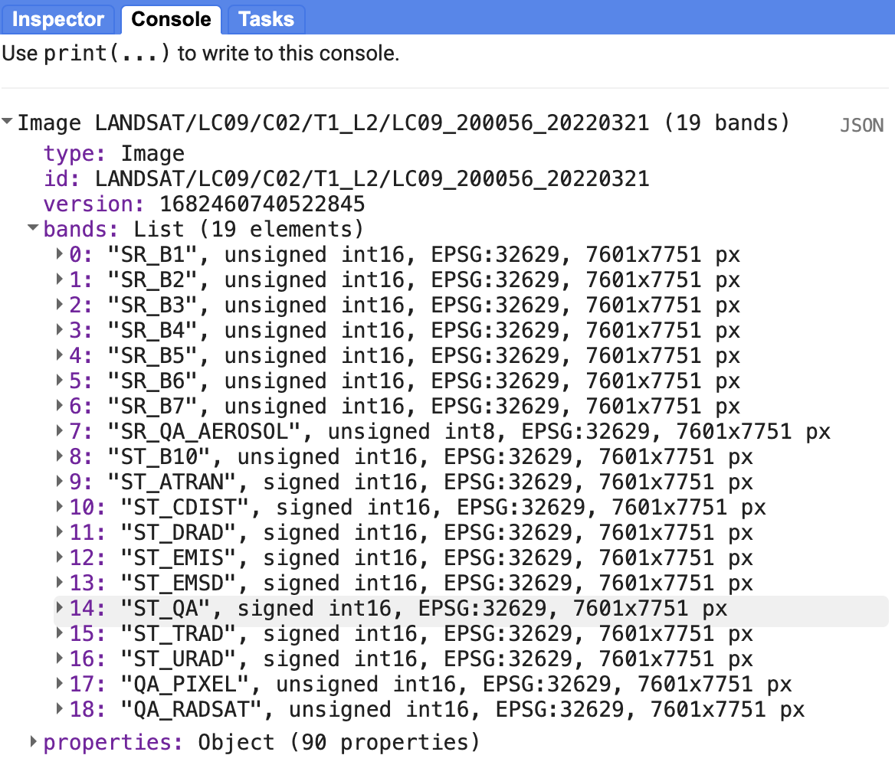
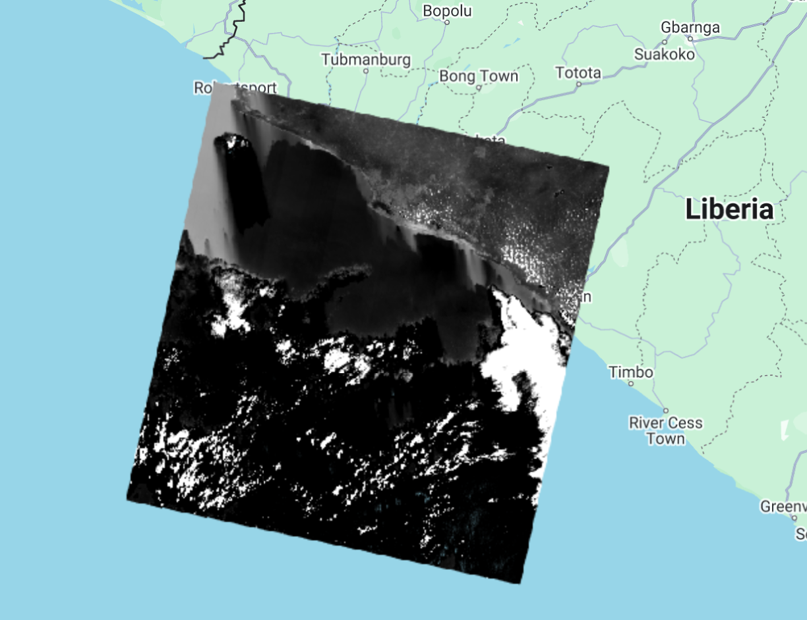
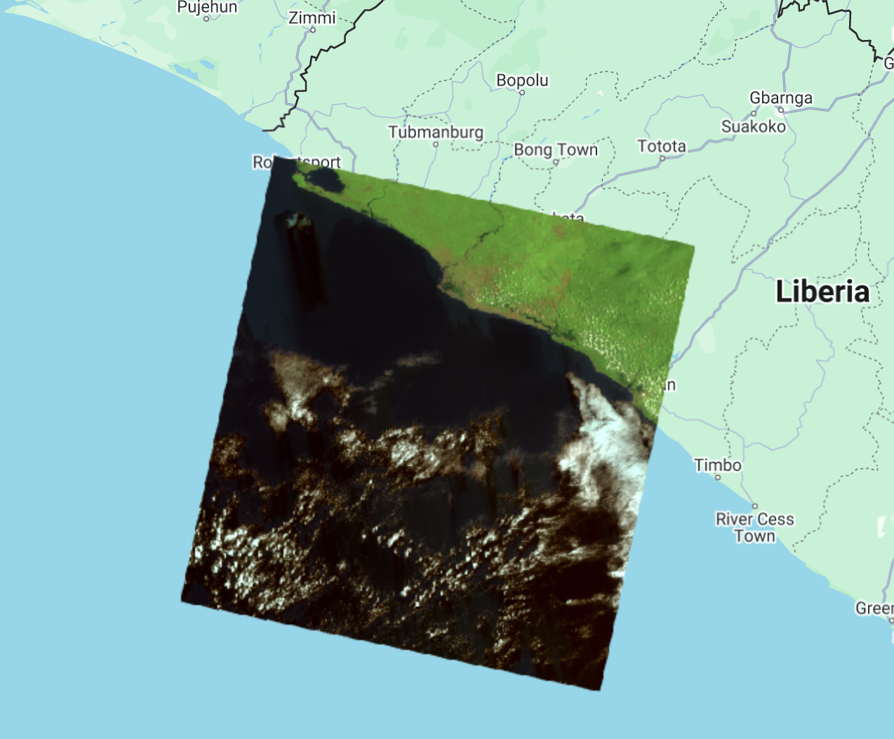
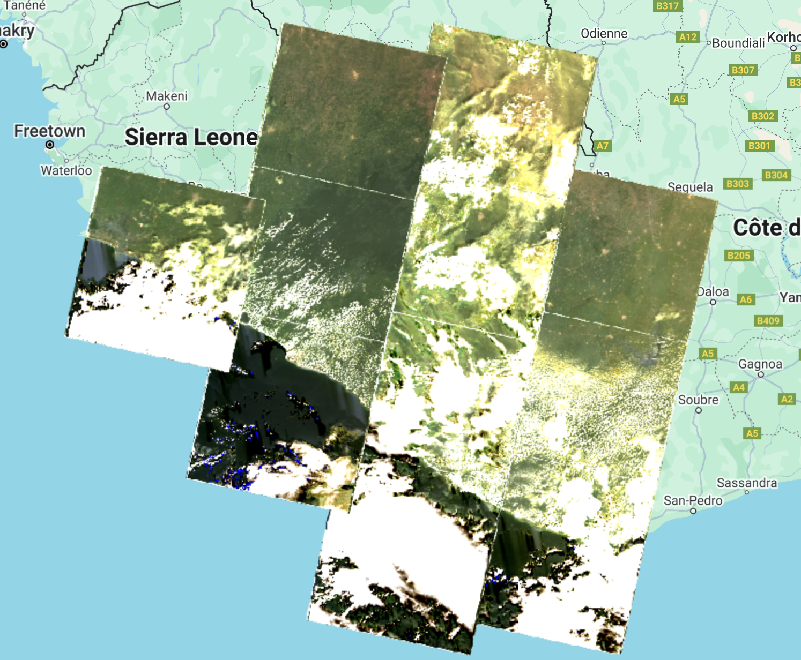
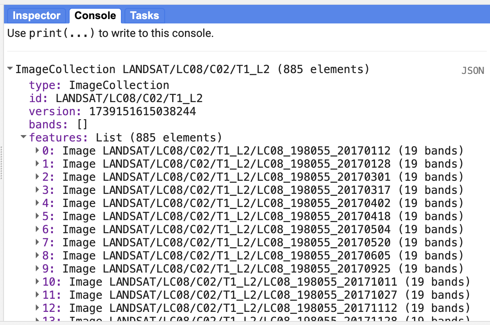
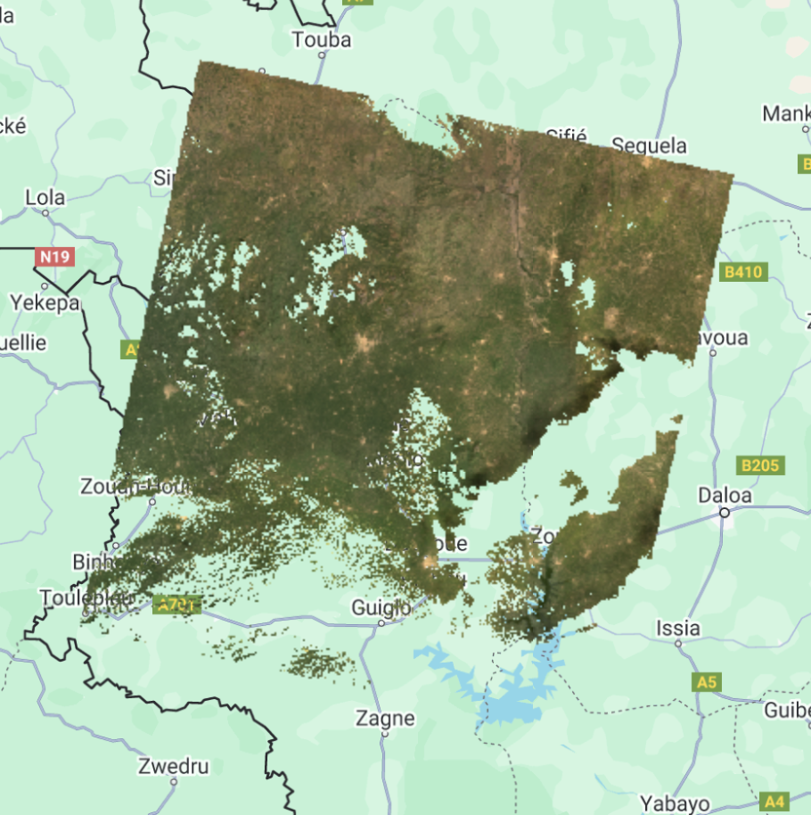
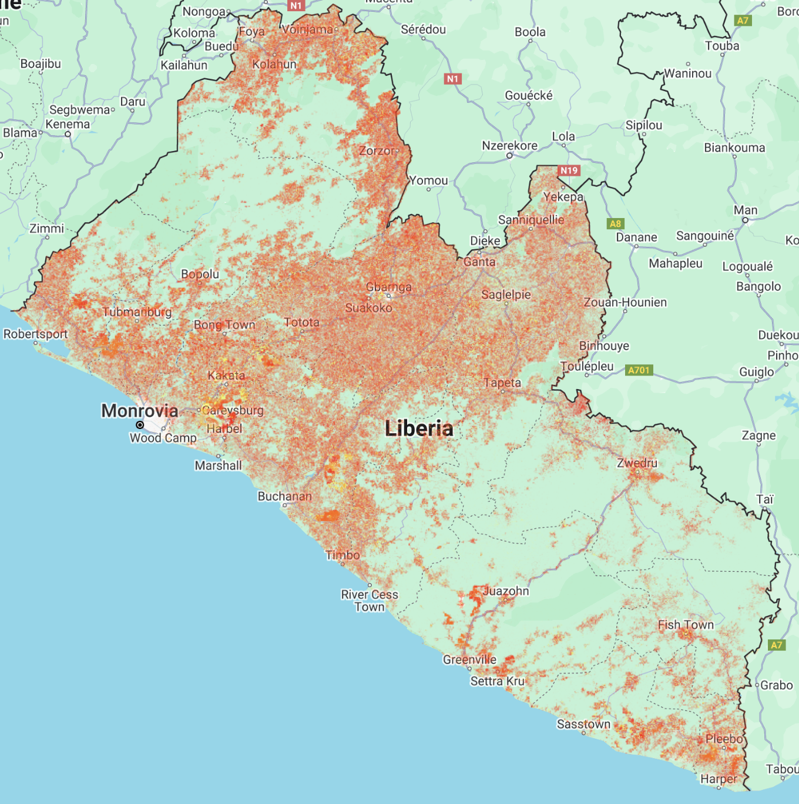

# Imagery in GEE

Imagery in GEE can be accessed either from your local workstation or Earth Engine's public data catalog, which offers over forty years of historical imagery and scientific datasets, updated and expanded daily.


## Importing Raster Data to GEE assets
 
You can use the Asset Manager to upload images or other georeferenced raster datasets, including georeferenced drone images. You can upload GeoTIFF image files up to 10 GB in size to your Earth Engine user folder. For larger files, we would need to use [the command-line upload option](https://developers.google.com/earth-engine/guides/command_line#upload).

To upload a GeoTIFF using the Code Editor, select the Assets tab in the upper left corner, click **`NEW`**, then select **Image upload**. Click the **`SELECT`** button and navigate to a GeoTIFF on your local file system, or drag and drop your GeoTIFF into this upload dialog.

Give the image an appropriate asset ID (which doesn't already exist) in your user folder. If you'd like to upload the image into an existing folder or collection, prefix the asset ID with the folder or collection ID, for example `projects/myproject/folder-or-collection-id/new-asset`.

Click `UPLOAD`.


Once you have started the upload, an "Asset ingestion" task appears on the `Tasks` tab at the right side of the Code Editor. Hovering over the task in the task manager shows a **?** icon which you can use to check the upload status. To cancel an upload, click on the spinning GEE icon , next to the task. Once the ingestion is complete, the asset will appear in your specified assets folder.


## Satellite images through public data catalogue

This section covers inspecting image bands, displaying them as map layers, and creating composite layers with multiple bands, including visible and non-visible spectrum.

First, we are going to visualize a Landsat 9 image of March 21, 2022 over Monrovia. You can explore the image in several ways. To get started, you can retrieve metadata (descriptive data about the image) by printing the image.

```javascript
var firstImage = ee.Image('LANDSAT/LC09/C02/T1_L2/LC09_200056_20220321');
print(firstImage);
```

In the `Console`, click on the expansion arrows to display the information. We see that this image consists of 19 different bands. For each band, the metadata lists four properties, but for now let's just note that the first property is a name or label for the band in quotes. For example, the name of the first band is “SR_B1”.



Now let's add one of the bands to the map as a layer so we can see it.

```javascript
Map.addLayer(
    firstImage, // data to visualize
    {
        bands: ['SR_B1'], //  image band to visualize
        min: 7000, //  range of values for visualization
        max: 12000
    },
    'First Image' //  layer name that appears under "Layers"
);
```

The code here uses the `addLayer` method of the map (`Map`). There are four important components of the above command:

- `firstImage`: this is the dataset that will be displayed on the map.
- `bands`: these are the particular bands of the dataset to display on the map (a single band "SR_B1" in our case).
- `min`, `max`: these represent the lower and upper limits of the values of "SR_B1" to display on the screen. The minimum (7000) is assigned to black, and the maximum (12000) to white, with values in between mapped linearly to grayscale. Values below 7000 appear black, and above 12000 appear white.
- `'First Image'`: this is a label for the map layer to display in the Layer Manager. It appears in the layer dropdown at the top right of the map.

When you run the code, you may need to scroll to find the image. Click and drag the map to Liberia or search "Monrovia, Liberia" in the panel at the top of the Code Editor. Use the `zoom` tool to increase or decrease the zoom level.




Can you recognize any features in the image?

Let's explore this image with the `Inspector` tool. Click the `Inspector` tab on the right side of the Code Editor, your cursor should now look like a crosshair. Clicking on a location will display data in the `Inspector` panel under three categories:


- `Point`: displays clicked cursor location details, including latitude, longitude, zoom level, and scale.  
- `Pixels`: provides pixel data for the selected layer, including the layer name, data source, and a bar chart of band values of our `"First Image"` that contains 19 bands. Hover over a bar to see the band name and pixel value. Click the blue icon next to `Layer 1` switch from a bar chart to a dictionary view, reporting pixel value for each band.
- `Objects`: shows metadata about the source dataset, similar to what appears when printing the image to the `Console`.

We can use color to compare these visual differences in pixel values of each band layer at a time as an RGB composite. This method uses the three primary colors (red, green, and blue) to display the values of each pixel in three bands.

To test this, add this code and run it.

```javascript
Map.addLayer(
    firstImage,
    {
        bands: ['SR_B4', 'SR_B3', 'SR_B2'],
        min: 7000,
        max: 12000
    },
    'True Color');
```


The result resembles the world we see and is called a natural color composite because it matches the spectral ranges of the bands to display colors. Also known as a true-color composite, it shows the red band in red, the green band in green, and the blue band in blue. We specify the pairing by Landsat 9 band order: B4, B3, B2, which correspond to real-world red, green, and blue, respectively.


Now, we can add two more layers, but with false colors, using the `SR_5`, `SR_4`, `SR_3` and `SR_6`, `SR_5`, `SR_4` bands.

```javascript
Map.addLayer(
    firstImage,
    {
        bands: ['SR_B5', 'SR_B4', 'SR_B3'],
        min: 6000,
        max: 18000
    },
    'False Color');

Map.addLayer(
    firstImage,
    {
        bands: ['SR_B6', 'SR_B5', 'SR_B3'],
        min: 7000,
        max: 27000
    },
    'False Color SWIR');
```

What coverages stand out in these band combinations?




### Complete code

"`1 Image Visualization - Landsat 9`" script from our repository in the `07_intro_to_GEE/02_imagery` folder.


## Adding another satellite image to the map

Now, we will add the same Landsat 9 image and a new Sentinel-2 image for comparison.  

First, we define the Landsat 9 image variable, print it to the Console, and set the map center using `Map.setCenter`, which requires `longitude`, `latitude`, and `zoom level`. Then, we add the image to the map using the True Color band combination.

```javascript
var firstImageL9 = ee.Image('LANDSAT/LC09/C02/T1_L2/LC09_200056_20220321');
print(firstImageL9);

Map.setCenter(-55.3807, 5.7495, 9);

Map.addLayer(
    firstImageL9,
    {
        bands: ['SR_B4', 'SR_B3', 'SR_B2'],
        min: 7000,
        max: 12000
    },
    'True Color L9');
```


Next, we define a variable `firstImageS2` to store an `ee.Image` of a Sentinel-2 scene from March 29, 2022, taken eight days after the Landsat 9 image. We print and add it to the map using the True Color band combination. For Sentinel-2, red (B4), green (B3), and blue (B2) bands match Landsat 9, though this isn’t always the case. Unlike Landsat 9, Sentinel-2 band names lack the `SR_` prefix.


```javascript
var firstImageS2 = ee.Image('COPERNICUS/S2_SR_HARMONIZED/20220329T105629_20220329T111136_T29NLH');
print(firstImageS2);

Map.addLayer(
    firstImageS2,
    {
        bands: ['B4', 'B3', 'B2'],
        min: 0,
        max: 2000
    },
    'True Color S2');
```

In the Console, can you see the difference in band quantity? Open the Earth Engine catalog for both datasets ([USGS Landsat 9 Level 2, Collection 2, Tier 1](https://developers.google.com/earth-engine/datasets/catalog/LANDSAT_LC09_C02_T1_L2)  & [Sentinel-2 MSI: MultiSpectral Instrument, Level-2A](https://developers.google.com/earth-engine/datasets/catalog/COPERNICUS_S2_SR)) and see the different band designations. Inspect the metadata for both images in the Console as well.


On the map, note the color differences, which may result from differences in spectral resolution, processing steps, and other factors. Why does the Sentinel-2 image cover a smaller area than Landsat 9? Zoom in to compare pixel sizes and observe the spatial resolution difference. Landsat 9 has a 30 m resolution, covering a larger area at the cost of detail, while Sentinel-2 has a 10 m resolution, offering finer detail but covering a smaller area.


## Projection and Scale

You can print the image’s projection and scale. Since different bands may have different spatial resolutions, a specific band must be selected for projection details. Below, we use the `select()` function to choose band 2 of the Sentinel-2 image, returning an image with just that band. Then, we apply the `projection()` function, which returns an `ee.Projection` object. Printing this variable in the Console reveals the image’s projection.

```javascript
var projection = firstImageS2.select('B2').projection();
print(projection);
```

On the Console we see that the Sentinel-2 image is in the EPSG:32629 projection.


We can also print the image’s scale (spatial resolution). The `ee.Projection` object has a `nominalScale()` function that returns the linear scale in meters of the units of this projection, as measured at the point of true scale. The type of object that is returned is a Float number.

```javascript
var scale = projection.nominalScale();
print(scale);
```

With this, we see on the Console that the scale is what we expected, 10 meters.

## Exporting an image

The GEE API provides export functions that allow exporting an image in different ways: to Google Drive, as an EE Asset (not leaving the Earth Engine environment), and to Google Cloud. If we want to work with the image outside of GEE, we can use the `Export.image.toDrive` function.

```javascript
Export.image.toDrive({
  image: firstImageS2.int16(),
  scale: 10,
  region: area,
  description: 'sentinel2image',
  fileNamePrefix: 'S2 Monrovia 220329',
  maxPixels: 1e13
})
```

Check this function's description in the `Docs` tab for more information.

You will see that once you run the code, the `Tasks` tab will flash orange and you will see the option to `Run` this export task. It might take several minutes for your image to export. Once the export task is finalized, you will be able to download the tif file(s) from [your Google Drive](https://drive.google.com/drive/my-drive).

### Complete code

Script "`2 Image Visualization - L9 & S2`" from the repository and folder `07_intro_to_GEE/02_imagery` or direct link: [https://code.earthengine.google.com/7a082a5c8a09c5ac1c67a073b377843d](https://code.earthengine.google.com/7a082a5c8a09c5ac1c67a073b377843d)


## Image Collections & Composites in Earth Engine

Depending on how long a remote sensing platform has been in operation, there may be thousands or millions of Earth images collected (e.g. Landsat). In Earth Engine, these are organized into `ee.ImageCollection`, a specialized data type with specific API operations. Like individual images, they can be viewed with `Map.addLayer`, filtered with `filter`, and processed with functions using `map`.

We are going to filter the Landsat 8 Collection 2, Tier 1, Level 2, to the limits of Liberia, using `filterBounds` and by dates to obtain images from January 2017 to December 2021, using `filterDate`.


```javascript
//--------------------------------------------------------------
// Define area of interest (vector data)
//--------------------------------------------------------------

var liberia = ee.FeatureCollection('projects/pc556-ncs-liberia-forest-mang/assets/liberia_boundary');

// TIP: Centering the map before adding a layer is more efficient 
// than adding it afterward.

//--------------------------------------------------------------
// Define raster data
//--------------------------------------------------------------

// We will work with Landsat 8 data.
// Search in the search bar for 'Landsat 8 Collection 2 Level 2 Tier 1'.
// Collection 2 -> More advanced level of processing.
// https://www.usgs.gov/landsat-missions/landsat-collection-2
// Level 2 -> Surface reflectance data.
// Tier 1 -> Highest quality data.

var landsat8 = ee.ImageCollection('LANDSAT/LC08/C02/T1_L2');

var collection = landsat8
    .filterDate('2017-01-01', '2022-01-01')
    .filterBounds(liberia);

Map.addLayer(collection, {bands: ['SR_B4', 'SR_B3', 'SR_B2'], min: 7000, max: 12000}, 'Landsat 8 Collection');

print(collection);
```

The result is images superimposed on each other and a total of 885 images. Note that the images that appear at the top are in accordance with the order of the images within the collection. In the `Console` you can look at the order of the images.





We can filter the collection by cloud cover as well. For that, we add one more filter on the `landsat8` variable and use the `CLOUD_COVER` property that contains cloud cover percentage information per image. Change the `collection` variable:

```javascript
var collection = landsat8
    .filterDate('2017-01-01', '2022-01-01')
    .filterBounds(liberia)
    .filter(ee.Filter.lt('CLOUD_COVER', 30));
```

We use the `ee.Filter.lt` to get images with cloud cover "less than" 30%, resulting in 268 images.


Now, we are going to apply a cloud masking function. Clouds and cloud shadows reduce the view of the optical sensors and block or obscure the Earth's surface. Working with pixels contaminated by clouds can influence accuracy and information content of products derived from remote sensing activities, including land cover classification, vegetation modeling, and change detection, where undetected clouds can be mapped as false changes. Therefore, information provided by cloud detection algorithms is essential to exclude clouds and cloud shadows from processing.

First, we scale the images as it is recommended by the developer ([https://developers.google.com/earth-engine/datasets/catalog/LANDSAT_LC08_C02_T1_L2](https://developers.google.com/earth-engine/datasets/catalog/LANDSAT_LC08_C02_T1_L2)). A scale factor must be applied to both Collection 1 and Collection 2 Landsat Level-2 surface reflectance and surface temperature products before using the data. 

> Note: 
>
> Landsat Collection 1 and Collection 2 Tier 2 products have different scale factors, fill values, and data types ([https://www.usgs.gov/faqs/how-do-i- use-scale-factor-landsat-level-2-science-products](https://www.usgs.gov/faqs/how-do-i-use-scale-factor-landsat-level-2-science-products)).

We create a function for the application of the scale factors:

```javascript
//--------------------------------------------------------------
// Time series preprocessing
// (Scaling and cloud masking)
//--------------------------------------------------------------

// Preprocess time series using functions that are applied
// to each and every image in the collection.

// Function to apply scale factors.
// To get surface reflectance values between 0 and 1
// (fraction of input solar radiation), we need to use
// scale factors provided by NASA/USGS.
function applyScaleFactors(image) {
  var opticalBands = image.select('SR_B.').multiply(0.0000275).add(-0.2);
  var thermalBands = image.select('ST_B.*').multiply(0.00341802).add(149.0);
  return image.addBands(opticalBands, null, true)
              .addBands(thermalBands, null, true);
}
```

And a function for cloud masking:

```javascript
// Cloud masking function.
// The quality band 'QA_PIXEL' provides information about the presence of clouds
// and other aspects of image quality.
// The information is stored in bits and we use the 'bitWiseAnd' function
// to extract it.
// The quality band 'QA_RADSAT' provides quality information about
// radiometric saturation.
function maskL8sr(image) {
  // Bit 0 - Fill
  // Bit 1 - Dilated Cloud
  // Bit 2 - Cirrus
  // Bit 3 - Cloud
  // Bit 4 - Cloud Shadow
  var qaMask = image.select('QA_PIXEL').bitwiseAnd(parseInt('11111', 2)).eq(0);
  var saturationMask = image.select('QA_RADSAT').eq(0);

  // Replace the original bands with the scaled ones and apply the masks.
  return image.updateMask(qaMask)
              .updateMask(saturationMask);
}
// Because we are dealing with bits, in the maskL8sr function,
// we use the bitwiseAnd and parseInt functions.
// These are functions that are used to unpack
// the bit information. A bitwise AND is a binary operation
// which takes two binary representations of equal length and
// perform logical AND operation on each pair of
// corresponding bits. Therefore, if both bits in the comparator
// positions have the value 1, the bit in the result
// binary representation is 1 (1 × 1 = 1); otherwise,
// the result is 0 (1 × 0 = 0 and 0 × 0 = 0). The parseInt
// the function parses a string argument (in our case, five characters
// string '11111') and returns an integer of the specified
// numbering system, base 2.
```

Now, we apply the two functions to the collection:

```javascript
// Apply preprocessing functions to the images in the collection.
var preprocessed = collection.map(applyScaleFactors)
                             .map(maskL8sr);
```

We can compare cloud masking effects by comparing the same image before and after processing:

```javascript
// ---------------------------------------------------------------
// Display the first image unprocessed and preprocessed
//---------------------------------------------------------------

// Select the first unprocessed image.
var firstUnprocessed = collection.first();

// Define visualization parameters.
var unprocessedVisParams = {
  bands: ['SR_B4', 'SR_B3', 'SR_B2'],
  min: 4380,
  max: 22300
};

// Add image to the map.
Map.addLayer(firstUnprocessed, 
             unprocessedVisParams, 
             'First unprocessed image');


// Select the first preprocessed image.
var firstPreprocessed = preprocessed.first();

var preprocessedVisParams = {
  bands: ['SR_B4', 'SR_B3', 'SR_B2'],
  min: 0,
  max: 0.15
};


// Add the processed image to the map.
Map.addLayer(firstPreprocessed, 
             preprocessedVisParams, 
             'First preprocessed image');
```




Now, we can create a median composite:

```javascript
//--------------------------------------------------------------
// Create a composite
//--------------------------------------------------------------
// Use the following functions to compare different aggregations:
// .min(); .max(); .mean(); .median()

// We will work with the Median composite.
var composite = preprocessed.median().clip(liberia);

// Add the composite to the map.
Map.addLayer(composite, preprocessedVisParams, 'Median Composite');
```

Note that the `median` function is shorthand for `reduce(ee.Reducer.median())`.


And finally, export this image to Google Drive or as a GEE Asset:

```javascript
//--------------------------------------------------------------
// Export composite to Google Drive or as a EE Asset
//--------------------------------------------------------------

// Export to Google Drive.
Export.image.toDrive({
  image: composite.toFloat(),
  description: 'medianL8composite_2017-2021',
  fileNamePrefix: 'medianL8composite_2017-2021',
  region: liberia,
  scale: 30,
  maxPixels: 1e13
});

// Export as a GEE Asset.
Export.image.toAsset({
  image: composite,
  description: 'medianL8composite_2017-2021',
  assetId: 'projects/trainings/assets/liberia/images/medianL8composite_2017-2021', //! UPDATE TO YOUR OWN PATH
  region: liberia,
  scale: 30,
  maxPixels: 1e13
});
```

### Complete code

Script "`3 ImageCollections & Composite`" is in the repository under this folder `07_intro_to_GEE/02_imagery`.


## Publicly available datasets 

Earth Engine also provides access to [numerous publicly available datasets](https://developers.google.com/earth-engine/datasets) that support environmental monitoring, including forest change and fire alerts. These datasets come from global satellite missions and scientific research initiatives, enabling rapid analysis and decision-making.

### Global Forest Change  
For example, the **Global Forest Change dataset** tracks forest loss, gain, and disturbance from 2000 onward, derived from Landsat imagery. It can be accessed using the following code snippet:

```javascript
var liberia = ee.FeatureCollection('projects/pc556-ncs-liberia-forest-mang/assets/liberia_boundary');

var gfc = ee.Image("UMD/hansen/global_forest_change_2022_v1_10").clip(liberia);

Map.addLayer(gfc.select('lossyear'), {min: 0, max: 22, palette: ['yellow', 'red']}, 'Forest Loss');
```




### Fire Alerts  
The **MODIS and VIIRS fire** datasets can provide near real-time active fire detections. For instance, **[Fire Information for Resource Management System (FIRMS)](https://developers.google.com/earth-engine/datasets/catalog/FIRMS
)** can be added to your map with:


```javascript
var firms = ee.ImageCollection('FIRMS').filter(
    ee.Filter.date('2022-03-01', '2022-04-10'));
var fires = firms.select('T21');
var firesVis = {
  min: 325.0,
  max: 400.0,
  palette: ['red', 'orange', 'yellow'],
};
Map.addLayer(fires, firesVis, 'Fires');
```


These datasets can help detect deforestation, monitor wildfires, and assess land use changes within GEE.


# Linking GEE imagery to CEO

*The following is adapted from a CEO blog, see the [source](https://www.collect.earth/connecting-gee-raster-data/) for further details.* 

GEE imagery can be integrated into CEO and can provide the following benefits: 
- Access near real-time satellite data for interpretation.  
- Combine high-resolution imagery with CEO’s sampling tools.  
- Enable collaborative land monitoring and validation.  

While CEO provides built-in access to Google Earth, Bing Maps, and Sentinel-2, we can also use custom GEE imagery.


The first step for connecting your GEE imagery with CEO is to determine the **Asset ID** for your Image Asset or Image Collection asset. If you are using your own imagery, be sure that the imagery is either shared publicly or if your asset must stay private, that you have given read access to “gateway1 [AT] ceo-production.iam.gserviceaccount [DOT COM]”.

You can find the Asset ID for your own data by clicking on the asset to bring up the Asset Details pane. The Asset ID is located on the left side as “Image ID”.

If you are using data from the Data Catalog, you can find the Asset ID on the information page under “Earth Engine Snippet” between the quotation marks.


The second piece of information you will need are the **visualization parameters**. CEO uses GEE’s image visualization parameters to display your Image Asset or Image Collection Asset. The most important of these parameters are “bands”, “min” and “max”. 

The final piece of information, needed for Image Collection Assets only, is your **start date and end date** (if using an image collection).


So, in CEO...
Click `Add New Imagery` on your main institution page. Once you select either “GEE Image Asset” or “GEE Image Collection Asset” as the Type, the basic steps to connect your Image Asset to CEO are:

- Add the imagery title, which will be the displayed name of the imagery.
- Add your Asset ID.
- Add your Visualization Parameters in JSON format.
    - For example, {“bands”:[“R”,”G”,”B”],”min”:90,”max”:210}
    - You should NOT have a “;” character after the right bracket. This may give an error “Invalid JSON in the ‘Visualization Parameters’ field” or may cause the imagery to not load properly.
- For Image Collection Assets, you will also need to specify your Start Date and End Date.


### GEE imagery as a CEO basemap

The following is an example of using a single Sentinel-2 image to replace the basemap of your CEO project.

<!-- To export imagery as a web tile layer, we first need to generate a GEE Tile Layer URL using the following script in GEE:

   ```javascript
   var image = ee.Image('COPERNICUS/S2_SR/20220329T105629_20220329T111136_T29NLH')
       .select(['B4', 'B3', 'B2'])
       .visualize({min: 0, max: 2000, bands: ['B4', 'B3', 'B2']});
   
   var mapId = image.getMapId();
   print('Tile URL:', mapId.urlFormat);
   ```


Then, copy the `Tile URL` from the Console.

 -->


- In the CEO project settings, go to the **Project Management** section (on the right-hand side of the screen) and click **`Configure Geo-Dash`**.  
   


- Click **`Add Widget`** at the top of the screen.  
   


- In the pop-up window, select `Image Asset` as the **Widget Type**.  
   


- Fill in the following details:
  - **Title**: Enter a descriptive name, such as `Sentinel2_March29_2022`.
  - **Basemap**: Select `Sentinel-2`.
  - **GEE Image Asset ID**: Paste the asset ID of the image you want to display, e.g.,  
    `COPERNICUS/S2_SR/20220329T105629_20220329T111136_T29NLH`.
  - **Available Bands**: Click `Refresh Available Bands` . This will load the available bands for the image.
  - **Image Parameters**: Adjust the visualization settings.  
    To display bands 4, 3, and 2 as **Red-Green-Blue (RGB)**, use:
    ```json
    {"bands": "B4, B3, B2",
      "min": 0,
      "max": 0.3
    }
    ```
  - Click **`Create`**.  
   


- Click **`Go to first plot`** in your project.  
  This will open a new tab in your browser, displaying your selected plot over the imported image.  
   


- If you need to modify the image or visualization settings, click `Edit Widget`.  
   


