*Objectives: GEE: uploading imagery to assets, including drone data; publicly available imagery and data sets (e.g. forest change and fire alerts); linking GEE imagery to CEO*

# Imagery in GEE

Imagery in GEE can be accessed either from your local workstation or Earth Engine's public data catalog, which offerd over forty years of historical imagery and scientific datasets, updated and expanded daily.


## Importing Raster Data to GEE assets
 
You can use the Asset Manager to upload image or other georeferenced raster datasets, including georeferenced drone images. You can upload GeoTIFF image files up to 10 GB in size to your Earth Engine user folder. For larger files, we would need to use [the command-line upload option](https://developers.google.com/earth-engine/guides/command_line#upload).

To upload a GeoTIFF using the Code Editor, select the Assets tab in the upper left corner, click **`NEW`**, then select **Image upload**. Click the **`SELECT`** button and navigate to a GeoTIFF on your local file system, or drag and drop your GeoTIFF into this upload dialog.

Give the image an appropriate asset ID (which doesn't already exist) in your user folder. If you'd like to upload the image into an existing folder or collection, prefix the asset ID with the folder or collection ID, for example `projects/myproject/folder-or-collection-id/new-asset`.

Click **`UPLOAD`** to start the upload.


Once you have started the upload, an "Asset ingestion" task appears on the `Tasks` tab at the right side of the Code Editor. Hovering over the task in the task manager shows a **?** icon which you can use to check the upload status. To cancel an upload, click on the spinning GEE icon , next to the task. Once the ingestion is complete, the asset will appear in your user folder with a  icon.


## Satellite images through public data catalogue

This section covers inspecting image bands, displaying them as map layers, and creating composite layers with multiple bands, including visible and non-visible spectrum.

First we are going to visualize a Landsat 9 image of March 21, 2022 over Monrovia. You can explore the image in several ways. To get started, you can retrieve metadata (descriptive data about the image) by printing the image.

```javascript
var firstImage = ee.Image('LANDSAT/LC09/C02/T1_L2/LC09_200056_20220321');
print(firstImage);
```

In the `Console`, click on the expansion arrows to display the information. We see that this image consists of 19 different bands. For each band, the metadata lists four properties, but for now let's just note that the first property is a name or label for the band in quotes. For example, the name of the first band is “SR_B1”.


Now let's add one of the bands to the map as a layer so we can see it.

```javascript
Map.addLayer(
    firstImage, // data to visualize
    {
        bands: ['SR_B1'], //  image band to visualize
        min: 7000, //  range of values for visualization
        max: 12000
    },
    'First Image' //  layer name that appears under "Layers"
);
```

The code here uses the `addLayer` method of the map (`Map`). There are four important components of the above command:

- `firstImage`: this is the dataset that will be displayed on the map.
- `bands`: these are the particular bands of the dataset to display on the map (a single band "SR_B1" in our case).
- `min`, `max`: these represent the lower and upper limits of the values of "SR_B1" to display on the screen. The minimum (7000) is assigned to black, and the maximum (12000) to white, with values in between mapped linearly to grayscale. Values below 7000 appear black, and above 12000 appear white.
- `'First Image'`: this is a label for the map layer to display in the Layer Manager. It appears in the layer dropdown at the top right of the map.

When you run the code, you may need to scroll to find the image. Click and drag the map to Liberia or search "Monrovia, Liberia" in the panel at the top of the Code Editor. Use the `zoom` tool to increase or decrease the zoom level.

<font color=red> EDIT the image </font>


Can you recognize any features in the image?

Let's explore this image with the `Inspector` tool. When you click on the `Inspector` tab on the right hand side of the Code Editor, your cursor should now look like a crosshair. When you click on a location on the image, the `Inspector` panel will report data for that location in three categories as follows:

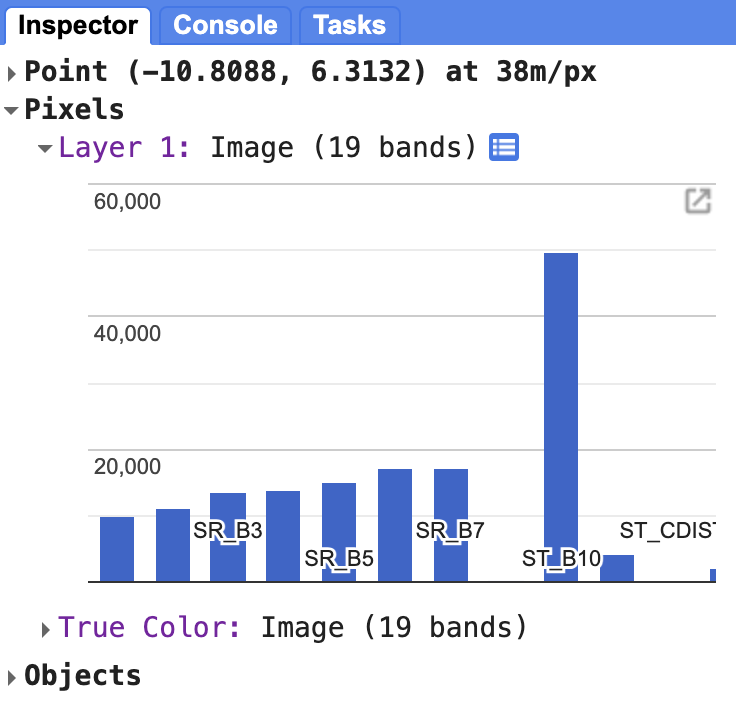

- `Point`: displays clicked cursor location details, including latitude, longitude, zoom level, and scale.  
- `Pixels`: provides pixel data for the selected layer, including the layer name, data source, and a bar chart of band values of our `"First Image"` that contains 19 bands. Hover over a bar to see the band name and pixel value. Click the blue icon next to `Layer 1` switch from a bar chart to a dictionary view, reporting pixel value for each band.
- `Objects`: shows metadata about the source dataset, similar to what appears when printing the image to the `Console`.

We can use color to compare these visual differences in pixel values of each band layer at a time as an RGB composite. This method uses the three primary colors (red, green, and blue) to display the values of each pixel in three bands.

To test this, add this code and run it.

```javascript
Map.addLayer(
    firstImage,
    {
        bands: ['SR_B4', 'SR_B3', 'SR_B2'],
        min: 7000,
        max: 12000
    },
    'True Color');
```


<font color=red> EDIT HERE ONWARDS </font>

The result resembles the world we see and is called a natural color composite, because it naturally matches the spectral ranges of the bands in the image to display colors. This image, also called a true-color composite, shows the red spectral band with shades of red, the green band with shades of green, and the blue band with shades of blue. We specify the pairing simply through the order of the bands in the list: B4, B3, B2. Because Landsat 9 bands 4, 3, and 2 correspond to the real-world colors of red, green, and blue, the image resembles the world we would see outside an airplane window or from a low-flying drone.

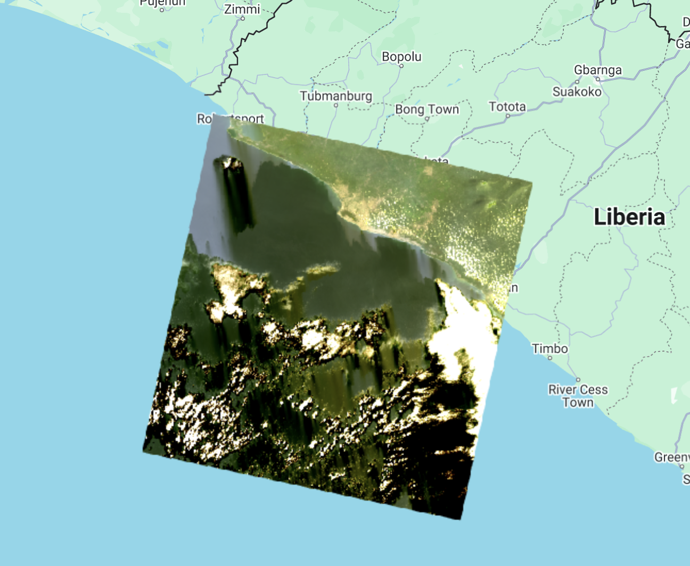

Now, we can add two more layers, but with false colors, using the `SR_5`, `SR_4`, `SR_3` and `SR_6`, `SR_5`, `SR_4` bands.

```javascript
Map.addLayer(
    firstImage,
    {
        bands: ['SR_B5', 'SR_B4', 'SR_B3'],
        min: 6000,
        max: 18000
    },
    'False Color');

Map.addLayer(
    firstImage,
    {
        bands: ['SR_B6', 'SR_B5', 'SR_B3'],
        min: 7000,
        max: 27000
    },
    'False Color SWIR');
```

What coverages stand out in these band combinations?

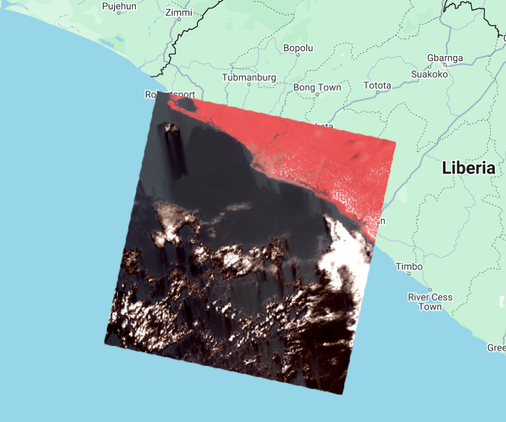


### Complete code

"`4 Image Visualization - Landsat 9`" script from repository and `T1 & T2` folder or direct link:
[https://code.earthengine.google.com/86e9cf5640f967eae536df99349b2c65](https://code.earthengine.google.com/86e9cf5640f967eae536df99349b2c65).

### Example with Landsat 9 and Sentinel-2

"`4 Image Visualization - L9 & S2`" script from repository and `T1 & T2` folder or direct link:
[https://code.earthengine.google.com/8909f4360f49c80071c830c2fd66738a](https://code.earthengine.google.com/8909f4360f49c80071c830c2fd66738a).


## Image Collections & Composites in Earth Engine

Depending on how long a remote sensing platform has been in operation, there may be thousands or millions of images collected from the Earth (e.g. Landsat). In Earth Engine, these are organized into `ee.ImageCollection`, a specialized data type that has specific operations available in the Earth Engine API. Like individual images, they can be viewed with `Map.addLayer`, filtered using the `filter` function, and mapped functions with `map`.

We are going to filter the Landsat 8 Collection 2, Tier 1, Level 2, to the limits of Suriname, using the `filterBounds` function and by dates to obtain images from January 2017 to December 2021, using the `filterDate` function.

```javascript
//--------------------------------------------------------------
// Define area of interest (vector data)
//--------------------------------------------------------------

var suriname = ee.FeatureCollection('projects/caribbean-trainings/assets/suriname-2023/boundary');
// TIP: Centering the map before adding a layer is more efficient 
// than adding it afterward.

//--------------------------------------------------------------
// Define raster data
//--------------------------------------------------------------

// We will work with Landsat 8 data.
// Search in the search bar for 'Landsat 8 Collection 2 Level 2 Tier 1'.
// Collection 2 -> More advanced level of processing.
// https://www.usgs.gov/landsat-missions/landsat-collection-2
// Level 2 -> Surface reflectance data.
// Tier 1 -> Highest quality data.

var landsat8 = ee.ImageCollection('LANDSAT/LC08/C02/T1_L2');

var collection = landsat8
    .filterDate('2017-01-01', '2022-01-01')
    .filterBounds(suriname);

Map.addLayer(collection, {bands: ['SR_B4', 'SR_B3', 'SR_B2'], min: 7000, max: 12000}, 'Landsat 8 Collection');

print(collection);
```

The result is images superimposed on each other and a total of 887 images. Take into account that the images that appear at the top are in accordance with the order of the images within the collection. In the `Console` you can look at the order of the images.


We can filter the collection by cloud cover as well. For that, we add one more filter on the `landsat8` variable and use the `CLOUD_COVER` property that contains cloud cover percentage information per image. Change the `collection` variable:

```javascript
var collection = landsat8
    .filterDate('2017-01-01', '2022-01-01')
    .filterBounds(suriname)
    .filter(ee.Filter.lt('CLOUD_COVER', 30));
```

We use the `ee.Filter.lt` to get images that have cloud cover "less than" 30%. Notice that we now have 200 images.


Now, we are going to apply a cloud masking function. Clouds and cloud shadows reduce the view of the optical sensors and completely block or obscure the spectral response of the Earth's surface. Working with pixels that are contaminated by clouds can significantly influence the accuracy and information content of products derived from a variety of remote sensing activities, including land cover classification, vegetation modeling, and especially change detection, where undetected clouds can be mapped as false changes. Therefore, the information provided by cloud detection algorithms is essential to exclude clouds and cloud shadows from subsequent processing steps.

First, we scale the images as it is recommended by the developer ([https://developers.google.com/earth-engine/datasets/catalog/LANDSAT_LC08_C02_T1_L2](https://developers.google.com/earth-engine/datasets/catalog/LANDSAT_LC08_C02_T1_L2)). A scale factor must be applied to both Collection 1 and Collection 2 Landsat Level-2 surface reflectance and surface temperature products before using the data. Please note: Landsat Collection 1 and Collection 2 Tier 2 science products have different scale factors, fill values, and different data types ([https://www.usgs.gov/faqs/how-do-i- use-scale-factor-landsat-level-2-science-products](https://www.usgs.gov/faqs/how-do-i-use-scale-factor-landsat-level-2-science-products)).

We create a function for the application of the scale factors:

```javascript
//--------------------------------------------------------------
// Time series preprocessing
// (Scaling and cloud masking)
//--------------------------------------------------------------

// Preprocess time series using functions that are applied
// to each and every image in the collection.

// Function to apply scale factors.
// To get surface reflectance values between 0 and 1
// (fraction of input solar radiation), we need to use
// scale factors provided by NASA/USGS.
function applyScaleFactors(image) {
  var opticalBands = image.select('SR_B.').multiply(0.0000275).add(-0.2);
  var thermalBands = image.select('ST_B.*').multiply(0.00341802).add(149.0);
  return image.addBands(opticalBands, null, true)
              .addBands(thermalBands, null, true);
}
```

And a function for cloud masking:

```javascript
// Cloud masking function.
// The quality band 'QA_PIXEL' provides information about the presence of clouds
// and other aspects of image quality.
// The information is stored in bits and we use the 'bitWiseAnd' function
// to extract it.
// The quality band 'QA_RADSAT' provides quality information about
// radiometric saturation.
function maskL8sr(image) {
  // Bit 0 - Fill
  // Bit 1 - Dilated Cloud
  // Bit 2 - Cirrus
  // Bit 3 - Cloud
  // Bit 4 - Cloud Shadow
  var qaMask = image.select('QA_PIXEL').bitwiseAnd(parseInt('11111', 2)).eq(0);
  var saturationMask = image.select('QA_RADSAT').eq(0);

  // Replace the original bands with the scaled ones and apply the masks.
  return image.updateMask(qaMask)
              .updateMask(saturationMask);
}
// Because we are dealing with bits, in the maskL8sr function,
// we use the bitwiseAnd and parseInt functions.
// These are functions that are used to unpack
// the bit information. A bitwise AND is a binary operation
// which takes two binary representations of equal length and
// perform logical AND operation on each pair of
// corresponding bits. Therefore, if both bits in the comparator
// positions have the value 1, the bit in the result
// binary representation is 1 (1 × 1 = 1); otherwise,
// the result is 0 (1 × 0 = 0 and 0 × 0 = 0). The parseInt
// the function parses a string argument (in our case, five characters
// string '11111') and returns an integer of the specified
// numbering system, base 2.
```

Now, we apply the two functions to the collection:

```javascript
// Apply preprocessing functions to the images in the collection.
var preprocessed = collection.map(applyScaleFactors)
                             .map(maskL8sr);
```

We can compare the effects of cloud masking by comparing the same image before and after the process:

```javascript
// ---------------------------------------------------------------
// Display the first image unprocessed and preprocessed
//---------------------------------------------------------------

// Select the first unprocessed image.
var firstUnprocessed = collection.first();

// Define visualization parameters.
var unprocessedVisParams = {
  bands: ['SR_B4', 'SR_B3', 'SR_B2'],
  min: 4380,
  max: 22300
};

// Add image to the map.
Map.addLayer(firstUnprocessed, 
             unprocessedVisParams, 
             'First unprocessed image');


// Select the first preprocessed image.
var firstPreprocessed = preprocessed.first();

var preprocessedVisParams = {
  bands: ['SR_B4', 'SR_B3', 'SR_B2'],
  min: 0,
  max: 0.15
};


// Agregar imagen al mapa.
Map.addLayer(firstPreprocessed, 
             preprocessedVisParams, 
             'First preprocessed image');
```


Now, we can create a median composite:

```javascript
//--------------------------------------------------------------
// Create a composite
//--------------------------------------------------------------
// Use the following functions to compare different aggregations:
// .min(); .max(); .mean(); .median()

// We will work with the Median composite.
var composite = preprocessed.median().clip(suriname);

// Add the composite to the map.
Map.addLayer(composite, preprocessedVisParams, 'Median Composite');
```

Note that the `median` function is shorthand for `reduce(ee.Reducer.median())`.


And finally, export this image to Google Drive or as a GEE Asset:

```javascript
//--------------------------------------------------------------
// Export composite to Google Drive or as a EE Asset
//--------------------------------------------------------------

// Export to Google Drive.
Export.image.toDrive({
  image: composite.toFloat(),
  description: 'medianL8composite_2017-2021',
  fileNamePrefix: 'medianL8composite_2017-2021',
  region: suriname,
  scale: 30,
  maxPixels: 1e13
});

// Export as a GEE Asset.
Export.image.toAsset({
  image: composite,
  description: 'medianL8composite_2017-2021',
  assetId: 'projects/caribbean-trainings/assets/suriname-2023/images/medianL8composite_2017-2021', //! UPDATE TO YOUR OWN PATH.
  region: suriname,
  scale: 30,
  maxPixels: 1e13
});
```

### Complete code

Script "`6 ImageCollections & Composite`" in the repository and folder `T3` or direct link: [https://code.earthengine.google.com/56778dd1a508c78473589e3045840577](https://code.earthengine.google.com/56778dd1a508c78473589e3045840577)


## Adding another satellite image to the map

We have seen how to visualize an image and the different band combinations that we can elect when visualizing an image. With the following code snippets, we will add to the map the same Landsat 9 image we worked with previously and a new Sentinel-2 image for comparison.

Start by defining the variable for the Landsat 9 image, printing it to the Console, and setting a center for the map. Note that the we will use a new center map function: `Map.setCenter`. This function centers the map based on a center point and it requires 3 arguments: `longitude`, `latitude`, and `zoom level`. Then, we add the image to the map using the True Color band combination.

```javascript
var firstImageL9 = ee.Image('LANDSAT/LC09/C02/T1_L2/LC09_229056_20220924');
print(firstImageL9);

Map.setCenter(-55.3807, 5.7495, 9);

Map.addLayer(
    firstImageL9,
    {
        bands: ['SR_B4', 'SR_B3', 'SR_B2'],
        min: 7000,
        max: 12000
    },
    'True Color L9');
```

Next, we will define a variable `firstImageS2` which will store an `ee.Image` object of a Sentinel-2 scene from September 26, 2022 -  an image taken 2 days after the Landsat 9 image. We print and add this image to the map also using the True Color band combination. In this case, the red, green, and blue band designations for Sentinel-2 are the same as for Landsat 9 (Red is band 4, Green is band 3, and Blue is band 20). This won't always be the case. The Sentinel-2 band names do not have the prefix `SR_` appended to it.

```javascript
var firstImageS2 = ee.Image('COPERNICUS/S2_SR/20220926T140709_20220926T141005_T21NXG');
print(firstImageS2);

Map.addLayer(
    firstImageS2,
    {
        bands: ['B4', 'B3', 'B2'],
        min: 600,
        max: 3000
    },
    'True Color S2');
```

In the Console, can you see the difference in band quantity? Open the Earth Engine catalog for both datasets ([USGS Landsat 9 Level 2, Collection 2, Tier 1](https://developers.google.com/earth-engine/datasets/catalog/LANDSAT_LC09_C02_T1_L2)  & [Sentinel-2 MSI: MultiSpectral Instrument, Level-2A](https://developers.google.com/earth-engine/datasets/catalog/COPERNICUS_S2_SR)) and see the different band designations. Inspect the metadata for both images in the Console as well.


On the map, note the difference in image colors. This can be due to differences in spectral resolutions, processing steps, and other factors. Why does the Sentinel-2 image cover a smaller area compared to the Landsat 9 image? Zoom in until you can see both images' pixel sizes. Do you note the difference in spatial resolution? Remember, Landsat 9 images have a 30 m spatial resolution whereas Sentinel-2 images have a 10 m spatial resolution. Landsat 9 covers a larger area but at the cost of the spatial resolution. Sentinel-2 has a higher spatial resolution but at the cost of covering a smaller area.

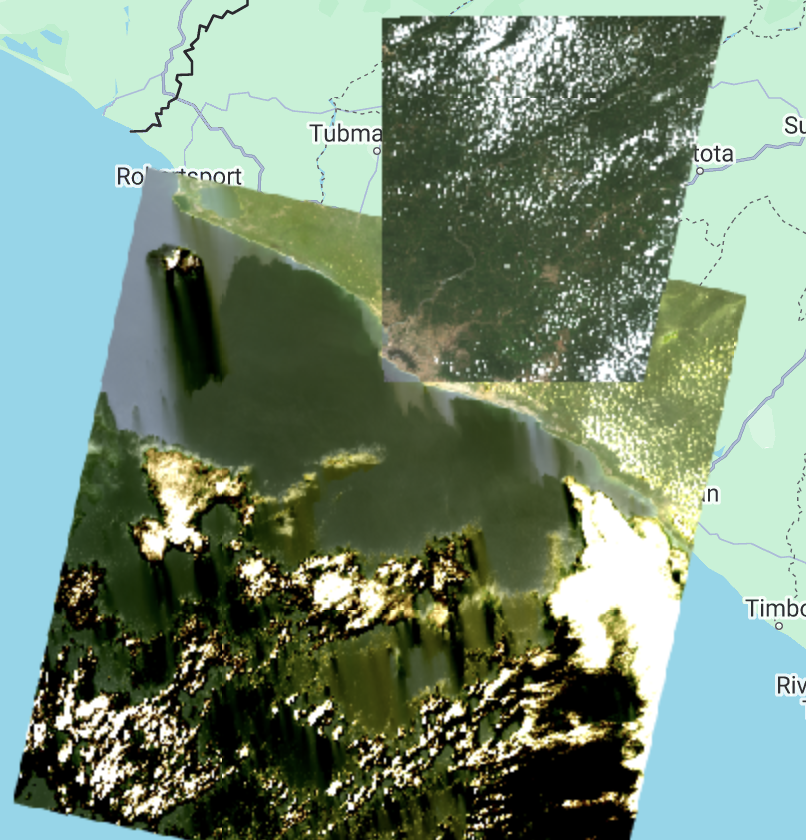

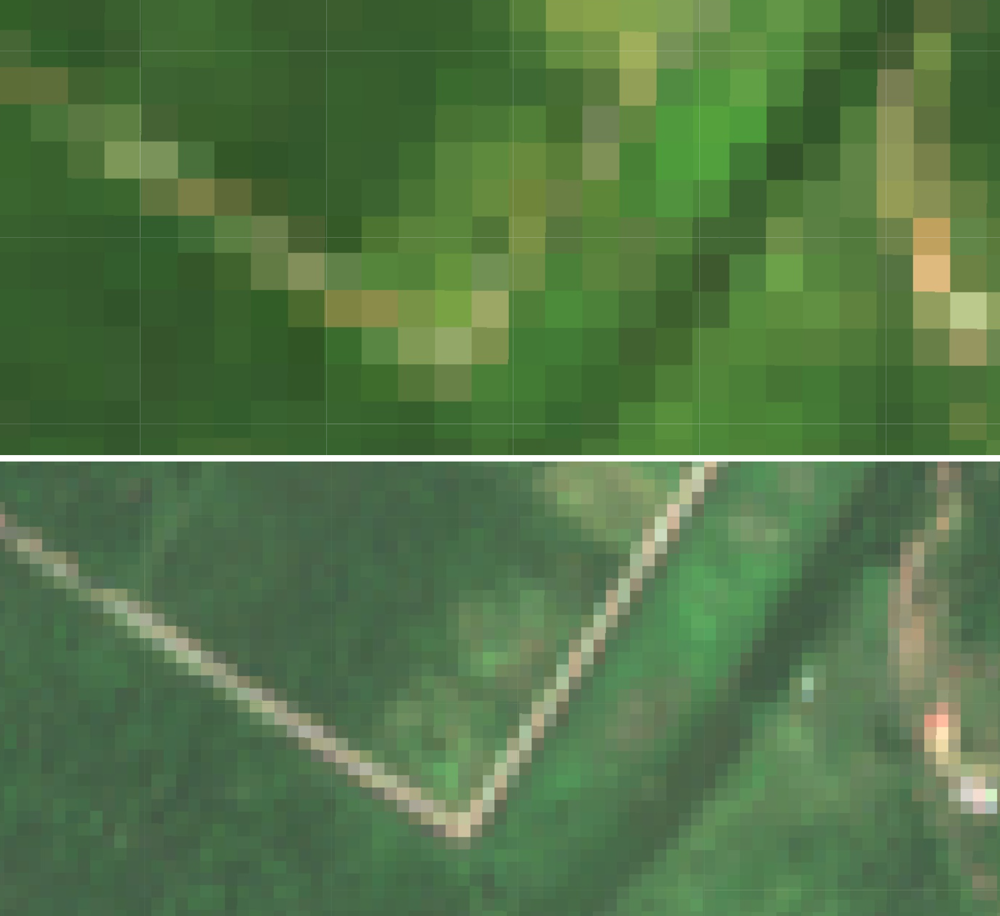

## Projection and Scale

You can also print the projection and scale of the image. Different bands might have different spatial resolutions, because of that, we need to select a specific band to display the projection information. Below, we select band 2 of the Sentinel-2 image using the `select()` function. This function returns an image with just one band (in this case, band 2). Then we apply a `projection()` function. This function returns a `ee.Projection` object. We can print this variable in the Console to see which projection the image is in.

```javascript
var projection = firstImageS2.select('B2').projection();
print(projection);
```

On the Console we see that the Sentinel-2 image is in the EPSG:32621 projection.

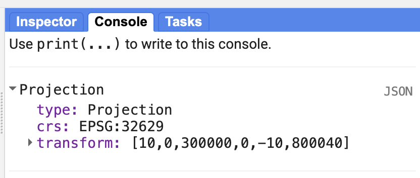

We can also print the scale of the image (spatial resolution). A `ee.Projection` object has a function called `nominalScale()` that returns the linear scale in meters of the units of this projection, as measured at the point of true scale. The type of object that it is returned is a Float number.

```javascript
var scale = projection.nominalScale();
print(scale);
```

With this, we see on the Console that the scale is what we expected, 10 meters.

## Exporting an image

The GEE API provides export functions that allow us to export an image in different ways: to Google Drive, as and EE Asset (not leaving the Earth Engine environment), and to Google Cloud. If we want to work with the image outside of GEE, we can use the `Export.image.toDrive` function.

```javascript
Export.image.toDrive({
  image: firstImageS2.int16(),
  scale: 10,
  region: area,
  description: 'sentinel2image',
  fileNamePrefix: 'S2 Paramaribo 220926',
  maxPixels: 1e13
})
```

Check this function's description in the `Docs` tab for more information.

You will see that once you run the code, the `Tasks` tab will flash orange and you will see the option to `Run` this export task. It might take several minutes for your image to export. Once the export task is finalized, you will be able to download the tif file(s) from your Google Drive ([https://drive.google.com/drive/my-drive](https://drive.google.com/drive/my-drive)).

### Complete code

Script "`1 Image Visualization - L9 & S2`" from the repository and folder `T3` or direct link: [https://code.earthengine.google.com/690d887ea9224bec426df51f278e9ab4](https://code.earthengine.google.com/690d887ea9224bec426df51f278e9ab4).


# Preprocessing Imagery in GEE


This exercise will walk us through retrieving and visualizing Landsat 8 data collections. Create a new repository called ‘training-servir-gee’.

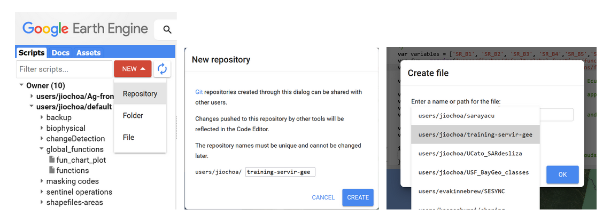

Figure 3. Creating a new script.

We set the name for our new script ‘sat_image_processing’.


Figure 4. Naming a new script

We look for Landsat 8 surface reflectance (SR) Collection 2 Tier 1 data. Collection 1 is already deprecated and Tier 1 comprises the highest radiometric and terrain correction quality.

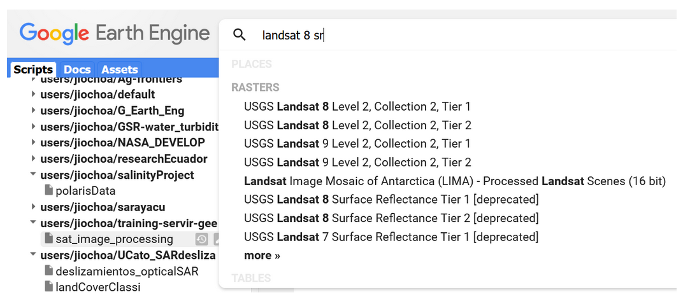

Figure 5. Catalog search bar showing Landsat datasets.


Figure 6. Landsat 8 description.

Lets hit the ‘Import’ button, and change the name of the collection to ‘*landsat8_sr*’. Now let's download the boundary shapefile of Guyana. We are going to upload this file into the Assets section to have our country boundary available. First you can add a new project pressing the *ADD A PROJECT* button within the Assets section:


Figure 7. Adding a new project

You can provide a name or id for the new cloud project,and then press ‘Select’.


Figure 8. Cloud project set-up window.

Now press the *New* button and select the *Shape files* options within the *Table Upload* section.


Figure 9. Uploading a new shapefile into the Assets.

When selecting the shapefile, make sure to select all of its components, but ignore the *qpj* file. For example, avoid errors like “The file named "guyana_boundary.qpj" does not have a correct extension” or “the shapefile must be accompanied by ‘dbf”


Figure 10. Shapefile properties.

The two-arrows icon permits us to refresh the view in case you don’t see the uploaded file. We click on the file name to open it:

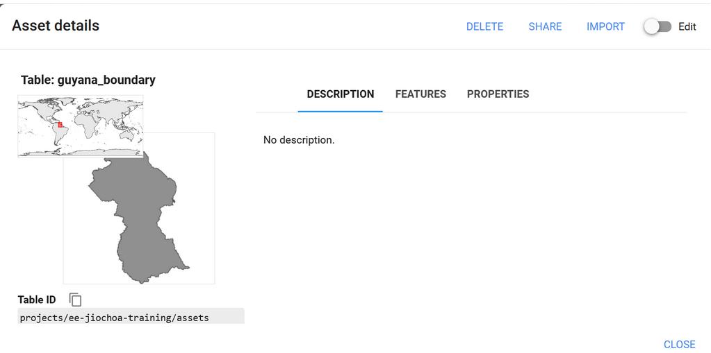

Figure 11. Shapefile loaded.

Click on ‘*Import*’ and change the name to *guyana_bou*. Now let’s work filtering our current image collection over three aspects: temporal, spatial, and spectral.


Figure 12. Typing an existent variable name

When typing you can press *Ctrl* + *spacebar* to autocomplete names of existent variables, or *Ctrl* + *spacebar* after inserting a point to observe a list of available functions

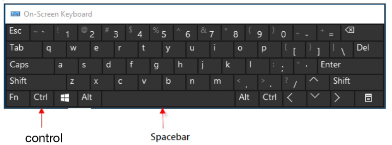

Figure 13. Keyboard shortcut

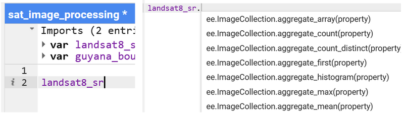

Figure 14. Available functions listed.

The following code selects 3 months of Landsat 8 imagery over Guyana territory. Immediately we apply a scale factor.

```javascript
landsat8_sr = landsat8_sr
            	.filterDate('2022-10-01', '2022-12-31')
            	.filterBounds(guyana_bou)

// Applies scaling factors needed for Landsat collection 02
function applyScaleFactors(image) {
  var opticalBands = image.select('SR_B.').multiply(0.0000275).add(-0.2);
  var thermalBands = image.select('ST_B.*').multiply(0.00341802).add(149.0);
  return image.addBands(opticalBands, null, true)
          	.addBands(thermalBands, null, true);
}


landsat8_sr = landsat8_sr.map(applyScaleFactors);
We can also select only the required bands, e.g. excluding the first band of coastal aerosol.  The visualization setting must be described.

var visualization = {
  bands: ['SR_B4', 'SR_B3', 'SR_B2'],
  min: 0.0,
  max: 0.3,
};

Map.centerObject(guyana_bou, 6)

Now we visualize the layers created using the 
Map.addLayer(guyana_bou, {}, 'guyana', 0)
Map.addLayer(landsat8_sr, visualization, 'True Color (432)');
```


Figure 15. True color Landsat 8 collection 2 mosaic for Guyana.

We have added the layer of surface reflectance (SR) values for 3 months to visualize. You can check the code link at [https://code.earthengine.google.com/c242421f3cc5229e8e24bd019b8f6ceb](https://code.earthengine.google.com/c242421f3cc5229e8e24bd019b8f6ceb).
