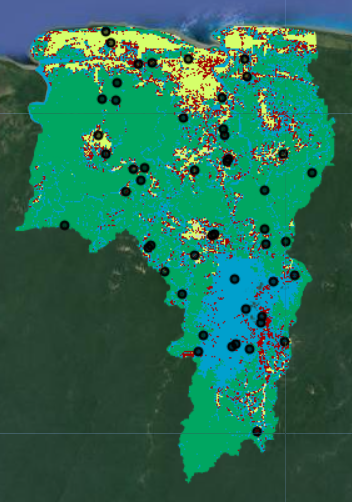
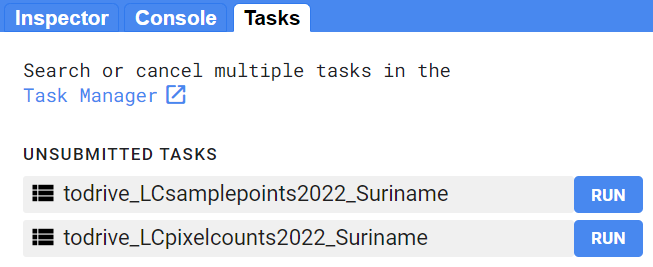
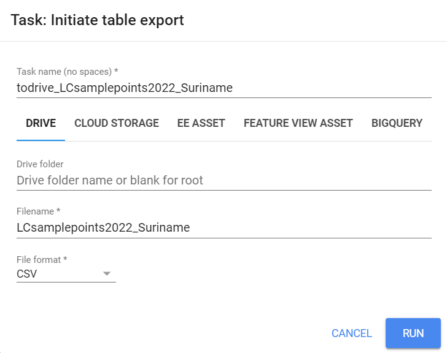
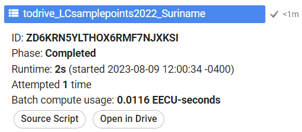

# Prepare Data for Accuracy Assessment in GEE

## Overview

In this workflow, we will create a stratified random sample of a land cover map, and use to conduct an accuracy assessment and area estimate of the strata in the land cover map.  We will make the stratified random sample in GEE, collect validation data at those points in CEO, and then calculate error matrices and estimate the true area of each land cover stratum in Google Sheets or Microsoft Excel.

# Create Classification Map in GEE

In the [Advanced Google Earth Engine - Change Detection 1](https://servir-amazonia.github.io/suriname-training/change-detection-1) module, we made a random forest land cover classification for two years.  Here, we will write a short snippet of code to export our land cover classification for 2022 (Year 2) as a GEE Asset.

Open your script titled **Change Detection - Two Date**, insert into the script, and run the script.

```javascript
//--------------------------------------------------------------
// Export Classifications
//--------------------------------------------------------------

// Export 2022 classified map as a GEE Asset to use for further analysis
// change the location to your root GEE folder
Export.image.toAsset({
  image: RFclassification_y2,
  description: 'toasset_LCclassification2022_Suriname',
  assetId: 'users/ebihari/LCclassification2022_Suriname',
  region: aoi,
  scale: 30,
  crs:'EPSG:4326',
  maxPixels: 1e13
});
```

Now, when we run our code, this export task should appear in the **Tasks** tab.  


Click **Run** on the task, filling out the names and locations you want the file to be put.


# Create Validation Points in GEE

In the new GEE script you created called **Map Validation - Sample Design**, import the land cover classification asset.  I have made land cover classification asset public, so you can use mine one `users/ebihari/LCclassification2022_Suriname` or your own.

```javascript
//--------------------------------------------------------------
// Import Classification Map
//--------------------------------------------------------------

// import land cover classification from previous activity 
var LC = ee.Image('users/ebihari/LCclassification2022_Suriname')

// add classified image to map
Map.addLayer(LC, {min: 1, max: 5, 
            palette: ['00a661','00a0cd','a40000', 'd5ff6a','d3d2cb']}, 
            'RF landcover classification');
```

Then, we create a stratified random sample with 10 points in each of the 5 land cover classes.  In a real project, you would want to collect many more validation points for this big of an AOI, but we will keep it simple for this exercise.

```javascript
//--------------------------------------------------------------
// Create Stratified Random Sample
//--------------------------------------------------------------

// create stratified random sample from the land cover classification map
// values in 'class' property: 
// 1: 'forest',
// 2: 'water',
// 3: 'urban',
// 4: 'agriculture',
// 5: 'bare soil'
var samplePts = LC.stratifiedSample({
  // total # points
  numPoints:50, 
  classBand:'classification', 
  region:LC.geometry(), 
  scale:30, 
  projection:'EPSG:4326', 
  seed:1010, 
  classValues:[1,2,3,4,5],
  // # points in each class
  classPoints:[10,10,10,10,10], 
  dropNulls:true, 
  tileScale:2, 
  geometries:true});
print('Sample points:', samplePts);

// Add points to the map
Map.addLayer(samplePts,{},'sample points');
```



Now, we export these sample points as a Google Drive file in .csv format.  We need to do some extra formatting to get the data in a format that CEO and SEPAL will accept.  We need to add columns called `PLOTID`, `LON`, and `LAT`, `SAMPLEID`, and `classification_readable` (which is just a column for the classification values in a readable format ("forest", "water", etc.), and will come in handy when doing our final analysis).

```javascript
//--------------------------------------------------------------
// Export Stratified Random Sample
//--------------------------------------------------------------

// create a dictionary to store class names
var classLookup = ee.Dictionary({
  1: 'forest',
  2: 'water',
  3: 'urban',
  4: 'agriculture',
  5: 'bare soil'
});

// write a function to rename the columns 
// so that the format is accepted by CEO
function ceoClean(f){
  // LON,LAT,PLOTID,SAMPLEID, readable classification column
  var fid = f.id();
  var coords = f.geometry().coordinates();
  var classValue = f.get('classification');
  var className = classLookup.get(classValue);
  return f.set('LON',coords.get(0),
               'LAT',coords.get(1),
               'PLOTID',fid,
               'SAMPLEID',fid,
               'classification_readable', className);
}
// print("First sample point:",ee.Feature(samplePts.map(ceoClean).first()));

// map that function to the sample points feature collection
var samplePts_CEO = samplePts.map(ceoClean);

print('Sample points with PLOTID and readable class:', samplePts_CEO);

print("Class labels and number of samples:",
      samplePts_CEO.aggregate_histogram('classification_readable'));

// Export points to Google Drive to use in further analysis
Export.table.toDrive({
  collection: samplePts_CEO,
  description: 'todrive_LCsamplepoints2022_Suriname',
  fileNamePrefix: 'LCsamplepoints2022_Suriname',
  selectors: 'LON,LAT,PLOTID,SAMPLEID,classification,classification_readable'
});
```

Additionally, we need to calculate class areas based on the map to use later in our later analysis. This block of code uses the `ee.Reducer.count()` function to count the number of pixels in each class.  It then stores these values in a `List` of `Dictionaries`.  Each `Dictionary` in this `List` has 2 keys: the `class` and the `count`.  Last, it uses this `List` to create a new `FeatureCollection` with 5 empty features in it (one for each class), and attaches the correct `class` and `count` as properties to each feature.  Thus, we end up with a data type that can be exported as a .csv, and it contains a separate row for each class and a separate column containing the pixel counts of those classes.

``` javascript
//--------------------------------------------------------------
// Calculate Class Areas
//--------------------------------------------------------------

// Create an extra image with a value of 1 in every pixel
// covering the same geometry as the land cover map
// (this is just an something needed for the ee.Reducer.group() function 
// because it needs an image with 2 bands)
var constantImage = ee.Image(1).clip(LC.geometry());

// Calculate the number of pixels in each class
var pixelCounts_dict = constantImage.addBands(LC).reduceRegion({
  // Use ee.Reducer.count().group() function
  reducer: ee.Reducer.count().group({
    // Use band "class" for grouping 
    // (which is now band 1 not 0 since we attached the extra image)
    groupField: 1, 
    groupName: 'class',
  }),
  geometry: LC.geometry(), // region of interest
  scale: 30, // Resolution of the image in meters
  maxPixels: 1e50 // Maximum number of pixels in the region
});

// Print the resulting dictionary of a list of dictionaries
print("Pixel Counts as Dictionary", pixelCounts_dict);

// Convert the this dictionary to just a list of dictionaries
// (we extract the list of dictionaries)
var pixelCounts_list = ee.List(pixelCounts_dict.get('groups'));

// Print the resulting list of dictionaries
print("Pixel Counts as List of Dictionaries", pixelCounts_list);

// Create a FeatureCollection from the list of dictionaries
var pixelCounts_fc = ee.FeatureCollection(
  // apply this function to all the dictionaries in the list
  pixelCounts_list.map(function(dict) {
    var dict2 = ee.Dictionary(dict);
    // extract the className from the dictionary
    var className = ee.Number(dict2.get('class'));
    // extract the count from the dictionary
    var count = ee.Number(dict2.get('count'));
    // put these into an empty feature class as new properties
    // (this allows us to export the info as separate columns in a CSV)
    return ee.Feature(null, {
      'class': className,
      'count': count
    });
  })
);

// Print the resulting FeatureCollection
print("Pixel Counts as FeatureCollection", pixelCounts_fc);

//--------------------------------------------------------------
// Export Class Areas
//--------------------------------------------------------------

// Export the FeatureCollection as a CSV to Google Drive for further analysis
Export.table.toDrive({
  collection: pixelCounts_fc,
  description: 'todrive_LCpixelcounts2022_Suriname',
  fileNamePrefix: 'LCpixelcounts2022_Suriname',
  fileFormat: 'CSV'
});
```

Now, when we run our code, these export tasks should appear in the **Tasks** tab.  



Click **Run** on the task, filling out the names and locations you want the files to be put.



Once the tasks have finished running, we can open the exported .csv files in Google Drive by clicking **Open in Drive** in the **Tasks** tab.



From your Google Drive, download these .csv files to your computer.

*Extra: Add legend.*

``` javascript
//--------------------------------------------------------------
// Add Legend
//--------------------------------------------------------------

// Set position of panel
var legend = ui.Panel({
  style: {
    position: 'bottom-right',
    padding: '8px 15px'
  }
});

// Create legend title
var legendTitle = ui.Label({
  value: 'Land Cover Classes - 2022',
  style: {
    fontWeight: 'bold',
    fontSize: '18px',
    margin: '0 0 4px 0',
    padding: '0'
    }
});

// Add title to legend panel
legend.add(legendTitle);
    
// Write a fcuntion that creates and styles 1 row of the legend
var makeRow = function(color, name) {
      
      // Create the label that is actually the colored box
      var colorBox = ui.Label({
        style: {
          backgroundColor: '#' + color,
          // Use padding to give the box height and width
          padding: '8px',
          margin: '0 0 4px 0'
        }
      });
      
      // Create the label that is the description text
      var description = ui.Label({
        value: name,
        style: {margin: '0 0 4px 6px'}
      });
      
      // Return the panel
      return ui.Panel({
        widgets: [colorBox, description],
        layout: ui.Panel.Layout.Flow('horizontal')
      });
};

// list with the class colors
var palette = visParam.palette;

// list with class names
var names = ['forest','water','urban','agriculture','bare soil'];


// Add color and and names to legend panel
for (var i = 0; i < 5; i++) {
  legend.add(makeRow(palette[i], names[i]));
  }  

// Add legend to map (alternatively you can also print the legend to the console)  
Map.add(legend);  
```

Code Checkpoint: [https://code.earthengine.google.com/?scriptPath=users%2Febihari%2FSurinameWS%3AMap%20Validation%20-%20Sample%20Design](https://code.earthengine.google.com/?scriptPath=users%2Febihari%2FSurinameWS%3AMap%20Validation%20-%20Sample%20Design)


