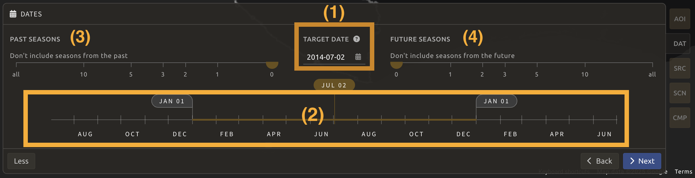
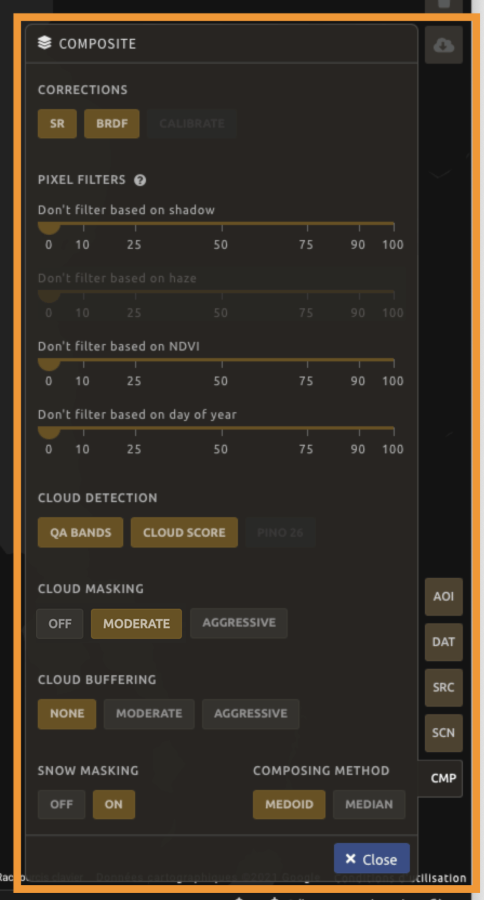
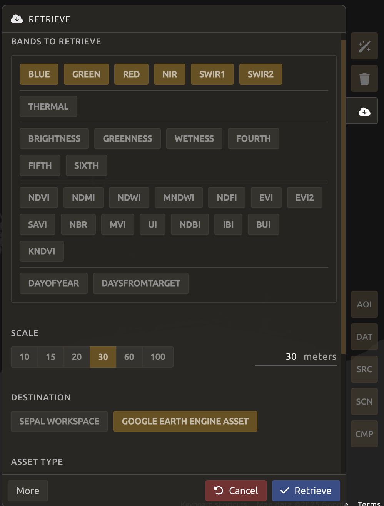
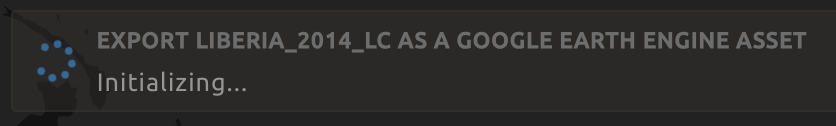
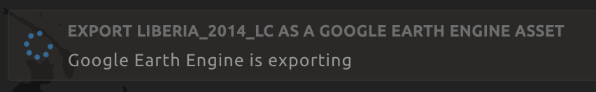
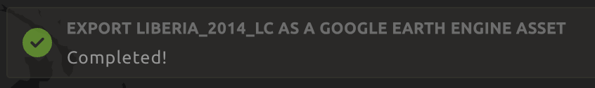
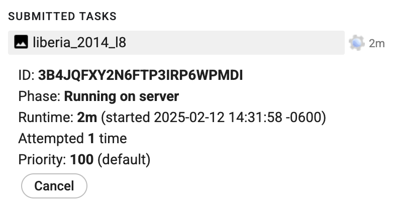
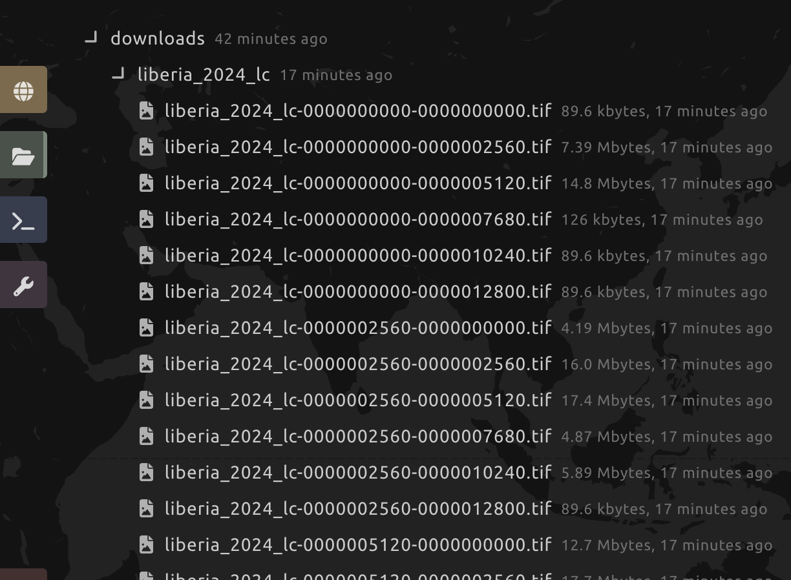

# Preprocessing Imagery in SEPAL


## Optical mosaics

> *A video-tutorial is available in [this YouTube video](https://www.youtube.com/watch?v=N8kIBBE3tdM)*.

A mosaic is a combination or fusion of two or more images. In SEPAL, you can create a single raster dataset from several raster datasets by mosaicking them together. This can be achieved on both contiguous rasters (first image below) and overlapping images (second image below).


<!--   -->

These overlay areas can be managed in various ways. For example, you can choose to:

- Keep only the raster data from the first or last dataset.
- Combine the values of the overlay cells using a weighting algorithm.
- Average the values of the overlay cells.
- Take the maximum or minimum value.

In addition, corrections can be made to the image to account for clouds, snow, and other factors, but these operations can be complex and repetitive.

SEPAL offers an interactive and intuitive way to create mosaics in any area of interest (AOI).

> **Note:**
>
> In order to be able to retrieve the images, be sure to [connect your SEPAL and Google Earth Engine (GEE) accounts](https://docs.sepal.io/en/latest/setup/gee.html).

## Start

At the top-left of your screen, click the green `Add recipe` button and type **mosaic** to select the `Optical mosaic` recipe.


Once the mosaic recipe is selected, SEPAL will display the recipe process in a new tab (**1**) and the **AOI selection** window will appear in the lower right (**2**).


The first step is to change the name of the recipe - it will be used to identify your files and recipes in SEPAL folders. Double-click the tab and write a new name. It will default to:

```code
Optical_mosaic_<start_date>_<end_date>_<band name>
```

But it is recommended to use the following naming convention:

```code
<aoi name>_<dates>_<measure>
```


 


## Parameters

In the lower-right corner, five tabs allow you to customize the mosaic creation:

- `AOI`: Area of interest.
- `DAT`: Target date of interest for the mosaic/composite.
- `SRC`: Source datasets of the mosaic/composite.
- `SCN`: Scene selection parameters.
- `CMP`: Composition parameters.


### AOI selection

The data exported by the recipe will be generated from within the bounds of the AOI. There are multiple ways to select the AOI in SEPAL:

- Administrative boundaries
- EE Tables (from GEE assets)
- Drawn polygons

For more details, see [AOI selection](https://docs.sepal.io/en/latest/feature/aoi_selector.html).

For this workshop, type `Liberia` in the **country** cell under the `AOI` tab and also select one of the provinces, since a smaller area will export faster for the purposes of this workshop. Click `Next`.


### Date

#### Yearly mosaic

In the `DAT` tab, select a year of the data to be used in the mosaic. Let's select 2024 here. Then click `Next`.


#### Seasonal mosaic

You can also expand the date selection tool in the `DAT` panel by clicking `More` to select a season of interest.

- Click the **calendar icon** (**1**) to open the **Date selection** pop-up. The selected data will be the one from which pixels in the mosaic should ideally come from.
- Use the slider (**2**) to define a season around the target date.
- Since the number of images in a single season of one year may not be enough to produce a mosaic, we can use two secondary (**3** for `Past season` and **4** for `Future season`) sliders to increase the pool of images.
- When the selection is done, click `Next`.



### Sources

A mosaic uses different raster datasets obtained from multiple sources. SEPAL allows you to select data from multiple entry points:

- **L9**: Landsat 9 [Tier 1](https://developers.google.com/earth-engine/datasets/catalog/LANDSAT_LC09_C02_T1) and [Tier 2](https://developers.google.com/earth-engine/datasets/catalog/LANDSAT_LC09_C02_T2)
- **L8**: Landsat 8 [Tier 1](https://developers.google.com/earth-engine/datasets/catalog/LANDSAT_LC08_C02_T1) and [Tier 2](https://developers.google.com/earth-engine/datasets/catalog/LANDSAT_LC09_C02_T2)
- **L7**: Landsat 7 [Tier 1](https://developers.google.com/earth-engine/datasets/catalog/LANDSAT_LE07_C02_T1) and [Tier 2](https://developers.google.com/earth-engine/datasets/catalog/LANDSAT_LC09_C02_T2)
- **S2**: Sentinel-2 [Multispectral](https://developers.google.com/earth-engine/datasets/catalog/COPERNICUS_S2_HARMONIZED)

Let's select L9 Tier 1 and click `Done`.


### Scenes

> **Note:** If Sentinel and Landsat data have been selected, you will need to use all scenes. As the tiling system from Sentinel and Landsat data are different, it’s impossible to select scenes using the tool presented in the following sections.

You can select scenes for mosaic manually or automatically:

  - **Use all scenes**: Includes all available images based on date parameters.
  - **Select scenes**: select one of the following **Priority** options:
  - _Cloud free_: prioritizes images with zero or few clouds.
  - _Target date_: prioritizes images that match the target date.
  - _Balanced_: maximizes both cloud-free and target date criteria.

Let's select **Use all scenes** and click `Apply`.


### Composite

> **Note:**
>
> Default options:
>
> - **Correction**: `SR`, `BRDF`
> - **Pixel filters**: No filters
> - **Cloud detection**: `QA bands`, `Cloud score`
> - **Cloud masking**: `Moderate`
> - **Cloud buffering**: `None`
> - **Snow masking**: `On`
> - **Composing method**: `Medoid`

For our workshop, we will use the default settings, but we encourage you to explore different options and refer to SEPAL documentation under [Composite](https://docs.sepal.io/en/latest/cookbook/optical_mosaic.html) for further details. Click `Apply`.



### Analysis

In the upper-right corner, three tabs are available, which allow you to customize the mosaic scene selection and export the final result:

- `Auto-select scenes` *magic wand* icon
- `Clear selected scenes` *trash bin* icon
- `Retrieve mosaic` *cloud download* icon


> **Note:** 
> 
> Since we have not selected the option **Select scenes** in the `SCN` tab, `Auto-select scenes` button will be disabled for us and the scene areas will be hidden as no scene selection needs to be performed.
>
> If you can’t see the image scene area (such as in the image below), you probably have selected a small AOI. Zoom out on the map and you will see the number of available images in the circles.


### Retrieve

> **Important:**
>
> Exporting of a `.tiff` file requires a small computation quota (see [Resource setup](https://docs.sepal.io/en/latest/setup/resource.html)).

Click the `Retrieve mosaic` button (*cloud download* icon) to open the `Retrieve` pane where you can select the parameters for exporting.

##### **Bands**
You need to select the band(s) to export with the mosaic. There is no maximum number of bands, but exporting useless bands will only increase the size and time of the output. To discover the full list of available bands with SEPAL, see Optical Satellite bands, transformations, and indices.

> **Tip:**
> 
> There is no fixed rule to the band selection. Each index is more adapted to a set of analyses in a defined biome. The knowledge of the study area, the evolution expected and the careful selection of an adapted band combination will improve the quality of downstream analysis.

#### *Dates*

- `dayofyear`: the Julian calendar date (day of the year)
- `dayfromtarget`: the distance to the target date within the season in days

##### **Scale**
You can set a custom scale for exportation by changing the value of the slider in metres (m) (note that requesting a smaller resolution than images’ native resolution will not improve the quality of the output – just its size – keep in mind that the native resolution of Sentinel data is 10 m, while Landsat is 30 m.)

##### **Destination**
You can export the image to the SEPAL workspace or to the Google Earth Engine Asset folder. The same image will be exported to both; however, for the former, you will find it in `.tif` format in the `Downloads` folder; for the latter, the image will be exported to your GEE account asset list.

Select `Apply` to start the download process.

> **Note:** If `Google Earth Engine Asset` is not displayed, ensure your [GEE account is connected to SEPAL](https://docs.sepal.io/en/latest/setup/gee.html).



### Exportation status

Monitor task progress in the **Tasks** tab (bottom-left corner of the screen). 

If you have selected GEE Asset as a destination, then you can also monitor tasks using the [GEE task manager](https://code.earthengine.google.com/tasks).







> **Tip:**
>
> This operation is running between GEE and SEPAL servers in the background. You can close the SEPAL page without stopping the process.

When the task is finished, the frame will be displayed in green.


### Access

Once downloaded, the data is stored in the `Downloads` folder. You can access it using the following format:

```bash
.
└── downloads/
    └── <MO name>/
        ├── <MO name>_<gee tile id>.tif
        └── <MO name>_<gee tile id>.vrt
```

The data are stored in a folder using the name of the optical mosaic as it was created in the first section of this article. As the number of data is spatially too big to be exported at once, the data are divided into smaller pieces and brought back together in a `<MO name>_<gee tile id>.vrt` file.




> **Tip:**
>
> The full folder structure is required to read the `.vrt` file.

Now that you've downloaded the optical mosaic, you can use it in other SEPAL workflows or transfer it to your computer using [FileZilla](https://filezilla-project.org/).


## Radar mosaics
> *A video-tutorial is available in [this YouTube video](https://www.youtube.com/watch?v=lip8C4tq7ig)*.


The SEPAL recipe for radar mosaics allows users to generate analysis-ready data (ARD) from the Sentinel-1 C-Band synthetic aperture radar (SAR) mission, which can be used in subsequent analysis, such as land cover classification.

##

The following steps demonstrate the default procedure for creating a yearly timescan, useful for tasks such as land cover mapping.

1. Select **Radar mosaic** within SEPAL **Recipes**.
2. Select your area of interest (AOI) and the year.
3. Check for orbit coverage.

    - Deselect all processing parameters.
    - Select **Ascending orbit** and let the mosaic render.
    - Deselect **Ascending orbit** and select **Descending orbit**. Let the mosaic render.
    - See if both orbits cover the entire AOI.  
      - If they do not, select the orbit that covers the entire AOI.  
      - If they do, select both and let the mosaic render; then, check for artifacts that may originate from using both orbits.

4. Select **Terrain** under **Geometric operations**.
5. Select **Moderate** under **Outlier removal**.
6. Export **Median**, **Min**, **Max**, and **STD** layers for both polarization bands **VV** and **VH**.

Follow the video tutorial linked above, which demonstrates these steps in a reproducible way.


