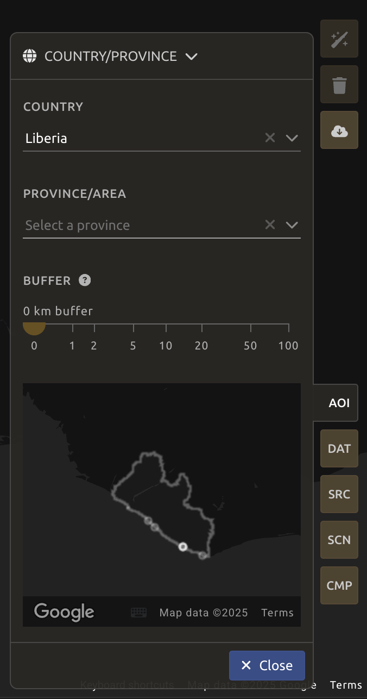
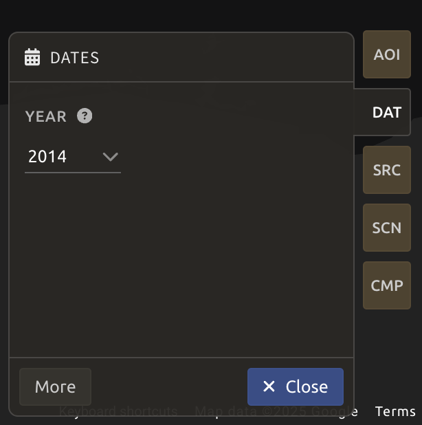

# Preprocessing Imagery in SEPAL

## Optical mosaics

A mosaic is a combination or fusion of two or more images. In SEPAL, you can create a single raster dataset from several raster datasets by mosaicking them together. This can be achieved on both contiguous rasters (first image below) and overlapping images (second image below).


<!--   -->

These overlay areas can be managed in various ways. For example, you can choose to:

- Keep only the raster data from the first or last dataset.
- Combine the values of the overlay cells using a weighting algorithm.
- Average the values of the overlay cells.
- Take the maximum or minimum value.

In addition, corrections can be made to the image to account for clouds, snow, and other factors, but these operations can be complex and repetitive.

SEPAL offers an interactive and intuitive way to create mosaics in any area of interest (AOI).

> **Note:**
>
> In order to be able to retrieve the images, be sure to [connect your SEPAL and Google Earth Engine (GEE) accounts](https://docs.sepal.io/en/latest/setup/gee.html).

## Start

In the window below, click `Add recipe` and type `mosaic` to select the `Optical mosaic` recipe.


Once the mosaic recipe is selected, SEPAL will display the recipe process in a new tab (**1**) and the **AOI selection** window will appear in the lower right (**2**).


The first step is to change the name of the recipe - it will be used to identify your files and recipes in SEPAL folders. Double-click the tab and write a new name. It will default to:

```code
Optical_mosaic_<start_date>_<end_date>_<band name>
```

But it is recommended to use the following naming convention:

```code
<aoi name>_<dates>_<measure>
```


## Parameters

In the lower-right corner, five tabs allow you to customize the mosaic creation:

- `AOI`: Area of interest.
- `DAT`: Target date of interest for the mosaic/composite.
- `SRC`: Source datasets of the mosaic/composite.
- `SCN`: Scene selection parameters.
- `CMP`: Composition parameters.


### AOI selection

The data exported by the recipe will be generated from within the bounds of the AOI. There are multiple ways to select the AOI in SEPAL:

- Administrative boundaries
- EE Tables (from GEE assets)
- Drawn polygons

For more details, see [AOI selection](https://docs.sepal.io/en/latest/feature/aoi_selector.html).

For this workshop, type `Liberia` in the **country** cell under the `AOI` tab. Click `Next`.



### Date

#### Yearly mosaic

In the `DAT` tab, select a year of the data to be used in the mosaic. Let's select 2024 here. Then click `Next`.



#### Seasonal mosaic

You can also expand the date selection tool in the `DAT` panel by clicking `More` to select a season of interest.

- Click the **calendar icon** (**1**) to open the **Date selection** pop-up. The selected data will be the one from which pixels in the mosaic should ideally come from.
- Use the slider (**2**) to define a season around the target date.
- Since the number of images in a single season of one year may not be enough to produce a mosaic, we can use two secondary (**3** for `Past season` and **4** for `Future season`) sliders to increase the pool of images.
- When the selection is done, click `Next`.


### Sources

A mosaic uses different raster datasets obtained from multiple sources. SEPAL allows you to select data from multiple entry points:

- **L9**: Landsat 9 [Tier 1](https://developers.google.com/earth-engine/datasets/catalog/LANDSAT_LC09_C02_T1) and [Tier 2](https://developers.google.com/earth-engine/datasets/catalog/LANDSAT_LC09_C02_T2)
- **L8**: Landsat 8 [Tier 1](https://developers.google.com/earth-engine/datasets/catalog/LANDSAT_LC08_C02_T1) and [Tier 2](https://developers.google.com/earth-engine/datasets/catalog/LANDSAT_LC09_C02_T2)
- **L7**: Landsat 7 [Tier 1](https://developers.google.com/earth-engine/datasets/catalog/LANDSAT_LE07_C02_T1) and [Tier 2](https://developers.google.com/earth-engine/datasets/catalog/LANDSAT_LC09_C02_T2)
- **S2**: Sentinel-2 [Multispectral](https://developers.google.com/earth-engine/datasets/catalog/COPERNICUS_S2_HARMONIZED)

Select all available options and click `Done`.


### Scenes

> **Note:** If Sentinel and Landsat data have been selected, you will need to use all scenes. As the tiling system from Sentinel and Landsat data are different, it’s impossible to select scenes using the tool presented in the following sections.

You can select scenes manually or automatically:

- `Use all scenes`: Includes all available images.
- `Select scenes`: Prioritize based on:
  - **Cloud-free**: Prioritizes images with zero or few clouds.
  - **Target date**: Prioritizes images that match the target date.
  - **Balanced**: Maximizes both cloud-free and target date criteria.


### Composite

> **Note:**
>
> Default settings:
>
> - **Correction**: `SR`, `BRDF`
> - **Pixel filters**: None
> - **Cloud detection**: `QA bands`, `Cloud score`
> - **Cloud masking**: `Moderate`
> - **Cloud buffering**: `None`
> - **Snow masking**: `On`
> - **Composing method**: `Medoid`

Define the compositing method for the final image.


### Analysis

Select scenes and begin the analysis using the top-right menu:

- `Auto-select scenes` (`magic wand` icon)
- `Clear selected scenes` (`trash` icon)
- `Retrieve mosaic` (`cloud download` icon)


### Retrieve

> **Important:**
>
> Exporting requires a small computation quota. See [Resource setup](../setup/resource).

Export the image to:

- `SEPAL workspace` (downloads as `.tif` file).
- `Google Earth Engine Asset`.

> **Note:** If `Google Earth Engine Asset` is not displayed, ensure your GEE account is connected to SEPAL.


### Exportation status

Monitor task progress in the **Tasks** tab (bottom-left corner).

- View task progress.
- Check for errors.
- Monitor tasks using the [GEE task manager](https://code.earthengine.google.com/tasks).


### Access

Once downloaded, the data is stored in the `Downloads` folder:

```bash
.
└── downloads/
    └── <MO name>/
        ├── <MO name>_<gee tile id>.tif
        └── <MO name>_<gee tile id>.vrt
```

> **Tip:**
>
> The full folder structure is required to read the `.vrt` file.

Now that you've downloaded the optical mosaic, you can use it in other SEPAL workflows or transfer it to your computer using [FileZilla](../setup.filezilla.html).
