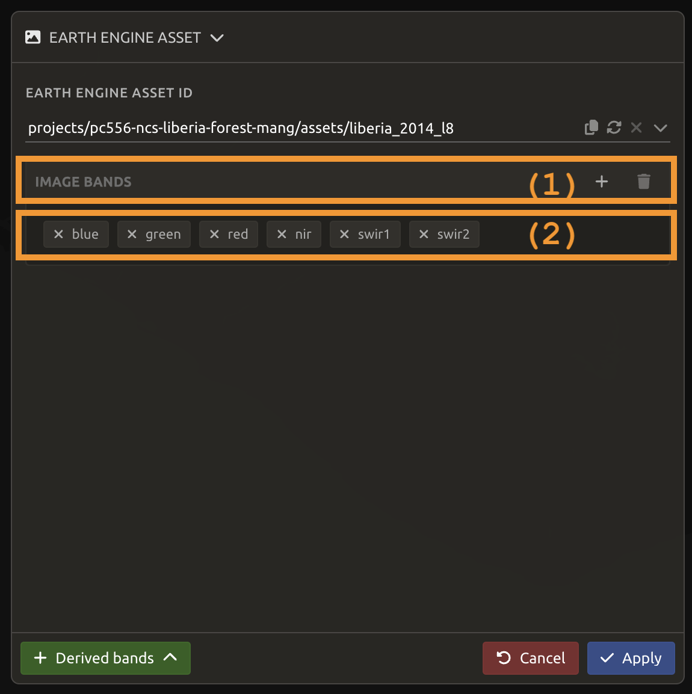
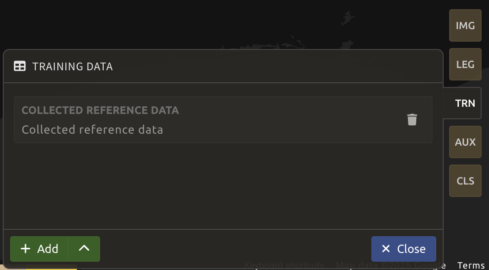

# Classification with Random Forest in SEPAL

> *A video-tutorial is available in [this YouTube video](https://www.youtube.com/watch?v=HBlYrwmq5ak)*.


# Classification

With **Classification** recipe, we can build supervised classifications of any mosaic image. It is built on top of the most advanced tools available on Google Earth Engine (GEE) – including the RandomForest classifier – allowing us access to a user-friendly interface to:

- select an image to classify
- define the class table
- add training data from external sources and on-the-fly selection.

In combination with other tools of SEPAL, the **Classification** recipe can help develop accurate land cover maps without writing a single line of code.

## Start

Once the **Classification** recipe is selected, SEPAL will show the recipe process in a new tab (**1**); the **Image selection** window will appear in the lower right (**2**).


The first step is to change the name of the recipe. This name will be used to identify your files and recipes in SEPAL folders. Use the best-suited naming convention - double-click the tab and enter a new name. It will default to:

```code
Classification_<timestamp>
```


<!-- 


 -->

> **_Note:_**
>
>  It is recommended to use the following naming convention:
>
> ```code
> <image_name>_<classification>_<measures>
> ```

## Parameters

In the lower-right corner, the following tabs are available, allowing us to customize the classification:

- `IMG`: Image to classify.
- `LEG`: Legend of the classification system.
- `TRN`: Training data of the model.
- `AUX`: Auxiliary global dataset to use in the model.
- `CLS`: Classifier configuration.


### Image selection


The first step consists of selecting the image bands on which to apply the classifier. The number of selected bands is not limited.

> **_Note:_**
>
> Increasing the number of bands to analyze will improve the model but slow down the rendering of the final image.

> **_Note:_**
>
> If multiple images are selected, all selected images should overlap. If the classifier finds masked pixels in one of the bands, it will mask them in the resulting classification.

Select `+ Add`. The following screen should be displayed:


**<font size = 3> Image type </font>**


We can select images from an **Existing recipe** or an exported **GEE asset**. Both should be an `ee.Image`, rather than a `Time series` or `ee.ImageCollection`.

##### Existing recipe:

- Advantages:
  - All computed bands from SEPAL can be used.
  - Any modification to the existing recipe will propagate in the final classification.
- Disadvantages:
  - The initial recipe will be computed at each rendering step, slowing down the classification process and potentially breaking on-the-fly rendering due to GEE timeout errors.

##### GEE asset:

- Advantages:
  - Can be shared with other users.
  - The computation will be faster, as the image has already been exported.
- Disadvantages:
  - Only the exported bands will be available.
  - The `Image` needs to be re-exported to propagate changes.

Both methods behave the same way in the interface.

**<font size = 3> Select bands </font>**

For this example, we use a public asset created with the **Optical mosaic** tool from SEPAL. <font color = red> It's a Sentinel-2 mosaic of Eastern Province in Zambia during the dry season from 2012 to 2020: CHANGE THE ASSET NAME BELOW TOO </font>

```code
projects/sepal-cookbook/assets/classification/zmb-eastern_2012_2021
```

**<font size = 3> Image bands </font>**

Once an asset is selected, SEPAL will load its bands in the interface. Click on the band name to select it. The selected bands are summarized in the expansion panel title (1) and displayed in gold in the panel content (2).

In this example, we selected:

<font color = red> THE BAND NAMES - CORRECT? </font>

- `red`
- `nir`
- `swir`
- `green`

<font color = red> CHANGE THE ASSET ID IN THE IMAGE BELOW </font>



**<font size = 3> Derived bands </font>**

SEPAL can build additional derived bands on-the-fly, so the analysis is not limited to native bands. 

Select the green `+ Derived bands` and choose the deriving method. The selected method will be applied to the selected bands and its name will be added in the expansion panel (1).

> **_Note:_**
>
> If more than two bands are selected, the operation will be applied to the Cartesian product of the bands, meaning that selecting bands A, B and C, and applying the `Difference` derived bands, will add three bands to your analysis:
> 
> - A - B
> - A - C
> - B - C

<font color = red> CHANGE THE ASSET ID IN THE IMAGE BELOW </font>


> **_Note:_**
>
> In the figure, we compute the normalized difference between `nir` and `red` (i.e. the NDVI), but it is also pre-computed in the `Indexes` derived bands.
>


Once image selection is complete, select `✓ Apply`. The images and bands will be displayed in the `IMG` panel. Selecting the `Trash bin` button removes the image and its bands from the analysis. Instead, click `> Next` to continue to next step.

<font color = red> CHANGE THE ASSET ID IN THE IMAGE BELOW </font>


### Legend setup

In this step, specify the legend for the output classified image. SEPAL provides multiple ways to create and customize a legend - manually or by importing a `csv` table.


> **Important:**
>
> Legends created here are fully compatible with other SEPAL functionalities.

**<font size = 3> Manual legend </font>**

Select `+ Add` to add a new class to your legend. A class consists of:

- *Color (1)*: click the color square to open the selector (must be unique)
- *Value (2)*: select an integer value (must be unique)
- *Class name (3)*: enter a description (cannot be empty)

You can select `HEX` (4) to display the hexadecimal value of the selected color. It can also be used to insert a known color palette by utilizing its values.

If unsure which colors to use for each class, apply colors using a preselected GEE color map (5). It will color all classes in your panel.


**<font size = 3> Import legend </font>**

You can also import a `.csv` file containing pre-made legend definitions.

Example `.csv` format:

```csv
code,class,color
10,Tree cover,#006400
20,Shrubland,#ffbb22
30,Grassland,#ffff4c
40,Cropland,#f096ff
```

Example 2:

```csv
code,class,red,blue,green
10,Tree cover,0,100,0
20,Shrubland,255,187,34
30,Grassland,255,255,76
40,Cropland,240,150,255
```

Click `^` and select `Import from CSV` to upload your file. You can select the columns that are defining your `csv` file (`Single column` for hexadecimal-defined colors or `Multiple columns` for RGB-defined colors).


Click `✓ Apply` to validate your selection. At this stage, you would still be able to modify the legend if needed. When done, `✓ Done` to validate this step. 


#### Export legend

Once the legend is validated, select `^` and export it using `Export as CSV`. A file will be downloaded to you computer named `<recipe_name>_legend.csv`.

<font color = red> EDIT HERE ONWARDS </font>

### Training data

> **_Note:_**
>
> This step is not mandatory.

Training data can be added from external sources or collected interactively.

Select `TRN` to open the **Training Data** menu.



Training data can be imported from:

- CSV files
- Google Earth Engine tables
- Sampled classifications
- Existing SEPAL recipes

### Classifier configuration

Select `CLS` to configure the classifier. SEPAL supports:

- Random Forest
- Gradient Tree Boost
- CART
- Naive Bayes
- SVM
- Min Distance
- Decision Tree


### Export

> **Important:**
>
> Exporting requires a small computation quota.

Select `Retrieve` to open the **Export** pane and choose the export parameters.


The exported image will be stored in the `Downloads` folder.

