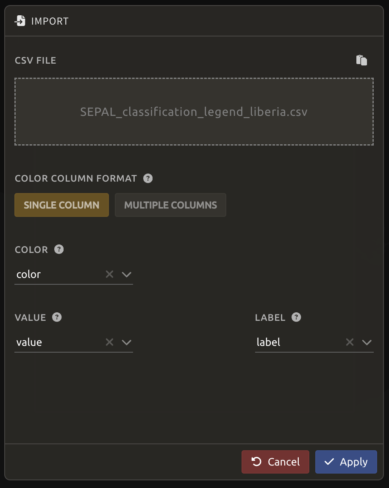
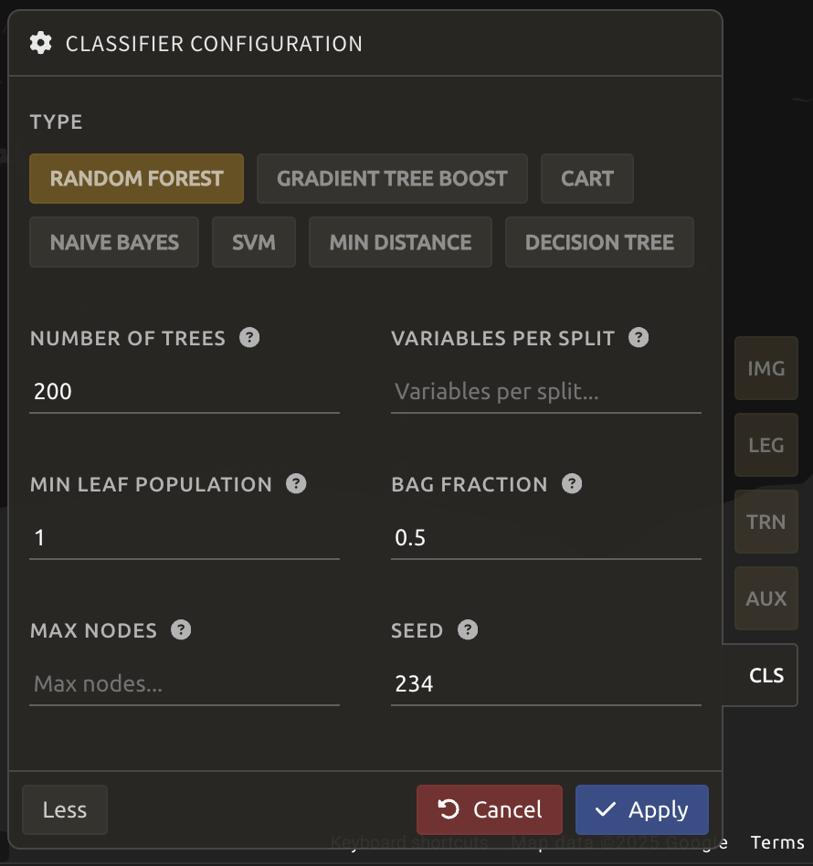
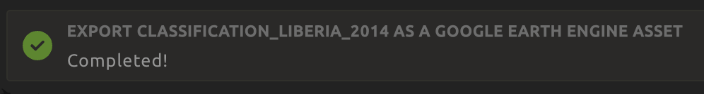

# Classification with Random Forest in SEPAL

> *A video-tutorial is available in [this YouTube video](https://www.youtube.com/watch?v=HBlYrwmq5ak)*.


# Classification

With **Classification** recipe, we can build supervised classifications of any mosaic image. It is built on top of the most advanced tools available on Google Earth Engine (GEE) – including the RandomForest classifier – allowing us access to a user-friendly interface to:

- select an image to classify
- define the class table
- add training data from external sources and on-the-fly selection.

In combination with other tools of SEPAL, the **Classification** recipe can help develop accurate land cover maps without writing a single line of code.

## Start

Once the **Classification** recipe is selected, SEPAL will show the recipe process in a new tab (**1**); the **Image selection** window will appear in the lower right (**2**).


The first step is to change the name of the recipe. This name will be used to identify your files and recipes in SEPAL folders. Use the best-suited naming convention - double-click the tab and enter a new name. It will default to:

```code
Classification_<timestamp>
```


<!-- 


 -->

> **_Note:_**
>
>  It is recommended to use the following naming convention:
>
> ```code
> <image_name>_<classification>_<measures>
> ```
>
> For example, `landsat_classiciation_2014_liberia`.

## Parameters

In the lower-right corner, the following tabs are available, allowing us to customize the classification:

- `IMG`: Image to classify.
- `LEG`: Legend of the classification system.
- `TRN`: Training data of the model.
- `AUX`: Auxiliary global dataset to use in the model.
- `CLS`: Classifier configuration.


### Image selection


The first step consists of selecting the image bands on which to apply the classifier. The number of selected bands is not limited.

> **_Note:_**
>
> Increasing the number of bands to analyze will improve the model but slow down the rendering of the final image.

> **_Note:_**
>
> If multiple images are selected, all selected images should overlap. If the classifier finds masked pixels in one of the bands, it will mask them in the resulting classification.

Select `+ Add`. The following screen should be displayed:


**<font size = 3> Image type </font>**


We can select images from an **Existing recipe** or an exported **GEE asset**. Both should be an `ee.Image`, rather than a `Time series` or `ee.ImageCollection`.

##### Existing recipe:

- Advantages:
  - All computed bands from SEPAL can be used.
  - Any modification to the existing recipe will propagate in the final classification.
- Disadvantages:
  - The initial recipe will be computed at each rendering step, slowing down the classification process and potentially breaking on-the-fly rendering due to GEE timeout errors.

##### GEE asset:

- Advantages:
  - Can be shared with other users.
  - The computation will be faster, as the image has already been exported.
- Disadvantages:
  - Only the exported bands will be available.
  - The `Image` needs to be re-exported to propagate changes.

Both methods behave the same way in the interface.

**<font size = 3> Select bands </font>**

For this example, we use a public asset created with the **Optical mosaic** tool from SEPAL. It's a Landsat mosaic of Liberia for 2014 <font color = red> DO WE NEED TO SET IT TO "ANYONE CAN READ"? </font>:

```code
projects/pc556-ncs-liberia-forest-mang/assets/liberia_2014_lc
```

**<font size = 3> Image bands </font>**

Once an asset is selected, SEPAL will load its bands in the interface. Click on the band name to select it. The selected bands are summarized in the expansion panel title (1) and displayed in gold in the panel content (2).

In this example, we selected:

- `blue`
- `green`
- `red`
- `nir`
- `swir1`
- `swir2`


**<font size = 3> Derived bands </font>**

SEPAL can build additional derived bands on-the-fly, so the analysis is not limited to native bands. 

Select the green `+ Derived bands` and choose the deriving method. The selected method will be applied to the selected bands and its name will be added in the expansion panel.


> **_Note:_**
>
> Feel free to explore the different options. The pre-computed indices are available in the `Indexes` derived bands.
>
>
> If more than two bands are selected, the operation will be applied to the Cartesian product of the bands, meaning that selecting bands A, B and C, and applying the `Difference` derived bands, will add three bands to your analysis:
> 
> - A - B
> - A - C
> - B - C


Select the following indices:

- `ndvi`
- `ndmi`
- `mndwi`
- `evi`
- `mvi`


Once image selection is complete, select `✓ Apply`. The images and bands will be displayed in the `IMG` panel. Selecting the `Trash bin` button removes the image and its bands from the analysis. If you want to add more images or different datasets (e.g.Landsat and Sentinel), you can click `+ Add` to select bands specific to the other image. Click `> Next` to continue to next step.


<font color = red> EDIT HERE ONWARDS </font>

### Legend setup

In this step, specify the legend for the output classified image. SEPAL provides multiple ways to create and customize a legend - manually or by importing a `csv` table.


> **Important:**
>
> Legends created here are fully compatible with other SEPAL functionalities.

**<font size = 3> Manual legend </font>**

Select `+ Add` to add a new class to your legend. A class consists of:

- *Color (1)*: click the color square to open the selector (must be unique)
- *Value (2)*: select an integer value (must be unique)
- *Class name (3)*: enter a description (cannot be empty)

You can select `HEX` (4) to display the hexadecimal value of the selected color. It can also be used to insert a known color palette by utilizing its values.

If unsure which colors to use for each class, apply colors using a preselected GEE color map (5). It will color all classes in your panel.


**<font size = 3> Import legend </font>**

You can also import a `.csv` file containing pre-made legend definitions.

Example `.csv` format:

```csv
color,value,label
#006400,1,"forest_80"
#228B22,2,"forest_30_80"
#32CD32,3,"forest_30"
#2E8B57,4,"mangroves"
```

Example 2:

```csv
red,blue,green,code,class
0,100,0,1,"forest_80",
34,139,34,2,"forest_30_80"
50,205,50,3,"forest_30"
46,139,87,4,"mangroves"
```

Click `^` and select `Import from CSV` to upload your file. You can select the columns that are defining your `csv` file (`Single column` for hexadecimal-defined colors or `Multiple columns` for RGB-defined colors).



Click `✓ Apply` to validate your selection. At this stage, you would still be able to modify the legend if needed. When done, `✓ Done` to validate this step. 

<font color = red> UPDATE THE LEGEND </font>


#### Export legend

If you added the legend manually, then you can select `^` and export it using `Export as CSV`. A file will be downloaded to you computer named `<recipe_name>_legend.csv`.


### Training data

> **_Note:_**
>
> This step is not mandatory.

Training data can be added from external sources or collected interactively. Select `TRN` to open the **Training Data** menu.


Training data can be imported from:

- CSV files
- Google Earth Engine tables
- Sampled classifications
- Existing SEPAL recipes

We will use the first option, but see more details on each option in the [SEPAL Documentation](https://docs.sepal.io/en/latest/cookbook/classification.html).

Click `+ Add` and select `CSV File` in the pop-out window. 


Upload the `csv` file with training data: `CE_2025-02-08_300pts.csv` and click `> Next`.


In the next window, confirm that the columns point coordinates are assigned correctly. Click `> Next`.


Next, SEPAL will request the columns specifying the class value (not the name). Only the single column is supported so far. Select the column from your file that embeds the class values. This is `map_class` in our case. Click `> Next`.


SEPAL will provide a summary of classes in the legend of the classification and the number of training points added by your file.


Selecting the `Done` button will complete the uploading procedure.


At this stage, the classifier begins processing and will display the results after a few minutes.  


You can now zoom in to visualize the map in better detail. However, you can also add more data to your classification model to improve it.


### Auxiliary datasets

You can select `AUX` to include more information that could be useful to the classification model but is not always included in satellite image bands, such as **elevation** data. Three sources are currently available on SEPAL:
 - **Latitude:** On-the-fly latitude dataset built from the coordinates of each pixel’s center.

 - **Terrain:** From the [NASA SRTM Digital Elevation 30 m dataset](https://developers.google.com/earth-engine/datasets/catalog/USGS_SRTMGL1_003), SEPAL will use the `Elevation`, `Slope` and `Aspect` bands. It will also add an `Eastness` and `Northness` band derived from `Aspect`.

 - **Water:** From the [JRC Global Surface Water Mapping Layers, v1.3 dataset](https://developers.google.com/earth-engine/datasets/catalog/JRC_GSW1_3_GlobalSurfaceWater), SEPAL will add the following bands: `occurrence`, `change_abs`, `change_norm`, `seasonality`, `max_extent`, `water_occurrence`, `water_change_abs`, `water_change_norm`, `water_seasonality` and `water_max_extent`.

 

Let's select `Terrain` and click `Apply`.

Again, the classifier begins processing and will display the results after a few minutes.  


The classification results appear on the screen because the Random Forest classification algorithm is the default in SEPAL. You can use the default parameters, or you can adjust the Random Forest settings or choose a different classifier.

### Classifier configuration

> **_Note:_**
>
>Customizing the classifier is a section designed for advanced users. Make sure that you thoroughly understand how the classifier you’re using works before changing its parameters.
>
> The default values if a Random Forest Classifier using 25 trees.


Select `CLS` to configure the classifier. SEPAL supports:

- Random Forest
- Gradient Tree Boost
- CART
- Naive Bayes
- SVM
- Min Distance
- Decision Tree

 


You may click `More` on the lower-left side of the panel to customize your classifier. Let's increase the `Number of trees` to `200`, `Seed` to `234`, and click `Apply`.




### Validating and improving the classification results

Click the `Layers` button at the top right of your screen:

 

While using the `GRID` option (**1**), drag and drop the `Planet` imagery to the top right of the screen and the `Google Satellite` imagery to the bottom right, as shown in the Figure below. Click `Close`.

 

You can now visualize the classification map along with high-resolution imagery to check for reliability visually.

 


For misclassified areas, you can add more training points by clicking `Enable reference data collection` at the top right of your screen. The pointer of the mouse will become a cursor `+`.


You can click in any of the panes (not restricted to the left `Recipe` pane), as long as it is within the border of the AOI. Once you have clicked on either screen, a point will appear as white pin, and the legend will appear on the right side of the screen, allowing you to select the class that the point belongs to. If added by accident, you can click `x Remove` to delete the point.


<font color = red> INCLUDE MORE DETAIL ON CLASSIFICATION HERE </font>

You can also modify the existing points by clicking on each point and selecting the new corresponding class from the list.


### Checking validity

SEPAL embeds information to help the user understand if the amount of training data is sufficient to produce an accurate classification model. In the `Recipe` window, select the sandwich menu to change the Band combination to `Class probability`.


You will now see the probability of the model (i.e. the confidence level of the level with output class for each pixel):
- if the value is high (for example, > 80%), then the pixel can be considered valid
- if the value is low (< 80 %), the model needs more training data or extra bands to improve the analysis

In the example image, the water body is classified as `water`, with a confidence of over 80%, which is higher than other classes around it.


### Export

> **Important:**
>
> Exporting requires a small computation quota, which can be added through the `Terminal` (see  [**Terminal** section here](https://docs.sepal.io/en/latest/setup/presentation.html)).

Selecting the *cloud download* icon to access the `Retrieve` pane to open the **Export** pane and choose the export parameters:
 - Select the band to export. There is no maximum number of bands; however, exporting useless bands will only increase the size and time of the output.
 
 - You can set a custom scale for exportation by changing the value of the slider in metres (m).
 
 > **_Note:_** 
 >
 > Requesting a smaller resolution than images’ native resolution (10 m for Sentinel, 30 m for Landsat) will not improve the quality of the output.

You can export the image to:
 - SEPAL workspace: will  be in `.tif` format in the Downloads folder
  - Google Earth Engine Asset: will be exported to your GEE account asset list.

Select the options as shown in the image below and click `Retrieve` to start the download process.


You can follow the progress of exportation in `Tasks` tab in the lower left of your screen. 

If you have selected GEE Asset as a destination, then you can also monitor tasks using the [GEE task manager](https://code.earthengine.google.com/tasks).


<font color = red> UPDATE THE FOLLOWING IMAGE ONCE DONE </font>



