# Preprocessing Imagery in GEE

Open up the script you named `1 preprocessing`. You will copy and paste each code block into the empty script. You can check your work by looking at the following script `users/ee-scripts/Liberia_Forest_SIG_workshops/09_classification_GEE/1 preprocessing`.

## Setup

### Set Important Parameters

First, we  define some variables that will be used as parameters later throughout the script. We are bringing them to the top of the script so they are easy to change without having to scroll through the script to find them.

These include values related to setting the version number, time period of interest, the number of reference points, cloud masking, and smoothing.

```javascript
// //////////////////////////////////////////////////////////////////////////////////////////
// //////////////////////////////////////////////////////////////////////////////////////////
// Define Parameters
// //////////////////////////////////////////////////////////////////////////////////////////
// //////////////////////////////////////////////////////////////////////////////////////////

// General
// ------------------------------------------------------------------------------------------

// version
var version = 1;

// dates of interest
var d1 = '2014-1-1'
var d2 = '2014-12-31'

// basemap
Map.setOptions('SATELLITE')

// final map resolution
var resolution = 30;

// number of reference data points per class
var classPointsNum = 400;
// (uncomment this if you want to customize the number of points per class)
// var classValuesList = [1,  2,  3,  4,  5,  7,  8,  9,  10, 11]
// var classPointsList = [400, 400, 400, 400, 400, 400, 400, 400, 400, 400]

// SAR 
// ------------------------------------------------------------------------------------------

// smoothing radius for SAR (m)
var smoothingRadius = 50;

// incidence angles for SAR
var angles = ee.List([20,45]);

// Optical
// ------------------------------------------------------------------------------------------

// cloud masking parameters

// threshold for percent cloud cover in a single scene
var cloudCoverThreshold = 100

// threshold for Sentinel 2 - Cloud Score+ quality score 
// values between 0.50 and 0.65 generally work well
// Higher values will remove thin clouds, haze & cirrus shadows
var csQualityThreshold = 0.80
```

### Create Area of Interest (AOI)

An area of interest can be uploaded from a local shapefile, drawn on the map, or derived from a pre-existing dataset in the Earth Engine catalogue.

For this exercise, we use a union of a `featureCollection` of a simple polygon around Liberia's borders to be our AOI. We can also import the exact Liberia borders and filter for specific provinces by uncommenting the lines below.

```javascript
// //////////////////////////////////////////////////////////////////////////////////////////
// //////////////////////////////////////////////////////////////////////////////////////////
// Define AOI
// //////////////////////////////////////////////////////////////////////////////////////////
// //////////////////////////////////////////////////////////////////////////////////////////

// import the simple Liberia feature collection
var Liberia = ee.FeatureCollection("projects/pc556-ncs-liberia-forest-mang/assets/Liberia_simple")
  
// define an aoi from the feature collection, grouping the provinces
var aoi = Liberia
  .union();
  
// Add the aoi object as a layer to the map
Map.addLayer(aoi, {}, 'AOI', false);

// alternatively, use a featureCollection of administrative borders or draw your own
// https://developers.google.com/earth-engine/datasets/catalog/FAO_GAUL_2015_level1

// // import the Liberia borders feature collection
// var Liberia = ee.FeatureCollection("projects/pc556-ncs-liberia-forest-mang/assets/LBR_county_updatedProj")

// // print out the county names
// print('province names:', Liberia.aggregate_array('County').distinct())
  
// // define an aoi from the feature collection
// var aoi = Liberia
//   // or select one or a few counties
//   // (uncomment this line to select a specific set of provinces)
//   // .filter(ee.Filter.inList('County', ['Bong','Gbarpolu']))
//   // get the union of all selected counties
//   .union();

// // Add the aoi object as a layer to the map
// Map.addLayer(aoi, {}, 'AOI', false);
```

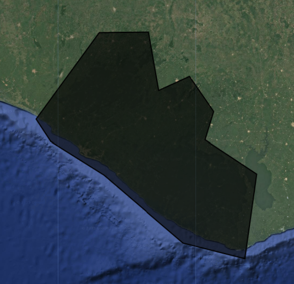

If we wanted to filter for a specific province, we can check the province names by printing them to the **Console** tab from our Liberia borders `featureCollection`.

# 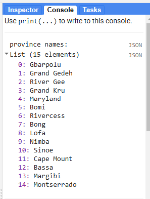


## Using the Original Land Use / Land Cover (LULC) Map

First, let's import the current 2014 LULC map for Liberia. We will use this map to produce reference data for our model and to use as a visual comparison while we go through the model building process.
> *Note: We do not NEED an origianl LULC map, but it is a quick way for us to quickly get relatively trustworthy samples for the purposes of this workshop.*

We need to make sure the cloud and nodata classes both receive values of 0 and then mask them out to effectively remove them from the map so we do not sample them.

We will also symbolize the LULC classes with appropriate colors and add them to the map. 

```javascript
// //////////////////////////////////////////////////////////////////////////////////////////
// //////////////////////////////////////////////////////////////////////////////////////////
// Import and Prepare the Original LULC Map for Sample Extraction
// //////////////////////////////////////////////////////////////////////////////////////////
// //////////////////////////////////////////////////////////////////////////////////////////

// LULC 
// ------------------------------------------------------------------------------------------

// import images
var lulc10m = ee.Image(
  'projects/pc556-ncs-liberia-forest-mang/assets/Liberia_landcover_forest_map_10m_v1_2014') //we will use this one with 10m resolution
var lulc30m = ee.Image(
  'projects/pc556-ncs-liberia-forest-mang/assets/Liberia_landcover_forest_map_30m_2014')

// // check cloud class
// var clouds = lulc.eq(25).selfMask()
// Map.addLayer(clouds,{},'clouds')
  
// do some preprocessing to remove classes we don't want
lulc10m = lulc10m
  // redefine clouds as 0
  .where(lulc10m.eq(25), 0) 
  // get rid of 0 values (nodata an dclouds)
  .selfMask()
  // rename class band
  .rename('class')
lulc30m = lulc30m
  // redefine clouds as 0
  .where(lulc30m.eq(25), 0) 
  // get rid of 0 values (nodata an dclouds)
  .selfMask()
  // rename class band
  .rename('class')

// define visualization paramaters
var lulcVis = {
  min: 1,
  max: 11,
  palette: [
                        // 0 nodata
            '#006d3a',  // 1 forest_80
            '#009c53',  // 2 forest_30-80
            '#00cc6c',  // 3 forest_30
            '#00bba4',  // 4 mangroves
            '#7b0000',  // 5 settlements
            'white',    // placeholder for 6
            '#015890',  // 7 water
            '#b6da03',  // 8 grassland
            '#d29f00',  // 9 shrub
            '#e3e3e3',  // 10 baresoil
            '#fff6a9'   // 11 sand
                        // 25 clouds
            ],         
                        
};
// Add to the map
Map.addLayer(lulc10m, lulcVis, 'LULC 2014 10m', false);
Map.addLayer(lulc30m, lulcVis, 'LULC 2014 30m', false);

```

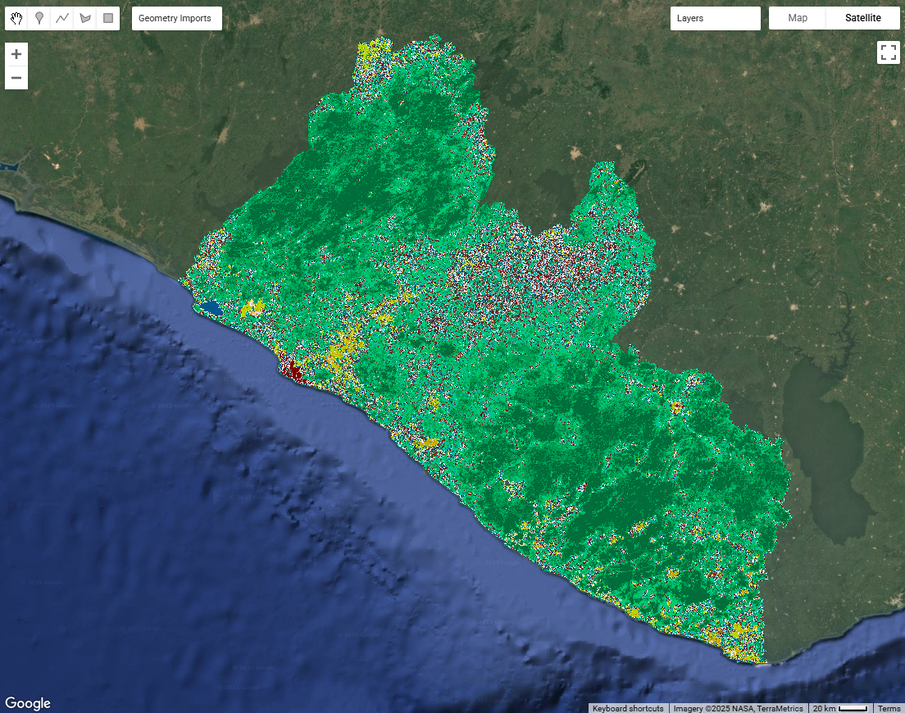

We can view the LULC class at any point on the map by opening the **Inspector** tab in the upper right hand corner of the screen and clicking somewhere on the map. Then, we can navigate to `Pixels` > `LULC 2014` > `class` to see the LULC class at that point.

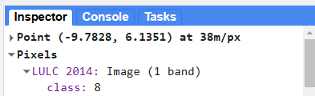

## Import and Preprocess Imagery

Now, we  import and preprocess all the `ImageCollections` we will use for our classification, including the LULC map we generated the reference data from and the satellite imagery on which we will run the model.

Before beginning any remote sensing workflow, image preprocessing is essential. We have to ensure we use high quality data that represents the kind of information we need for our anlaysis. Many of the Image Collections in the GEE catalogue have undergone the more complex pieces of preprocessing, such as georeferencing and terrain, radiometric, and atmospheric correction. However, we still typically need to do the following:
* filter for the area of interest
* filter for the time period of interest (with consideration for seasonality and data availability)
* filter for certain image properties (such as orbit direction or sensor angle)
* filter for the bands of interest (with consideration for what we are trying to map)
* calculate indices
* smooth noisy imagery (SAR imagery)
* mask out clouds (optical imagery)

It is generally better to do as much filtering as we can at the beginning of our analysis to reduce the size of our data sets. This reduces the computational demands of the script.

### Elevation (DEM)

Next, let's import elevation data, which might be particularly useful in our classification for LULC types that are strongly influence by elevation. We will use the Copernicus 30m resolution DEM. 

Before importing this data set from the GEE data catalogue, we can preview important information about it by searching for 'Copernicus DEM' into the search bar above the code editor and clicking on **Copernicus DEM GLO-30: Global 30m Digital Elevation Model**. We can see how it was produced and who produced it. We can click on **See example** to see an example script using the data set, and we can click on **BANDS** to see the resolution and band descriptions.

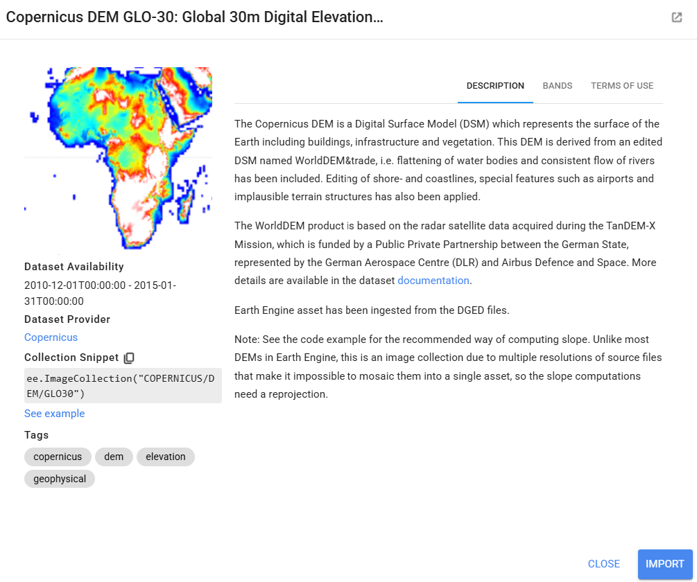

We symbolize and add this to the map as well.

```javascript
// //////////////////////////////////////////////////////////////////////////////////////////
// //////////////////////////////////////////////////////////////////////////////////////////
// Import and Preprocess Imagery
// //////////////////////////////////////////////////////////////////////////////////////////
// //////////////////////////////////////////////////////////////////////////////////////////

// DEM 
// ------------------------------------------------------------------------------------------

// import Copernicus DEM image collection
var demCollection = ee.ImageCollection('COPERNICUS/DEM/GLO30')

// print the resolution
print('DEM resolution (m):',demCollection.first().select('DEM').projection().nominalScale())

// do some preprocessing
var dem = demCollection
  // select just the DEM bands
  .select('DEM')
  // mosaic all images from the image collection into a single image
  .mosaic()
  // clip to the AOI
  .clip(aoi);

// define visualization paramaters
var demVis = {
  min: 0,
  max: 600,
  palette: ['0000ff','00ffff','ffff00','ff0000','ffffff'],
};
// add to the map
Map.addLayer(dem, demVis, 'DEM', false);
```

### Synthetic Aperture Radar (SAR) Imagery (PALSAR and Sentinel-1)

Now, we start importing the raw satellite imagery we will use in our model, starting with synthetic aperture radar (SAR) imagery. We need to do some filtering and preprocessing for the SAR imagery before we use it in our model. SAR can be more complex to interpret and analyze, but it can be very useful in tropical areas where cloud cover makes optical imagery difficult to use. 

>*Details on SAR:* 
>>*Resource:* For some background on SAR data, you can go to the <a href="https://sig-gis.github.io/Liberia_NSC_ForestMonitoringTraining/11_resources/01_sar.html" target="_blank" rel="noopener noreferrer">SAR section of the Resources page</a> on this website, and more extensive SAR materials can be found at this <a href="https://learnsar.open.uaf.edu/sar-resources/" target="_blank" rel="noopener noreferrer">website</a>.

>>In general, for forest mapping in tropical West Africa, the following types of SAR images are most useful, so we will use these to guide our decisions:
>>* Descending orbit pass 
>>* Interferometric Wide swath mode
>>* Moderate Incidence Angles (20° to 45°)
>>* C-band SAR and L-Band (e.g. Sentinel-1, ALOS PALSAR)
>>* VV/VH & HH/HV dual polarization

In this part of the script, we do several things. We will use both PALSAR (Phased Array L-band Synthetic Aperture Radar) and Sentinel-1 so that we can work with both L and C-band SAR data (both good for forest related analyses). 
> L-band provides better penetration depth into vegetation, while C-band provides higher spatial resolution. 

However, both of these data sets are only available starting in 2015, so we write functions for the importing and preprocessing of each data set, and then we call these functions only if our time period of interest is after 2015. Within each importing and preprocessing function, we:

* filter for images that match our area of interest 
* filter for our dates of interest
* filter for sensor angle
* filter for sensor mode
* select polarization bands
* composite the image (combine all the images from the time period into a single image by calculating the median of all values present at each pixel)
* clip th eimage to the AOI
* scale values to decibels (if needed)
* smooth out the image (using a focal mean function).


**Note**: Parts of the following script will produce an error if your year of interest defined at the top of your script is before 2015, because Sentinel-1 data is not available until then.

```javascript
// SAR
// ------------------------------------------------------------------------------------------

// general properties of SAR usually used for forest mapping in Liberia:
  // Descending orbit pass 
  // Interferometric Wide swath mode
  // Moderate Incidence Angles (20° to 45°)
  // C-band SAR and L-Band (e.g. Sentinel-1, ALOS PALSAR)
  // VV/VH & HH/HV dual polarization

// import and preprocess SAR imagery based on the dates of interest
var sar = ee.Image(
  // if the date range is 2015-present, use SAR imagery
  ee.Algorithms.If(
    ee.Date(d1).millis()
      .gte(ee.Date('2015-01-01').millis()),
    // call function to import and preprocess Sentinel 1 and PALSAR
    ee.Image(importS1(d1,d2))
      .addBands(ee.Image(importPALSAR(d1,d2))),
    // if the date range is outside of 2015-present, return an empty image
    ee.Image(0)            
  )
);

// define visualization parameters
var s1vis = {bands:['VH'],min:-20,max:0};
var palsarvis = {bands:['HV'],min:-20,max:0};
// add to map
Map.addLayer(sar, palsarvis,'SAR HV',false);
Map.addLayer(sar, s1vis,'SAR VH',false);

// functions are defined below:

// Sentinel-1 SAR (C-band)
// -----------------------------------------

// write a function to import and preprocess Sentinel 1
function importS1(date1,date2){

  // import Sentinel-1 SAR image collection
  var s1Collection = ee.ImageCollection('COPERNICUS/S1_GRD')
  
  // print the resolution
  print('Sentinel-1 SAR resolution (m):',s1Collection.first().select('HV').projection().nominalScale())
  print("Example Sentinel-1 images:", s1Collection.limit(3))
  
  // do some preprocessing
  var s1 = s1Collection
    // select images that intersect with your AOI
    .filterBounds(aoi)
    // select images in your dates of interest
    .filterDate(date1, date2)
    // select images made with the Interferometric Wide Swath mode
    .filter(ee.Filter.eq('instrumentMode', 'IW'))
    // select pixels with certain incidence angles
    .map(function(image) {
      // select the angle band
      var angle = image.select('angle');
      // mask out bands outside of a certain angle range
      return image.updateMask(angle.gte(angles.get(0).getInfo()).and(angle.lte(angles.get(1).getInfo())));
    })
    // // select images that were taken during the north to south orbit
    // .filter(ee.Filter.eq('orbitProperties_pass', 'DESCENDING')) //DESCENDING //ASCENDING
    // select specific bands
    .select('VV','VH') //VV //VH //HH //HV
    // get the median for the time period of interest
    .median()
    // apply speckle filter
    .focal_mean(smoothingRadius,'circle','meters')
    // clip to the AOI
    .clip(aoi);
  
  // return the composited and cleaned Sentinel 1 image
  return(s1)
}

// PALSAR SAR (L-band)
// -----------------------------------------

// write a function to import and preprocess Sentinel 1
function importPALSAR(date1,date2){

  // import PALSAR SAR image collection
  var palsarCollection = ee.ImageCollection('JAXA/ALOS/PALSAR-2/Level2_2/ScanSAR')
  // var palsarCollection = ee.ImageCollection('JAXA/ALOS/PALSAR/YEARLY/SAR_EPOCH')
  
  // print the resolution
  print('PALSAR SAR resolution (m):',palsarCollection.first().select('HH').projection().nominalScale())
  print("Example PALSAR images:", palsarCollection.limit(3))
  
  // do some preprocessing
  var palsar = palsarCollection
    // select images that intersect with your AOI
    .filterBounds(aoi)
    // select images in your dates of interest
    .filterDate(date1, date2)
    // select images with certain incidence angles
    .filter(ee.Filter.gte('IncAngleNearRange', 0))  
    .filter(ee.Filter.lte('IncAngleFarRange', 90))
    // // select images that were taken during the north to south orbit
    // .filter(ee.Filter.eq('PassDirection', 'Descending')) //Descending //Ascending
    // select specific bands
    .select('HH','HV') //VV //VH //HH //HV
    // get the median for the time period of interest
    .median()
    // convert to decibels
    .pow(2).log10().multiply(10).subtract(83.0)
    // apply speckle filter
    .focal_mean(smoothingRadius,'circle','meters')
    // clip to the AOI
    .clip(aoi);

  // return the composited and cleaned PALSAR image
  return(palsar)
}
```

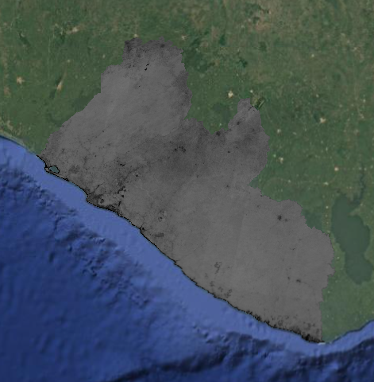


### Optical Imagery (Landsat 8 and Sentinel-2)

Now we will do something very similar with optical imagery. Optical imagery is much more intuitive to interpret and less noisy than SAR, but it is frequently obscured by clouds in tropical regions.

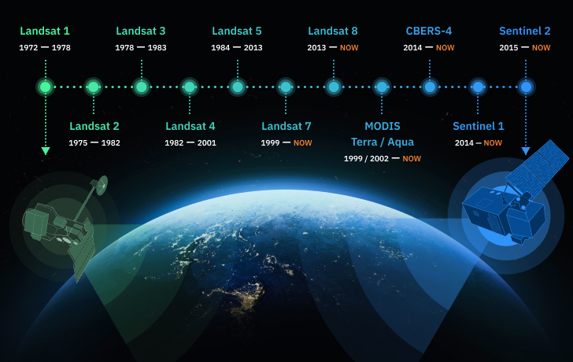

We will use either Landsat 8 or Harmonized Landsat-Sentinel (HLS) imagery, depending on the dates of interest. HLS combines Landsat and Sentinel-2 imagery to create cloud-free imagery with a higher spatial coverage and higher temporal resolution than is otherwise possible with only one of these sensors. It is only available starting in 2016, so we write functions for the importing and preprocessing of each data set, and then we call the Landsat function if our time period of interest is before 2016 and call the HLS function if our time period of interest is after 2016. Within each importing and preprocessing function, we:

* filter for images that match our area of interest
* filter for our dates of interest
* filter out images with high cloud cover
* mask out clouds (using the `QA_PIXEL` band for Landsat and the `Fmask` band for HLS)
* select and rename bands (so the band names are consistent regardless of which imagery source we use)
* composite the image (using median)
* clip the image to the AOI
* scale values to reflectance (if needed)

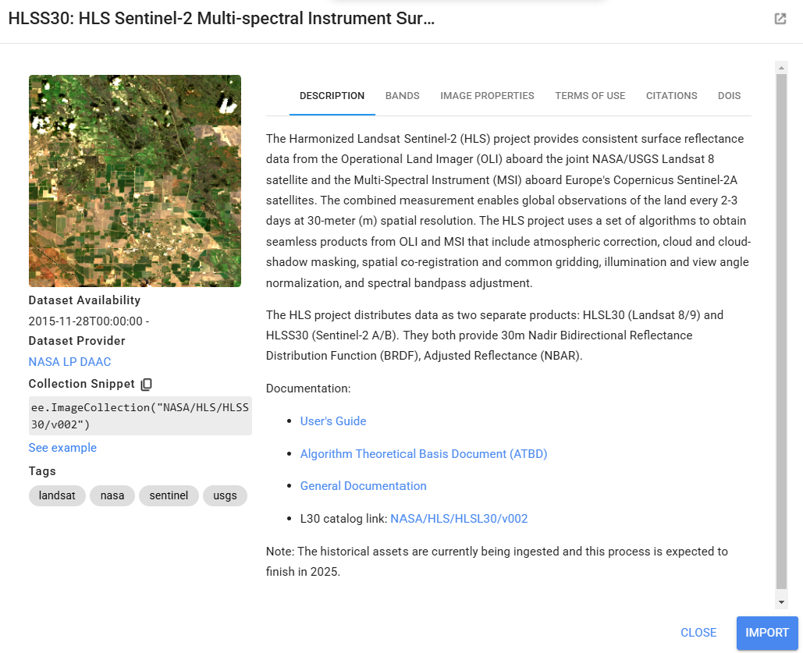

*Resource:* For some background on cloud masking, you can go to the <a href="https://sig-gis.github.io/Liberia_NSC_ForestMonitoringTraining/11_resources/02_cloudmasking.html" target="_blank" rel="noopener noreferrer">Cloud Masking section of the Resources page</a> on this website.

```javascript
// Optical
// ------------------------------------------------------------------------------------------

// import and preprocess optical imagery based on the dates of interest
var optical = ee.Image(
  // if the date range is 2013-2015, use Landsat 8
  ee.Algorithms.If(
    ee.Date(d2).millis()
      .lt(ee.Date('2016-01-01').millis())
      .and(ee.Date(d1).millis()
        .gte(ee.Date('2013-01-01').millis())),
    // call function to import and preprocess Landsat 8
    importL8(d1,d2),
    // if the date range is 2016-present, use HLS
    ee.Algorithms.If(
      ee.Date(d1).millis()
        .gte(ee.Date('2016-01-01').millis()),   
      // call function to import and preprocess HLS
      importHLS(d1,d2), 
    // if the date range is outside of 2013-present, return an empty image
    ee.Image(0)            
  )
));

// define visualization parameters
var opticalVis = {bands:['red','green','blue'],min:0,max:0.3};
// add to map
Map.addLayer(optical, opticalVis,'optical',false);

// functions are defined below:

// Landsat 8 (for 2013-2015)
// -----------------------------------------

// write a function to import and preprocess Landsat 8 
function importL8(date1,date2){
  
  // import the Sentinel 2 image collection
  var l8Collection = ee.ImageCollection("LANDSAT/LC08/C02/T1_L2")
  
  // print the resolution
  print('Landsat-8 resolution (m):',l8Collection.first().select(1).projection().nominalScale())
  print("Example Landsat-8 images:", l8Collection.limit(3))
  
  // do some preprocessing to make an image from the Sentinel 8 image collection
  var l8 = l8Collection
    // select images that intersect with your AOI
    .filterBounds(aoi)
    // select images in your dates of interest
    .filterDate(date1, date2)
    .filter(ee.Filter.lt('CLOUD_COVER', cloudCoverThreshold))
    // mask out cloudy pixels
    .map(function(image) {
      // define the quality score band to use
      var qaBand = image.select('QA_PIXEL');
      // select the bits of interest
      // Bits 1,2,3,4 are cloud-related 
      // The << operator is the "bitwise shift" operator, shifting 1 to the left by the specified number of bits
      var dilatedCloudBitMask = 1 << 1;  // 1 shifted left by 1 bit  = 00000010 = 2  (dilated clouds)
      var cirrusBitMask = 1 << 2;        // 1 shifted left by 2 bits = 00000100 = 4  (cirrus clouds)
      var cloudBitMask = 1 << 3;         // 1 shifted left by 3 bits = 00001000 = 8  (clouds)
      var cloudShadowBitMask = 1 << 4;   // 1 shifted left by 4 bits = 00010000 = 16 (cloud shadow)
      // Transform bits and create a mask where values are 0
      var mask = qaBand.bitwiseAnd(dilatedCloudBitMask).eq(0)
                .and(qaBand.bitwiseAnd(cirrusBitMask).eq(0))
                .and(qaBand.bitwiseAnd(cloudBitMask).eq(0))
                .and(qaBand.bitwiseAnd(cloudShadowBitMask).eq(0));
      // Apply mask
      return image.updateMask(mask);
    })
    // select and rename desired bands
    .select(['SR_B2', 'SR_B3', 'SR_B4', 'SR_B5', 'SR_B6', 'SR_B7'], 
            ['blue',  'green', 'red',   'NIR',   'SWIR1', 'SWIR2',])
    // get the median for the time period of interest
    .median()
    // convert to reflectance values
    .multiply(0.0000275).add(-0.2)
    // clip to the AOI
    .clip(aoi);
  
  // return the composited and cleaned Sentinel 2 image
  return(l8)
}

// Harmonized Landsat Sentinel combined (for 2016-present)
// -----------------------------------------

// write a function to import and preprocess HLS 
function importHLS(date1,date2){
  
  // import the Landsat 8 HLS image collection
  var l8Collection = ee.ImageCollection("NASA/HLS/HLSL30/v002")
    // select and rename desired bands
    .select(['B2',    'B3',    'B4',    'B5',    'B6',    'B7',   'Fmask'], 
            ['blue',  'green', 'red',   'NIR',   'SWIR1', 'SWIR2','Fmask'])
  // import the Sentinel 2 HLS image collection
  var s2Collection = ee.ImageCollection("NASA/HLS/HLSS30/v002")
    // .select(['B2',  'B3',   'B4', 'B5',      'B6',      'B7',      'B8', 'B8A',     'B11',  'B12',  'Fmask'], 
    //         ['blue','green','red','redEdge1','redEdge2','redEdge3','NIR','redEdge4','SWIR1','SWIR2','Fmask'])
    .select(['B2',  'B3',   'B4', 'B8', 'B11',  'B12',  'Fmask'], 
            ['blue','green','red','NIR','SWIR1','SWIR2','Fmask'])
  
  // merge the two collections into one big HLS image collection
  var hlsCollection = l8Collection.merge(s2Collection);
  
  // print the resolution
  print('HLS resolution (m):',hlsCollection.first().select(1).projection().nominalScale())
  print("Example HLS images:", hlsCollection.limit(3))
  
  // do some preprocessing to make an image from the HLS image collection
  var hls = hlsCollection
    // select images that intersect with your AOI
    .filterBounds(aoi)
    // select images in your dates of interest
    .filterDate(date1, date2)
    .filter(ee.Filter.lt('CLOUD_COVERAGE', cloudCoverThreshold))
    // mask out cloudy pixels
    .map(function(image) {
      // define the quality score band to use
      var qaBand = image.select('Fmask');
      // select the bits of interest
      // Bits 1,2,3,4 are cloud-related 
      // The << operator is the "bitwise shift" operator, shifting 1 to the left by the specified number of bits
      var cloudBitMask = 1 << 1;  
      var cloudAdjBitMask = 1 << 2; 
      var cloudShadowBitMask = 1 << 3; 
      var mask = qaBand.bitwiseAnd(cloudBitMask).eq(0)
                .and(qaBand.bitwiseAnd(cloudShadowBitMask).eq(0));
                // (uncomment this to remove cloud adjacent pixels)
                // .and(qaBand.bitwiseAnd(cloudAdjBitMask).eq(0));
      // Apply mask
      return image.updateMask(mask);
    })
    // select the bands of interest
    .select(['blue','green','red','NIR','SWIR1','SWIR2'])
    // get the median for the time period of interest
    .median()
    // clip to the AOI
    .clip(aoi)
  
  // return the composited and cleaned HLS image
  return(hls)
}
```

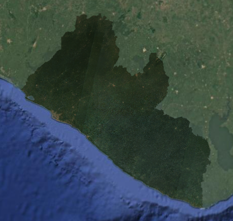

### Optical Imagery (Planet)

Last, let's import Planet NICFI imagery. Although it only has red, green, blue, and NIR bands, all of which are also present in the Landsat and Sentinel, adding this data set may strengthen the model.

Planet NICFI biannual to monthly mosaics are only available starting in 2015, so we write functions for the importing and preprocessing of the data set, and then we call the function only if our time period of interest is after 2015. Within each importing and preprocessing function, we:

* filter for images that match our area of interest
* filter for our dates of interest
* mask out clouds (using the reflectance values of the bands)
* select and rename bands (so the band names are consistent regardless of which imagery source we use)
* composite the image (using median)
* clip the image to the AOI

```javascript
// Additional Optical
// ------------------------------------------------------------------------------------------

// import and preprocess Planet imagery based on the dates of interest
var planet = ee.Image(
  // if the date range is 2015-present, use planet imagery
  ee.Algorithms.If(
    ee.Date(d1).millis()
      .gte(ee.Date('2015-01-01').millis()),
    // call function to import and preprocess Planet
    ee.Image(importPlanet(d1,d2)),
    // if the date range is outside of 2015-present, return an empty image
    ee.Image(0)            
  )
);

// define visualization parameters
var planetVis = {bands:['red_planet','green_planet','blue_planet'],min:64,max:5454,gamma:1.8};
// add to map
Map.addLayer(planet, planetVis,'planet optical',false);

// functions are defined below:

// Planet (after 2015)
// -----------------------------------------

// write a function to import and preprocess Landsat 8 
function importPlanet(date1,date2){
  
  // import the Sentinel 2 image collection
  var planetCollection = ee.ImageCollection("projects/planet-nicfi/assets/basemaps/africa")
  
  // print the resolution
  print('Planet NICFI resolution (m):',planetCollection.first().select(1).projection().nominalScale())
  print("Example Planet NICFI images:", planetCollection.limit(3))
  
  // do some preprocessing to make an image from the Sentinel 8 image collection
  var planet = planetCollection
    // select images that intersect with your AOI
    .filterBounds(aoi)
    // select images in your dates of interest
    .filterDate(date1, date2)
     // mask out clouds 
    .map(function(image) {
      // select and rename the bands we want to use
      var blue = image.select('B'); 
      var green = image.select('G');  
      var red = image.select('R'); 
      var NIR = image.select('N');
      // calculate a brightness value by averaging all the bands
      var brightness = image.expression(
        '(b1 + b2 + b3 + b4) / 4', {
          'b1': blue, 'b2': green, 'b3': red, 'b4': NIR
        })
      // Create a cloud mask by setting thresholds for each band 
      // (high reflectance in all bands suggests clouds)
      var cloudMask = blue
        .lt(1100)  //1100
        .and(green.lt(1600))  // 1600
        .and(red.lt(2200)) //2200
        // .and(NIR.lt(3500)) //3500
        .and(brightness.lt(2200));  // 2000
      // Apply the cloud mask to the image
      return image.updateMask(cloudMask);
    })
    // select and rename desired bands
    .select(['B',          'G',           'R',         'N'], 
            ['blue_planet','green_planet','red_planet','NIR_planet',])
    // get the median for the time period of interest
    .median()
    // clip to the AOI
    .clip(aoi);
  
  // return the composited and cleaned Sentinel 2 image
  return(planet)
}
```

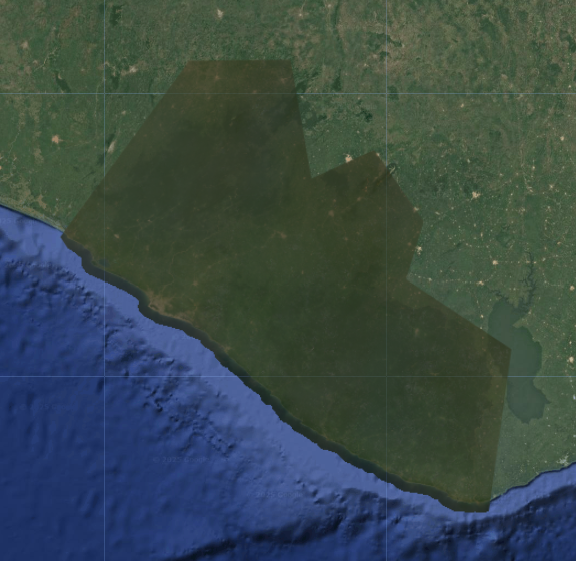

*Hint:* For dates of interest in 2014, you will get an error when trying to add Planet imagery to the map, since it is empty for this year.

## Prepare Predictor Image
The *Predictor Image* is the image data that is being analyzed by the model to generate a prediction. Said another way, it is the satellite imagery for the year for which we are trying to produce a LULC map.

Now that we have multiple composted images containing the different bands we would like to use as predictor variables in our random forest model. We combine all these bands into a single image, the Predictor Image. 

>**Note:**
>> The **Training Image** and the **Predictor Image** may be the same or different. In our case we are using the same image from which we are extracting the variables for the training samples, as we are for giving the Random Forest for the prediction of all the pixels. However, as long as the bands are the same between the two images, you can use training data from one image and apply it to a different image (e.g., use training points from a 2016 Training Image to classify a 2018 Preditor Image). You could not train a Random Forest classifier on a Training Image with fewer variables than the Predictor Image and expect it to be able to utilize all the information (e.g. training on 2014 with only Landsat and use the Random Forest classifier on a 2018 image with Landsat, Sentinel-2, and SAR).

```javascript
// //////////////////////////////////////////////////////////////////////////////////////////
// //////////////////////////////////////////////////////////////////////////////////////////
// Prepare Predictor Image
// //////////////////////////////////////////////////////////////////////////////////////////
// //////////////////////////////////////////////////////////////////////////////////////////

// merge all images into a predictor image with many bands
var predImage = dem
  .addBands(sar)
  .addBands(optical)
  .addBands(planet)
```

### Calculate Indices
The next thing we do is calculate some spectral indices from the optical imagery that are frequently used to identify LULC classes of interest. Certain land cover types strongly reflect or absorb different wavelengths of light, and we can calculate normalized versions of these spectral differences to highlight certain land cover types. Most of these index values range from -1 to +1.

* **NDVI:** Normalized Difference Vegetation Index - highlights vegetation health and density; calculated using the NIR and red bands

* **LSWI:** Land Surface Water Index - highlights vegetation and soil water content; calculated using the NIR and SWIR1 bands

* **NDMI:** Normalized Difference Moisture Index - highlights vegetation water content; calculated with the red and SWIR2 bands

* **MNDWI:** Modified Normalized Difference Water Index - highlights open water; calculated using the geen and SWIR bands

* **EVI:** Enhanced Vegetation Index - highlights vegetation health and density; calculated using the NIR, red, and blue bands

* **MVI:** Mangrove Vegetation Index - highlights mangroves; calculated using the NIR, green, and SWIR1 bands

* **RVI:** Radar Vegetation Index - highlights vegetation density and structure; calculated using the HV, HH, and VV polarizations

As we did before, we write separate functions for the optical and SAR indices, and only call the SAR function for the time period for which SAR is available.

*Resource:* For some background on spectral indices, you can go to the <a href="https://sig-gis.github.io/Liberia_NSC_ForestMonitoringTraining/11_resources/03_indices.html" target="_blank" rel="noopener noreferrer">Spectral Indices section of the Resources page</a> on this website.

```javascript
// Calculate indices
// ------------------------------------------------------------------------------------------

// calculate indices on imagery
predImage = predImage
  .addBands(calculateOpticalIndices(predImage))
  .addBands(ee.Image(
  // if the date range is 2015-present
    ee.Algorithms.If(
      ee.Date(d1).millis()
        .gte(ee.Date('2015-01-01').millis()),
      // call function to calculate SAR indices
      ee.Image(calculateSARIndices(predImage)),
      // if the date range is outside of 2015-present, add an empty image
      ee.Image(0)          
    ))
  )

// functions defined below:

// write function to calculate indices
function calculateOpticalIndices(image){
  
  // make sure the image is recognized as an image
  ee.Image(image)
  
  // calculate the indices and rename them
  
  // When we can, we use the GEE function normalizedDifference, expressed as: (b1-b2)/(b1+b2)
  // NDVI: (NIR-Red)/(NIR+Red)
  var ndvi = image.normalizedDifference(['NIR', 'red']).rename('NDVI');
  // LSWI: (NIR-SWIR1)/(NIR+SWIR1)
  var lswi = image.normalizedDifference(['NIR', 'SWIR1']).rename('LSWI');
  // NDMI: (SWIR2-Red)/(SWIR2+Red)
  var ndmi = image.normalizedDifference(['SWIR2', 'red']).rename('NDMI');
  // NDWI: (Green-NIR)/(Green+NIR)
  var ndwi = image.normalizedDifference(['green', 'NIR']).rename('NDWI');
  // MNDWI: (Green-SWIR2)/(Green+SWIR2)
  var mndwi = image.normalizedDifference(['green', 'SWIR2']).rename('MNDWI');
  
  // for the more complicated indices, we define the input bands separately first
  var nir = image.select('NIR');
  var red = image.select('red');
  var blue = image.select('blue');
  var green = image.select('green');
  var swir1 = image.select('SWIR1');
  // EVI: 2.5 * (NIR-red) / (NIR + (6*red) - (7.5*blue) + 1)
  var evi = nir.subtract(red).multiply(2.5)
    .divide(nir.add(red.multiply(6)).subtract(blue.multiply(7.5)).add(1))
    .rename('EVI');
  // MVI: (NIR-green)/(SWIR1-green)
  var mvi = nir.subtract(green).divide(swir1.subtract(green)).rename('MVI');

  // merge indices into a single image
  var indices = ndvi
    .addBands(lswi)
    .addBands(ndmi)
    // .addBands(ndwi)
    .addBands(mndwi)
    .addBands(evi)
    .addBands(mvi);
                    
  // return the index image
  return indices
}

// write function to calculate indices
function calculateSARIndices(image){
  
  // make sure the image is recognized as an image
  ee.Image(image)
  
  // calculate the indices and rename them

  // for the more complicated indices, we define the input bands separately first
  // for the SAR bands, we need to convert from decibels to a linear scale for the calculations
  var vv = ee.Image(10).pow(image.select('VV').divide(10));
  var vh = ee.Image(10).pow(image.select('VH').divide(10));
  var hh = ee.Image(10).pow(image.select('HH').divide(10));
  var hv = ee.Image(10).pow(image.select('HV').divide(10));
  // RVI: (8*HV) / (HH + VV + (2*HV))
  var rvi = hv.multiply(8).divide(hh.add(vv).add(hv.multiply(2))).rename('RVI');

  // merge indices into a single image
  var indices = rvi
                    
  // return the index image
  return indices
}
```

*Resource:* Here is a great resource published by the University of Bonn for finding indeces for many different purposes: <a href="https://www.indexdatabase.de/" target="_blank" rel="noopener noreferrer">https://www.indexdatabase.de/</a>.


### Fix Projection Issues

If we look back at the resolutions we printed out, we see that the original imagery sources had different pixel sizes. It is best to reduce the resolution of all predictor variables to that of the lowest resolution imagery source. Thus we reduce the resolution to 30m, and we need to define a projection and reproject in order to do this.

```javascript
// Fix projection issues
// ------------------------------------------------------------------------------------------

// set the projection of the image
predImage = predImage.setDefaultProjection('EPSG:4326', null, resolution);
  
// reduce the resolution of all bands to the desired resolution
predImage = predImage
  .reduceResolution({
    reducer: ee.Reducer.mean(),
    bestEffort: true})  // Allows approximation for complex regions
  .reproject({
    crs: predImage.projection(),
    scale: resolution});
    
// print
print('predictor image:', predImage)
```

## Checking Our Work

Let's print out some of our results to double check we did everything correctly.

Add a few of the indeces we made to use for input variables of the predictor image.
```javascript
// add some of the features (a.k.a. variables or bands) from the preditor image to the map
var ndviVis = {
  bands:['NDVI'],
  min:0,
  max:0.8,
  palette: ['8bc4f9', 'c9995c', 'c7d270','8add60','097210']};
Map.addLayer(predImage, ndviVis, 'NDVI', false);
var rviVis = {
  bands:['RVI'],
  min:0,
  max:2,
  palette: ['black', 'white']};
Map.addLayer(predImage, rviVis,'RVI',false);
```
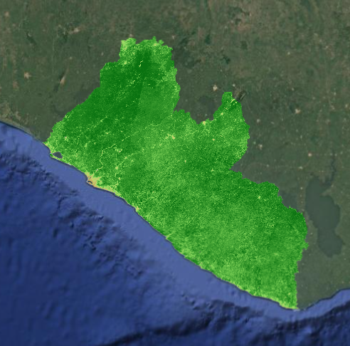

Now, let's examine what we have printed to the **Console** tab. We printed out the resolution and the first few images in each `imageCollection`.

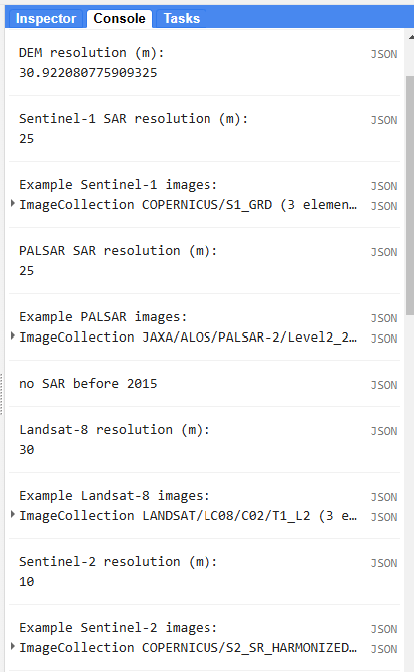

We can expand the different levels of properties to get a better sense of what the data look like.


We can also check the band values of every image at specific points by opening on the **Inspector** tab and clicking somewhere on the map.

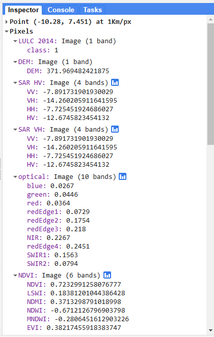

We also printed the merged predictor image to make sure all the other bands were added and the indices were calculated correctly.

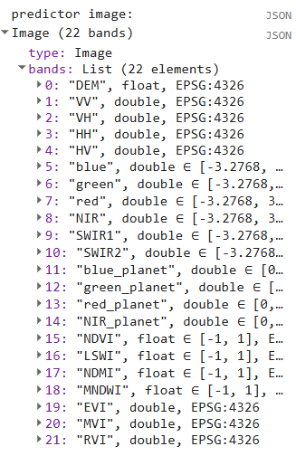


## Prepare Reference Points

Next, we generate reference data. We can either import the points we generated in SEPAL or AREA2, or we can generate points directly in this script. 

We will create a stratified random sample based on the 2014 LULC map, allocating 400 points to each class (excluding clouds and no data). The general rules of thumb for the number of reference data points are: 

* **training points:** Generate enough training points per class to have at least 10 * p, where p the number of predictor variables (e.g. if your predictor image has 16 bands, generate at least 160 training points per LULC class)

* **testing points:** Generate enough testing points per class so the ratio between training and testing points is √(p):1, where p is the number of predictor variables (e.g. if your predictor image has 16 bands, generate at least 40 tetsing points per class - the ratio between training and testing points should be 4:1, which is an 80%-20% split)

In more recent years when SAR and Planet NICFI are available, we have 22 possible predictor bands to use in our model. Based on these rules of thumb, we should have at least 220 training points per class, and at least 48 testing points per class. Thus, 400 total reference points per class go well beyond these minimums if we split them into training and testing data later 

*Tip:* Generally, more training and testing data is better, so try to generate as much as you can within your budget and time constraints.

```javascript
// //////////////////////////////////////////////////////////////////////////////////////////
// //////////////////////////////////////////////////////////////////////////////////////////
// Prepare Training and Testing Points
// //////////////////////////////////////////////////////////////////////////////////////////
// //////////////////////////////////////////////////////////////////////////////////////////

// create a stratified random sample based on the LULC map
  var refPoints = lulc10m.stratifiedSample({
    // number of points per class, set as a variable at the beginning of the script
    numPoints: classPointsNum,
    // the band with the LULC classes in it
    classBand: 'class',
    // resolution of the LULC map
    scale: 10,
    // set the seed so you regenerate the same exact points every time
    seed: 111,
    // (uncomment if you want a custom number of points per class)
    // classValues:classValuesList,
    // classPoints:classPointsList, 
    dropNulls:true, 
    tileScale:2, 
    geometries: true
  });
  
// Add to the map
Map.addLayer(refPoints, {}, 'reference points', false);
// print
print('reference points:', refPoints.limit(5))

```

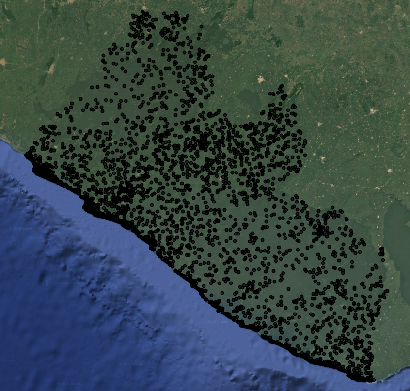

## Export

The last thing we do is export the **Reference Points** and **Predictor Image** (*for this demo it is being used as our **Training Image** too*) to run the classification in a separate script. These Reference Points have yet to be split up into training and testing data, and they are simple class labels without the extracted variable information from the Training Image yet.

 While we could do all the preprocessing and analysis steps in a single script, we would get an error that our user memory limit was exceeded, meaning that the script was too computationally expensive to do all in one go. This is because we are trying to run a computationally expensive preprocessing and machine learning functions on a large image with high saptial resolution and many prediction bands. 

When exporting, make sure to change the `assetId` to a path that is in your own asset library.

```javascript
// //////////////////////////////////////////////////////////////////////////////////////////
// //////////////////////////////////////////////////////////////////////////////////////////
// Export
// //////////////////////////////////////////////////////////////////////////////////////////
// //////////////////////////////////////////////////////////////////////////////////////////

// Export the reference points
Export.table.toAsset({
  // the feature collection you want to export
  collection: refPoints,
  // the task name
  description: 'refPoints',
  // the asset ID and path (change to your own asset library)
  assetId: 'projects/pc556-ncs-liberia-forest-mang/assets/refPoints_10m_'+d1.slice(0,4)+'_'+classPointsNum+'PerClass_v'+version
});

// Export the reference points
Export.image.toAsset({
  // the image you want to export
  image: predImage,
  // the name of the task
  description: 'predImage',
  // the path and name of the asset (change this to be in your own asset library)
  assetId: 'projects/pc556-ncs-liberia-forest-mang/assets/predImage_'+resolution+'m_'+d1.slice(0,4)+'_v'+version,
  // the geometry to clip the image to
  region: aoi,
  // the resolution of the image
  scale: resolution,
  maxPixels: 1e13
})
```

Now, when we run our script, a new export task will show up in the **Tasks** tab. Click **RUN** to begin the export, and track its status just below in **SUBMITTED TASKS**.

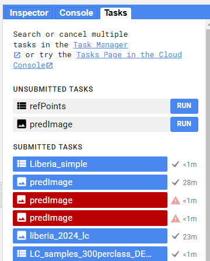

Code checkpoint: check your work in `users/ee-scripts/Liberia_Forest_SIG_workshops/09_classification_GEE/preprocessing`

If your export is taking a long time, you can use the following pre-prepared results files from the workshop asset repository for the later steps.

<a href="https://code.earthengine.google.com/?asset=projects/pc556-ncs-liberia-forest-mang/assets/refPoints_10m_2014_400PerClass" target="_blank" rel="noopener noreferrer">https://code.earthengine.google.com/?asset=projects/pc556-ncs-liberia-forest-mang/assets/refPoints_10m_2014_400PerClass</a>

<a href="https://code.earthengine.google.com/?asset=projects/pc556-ncs-liberia-forest-mang/assets/predImage_30m_2014" target="_blank" rel="noopener noreferrer">https://code.earthengine.google.com/?asset=projects/pc556-ncs-liberia-forest-mang/assets/predImage_30m_2014</a>
