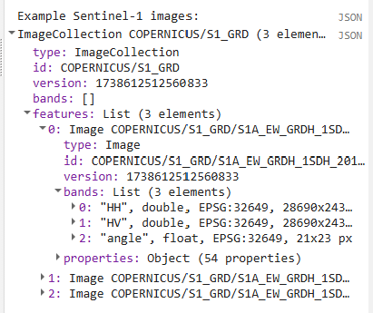

# Preprocessing Imagery in GEE

## Set Important Parameters

First, we  define some variables that will be used as parameters later throughout the script. We are bringing them to the top of the script so they are easy to change without having to scroll through the script to find them.

These include values related to setting the time period of interest, cloud masking, and smoothing.

<font color = red> script </font>

```javascript

```

## Create Area of Interest (AOI)

An area of interest can be uploaded from a local shapefile, drawn on the map, or derived from a pre-existing dataset in the Earth Engine catalogue.

For this exercise, we use a union of a `featureCollection` of Liberia's borders to be our AOI. We can also filter for specific provinces by uncommenting the line below.

```javascript

```


If we wanted to filter for a specific province, we can check the province names by printing them to the **Console** tab from our Liberia borders `featureCollection`.


## Import and Preprocess Imagery

Now, we  import and preprocess all the `ImageCollection`s we will use for our classification, including the LULC map we generate the reference data from and the satellite imagery we run the model on.

Before beginning any remote sensing workflow, image preprocessing is essential. We have to ensure we use high quality data that represent the kind of information we need for our anlaysis. Many of the `ImageCollection` in the GEE catalogue have undergone the more complex pieces of preprocessing, such as georeferencing and terrain, radiometric, and atmospheric correction. However, we still need to do seom of the following:
* filter for the area of interest
* filter for the time period of interest (with consideration for seasonality and data availability)
* filter for certain image properties (such as orbit direction or sensor angle)
* filter for the bands of interest (with consideration for what we are trying to map)
* calculate indices
* smooth noisy imagery (SAR imagery)
* mask out clouds (optical imagery)

It is generally better to do as much filtering as we can at the beginning of our analysis to reduce the size of our data sets. This reduces the computational demands of the script.

### Land Use / Land Cover (LULC)

First, let's import the current 2014 LULC map for Liberia. We will use this map to produce reference data for our model and to use as a visual comparison while we go through the model building process.

We need to make sure the cloud and nodata classes both receive values of 0 and then mask them out to effectively remove them from the map so we do not sample them.

We also symbolize the LULC classes with appropriate colors and add them to the map. 

```javascript

```


We can view the LULC class at any point on the map by opening the **Inspector** tab in the upper right hand corner of the screen and clicking somewhere on the map. Then, we can navigate to `Pixels` > `LULC 2014` > `class` to see the LULC class at that point.


### Elevation (DEM)

Next, let's import elevation data, which might be particularly useful in our classification for LULC types that are strongly influence by elevation. We will use the Copernicus 30m resolution DEM. 

Before importing this data set from the GEE data catalogue, we can preview important information about it by searching for 'Copernicus DEM' into the search bar above the code editor and clicking on **Copernicus DEM GLO-30: Global 30m Digital Elevation Model**. We can see how it was produced and who produced it. We can click on **See example** to see an example script using the data set, and we can click on **BANDS** to see the resolution and band descriptions.


We symbolize and add this to the map as well.

```javascript

```

### SAR Imagery

Now, we start importing the raw satellite imagery we will use in our model, starting with synthetic aperture radar (SAR) imagery. We need to do some filtering and preprocessing for the SAR imagery before we use it in our model. SAR can be more complex to interpret and analyze, but it can be very useful in tropical areas where cloud cover makes optical imagery difficult to use. 

*Resource:* For some background on SAR data, you can go to the Intro to SAR page in the Resources tab of this website.
<font color = red> insert correct link to SAR resources </font>

In general, for forest mapping in tropical West Africa, the following types of SAR images are most useful, so we will use most these to guide our decisions:
* Descending orbit pass 
* Interferometric Wide swath mode
* Moderate Incidence Angles (20° to 45°)
* C-band SAR and L-Band (e.g. Sentinel-1, ALOS PALSAR)
* VV/VH & HH/HV dual polarization

In this part of the script, we do several things. We will use both PALSAR and Sentinel-1 so that we can work with both L and C-band SAR data (which are best for forest related analyses). However, both of these data sets are only available starting in 2015, so we write functions for the importing and preprocessing of each data set, and then we call these functions only if our time period of interest is after 2015. Within each importing and preprocessing function, we:

* filter for images that match our area of interest 
* filter for our dates of interest
* filter for sensor angle
* filter for sensor mode
* select polarization bands
* composite the image (combine all the images from the time period into a single image by calculating the median of all values present at each pixel)
* clip th eimage to the AOI
* scale values to decibels (if needed)
* smooth out the image (using a focal mean function).

```javascript
```


### Optical Imagery

Now we will do something very similar with optical imagery. Optical imagery is much more intuitive to interpret and less noisy than SAR, but it is frequently obscured by clouds in tropical regions.


We will use either Landsat 8 or Sentinel 2 imagery, depending on the dates of interest. Sentinel 2 has a higher temporal and spatial resolution but is only available starting in 2018, so we write functions for the importing and preprocessing of each data set, and then we call the Landsat function if our time period of interest is before 2019 and call the Sentinel function if our time period of interest is after 2019. Within each importing and preprocessing function, we:

<font color = red> fix dates </font>

* filter for images that match our area of interest
* filter for our dates of interest
* filter out images with high cloud cover
* mask out clouds (using the `QA_PIXEL` band for Landsat and the `QA60` band with CloudScore+ for Sentinel)
* select and rename bands (so the band names are consistent regardless of which imagery source we use)
* composite the image (using median)
* clip the image to the AOI
* scale values to reflectance (if needed)

*Resource:* For some background on cloud masking, you can go to the Cloud Masking page in the Resources tab of this website.
<font color = red> insert correct link to resources </font>

```javascript
```


### Calculate Indices

The last thing we do is calculate some spectral indices from the optical imagery that are frequently used to identify LULC classes of interest. Certain land cover types strongly reflect or absorb different wavelengths of light, and we can calculate normalized versions of these spectral differences to highlight certain land cover types. These index values range from -1 to +1:

* **NDVI:** Normalized Difference Vegetation Index - highlights vegetation health and density; calculated using the NIR and red bands

* **LSWI:** Land Surface Water Index - highlights vegetation and soil water content; calculated using the NIR and SWIR1 bands

* **NDMI:** Normalized Difference Moisture Index - highlights vegetation water content; calculated with the red and SWIR2 bands

* **MNDWI:** Modified Normalized Difference Water Index - highlights open water; calculated using the geen and SWIR bands

* **EVI:** Enhanced Vegetation Index - highlights vegetation health and density; calculated using the NIR, red, and blue bands

*Resource:* For some background on indices, you can go to the Spectral Indices page in the Resources tab of this website.
<font color = red> insert correct link to resources </font>

```javascript
```


*Tip:* Here is a great resource published by the University of Bonn for finding indeces for many different purposes: [https://www.indexdatabase.de/](https://www.indexdatabase.de/)

Just to check we did everything correctly, we print out the resolution and the first few images in each `imageCollection` to the **Console** tab.


We can expand the different levels of properties to get a better sense of what the data look like.



We can also check the band values of every image at specific points by opening on the **Inspector** tab and clicking somewhere on the map.


## Prepare Predictor Image

Now, we have multiple composted images containing the different bands we would like to use as predictor variables in our random forest model. We combine all these bands into a single image. Also, if we look back at the resolutions we printed out, we see that the original imagery sources had different pixel sizes. It is best to reduce the resolution of all predictor variables to that of the lowest resolution imagery source. Thus we reduce the resolution to 30m.

```javascript
```


## Prepare Reference Data

Next, we generate reference data. We can either import the points we generated in SEPAL or AREA2, or we can generate points directly in this script. 