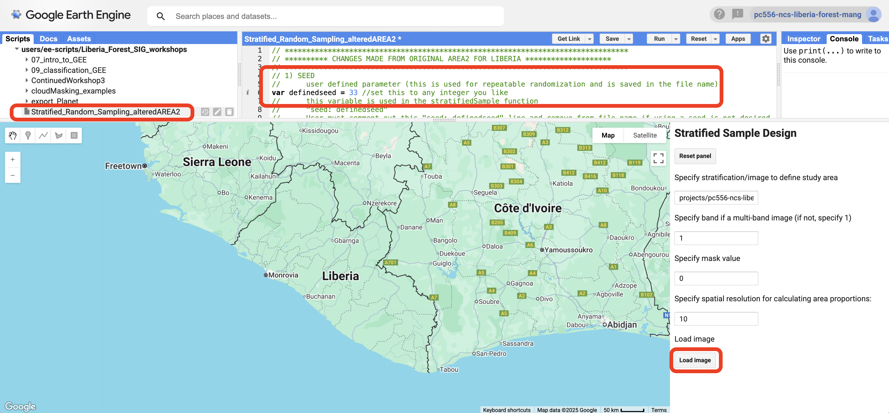
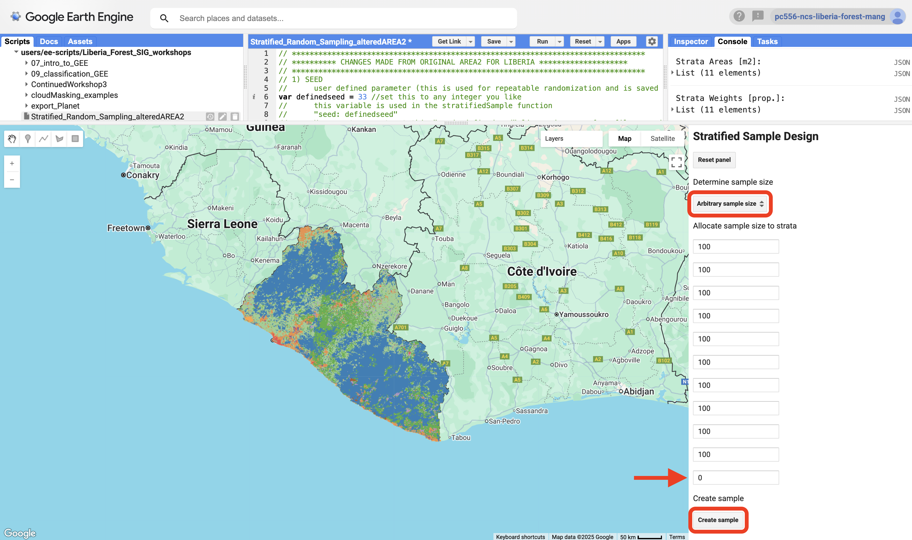
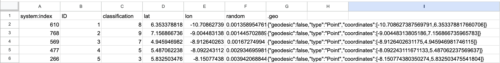
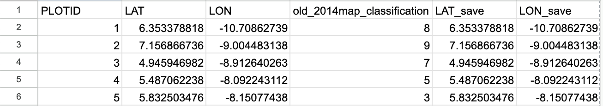
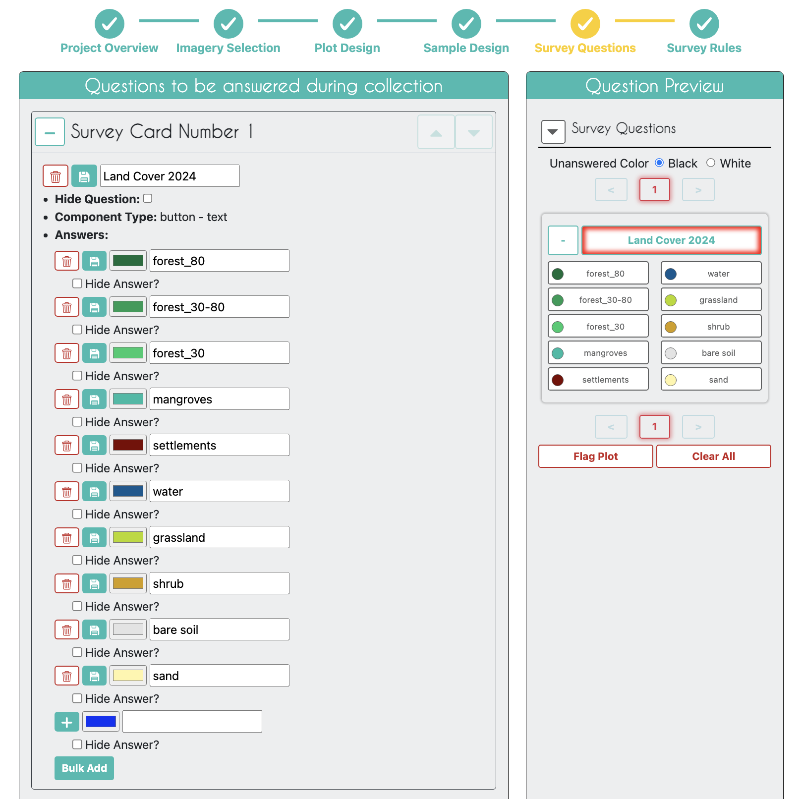
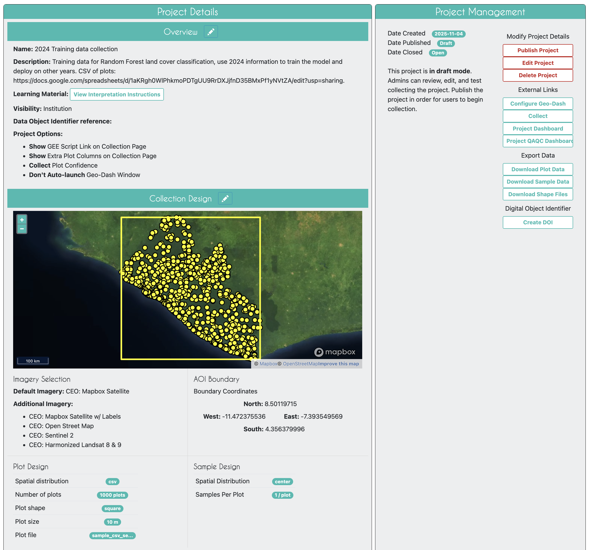

*This page has been added since the original workshop event.*

# Preparing Training Data for Random Forest

We need to train the Random Forest model (coming in the next section) by giving it examples of what each land cover looks like. We need to give the Random Forest model training data. 

We will do this by gathering a sufficient number of training points (preferably 50-100 minimum) from each land cover. We could randomly look for examples across the study area, but we have a pre-exisiting land cover map that should give a decent starting point and make this data collection more efficient. The pre-existing map was for 2014, but it will be handy to distribute samples in classes according to that map. The final resulting training data may not have the same classes as the original map for all points, either because of map errors, or because the land cover has changed between 2014 and our year of interest. The pre-exisiting map is just an efficiency tool for data gathering.

## Decision Making for the Data Collection 

### (Reminder from the Sampling Design Section) Sampling design considerations for ML algorithm training
For training machine learning algorithms, sampling design is critical to ensure that the data used to train the model covers the variability in the dataset, preventing overfitting or underfitting. Sometimes the full data set of samples is split into training and testing subsets to evaluate model performance, but separate sampling design for the validation data can also be done. Anything you want the ML algorithm to learn, should be provided as an example in the training samples.

General rules of thumb to use for sampling design to gather training data for Random Forest:
- A commonly cited rule is to have at least 10 times as many samples as there are features (variables) in the dataset to provide enough data for the model to learn meaningful patterns.
    -   Example: For 20 features, aim for at least 200 samples per class
- Decide on a minimum number of samples per class:
    -   For simple problems, aim for 50–100 samples per class.
    -   For complex problems or high-dimensional datasets, aim for 500–1,000 samples per class or more.
- Classes with fewer samples (minority classes) should have a minimum of 30–50 samples to ensure meaningful learning.
- Highly variabile classs requires larger sample sizes to capture the diversity.

### How Many Samples
Based on the logic above we will allocate 100 samples to each of the 10 classes in the original LC map. We do not need to place samples in the 0 class (no data) or 25 class (clouds), because we do not want the final map to include these classes. Note, there is no class 6. 

The pre-exisitng map is on GEE as an asset: projects/pc556-ncs-liberia-forest-mang/assets/Liberia_landcover_forest_map_10m_v1_2014. 

 |Numeric code         |  Class name     |
 |:-------------:|:-------------:|
 | 0  | nodata |
 | 1  | forest_80 |
 | 2 | forest_30_80 |
 | 3 | forest_30 |
 | 4 | mangroves |
 | 5  | settlements |
 | 7  | water |
 | 8  | grassland |
 | 9  | shrub |
 | 10  | baresoil |
 | 11 | sand |
 | 25 | clouds |

### Distributing the Samples
We will use AREA2 (local version in our repository) to easily generate locations for these samples. The local version of the AREA2 user interface already references the map asset and correct spatial resolution. It also has the addition of allowing specification of a randomization seed. If you use the same seed you can re-generate the same set of 'random' points. If you change the seed you will have a new set of point locations. 

See this [recording](https://drive.google.com/file/d/1oIiLt1I1oAF8WQIHUtkbHYQQQyzYhKD-/view?usp=sharing) from Workshop 3, that shows Crystal walking through the use of AREA2 (you can ignore the sections on proportional sample distribution from this recording, as we are just using 100). 

#### Steps in AREA2

1\. Open the [local version of AREA2[(https://code.earthengine.google.com/59d18ee712ce510ae5f99a1987af0e61) from the repository.

2\.  You will see the 'seed' at the top of the code. It is set to 33 by default, but you can change it to any random integer you like if you ever want a totally different set of points. The seed will be saved in the file name.

3\.  Click `Run`.

4\. Leave the pre-set defaults of the path to the defined stratification map, the 1 (for a single band image), the 0 mask value, and the 10m resolution. Click `Load image`. It may take a few moments for the next screen to load.

5\. On the second screen select "Arbitrary sample size" from the drop down menu of options for howt to "Determine sample size".

6\. Type 100 in all the cells except the last one, where you need to type 0. The cells correspond to the classes in your stratification map from the table above. Class 0 was removed when you used 0 as the masking value on the first screen of AREA2. The last cell is the clouds strata, which we do not need to sample.

7\. Click `Create sample`. Then go to the Tasks tab on the top right of your browser window. Download the CSV file to Drive.

### Creating a CEO Project Using the Samples

#### Clean the CSV File for Use in CEO
Once your download to Drive completes you need to clean up the file a bit so it can be used by CEO. The CSV file produced by AREA2 will look like this:

Clean up the columns so they look like this. You can remove the extraneous columns (system:index, random, .geo). Rename the ID column to "PLOTID", the classification to a clearer "old_2014map_classification", lat to "LAT", and lon to "LON". Finally, I recommend duplicating the LAT and LON columns. CEO does not export the coordinates in the final Sample file output, so it is easiest to preserve them now. The final version will look like this:

Download this cleaned file as a CSV to be used as the Plot Locations CSV in a CEO project.

A prepared version of the CSV file made with the directions above is available [here](https://docs.google.com/spreadsheets/d/1aKRgh0WlPhkmoPDTgUU9RrDXJjfnD35BMxPf1yNVtZA/edit?usp=sharing). The seed used was 33 and 100 points per strata were allocated, for a total of 1,000 points.

#### Create the CEO Project

Build a very simple CEO project to collect training data. The data collected should be for the land cover in 2024.

We are choosing to collect data for 2024 because all data we will be using (sensors on various satellites and Google embeddings) were available at this time. Earlier years will not have all the available data (e.g. Google embeddings are only available from 2017 onwards). 

- Give the project an informative name.
- Make sure the plot confidence is collected during the survey, so it can be used for QA/QC reviews.
- Use the CSV you just made as the spatial distribution file under Plot Design.
- Use "Center" for the Sample Design.
- Your only necessary survey question should ask about the land cover in 2024, with all the land cover types you want.

You can use this text to use the `Bulk Add` feature for adding the answer options.
#006d3a, forest_80
#009c53, forest_30-80
#00cc6c, forest_30
#00bba4, mangroves
#7b0000, settlements
#015890, water
#b6da03, grassland
#d29f00, shrub
#e3e3e3, bare soil
#fff6a9, sand

Your final project will come out looking something like this: [https://app.collect.earth/review-project?projectId=56260](https://app.collect.earth/review-project?projectId=56260) 

### After the Data Collection
It will take a while to collect the data in CEO with the work of several team members. The quality of this data will determine the quality of all your resulting maps, so be sure you are satisfied with the data and have performed sufficient QA/QC. 

Once the data collection is complete download the Sample Data CSV file. Since we saved the lat/long as additional columns in our file cleaning earlier, you can use those columns to ingest these points into GEE. You will need to adjust the column name of your survey question so it has no spaces, e.g., class2024.

On GEE, under the Assets tab, click `New, select `CSV file`. Give the sample file asset an understandable name. Use the preserved LAT_save and LON_save columns as the X column and Y column, respectively. Click `Upload`.

Once ingested, make this file readable to all. We will need it in the next section.

 
