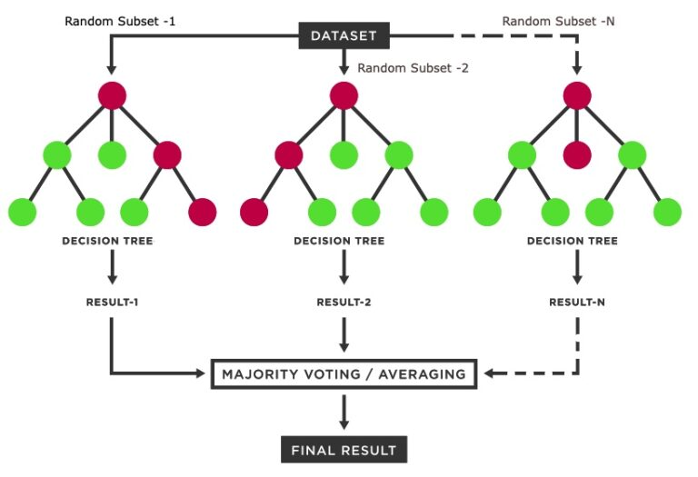
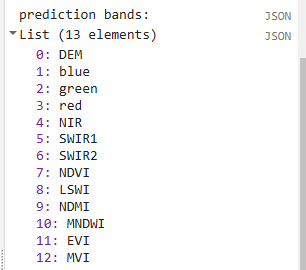
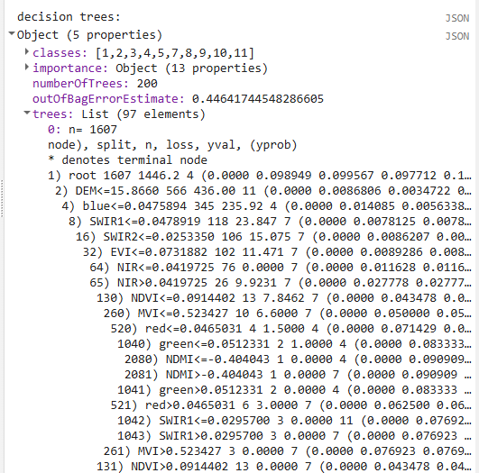
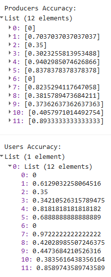

*This page has been edited since the original workshop event.*
*This updated version  no longer includes Planet NICFI imagery, and instead includes Google Embeddings.*

# Classification with Random Forest in GEE

Open up a new script and name it `2 classification`. You will copy and paste each code block into the empty script. You can check your work by looking at the following script `users/ee-scripts/Liberia_Forest_SIG_workshops/09_classification_GEE/2 v3 classification  - USE THIS`.

## Setup

### Set Important Parameters

Insert all of your asset paths. Pay special attention to this section as this is where you interact with the code as the user and need to change a few things.

- Verions number: just for keeping track of your export files as you test things
- Training image: Composite image generated for 2024 in "1 v3 preprocessing - USE THIS" from the repository.
- Deployment image: **This will change every time**, as it is the image for your time period of interest, for which you are making a map. This will be one of the many composite images generated using "1 v3 preprocessing - USE THIS" from the repository.
- CEO data: Put the path to the asset you uploaded in the last section in to define the **refPoints** variable.
- CEOlabel_column: This is the name of the column in your CEO data that holds the user defined LC label for each point, should be 'LandCoverLabel2024'
- CEO label dictionary: This is the dictionary defining the number label associated with each land cover type. This should not need to change unless you change your CEO project answers or want to change which land covers you are mapping.


Copy the script below to get started. Alter the  ##USER INPUT## sections as needed.


```javascript
// **********************************************************
// USER DEFINED VARIABLES
// **********************************************************

// ############### USER INPUT ###############
// version for file naming
var version = 4; 


// Predictor Variable Images //SET THESE ASSET PATHS
// ------------------------------------------------------------------------------------------

// **************************************** **************************************** ****************************************

// ############### USER INPUT ###############
//CHANGE THE TRAINING IMAGE PATH IF NEEDED (using testing image made by Crystal for 2024, which includes embeddings) --- should be the year of the CEO data
var trainImage = ee.Image('projects/pc556-ncs-liberia-forest-mang/assets/predImage_30m_2024_v3_embeddingtest')

Map.addLayer(trainImage, {bands:['red_L8','green_L8','blue_L8'],min:0,max:0.3}, 
  'training image L8', false);

// **************************************** **************************************** ****************************************  

// ############### USER INPUT ###############
// Deployment image (or just define the exact image path for the correct year as is done for the var trainImage)
// CHANGE THE DEPLOYMENT IMAGE TO THE YEAR OF INTEREST (created using 1. v3 preprocessing script)
//var deployImage = ee.Image("projects/pc556-ncs-liberia-forest-mang/assets/predImage_30m_"+d1Deploy.slice(0,4)+'_v'+version)
var deployImage = ee.Image("projects/pc556-ncs-liberia-forest-mang/assets/predImage_30m_2023_v3_embeddingtest")
print('Deploy image year, to be used for year of interest:', deployImage.get('year')); // set in preprocessing

// Confirm deploy image year matches the selected year by definin the variable through the metadata of the deployment image
// Server-side scalar → client string (OK for tiny metadata)
var year_of_interest = ee.String(deployImage.get('year')).getInfo();  // Pull this from the deployment image to avoid issues. 'year' was set in preprocessing


Map.addLayer(deployImage, {bands:['red_L8','green_L8','blue_L8'],min:0,max:0.3}, 
  'deployment image L8', false);

// **************************************** **************************************** **************************************** 

// ############### USER INPUT ###############
// YOU CAN UPLOAD A CEO SAMPLES FILE FOR THIS INSTEAD IF YOU HAVE ONE
var refPoints = ee.FeatureCollection("projects/pc556-ncs-liberia-forest-mang/assets/CEO_test_lc_labels")
  //"projects/pc556-ncs-liberia-forest-mang/assets/stratSample2014_example") //let's switch this to using something recent (e.g. 2024) for the training year
  
// ############### USER INPUT ###############  
var CEOlabel_column = 'LandCoverLabel2024' //SWITCH THIS TO THE COLUMN NAME USED TO INDICATE THE CLASS VALUES, should hopefully remain the same as this and not need changing
                                           //(words for LC type, which we will convert to numbers)


// ############### USER INPUT ###############
// Ensure the CEO answers from you survey exactly match the dictionary below so the words for the LC can be given a number label
var dictionary_CEO_lc = ee.Dictionary({ //for 2024 land cover question
        1: 'forest_80',
        2: 'forest_30-80',
        3: 'forest_30',
        4: 'mangroves',
        5: 'settlements',
        7: 'water',
        8: 'grassland',
        9: 'shrub',
        10: 'bare_soil',
        11: 'sand'
});

```

The following parameters are also needed, but should not need changing. The time period of interest (defined using your deployment image), final map resolution, and smoothing.

The version number and dates should match the ones in the preprocessing script. 

```javascript
// //////////////////////////////////////////////////////////////////////////////////////////
// //////////////////////////////////////////////////////////////////////////////////////////
// Define Stable Parameters
// //////////////////////////////////////////////////////////////////////////////////////////
// //////////////////////////////////////////////////////////////////////////////////////////

// dates of training image and points
// (THIS SHOULD REMAIN 2024 TO ALIGN WITH THE CEO DATA)
var d1Train = '2024-1-1'
var d2Train = '2024-12-31'

// dates of deploying image
var d1Deploy = year_of_interest+'-1-1'
var d2Deploy = year_of_interest+'-12-31'

// basemap
Map.setOptions('SATELLITE')


// final map resolution
var resolution = 30;
// smoothing radius for final map (pixels)
var modeRadius = 2;
```

### Prepare the CEO data
Your CEO survey exports words for each answer, the land cover type selected by the user (e.g., water), but we need to convert these to numberic labels. The next part of the code will reference the dictionary you created in the parameters section to add a column to the refpoints, so each written landcover label will have the correct corresponding numeric label.

```javascript
// //////////////////////////////////////////////////////////////////////////////////////////
// //////////////////////////////////////////////////////////////////////////////////////////
// Set up the CEO data
// //////////////////////////////////////////////////////////////////////////////////////////
// //////////////////////////////////////////////////////////////////////////////////////////

var classBand = 'classvalues2024'; //New column of LC number values for each class labeled in 2024. 
                                  //This will be created based on the CEOlabel_column and the dictionary_CEO_lc dictionary above

// --- Invert it to label->number ---
// Invert to label->code (keys come out as strings)
var labelToCode = ee.Dictionary.fromLists(dictionary_CEO_lc.values(),
                                         dictionary_CEO_lc.keys());


// --- Add numeric class column using the defined column name ---
var withCodes = refPoints.map(function(f) {
  var label = ee.String(f.get(CEOlabel_column)).trim();
  var code = ee.Algorithms.If(
    labelToCode.contains(label),
    ee.Number.parse(labelToCode.get(label)),// keys are strings; parse to numb
    ee.Number(-9999) // or null
  );
  return f.set(classBand, code);
});


// --- Quick preview ---
print('Preview CEO data with numeric classes:', withCodes.limit(10));

refPoints = withCodes // switch back to the original variable name with the numberic labels added

```


### Import Data

We have already preprocessed and exported all data sets we need to run the classification, so now we just import them into this script and add them all to the map. This includes the AOI, the reference points, the predictor image (also being used as the training image), and the original 2014 LULC maps.

```javascript
// //////////////////////////////////////////////////////////////////////////////////////////
// //////////////////////////////////////////////////////////////////////////////////////////
// Import and Visualize Data
// //////////////////////////////////////////////////////////////////////////////////////////
// //////////////////////////////////////////////////////////////////////////////////////////

// AOI
// ------------------------------------------------------------------------------------------

// import the simple Liberia feature collection
var Liberia = ee.FeatureCollection("projects/pc556-ncs-liberia-forest-mang/assets/Liberia_simple")
  
// define an aoi geometry from the feature collection
var aoi = Liberia
  .union();
  
// Add the aoi object as a layer to the map
Map.addLayer(aoi, {}, 'AOI', false);

// Reference Points (must be known point locations with a label for the LC class)
// ------------------------------------------------------------------------------------------
// Use the uploaded CEO points...
  
print('reference points:', refPoints)
// print(refPoints.geometry());
// print(ee.Algorithms.ObjectType(refPoints.first().get('lon')))
print('property names:', refPoints.first().propertyNames());  
Map.addLayer(refPoints, {}, 'reference points', false);


// LULC
// ------------------------------------------------------------------------------------------

var lulc10m = ee.Image(
  'projects/pc556-ncs-liberia-forest-mang/assets/Liberia_landcover_forest_map_10m_v1_2014')
var lulc30m = ee.Image(
  'projects/pc556-ncs-liberia-forest-mang/assets/Liberia_landcover_forest_map_30m_2014')

// do some preprocessing to remove classes we don't want
lulc10m = lulc10m
  // redefine clouds as 0
  .where(lulc10m.eq(25), 0) 
  // get rid of 0 values (nodata an dclouds)
  .selfMask()
  // rename class band
  .rename('class')
lulc30m = lulc30m
  // redefine clouds as 0
  .where(lulc30m.eq(25), 0) 
  // get rid of 0 values (nodata an dclouds)
  .selfMask()
  // rename class band
  .rename('class')

// define visualization paramaters
var lulcVis = {
  min: 1,
  max: 11,
  palette: [
                        // 0 nodata
            '#006d3a',  // 1 forest_80
            '#009c53',  // 2 forest_30-80
            '#00cc6c',  // 3 forest_30
            '#00bba4',  // 4 mangroves
            '#7b0000',  // 5 settlements
            'white',    // placeholder for 6
            '#015890',  // 7 water
            '#b6da03',  // 8 grassland
            '#d29f00',  // 9 shrub
            '#e3e3e3',  // 10 baresoil
            '#fff6a9'   // 11 sand
                        // 25 clouds
            ],         
                        
};
// Add to the map
Map.addLayer(lulc10m, lulcVis, 'LULC 2014 10m', false);
Map.addLayer(lulc30m, lulcVis, 'LULC 2014 30m', false);

// select which lulc to use for generating reference data
var lulc = lulc10m;

```


## Prepare Training and Testing Points

Next, we extract all the values from the **Training Image** (remember this is the same as the file we saved as our Predictor Image, both 2014) to the reference points, and then separate the points into a training and testing set in a 80%-20% split (which yields approximately 320 training points and 80 testing points per LULC class). 

This meets the minimum requirements of the 10*p training and √(p):1 testing rules of thumb. That is assuming we are using our most complicated image with lots of variable bands (which would dictate at least 220 training and 48 testing points per class). For 2014 we only have Landsat, so we could technically have fewer points, but we will keep it at 400 since this would work for all of our images and more points only help.

We split the data by generating a new property in the reference data points which consists of random numbers with values between 0 and 1 (in binary numbers). Then, we separate out the points with a value greater than 0.8 and less than 0.8 in the random column - which statistically should give us about an 80%-20% split.

```javascript
// //////////////////////////////////////////////////////////////////////////////////////////
// //////////////////////////////////////////////////////////////////////////////////////////
// Prepare Training and Testing Data
// //////////////////////////////////////////////////////////////////////////////////////////
// //////////////////////////////////////////////////////////////////////////////////////////

// extract the predictor image band values reference points
refPoints = trainImage.sampleRegions({
      collection: refPoints, 
      properties: [classBand], 
      scale: resolution,
      geometries:true
    })

// Add to the map
Map.addLayer(refPoints, {}, 'reference points', false);
// print
print('reference points:', refPoints.limit(5))

// Divide reference points into training and testing points
// Create random column in reference points
refPoints = refPoints.randomColumn();

// set aside 80% of data for training 
var trainPoints = refPoints.filter(ee.Filter.lt('random', 0.8));
// set aside 20% of the data for testing
var testPoints = refPoints.filter(ee.Filter.gte('random', 0.8));

// print size of testing and training data sets
print('Number of training points:', trainPoints.size());
print('Number of testing points:', testPoints.size());
//print('testPoints', testPoints)

// add to map
Map.addLayer(trainPoints, {color: 'black'}, 'training points', false); 
Map.addLayer(testPoints, {color: 'white'}, 'testing points', false); 

// **************************************** **************************************** ****************************************
// alternatively, import the if training and testing points were created separatelyu (in SEPAL or AREA2), 
// or they will be split using a larger reference points
// (comment out the rest of this section above)
// var trainPoints = ee.FeatureCollection()
// var testPoints = ee.FeatureCollection()
// // print size of testing and training data sets
// print('Number of training points:', trainPoints.size());
// print('Number of testing points:', testPoints.size());
// **************************************** **************************************** ****************************************

```


*Tip:* For most models (with between 10 and 50 predictor bands), the data splitting ratio will fall somewhere between a 75%-25% split and a 90%-10% split. You should always strive to generate as much reference data as you can within your human and computational resource limits.

Your training and testing sample points are now ready! They have both class labels and extracted band information from the Training Image. They will serve as examples for Random Forest of what spectral information of those classes look like. 

## Train the Classifier

Now, we run the classification in two separate steps - training and deployment:
1. **train** the classifier on the training points
2. **deploy** the classifier on either the predictor image or the testing points.

As discussed before, the random forest model repeatedly selects a random subset of training points and generates a series of thresholds (called decision trees) in the predictor variables that would most effectively categorize the training points into the classes of interest. When all of these decision trees are constructed, the model can be applied to a predictor image. It applies all the decision trees to every single pixel in the image, and aggregates the result of all the trees to make a final class assignment to each pixel (usually either mean or mode).



*Resource:* For some background on Random Forest, you can go to the <a href="https://sig-gis.github.io/Liberia_NSC_ForestMonitoringTraining/02_Intro_MachineLearning" target="_blank" rel="noopener noreferrer">Machine Learning page</a> on this website, and another brief intro can be found at <a href="https://www.ibm.com/think/topics/random-forest" target="_blank" rel="noopener noreferrer">this website</a>.

First, we select the predictor variables we want the classifier to use. This is where we can remove bands as we refine the model. We remove any `constant` bands which are leftover artifacts from our exported image. Then, we train the `ee.Classifier.smileRandomForest()` classifier with 200 trees, the prepped training points, the selected LULC class band, and the selected prediction bands. 

```javascript
// //////////////////////////////////////////////////////////////////////////////////////////
// //////////////////////////////////////////////////////////////////////////////////////////
// Train Classifier
// //////////////////////////////////////////////////////////////////////////////////////////
// //////////////////////////////////////////////////////////////////////////////////////////


//Google embedding band list, set as variable
var geBands = ee.List([
  'A00','A01','A02','A03','A04','A05','A06','A07','A08','A09','A10','A11','A12','A13','A14','A15',
  'A16','A17','A18','A19','A20','A21','A22','A23','A24','A25','A26','A27','A28','A29','A30','A31',
  'A32','A33','A34','A35','A36','A37','A38','A39','A40','A41','A42','A43','A44','A45','A46','A47',
  'A48','A49','A50','A51','A52','A53','A54','A55','A56','A57','A58','A59','A60','A61','A62','A63'
]);

// Define prediction bands
var predBands =  deployImage
  // Get all image bands from the predictor image
  .bandNames()
  // if the date range is 2013-2015, use only Landsat 8 optical bands and indices (remove HLS)
  .removeAll(ee.List(
    ee.Algorithms.If(
      ee.Date(d2Deploy).millis()
        .lt(ee.Date('2016-01-01').millis())
        .and(ee.Date(d1Deploy).millis()
          .gte(ee.Date('2013-01-01').millis())),
      ee.List(['blue_HLS','green_HLS','red_HLS','NIR_HLS','SWIR1_HLS','SWIR2_HLS',
               'NDVI_HLS','LSWI_HLS','NDMI_HLS','MNDWI_HLS','EVI_HLS','MVI_HLS']),
      // if the date range is 2016-present, use only HLS optical bands and indices (remove L8)
      ee.Algorithms.If(
        ee.Date(d1Deploy).millis()
          .gte(ee.Date('2016-01-01').millis()),
        ee.List(['blue_L8','green_L8','red_L8','NIR_L8','SWIR1_L8','SWIR2_L8',
                 'NDVI_L8','LSWI_L8','NDMI_L8','MNDWI_L8','EVI_L8','MVI_L8']),
        ee.List([]) // fallback
      )
    )
  ));

    
// Additional, explicit removal of embeddings for <2017
predBands = ee.List(
  ee.Algorithms.If(
    ee.Date(d1Deploy).millis().lt(ee.Date('2017-01-01').millis()),
    predBands.removeAll(geBands),
    predBands
  )
);    
    

// print prediction bands
print('prediction bands:', predBands)


//double check all bands are the same in both images
var trainBands  = trainImage.bandNames();
var deployBands = deployImage.bandNames();

// Keep only bands present in BOTH train and deploy images
predBands = ee.List(predBands)
  .map(function(b) {
    b = ee.String(b);
    var inTrain  = ee.Number(trainBands.indexOf(b)).gte(0);
    var inDeploy = ee.Number(deployBands.indexOf(b)).gte(0);
    return ee.Algorithms.If(inTrain.and(inDeploy), b, null);
  })
  .removeAll([null]);
  
  
print('Confirm bands are the same in both images.')
print('Bands in both, should be same as above: ',predBands)

// Train random forest classifier with the training points and prediction bands
var RFclassifier = ee.Classifier.smileRandomForest({numberOfTrees:200, seed:234})
  .train({
    features: trainPoints, 
    classProperty: classBand,
    inputProperties: predBands //this ensures the bands for two images match
});

// Print decision trees
print('decision trees:', RFclassifier.explain());

```

We also print out the prediction bands and the decision trees of the random forest model so we can explore what kinds of cutoffs the random forest decision trees have created in the different predictor variables.





## Deploy the Classifier

Second, we actually deploy the classifier on the full predictor image to get a classification map. We also apply a focal mode function to reduce speckling and reproject to our desired resolution (the final resolution should be no lower than the lowest resolution predictor variable dataset). 

```javascript
// //////////////////////////////////////////////////////////////////////////////////////////
// //////////////////////////////////////////////////////////////////////////////////////////
// Run Classifier
// //////////////////////////////////////////////////////////////////////////////////////////
// //////////////////////////////////////////////////////////////////////////////////////////

// Classify the predictor image with the trained classifier
var RFclassification = deployImage
  .select(predBands) //this ensures the bands for two images match
  .classify(RFclassifier)
  // smooth to make it less speckly
  .focalMode(modeRadius, 'circle', 'pixels')
  .reproject({
    crs: deployImage.projection(),
    scale: resolution})
  .clip(aoi)

// Add the classified image to the map
Map.addLayer(RFclassification, lulcVis, 
            'RF classification');
```


*Tip:* When you add the final classification to the map, it might give you an error for trying to load in the entire AOI at once. We are asking the script to do many computationally expensive calculations (random forest, focal mode, etc.) and then render the products of those calculations directly onto the map in high resolution. The solution to this is exporting the final image and then reimporting it to put it onto the map, which is much less computationally expensive. Zooming in to a smaller area can also help. If you just want to look at the map, you can even comment out the unneeded parts of the script to make the image load even faster.

## Assess Accuracy

Now, we take a look at the accuracies of each individual class. We first classify the testing points and then extract the error matrix, for which we just provide the property names of the "true" and "predicted" values (which are the original extracted LULC values and the LULC values predicted by the model). We print the error matrix and the lists of user's and producer's accuracies, but we do **not** print the overall accuracy. This simple way to calculate accuracy, where we divide the number of correctly classified points by the total number of points, is **not appropriate** here because our original sample was a **stratified** random sample. We need to do a **weighted** accuracy assessment, where we weight the class accuracies based on their predicted areas, and then aggregate them. We will do this separately in a spreadsheet.

*Resource:* For some background on accuracy assessment and user's and producer's accuracy, you can go to the <a href="https://sig-gis.github.io/Liberia_NSC_ForestMonitoringTraining/10_accuracy" target="_blank" rel="noopener noreferrer">Accuracy Assessment page</a> on this website.

```javascript
// //////////////////////////////////////////////////////////////////////////////////////////
// //////////////////////////////////////////////////////////////////////////////////////////
// Assess Accuracy
// //////////////////////////////////////////////////////////////////////////////////////////
// //////////////////////////////////////////////////////////////////////////////////////////

// classify the testing data using the trained classifier
var testPointsClassified = testPoints.classify(RFclassifier);

// Create confusion matrix using the true and predicted values in the tetsing data
var confusionMatrix = testPointsClassified.errorMatrix({
  // the "true" values from the reference data
  actual: classBand, 
  // the "predicted" values from the RF classification
  predicted: 'classification'
});

// Print confusion matrix and accuracies
// This is overall accuracy is a simplified version - is NOT appropriate for stratified random sampling
// print('Overall Accuracy:', confusionMatrix.accuracy());
print('Confusion Matrix:', confusionMatrix);
print('Producers Accuracy:', confusionMatrix.producersAccuracy());
print('Users Accuracy:', confusionMatrix.consumersAccuracy());
```



For helpful reference, these are the labels associated wih your class numbers.

 |Numeric code         |  Class name     |
 |:-------------:|:-------------:|
 | 0  | nodata |
 | 1  | forest_80 |
 | 2 | forest_30_80 |
 | 3 | forest_30 |
 | 4 | mangroves |
 | 5  | settlements |
 | 7  | water |
 | 8  | grassland |
 | 9  | shrub |
 | 10  | baresoil |
 | 11 | sand |


## Assess Variable Importance

Lastly, we'll take a look at variable importance. The `ee.Classifier.smileRandomForest()` function automatically calculates variable importance based on the Gini Impurity Index, which measures how much each predictor variable reduces impurity in classes at each split (node) in the decision trees. We scale these so all variable importances add up to 100, and then we both print them out and create a bar chart.

```javascript
// //////////////////////////////////////////////////////////////////////////////////////////
// //////////////////////////////////////////////////////////////////////////////////////////
// Assess Variable Importance
// //////////////////////////////////////////////////////////////////////////////////////////
// //////////////////////////////////////////////////////////////////////////////////////////

// extract the importance of each predictor variable from the random forest model
var varImportance = ee.Dictionary(RFclassifier.explain().get('importance'));

// convert raw importance values to percentages (so they all add up to 100)
// sum up all importances
var varImportanceSum = varImportance.values().reduce(ee.Reducer.sum());
// multiply each importance value by 100 and divide by the sum to relativize them
var varRelImportance = varImportance.map(function(key, val) {
  return (ee.Number(val).multiply(100)).divide(varImportanceSum);
  });

// sort importances to go from lowest to highest
var sortedProperties = varRelImportance.keys().sort(varRelImportance.values())
var sortedImportances = ee.List([sortedProperties, varRelImportance.values().sort()])
// print
print('relative importance of variables:',sortedImportances);

// create a feature collection from the relative importances
var varRelImportanceFC = ee.FeatureCollection([
  ee.Feature(null, varRelImportance)
]);

// create a chart of the relative importances
var varRelImportanceChart = ui.Chart.feature.byProperty({
  features: varRelImportanceFC
}).setOptions({
      title: 'Variable Relative Importance',
      vAxis: {title: 'Importance'},
      hAxis: {title: 'Bands'}
  });
// print
print(varRelImportanceChart);
```


Now, we could refine the model by removing variables one by one, starting with the ones with lowest importance and seeing how many you can remove before it dramatically reduces accuracy. You can do this earlier in the script with the `.removeAll()` function, recording the variable importances and resulting accuracies at each removal. Usually, you will see a sharp decrease in accuracy after removing certain variables, indicating which variables should be kept in the model.

*Try it out. Remove a variable band or two and re-run the script. How did the accuracies change?*

## Calculate Areas

Additionally, we need to calculate class areas based on the map (*these are pixel counts not our final unbiased area estimates!*) to use later in our weighted accuracy assessment. We use the `ee.Reducer.count()` function to count the number of pixels in each class and then store these values in a `List` of `Dictionaries`. Each `Dictionary` has 2 keys: the class and the pixel count. We convert these to a `featureCollection` with 12 empty features in it (one for each class), attaching the correct class and pixel count as properties to each feature. Thus, we end up with a data type that can be exported as a .csv containing a row for each class and a column containing the pixel counts of those classes (unfortunately, converting to a `featureCollection` is the only way to export a table from GEE).

```javascript
// //////////////////////////////////////////////////////////////////////////////////////////
// //////////////////////////////////////////////////////////////////////////////////////////
// Calculate Areas
// //////////////////////////////////////////////////////////////////////////////////////////
// //////////////////////////////////////////////////////////////////////////////////////////

// Create an extra image with a value of 1 in every pixel covering the AOI
// (this is just an something needed for the ee.Reducer.group() function because it needs an image with 2 bands)
var constantImage = ee.Image(1).clip(aoi);

// Calculate the number of pixels in each class
var pixelCounts_dict = constantImage.addBands(RFclassification).reduceRegion({
  // Use ee.Reducer.count().group() function
  reducer: ee.Reducer.count().group({
    // Use band "classification" for grouping 
    // (which is now band 1 not 0 since we attached the extra image)
    groupField: 1, 
    groupName: 'classification',
  }),
  geometry: aoi, // region of interest
  scale: 30, // Resolution of the image in meters
  maxPixels: 1e50 // Maximum number of pixels in the region
});

// // Print the resulting dictionary of a list of dictionaries
// print("Pixel Counts as Dictionary:", pixelCounts_dict);

// Convert the this dictionary to just a list of dictionaries
// (we extract the list of dictionaries)
var pixelCounts_list = ee.List(pixelCounts_dict.get('groups'));

// // Print the resulting list of dictionaries
// print("Pixel Counts as List of Dictionaries:", pixelCounts_list);

// Create a FeatureCollection from the list of dictionaries
var pixelCounts_fc = ee.FeatureCollection(
  // apply this function to all the dictionaries in the list
  pixelCounts_list.map(function(dict) {
    var dict2 = ee.Dictionary(dict);
    // extract the className from the dictionary
    var className = ee.Number(dict2.get('classification'));
    // extract the count from the dictionary
    var count = ee.Number(dict2.get('count'));
    // put these into an empty feature class as new properties
    // (this allows us to export the info as separate columns in a CSV)
    return ee.Feature(null, {
      'classification': className,
      'count': count
    });
  })
);

// Print the resulting FeatureCollection
print("Pixel Counts as FeatureCollection", pixelCounts_fc);
```


## Export

The last thing we do is export the classified testing points to our asset library for proper accuracy assessment and the classification map for easy visualization. We also export the testing points and class areas to our Google Drive for use in the accuracy assessment.

```javascript
// //////////////////////////////////////////////////////////////////////////////////////////
// //////////////////////////////////////////////////////////////////////////////////////////
// Export
// //////////////////////////////////////////////////////////////////////////////////////////
// //////////////////////////////////////////////////////////////////////////////////////////

// Export the classification map to Asset Library
Export.image.toAsset({
  // the image you want to export
  image: RFclassification,
  // the name of the task
  description: 'RFclassification',
  // the path and name of the asset (change this to be in your own asset library)
  assetId: 'projects/pc556-ncs-liberia-forest-mang/assets/RFclassification_'+resolution+'m_'+d1.slice(0,4)+'_v'+version,
  // the geometry to clip the image to
  region: aoi,
  // the resolution of the image
  scale: resolution,
  maxPixels: 1e13
})
            
// Export the reference points Asset Library
Export.table.toAsset({
  // the feature collection you want to export
  collection: testPointsClassified,
  // the task name
  description: 'testPointsClassified',
  // the asset ID and path (change to your own asset library)
  assetId: 'projects/pc556-ncs-liberia-forest-mang/assets/testPointsClassified_'+resolution+'m_'+d1.slice(0,4)+'_v'+version,
});

// Export the class areas as a CSV to Google Drive
Export.table.toDrive({
  // the feature collection
  collection: pixelCounts_fc,
  // the task name
  description: 'classAreas',
  // folder and file name in Drive
  fileNamePrefix: 'classAreas_'+resolution+'m_'+d1.slice(0,4)+'_v'+version,
  fileFormat: 'CSV'
});

// Export reference points to Google Drive
Export.table.toDrive({
  collection: testPointsClassified,
  // the task name
  description: 'todrive_testPointsClassified',
  // folder and file name in Drive
  fileNamePrefix: 'testPointsClassified_'+resolution+'m_'+d1.slice(0,4)+'_v'+version,
  // columns to export
  selectors: 'system:index,classification,class'
});
```

## Iterative Model Refinement

Now that we have a functioning model, we can refine it to improve it. A good way to think about this process is "how can I make the model as simple as possible while still maintaining its predictive power." This concept is called "parsimony," and many scientific fields pursue parsimony when developing models.

You can refine the model by iteratively removing predictor variables, as mentioned above, but there are also many other refinements you could make to the input data or model parameters. These are listed in the <a href="https://sig-gis.github.io/Liberia_NSC_ForestMonitoringTraining/09_class_GEE/04_discussion.html" target="_blank" rel="noopener noreferrer">Discussion Tab</a>.

Code checkpoint: check your work in `users/ee-scripts/Liberia_Forest_SIG_workshops/09_classification_GEE/2 classification`.
