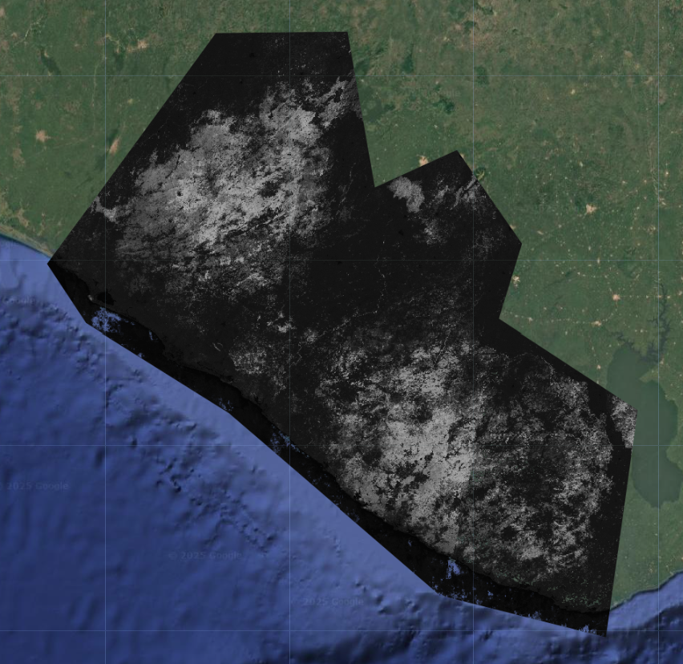
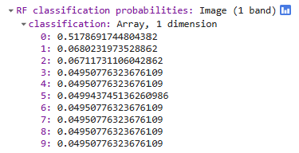
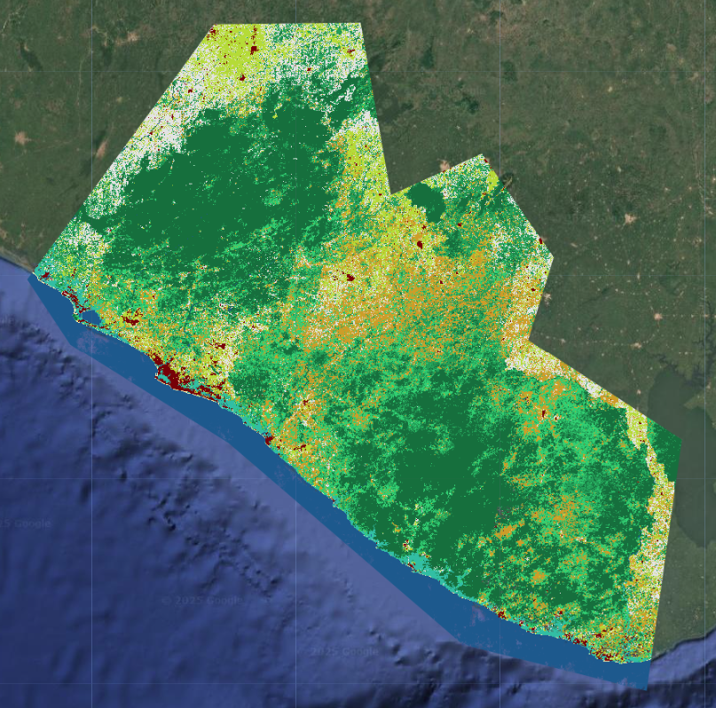
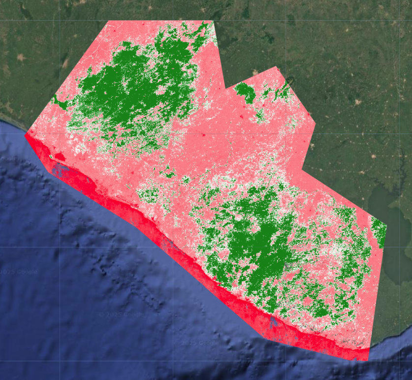
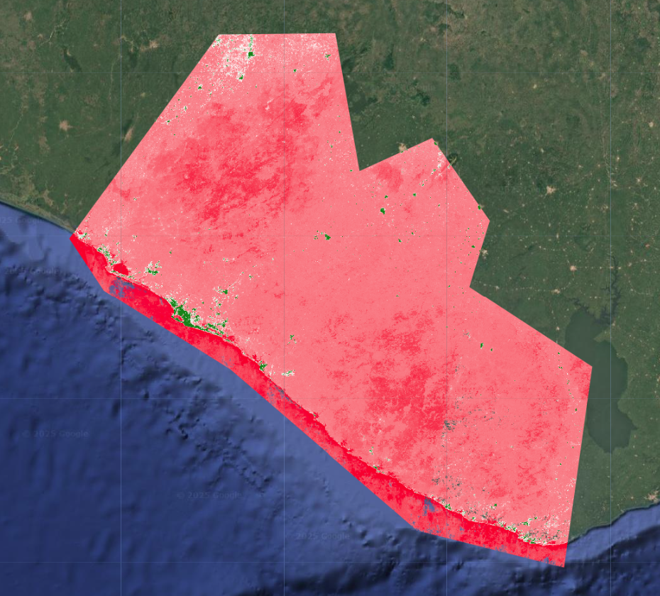
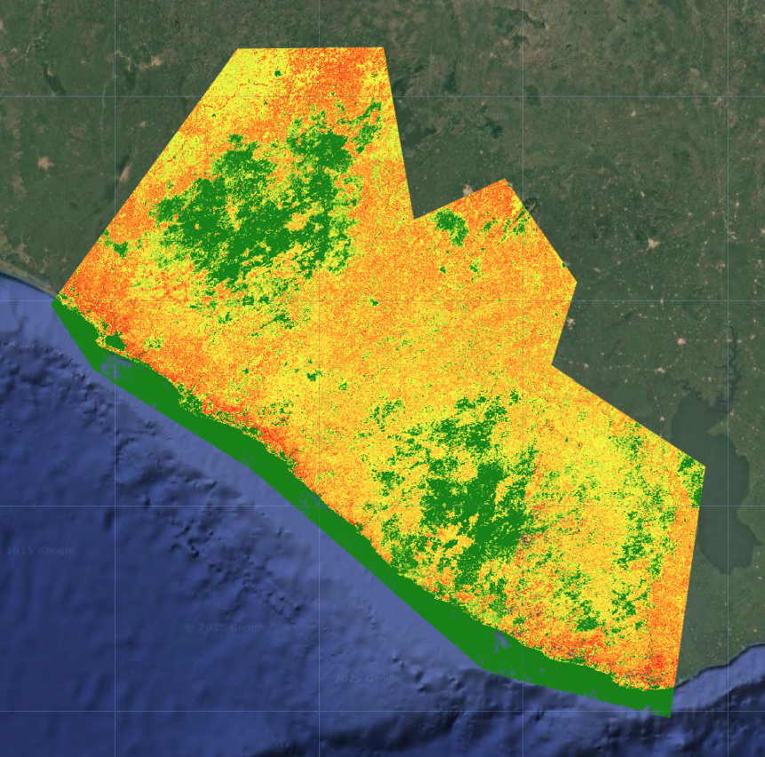

# Multiprobability Classification

Open up a new script and name it `3 multiprobability_classification`. You will copy and paste each code block into the empty script. You can check your work by looking at the following script `users/ee-scripts/Liberia_Forest_SIG_workshops/09_classification_GEE/3 multiprobability_classification`.

## Background

One of the big advantages of using Google Earth Engine for building a random forest model is the customizability. You can easily change the model parameters and input data to compare how they impact model results. You can also extract different types of outputs from the model, which you can then manipulate manually to create a final classification map.

Here, we will demonstrate how to use the "multiprobability" output mode for random forest and what you could potentially do with it. In the our original classification script, we use the default "classification" output mode, in which the random forest model automatically assigns a class to each pixel based on the majority vote from all the decision trees at that pixel. However, if we select "multiprobability" mode, the random forest model gives us an `array` of class probabilities at each pixel based on how many decision trees voted for each class at that pixel. This gives us the opportunity to:
1. view the probabilities of each class as individual layers
2. create our own classification rules
3. calculate uncertainty
4. iteratively refine our model

## Setup

Let's take a look at how this works. In the script, paste the following code. Up until the `Train Classifier` section, the code will look identical to the previous classification script.

```javascript
// //////////////////////////////////////////////////////////////////////////////////////////
// //////////////////////////////////////////////////////////////////////////////////////////
// Define Parameters
// //////////////////////////////////////////////////////////////////////////////////////////
// //////////////////////////////////////////////////////////////////////////////////////////

// version
var version = 1;

// dates of interest
var d1 = '2014-1-1'
var d2 = '2014-12-31'

// basemap
Map.setOptions('SATELLITE')

// class band name
var classBand = 'class' //'simplifiedClass' //'class'

// final map resolution
var resolution = 30;
// smoothing radius for final map (pixels)
var modeRadius = 2;

// //////////////////////////////////////////////////////////////////////////////////////////
// //////////////////////////////////////////////////////////////////////////////////////////
// Import and Visualize Data
// //////////////////////////////////////////////////////////////////////////////////////////
// //////////////////////////////////////////////////////////////////////////////////////////

// AOI
// ------------------------------------------------------------------------------------------

// import the simple Liberia feature collection
var Liberia = ee.FeatureCollection("projects/pc556-ncs-liberia-forest-mang/assets/Liberia_simple")
  
// define an aoi geometry from the feature collection
var aoi = Liberia
  .union();
  
// Add the aoi object as a layer to the map
Map.addLayer(aoi, {}, 'AOI', false);

// Reference Points
// ------------------------------------------------------------------------------------------

var refPoints = ee.FeatureCollection(
  "projects/pc556-ncs-liberia-forest-mang/assets/refPoints_10m_2014_400PerClass")
  
// Predictor Variable Image
// ------------------------------------------------------------------------------------------

var predImage = ee.Image(
  "projects/pc556-ncs-liberia-forest-mang/assets/predImage_30m_"+d1.slice(0,4)+'_v'+version)

// add to map
Map.addLayer(predImage, {bands:['red','green','blue'],min:0,max:0.3}, 
  'optical', false);
Map.addLayer(predImage, {bands:['red_planet','green_planet','blue_planet'],min:64,max:5454,gamma:1.8}, 
  'optical planet', false);
  
// LULC
// ------------------------------------------------------------------------------------------

var lulc10m = ee.Image(
  'projects/pc556-ncs-liberia-forest-mang/assets/Liberia_landcover_forest_map_10m_v1_2014')
var lulc30m = ee.Image(
  'projects/pc556-ncs-liberia-forest-mang/assets/Liberia_landcover_forest_map_30m_2014')

// do some preprocessing to remove classes we don't want
lulc10m = lulc10m
  // redefine clouds as 0
  .where(lulc10m.eq(25), 0) 
  // get rid of 0 values (nodata an dclouds)
  .selfMask()
  // rename class band
  .rename('class')
lulc30m = lulc30m
  // redefine clouds as 0
  .where(lulc30m.eq(25), 0) 
  // get rid of 0 values (nodata an dclouds)
  .selfMask()
  // rename class band
  .rename('class')

// define visualization paramaters
var lulcVis = {
  min: 1,
  max: 11,
  palette: [
                        // 0 nodata
            '#006d3a',  // 1 forest_80
            '#009c53',  // 2 forest_30-80
            '#00cc6c',  // 3 forest_30
            '#00bba4',  // 4 mangroves
            '#7b0000',  // 5 settlements
            'white',    // placeholder for 6
            '#015890',  // 7 water
            '#b6da03',  // 8 grassland
            '#d29f00',  // 9 shrub
            '#e3e3e3',  // 10 baresoil
            '#fff6a9'   // 11 sand
                        // 25 clouds
            ],         
                        
};
// Add to the map
Map.addLayer(lulc10m, lulcVis, 'LULC 2014 10m', false);
Map.addLayer(lulc30m, lulcVis, 'LULC 2014 30m', false);

// select which lulc to use for generating reference data
var lulc = lulc10m;

// //////////////////////////////////////////////////////////////////////////////////////////
// //////////////////////////////////////////////////////////////////////////////////////////
// Prepare Training and Testing Data
// //////////////////////////////////////////////////////////////////////////////////////////
// //////////////////////////////////////////////////////////////////////////////////////////

// extract the predictor image band values reference points
refPoints = predImage.sampleRegions({
      collection: refPoints, 
      properties: [classBand], 
      scale: resolution,
      geometries:true
    })

// Add to the map
Map.addLayer(refPoints, {}, 'reference points', false);
// print
print('reference points:', refPoints.limit(5))

// Divide reference points into training and testing points
// Create random column in reference points
refPoints = refPoints.randomColumn();

// set aside 80% of data for training 
var trainPoints = refPoints.filter(ee.Filter.lt('random', 0.8));
// set aside 20% of the data for testing
var testPoints = refPoints.filter(ee.Filter.gte('random', 0.8));

// print size of testing and training data sets
print('Number of training points:', trainPoints.size());
print('Number of testing points:', testPoints.size());

// add to map
Map.addLayer(trainPoints, {color: 'black'}, 'training points', false); 
Map.addLayer(testPoints, {color: 'white'}, 'testing points', false); 

// alternatively,  import the training and testing points created in SEPAL or AREA2 
// (comment out the rest of this section above)
// var trainPoints = ee.FeatureCollection()
// var testPoints = ee.FeatureCollection()
```

## Train and Deploy the Classifier

Now, we train and deploy the classifier. This also looks almost the same as the previous script, except we use `.setOutputMode()` to set the output mode to `MULTIPROBABILITY`. For simplicity, we also remove the parts where we smooth and reproject the output.

```javascript
// //////////////////////////////////////////////////////////////////////////////////////////
// //////////////////////////////////////////////////////////////////////////////////////////
// Train Classifier
// //////////////////////////////////////////////////////////////////////////////////////////
// //////////////////////////////////////////////////////////////////////////////////////////

// Define prediction bands
// Get all image bands from the predictor image and remove any you want to leave out
var predBands =  predImage.bandNames()
  .removeAll(['constant','constant_1','constant_2'])

// print prediction bands
print('prediction bands:', predBands)

// Train random forest classifier with the training points and prediction bands
var RFclassifier = ee.Classifier.smileRandomForest({numberOfTrees:200, seed:234})
  // set the output mode to multiprobability
  .setOutputMode('MULTIPROBABILITY')
  // train the classifier
  .train({
    features: trainPoints, 
    classProperty: classBand,
    inputProperties: predBands
  })
  ;

// // Print decision trees
// print('decision trees:', RFclassifier.explain());

// //////////////////////////////////////////////////////////////////////////////////////////
// //////////////////////////////////////////////////////////////////////////////////////////
// Run Classifier
// //////////////////////////////////////////////////////////////////////////////////////////
// //////////////////////////////////////////////////////////////////////////////////////////

// Classify the predictor image with the trained classifier
var RFclassification = predImage
  .select(predBands)
  .classify(RFclassifier)
  .clip(aoi)

// // print
// print(RFclassification)
// add to map
Map.addLayer(RFclassification, 
  {}, 
  'RF classification probabilities',
  false);
```

When we add the result to the map, we see that the output looks quite different from before. 



When we click on the map in **Inspector** mode, we see that this is an image with a single band called `classification`, and the band consists of an `array` with 10 items in it. These are the probabilities of the 10 LULC classes at that pixel, except they have been assigned ordered index values that replace their original class labels.



What we are seeing on the map is actually the first item in each pixel's `array`, so the probabilities of the class that we had initially labelled class 1 (forest with greater than 80% canopy cover).

## Postprocess Multiprobability Output

Now that we know what kind of data we are dealing with, which is an `image array`, we can do some postprocessing to explore the outputs further and create a final LULC and certainty map.

### Extract Highest Probability Class

First, we create a very simple classification rule from the multiprobability output: the highest probability class at each pixel. This will yield a map that is very similar or the same as the original classification we did, since this is effectiviely what the efault `CLASSIFICATION` output mode is doing.

In this section of code, we create extract the highest probability class at each pixel. Because we are now working with an `image array` structure, we have to do a few extra steps to properly extract and rename the band.

```javascript
// //////////////////////////////////////////////////////////////////////////////////////////
// //////////////////////////////////////////////////////////////////////////////////////////
// Postprocess Multiprobability Output
// //////////////////////////////////////////////////////////////////////////////////////////
// //////////////////////////////////////////////////////////////////////////////////////////

// make a list of the array indices present in the classification result
var originalNum = [0,1,2,3,4,5,6,7,8, 9]
// make a list of the actual class label
var remapNum =    [1,2,3,4,5,7,8,9,10,11]

// Extract highest probability class
// ------------------------------------------------------------------------------------------

// create a final LULC map from the highest probability class at each pixel
var maxProbClassification = RFclassification
  // find the array index of the highest probability class at each pixel
  .arrayArgmax()
  // extract it from the array to just create an image with one classification band
  .arrayFlatten([['classification']])
  // convert the array index to the actual class label
  .remap(originalNum, remapNum)
  // rename the classification band
  .rename('classification')
  // // smooth to make it less speckly
  // .focalMode(modeRadius, 'circle', 'pixels')
  // // reproject to 30m resolution
  // .reproject({
  //   crs: predImage.projection(),
  //   scale: resolution})
  // // clip to AOI
  // .clip(aoi);
  
// // print
// print(maxProbClassification)
// add to map
Map.addLayer(maxProbClassification, 
  lulcVis, 
  'RF classification max');
```



### Extract Individual Class Probabilities

Next, we extract the probabilities of each LULC class as images with one band. Again, we need to do some extra steps where we index the `image array`s for the classes we want and extract them into an image band. For now, we just do forest and settlements, but this can be done for any of the 10 classes - you just need to know the array index of class you want.

```javascript
// Extract individual class probabilities
// ------------------------------------------------------------------------------------------

// forest 80%
// -------------------

// get forest 80% probability at each pixel
var forestProb = RFclassification
  // extract the first item from the array (item 0 is forest with 80% cover)
  // (0th axis of the array, from item 0 inclusive to item 1 exclusive)
  .arraySlice(0,0,1)
  // extract it from the array to just create an image with one probability band
  .arrayFlatten([['classification']])
  // rename the probability band
  .rename('forest');

// // print 
// print(forestProb)
// add to map
Map.addLayer(forestProb, 
  {min:0,max:0.3,palette:['red','white','green']}, 
  'forest probability');

// settlements
// -------------------
  
// get settlements probability at each pixel
var settlementProb = RFclassification
  // extract the first item from the array (item 4 is settlements)
  // (0th axis of the array, from item 4 inclusive to item 5 exclusive)
  .arraySlice(0,4,5)
  // extract it from the array to just create an image with one probability band
  .arrayFlatten([['classification']])
  // rename the probability band
  .rename('forest');

// // print 
// print(settlementProb)
// add to map
Map.addLayer(settlementProb, 
  {min:0,max:0.3,palette:['red','white','green']}, 
  'settlement probability');
```





### Calculate Certainty

Last, we calculate a rough measure of certainty. We calculate the standard deviation of the probabilities at each band, with a few extra steps again to properly extract and rename the band. The way we can interpret this is:

* **high standard deviation = high certainty** If the standard deviation is high, that likely means the distribution is spread out, with one class having a very high probability and a lot of classes having very low probabilities. This would indicate that the model could easily differentiate classes and is less likely to confuse them.
* **low standard deviation = low certainty** If the standard deviation is low, that likely means the distribution is tightly clustered, with many classes sharing similar probabilities.his would indicate that the model could not easily differentiate classes and is more likely to confuse them.

```javascript
// Certainty
// ------------------------------------------------------------------------------------------

// get the standard deviation of probabilities at each pixel
var certainty = RFclassification
  // use a reducer to get standard deviation at each pixel (0th axis of the array)
  .arrayReduce(ee.Reducer.sampleStdDev(),[0])
  // extract it from the array to just create an image with one standard deviation band
  .arrayFlatten([['classification']])
  // rename the certainty band
  .rename('certainty')

// print 
// print(uncertainty)
// add to map
Map.addLayer(
  certainty,
  {min:0,max:0.1,palette:['red','yellow','green']},
  'certainty')
```



Just by looking at the certainty layer overlaid with the final LULC map, we can see that pure areas of dense forest, settlements, and dense forest have high certainty, while transitional zones between different land cover types, especially less dense forests, grassland, and shrubland have low certainty.

## Iterative Model Refinement

This measure of certainty now gives us another way to refine the model in a more targeted way. We could generate additional training points in the areas of highest uncertainty and retrain the model on the expanded set of training points. We would then repeat this process multiple times and see how much it improves model accuracy.

Code checkpoint: check your work in `users/ee-scripts/Liberia_Forest_SIG_workshops/09_classification_GEE/3 multiprobability_classification`.