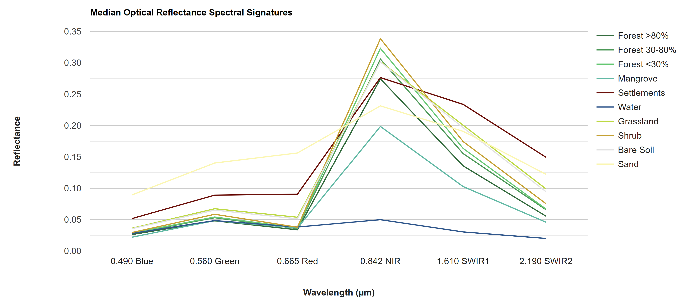
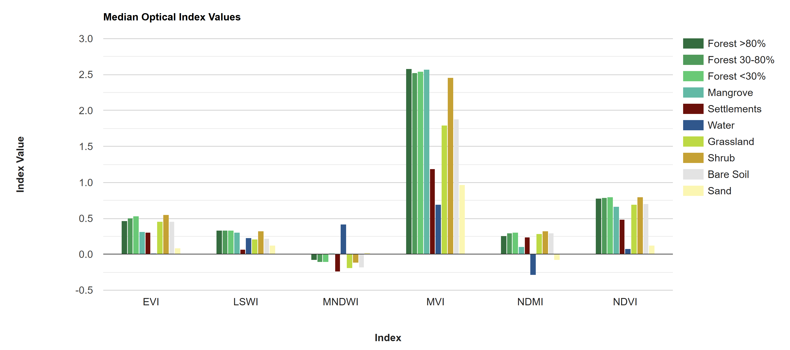
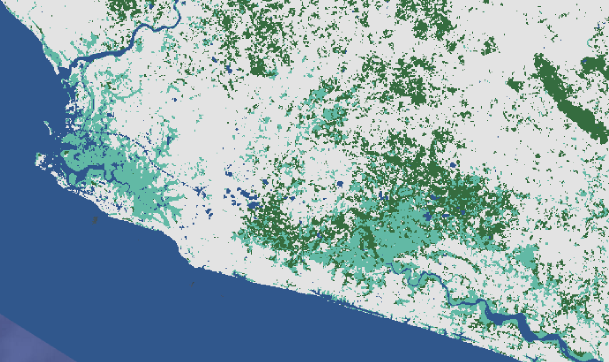

# Challenges

## Rerun the Analysis for 2024

Rerun the entire analysis for 2024, from the `preprocessing` and `classification` scripts. 

The necessary intermediate assets, `projects/pc556-ncs-liberia-forest-mang/assets/refPoints_10m_2014_400PerClass` and `projects/pc556-ncs-liberia-forest-mang/assets/predImage_30m_2024_v1` for doing the classification have already been exported for you, and the scripts are set up in such a way that they will import the correct assets if you simply change the `d1` and `d2` variables to `2024` at the top of the script. 
```javascript
// dates of interest
var d1 = '2024-1-1'
var d2 = '2024-12-31'
```

## Visualize Spectral Signatures of Different LULC Types

Open up a new script and name it `4 spectral_signatures`. You will copy and paste each code block into the empty script. You can check your work by looking at the following script `users/ee-scripts/Liberia_Forest_SIG_workshops/09_classification_GEE/4 spectral_signatures`.

As part of the data exploration process, we can visualize the differences in how different LULC types reflect/reemit different wavelengths of light. These are called "spectral signatures," and they can give good insight into which bands or indices will be the most useful for distinguishing different LULC types in the classification, and which LULC types will be easily confused with one another. The greater the difference in spectral signatures, the easier the LULC types will be to separate.





Looking at these charts, we can already predict that water will probably be extremely easy to distinguish from other classes, as it has a unique spectral signature and unique values in many of the indices. Sand and settlements, on the other hand, may be relatively easy to distinguish from other classes but may be difficult to distinguish from each other. Similarly, all the vegetation classes will probably be extremely difficult to distinguish from each other, with the NIR band looking like the best band for distinguishing them.

Another interesting thing to note is how similar the bare soil spectral signature is to the vegetation classes and how different it is from the sand and settlement classes - it is nearly identical to grassland. This is surprising, as bare soil should be much more similar in composition to sand and settlements than to vegetation. This could be because what was defined as bare soil in the 2014 map may not have been bare soil year-round, but rather bare soil in the dry season with a thin layer of annual herbacious vegetation in the dry season. Thus, when taking the annual median to composite the predictor image, areas which were bare in less than half of the images may appear greener than we might expect from a "bare soil" class. This is an example of why manual labelling of reference points with strict definitions and extensive QAQC is crucial. Our reference points for this exercise were just blindly generated from the 2014 map, which should not be done when generating a final product. 

First, we just import the data sets we have prepped for classification: the AOI, the predictor image, the reference points, and the 2014 LULC maps. 

```javascript
// //////////////////////////////////////////////////////////////////////////////////////////
// //////////////////////////////////////////////////////////////////////////////////////////
// Define Parameters
// //////////////////////////////////////////////////////////////////////////////////////////
// //////////////////////////////////////////////////////////////////////////////////////////

// version
var version = 1;

// dates of interest
var d1 = '2014-1-1'
var d2 = '2014-12-31'

// basemap
Map.setOptions('SATELLITE')

// //////////////////////////////////////////////////////////////////////////////////////////
// //////////////////////////////////////////////////////////////////////////////////////////
// Import and Visualize Data
// //////////////////////////////////////////////////////////////////////////////////////////
// //////////////////////////////////////////////////////////////////////////////////////////

// AOI
// ------------------------------------------------------------------------------------------

// import the simple Liberia feature collection
var Liberia = ee.FeatureCollection("projects/pc556-ncs-liberia-forest-mang/assets/Liberia_simple")
  
// define an aoi geometry from the feature collection
var aoi = Liberia
  .union();
  
// Add the aoi object as a layer to the map
Map.addLayer(aoi, {}, 'AOI', false);
Map.centerObject(aoi, 7)

// Reference Points
// ------------------------------------------------------------------------------------------

var refPoints = ee.FeatureCollection(
  "projects/pc556-ncs-liberia-forest-mang/assets/refPoints_10m_2014_400PerClass")
  
// add to map
Map.addLayer(refPoints, {}, 
  'reference points', false);
  
// Predictor Variable Image
// ------------------------------------------------------------------------------------------

var predImage = ee.Image(
  "projects/pc556-ncs-liberia-forest-mang/assets/predImage_30m_"+d1.slice(0,4)+'_v'+version)

// print band names
print("predictor image bands:", predImage.bandNames())
// add to map
Map.addLayer(predImage, {bands:['red','green','blue'],min:0,max:0.3}, 
  'optical', false);
  
// LULC
// ------------------------------------------------------------------------------------------

var lulc10m = ee.Image(
  'projects/pc556-ncs-liberia-forest-mang/assets/Liberia_landcover_forest_map_10m_v1_2014')
var lulc30m = ee.Image(
  'projects/pc556-ncs-liberia-forest-mang/assets/Liberia_landcover_forest_map_30m_2014')

// do some preprocessing to remove classes we don't want
lulc10m = lulc10m
  // redefine clouds as 0
  .where(lulc10m.eq(25), 0) 
  // get rid of 0 values (nodata an dclouds)
  .selfMask()
  // rename class band
  .rename('class')
lulc30m = lulc30m
  // redefine clouds as 0
  .where(lulc30m.eq(25), 0) 
  // get rid of 0 values (nodata an dclouds)
  .selfMask()
  // rename class band
  .rename('class')

// define visualization paramaters
var lulcVis = {
  min: 1,
  max: 11,
  palette: [
                        // 0 nodata
            '#006d3a',  // 1 forest_80
            '#009c53',  // 2 forest_30-80
            '#00cc6c',  // 3 forest_30
            '#00bba4',  // 4 mangroves
            '#7b0000',  // 5 settlements
            'white',    // placeholder for 6
            '#015890',  // 7 water
            '#b6da03',  // 8 grassland
            '#d29f00',  // 9 shrub
            '#e3e3e3',  // 10 baresoil
            '#fff6a9'   // 11 sand
                        // 25 clouds
            ],         
                        
};
// Add to the map
Map.addLayer(lulc10m, lulcVis, 'LULC 2014 10m', false);
Map.addLayer(lulc30m, lulcVis, 'LULC 2014 30m', false);

// select which lulc to use for generating reference data
var lulc = lulc10m;
```

Next, we create some `ui.Chart.image.byClass()` objects which aggregate the median of the predictor image bands at each reference point by LULC class. First we plot the optical bands as a line graph, and then we plot the indices as a bar chart. We will not discuss each component of creating a chart in GEE here, but if you want to learn more about this topic there are plenty of resources online.

``` javascript
// //////////////////////////////////////////////////////////////////////////////////////////
// //////////////////////////////////////////////////////////////////////////////////////////
// Visualize Spectral Signatures
// //////////////////////////////////////////////////////////////////////////////////////////
// //////////////////////////////////////////////////////////////////////////////////////////

var sarChart = ui.Chart.image
                .byClass({
                  image: predImage
                          .select(['VV','VH','HH','HV'])
                          .addBands(lulc),
                  classBand: 'class',
                  region: refPoints,
                  reducer: ee.Reducer.median(),
                  scale: 30,
                  classLabels: ['','Forest >80%','Forest 30-80%','Forest <30%','Mangrove','Settlements',
                                '','Water','Grassland','Shrub','Bare Soil','Sand'],
                })
                .setChartType('ColumnChart')
                .setOptions({
                  title: 'Median SAR Backscatter Values',
                  hAxis: {
                    title: 'Polarization',
                    titleTextStyle: {italic: false, bold: true}
                  },
                  vAxis: {
                    title: 'Backscatter',
                    titleTextStyle: {italic: false, bold: true}
                  },
                  colors: [      
                                // 0 nodata
                    '#006d3a',  // 1 forest_80
                    '#009c53',  // 2 forest_30-80
                    '#00cc6c',  // 3 forest_30
                    '#00bba4',  // 4 mangroves
                    '#7b0000',  // 5 settlements
                    // 'white',    // placeholder for 6
                    '#015890',  // 7 water
                    '#b6da03',  // 8 grassland
                    '#d29f00',  // 9 shrub
                    '#e3e3e3',  // 10 baresoil
                    '#fff6a9'   // 11 sand
                                // 25 clouds
                  ]
                });

var l8Wavelengths = ['0.490 Blue', '0.560 Green', '0.665 Red',
                    '0.842 NIR', '1.610 SWIR1', '2.190 SWIR2']
var s2Wavelengths = ['0.490 Blue', '0.560 Green', '0.665 Red', '0.705 RedEdge1', 
                    '0.740 RedEdge2', '0.783 RedEdge3', '0.842 NIR','0.865 RedEdge4',
                    '1.610 SWIR1', '2.190 SWIR2']

var opticalChart = ui.Chart.image
                .byClass({
                  image: predImage
                          .select(['blue', 'green', 'red', 'NIR', 'SWIR1', 'SWIR2'])
                          .addBands(lulc),
                  classBand: 'class',
                  region: refPoints,
                  reducer: ee.Reducer.median(),
                  scale: 30,
                  classLabels: ['','Forest >80%','Forest 30-80%','Forest <30%','Mangrove','Settlements',
                                '','Water','Grassland','Shrub','Bare Soil','Sand'],
                  xLabels: l8Wavelengths
                })
                //.setChartType('ScatterChart')
                .setChartType('ScatterChart')
                .setOptions({
                  title: 'Median Optical Reflectance Spectral Signatures',
                  hAxis: {
                    title: 'Wavelength (µm)',
                    titleTextStyle: {italic: false, bold: true},
                    ticks: l8Wavelengths
                  },
                  vAxis: {
                    title: 'Reflectance',
                    titleTextStyle: {italic: false, bold: true}
                  },
                  colors: [      
                                // 0 nodata
                    '#006d3a',  // 1 forest_80
                    '#009c53',  // 2 forest_30-80
                    '#00cc6c',  // 3 forest_30
                    '#00bba4',  // 4 mangroves
                    '#7b0000',  // 5 settlements
                    // 'white',    // placeholder for 6
                    '#015890',  // 7 water
                    '#b6da03',  // 8 grassland
                    '#d29f00',  // 9 shrub
                    '#e3e3e3',  // 10 baresoil
                    '#fff6a9'   // 11 sand
                                // 25 clouds
                  ],
                  pointSize: 0,
                  lineSize: 2,
                  curveType: 'linear'
                });
                
var indexChart = ui.Chart.image
                .byClass({
                  image: predImage
                          .select(['NDVI','LSWI','NDMI','MNDWI','EVI','MVI'])
                          .addBands(lulc),
                  classBand: 'class',
                  region: refPoints,
                  reducer: ee.Reducer.median(),
                  scale: 30,
                  classLabels: ['','Forest >80%','Forest 30-80%','Forest <30%','Mangrove','Settlements',
                                '','Water','Grassland','Shrub','Bare Soil','Sand'],
                })
                .setChartType('ColumnChart')
                .setOptions({
                  title: 'Median Optical Index Values',
                  hAxis: {
                    title: 'Index',
                    titleTextStyle: {italic: false, bold: true}
                  },
                  vAxis: {
                    title: 'Index Value',
                    titleTextStyle: {italic: false, bold: true}
                  },
                  colors: [      
                                // 0 nodata
                    '#006d3a',  // 1 forest_80
                    '#009c53',  // 2 forest_30-80
                    '#00cc6c',  // 3 forest_30
                    '#00bba4',  // 4 mangroves
                    '#7b0000',  // 5 settlements
                    // 'white',    // placeholder for 6
                    '#015890',  // 7 water
                    '#b6da03',  // 8 grassland
                    '#d29f00',  // 9 shrub
                    '#e3e3e3',  // 10 baresoil
                    '#fff6a9'   // 11 sand
                                // 25 clouds
                  ]
                });

// print(sarChart);
print(opticalChart);
print(indexChart);
```

## Rerun the Analysis for a Simpler LULC Typology

Open up a new script and name it `5 simplified_LULC`. You will copy and paste each code block into the empty script. You can check your work by looking at the following script `users/ee-scripts/Liberia_Forest_SIG_workshops/09_classification_GEE/5 simplified_LULC`.

We can also build a random forest classification model for a simplified LULC typology with fewer classes. For example, we can combine all forest classes into one class and leave the other classes as is. If we just want to simplify it even further to just focus on forests and mangroves, we can condense all LULCs into 4 classes: forest, mangrove, water, and other. This is what we do in this example.

In order to do this, we add a block of code to our script in which we reclassify the LULC map into these 4 classes and then generate new reference points with 400  in each new class. We also tweak a few other pieces of the code so that it works for these new classes.



Based on the user's and producer's accuracies printed in the **Console**, we can already tell that the overall weighted accuracy is likely going to be higher for this simplified classification map than the one with all 10 classes.

Here is the additional code block.

``` javascript
// //////////////////////////////////////////////////////////////////////////////////////////
// //////////////////////////////////////////////////////////////////////////////////////////
// Simplify LULC Classes
// //////////////////////////////////////////////////////////////////////////////////////////
// //////////////////////////////////////////////////////////////////////////////////////////

// reclassify LULC map to just forests, mangroves, and other
  // 1 forest
  // 2 mangrove
  // 3 other
  // 4 water
lulc = lulc
  // assign a new value to each class
  .remap(
    [1,2,3,4,5,7,8,9,10,11],
    [1,1,1,2,3,4,3,3,3, 3])
  // .remap(
  //   [1,2,3,4,5,7,8,9,10,11],
  //   [1,1,1,4,5,7,8,9,10,11])
  // rename class
  .rename('simplifiedClass');                  
  
// define visualization paramaters
lulcVis = {
  min: 1,
  max: 4,
  palette: [
            '#006d3a',  // 1 forest
            '#00bba4',  // 2 mangroves
            '#e3e3e3',  // 3 other
            '#015890',  // 4 water
            ],   
};
// Add to the map
Map.addLayer(lulc, lulcVis, 'LULC 2014 simplified', false);

// create a new stratified random samplebased on the reclassified LULC map

// set the number of points you want to have per class
var classPointsNum = 400
// var classValues = [1,  2,  3,  4]
// var classPoints = [400,400,400,400] 

// create a stratified sample
var refPoints = lulc.stratifiedSample({
  // number of points per class
  numPoints: classPointsNum,
  // the band name with the classes in it
  classBand: classBand,
  // resolution of the LULC map
  scale: 10,
  seed: 111,
  // classValues:classValuesList,
  // classPoints:classPointsList, 
  dropNulls:true, 
  tileScale:2, 
  geometries: true
});
```

Here is the full script.

``` javascript
// //////////////////////////////////////////////////////////////////////////////////////////
// //////////////////////////////////////////////////////////////////////////////////////////
// Define Parameters
// //////////////////////////////////////////////////////////////////////////////////////////
// //////////////////////////////////////////////////////////////////////////////////////////

// version
var version = 1;

// dates of interest
var d1 = '2014-1-1'
var d2 = '2014-12-31'

// basemap
Map.setOptions('SATELLITE')

// class band name
var classBand = 'simplifiedClass' //'simplifiedClass' //'class'

// final map resolution
var resolution = 30;
// smoothing radius for final map (pixels)
var modeRadius = 2;

// //////////////////////////////////////////////////////////////////////////////////////////
// //////////////////////////////////////////////////////////////////////////////////////////
// Import and Visualize Data
// //////////////////////////////////////////////////////////////////////////////////////////
// //////////////////////////////////////////////////////////////////////////////////////////

// AOI
// ------------------------------------------------------------------------------------------

// import the simple Liberia feature collection
var Liberia = ee.FeatureCollection("projects/pc556-ncs-liberia-forest-mang/assets/Liberia_simple")
  
// define an aoi geometry from the feature collection
var aoi = Liberia
  .union();
  
// Add the aoi object as a layer to the map
Map.addLayer(aoi, {}, 'AOI', false);

// Reference Points
// ------------------------------------------------------------------------------------------

// var refPoints = ee.FeatureCollection(
//   "projects/pc556-ncs-liberia-forest-mang/assets/refPoints_10m_2014_400PerClass")

// Predictor Variable Image
// ------------------------------------------------------------------------------------------

var predImage = ee.Image(
  "projects/pc556-ncs-liberia-forest-mang/assets/predImage_30m_"+d1.slice(0,4)+'_v'+version)

// add to map
Map.addLayer(predImage, {bands:['red','green','blue'],min:0,max:0.3}, 
  'optical', false);
Map.addLayer(predImage, {bands:['red_planet','green_planet','blue_planet'],min:64,max:5454,gamma:1.8}, 
  'optical planet', false);
  
// LULC
// ------------------------------------------------------------------------------------------

var lulc10m = ee.Image(
  'projects/pc556-ncs-liberia-forest-mang/assets/Liberia_landcover_forest_map_10m_v1_2014')
var lulc30m = ee.Image(
  'projects/pc556-ncs-liberia-forest-mang/assets/Liberia_landcover_forest_map_30m_2014')

// do some preprocessing to remove classes we don't want
lulc10m = lulc10m
  // redefine clouds as 0
  .where(lulc10m.eq(25), 0) 
  // get rid of 0 values (nodata an dclouds)
  .selfMask()
  // rename class band
  .rename('class')
lulc30m = lulc30m
  // redefine clouds as 0
  .where(lulc30m.eq(25), 0) 
  // get rid of 0 values (nodata an dclouds)
  .selfMask()
  // rename class band
  .rename('class')

// define visualization paramaters
var lulcVis = {
  min: 1,
  max: 11,
  palette: [
                        // 0 nodata
            '#006d3a',  // 1 forest_80
            '#009c53',  // 2 forest_30-80
            '#00cc6c',  // 3 forest_30
            '#00bba4',  // 4 mangroves
            '#7b0000',  // 5 settlements
            'white',    // placeholder for 6
            '#015890',  // 7 water
            '#b6da03',  // 8 grassland
            '#d29f00',  // 9 shrub
            '#e3e3e3',  // 10 baresoil
            '#fff6a9'   // 11 sand
                        // 25 clouds
            ],         
                        
};
// Add to the map
Map.addLayer(lulc10m, lulcVis, 'LULC 2014 10m', false);
Map.addLayer(lulc30m, lulcVis, 'LULC 2014 30m', false);

// select which lulc to use for generating reference data
var lulc = lulc10m;

// //////////////////////////////////////////////////////////////////////////////////////////
// //////////////////////////////////////////////////////////////////////////////////////////
// Simplify LULC Classes
// //////////////////////////////////////////////////////////////////////////////////////////
// //////////////////////////////////////////////////////////////////////////////////////////


// reclassify LULC map to just forests, mangroves, and other
  // 1-3:  1 forest
  // 4:    2 mangrove
  // 5-25: 3 other
lulc = lulc
  // method 1
  .remap(
    [1,2,3,4,5,7,8,9,10,11],
    [1,1,1,2,3,4,3,3,3, 3])
  // // method 2
  // .where(lulc.gte(1).and(lulc.lte(3)), 1)  
  // .where(lulc.eq(4), 2)                    
  // .where(lulc.gte(5), 3)
  // rename the class band
  .rename('simplifiedClass');                  
  
// define visualization paramaters
lulcVis = {
  min: 1,
  max: 4,
  palette: [
            '#006d3a',  // 1 forest_80
            '#00bba4',  // 4 mangroves
            '#e3e3e3',  // 10 baresoil
            '#015890',  // 7 water
            ],         
};
// Add to the map
Map.addLayer(lulc, lulcVis, 'LULC 2014 simplified', false);

// create a new stratified random samplebased on the reclassified LULC map

// set the number of points you want to have per class
var classPointsNum = 400
// var classValues = [1,  2,  3,  4]
// var classPoints = [400,400,400,400] 

// create a stratified sample
var refPoints = lulc.stratifiedSample({
  // number of points per class
  numPoints: classPointsNum,
  // the band name with the classes in it
  classBand: classBand,
  // resolution of the LULC map
  scale: 10,
  seed: 111,
  // classValues:classValuesList,
  // classPoints:classPointsList, 
  dropNulls:true, 
  tileScale:2, 
  geometries: true
});

// //////////////////////////////////////////////////////////////////////////////////////////
// //////////////////////////////////////////////////////////////////////////////////////////
// Prepare Training and Testing Data
// //////////////////////////////////////////////////////////////////////////////////////////
// //////////////////////////////////////////////////////////////////////////////////////////

// extract the predictor image band values reference points
refPoints = predImage.sampleRegions({
      collection: refPoints, 
      properties: [classBand], 
      scale: resolution,
      geometries:true
    })

// Add to the map
Map.addLayer(refPoints, {}, 'reference points', false);
// print
print('reference points:', refPoints.limit(5))

// Divide reference points into training and testing points
// Create random column in reference points
refPoints = refPoints.randomColumn();

// set aside 80% of data for training 
var trainPoints = refPoints.filter(ee.Filter.lt('random', 0.8));
// set aside 20% of the data for testing
var testPoints = refPoints.filter(ee.Filter.gte('random', 0.8));

// print size of testing and training data sets
print('Number of training points:', trainPoints.size());
print('Number of testing points:', testPoints.size());

// add to map
Map.addLayer(trainPoints, {color: 'black'}, 'training points', false); 
Map.addLayer(testPoints, {color: 'white'}, 'testing points', false); 

// alternatively,  import the training and testing points created in SEPAL or AREA2 
// (comment out the rest of this section above)
// var trainPoints = ee.FeatureCollection()
// var testPoints = ee.FeatureCollection()

// //////////////////////////////////////////////////////////////////////////////////////////
// //////////////////////////////////////////////////////////////////////////////////////////
// Train Classifier
// //////////////////////////////////////////////////////////////////////////////////////////
// //////////////////////////////////////////////////////////////////////////////////////////

// Define prediction bands
// Get all image bands from the predictor image and remove any you want to leave out
var predBands =  predImage.bandNames()
  .removeAll(['constant','constant_1','constant_2']) 

// print prediction bands
print('prediction bands:', predBands)

// Train random forest classifier with the training points and prediction bands
var RFclassifier = ee.Classifier.smileRandomForest({numberOfTrees:200, seed:234})
  .train({
    features: trainPoints, 
    classProperty: classBand,
    inputProperties: predBands
});

// Print decision trees
print('decision trees:', RFclassifier.explain());

// //////////////////////////////////////////////////////////////////////////////////////////
// //////////////////////////////////////////////////////////////////////////////////////////
// Run Classifier
// //////////////////////////////////////////////////////////////////////////////////////////
// //////////////////////////////////////////////////////////////////////////////////////////

// Classify the predictor image with the trained classifier
var RFclassification = predImage
  .select(predBands)
  .classify(RFclassifier)
  // smooth to make it less speckly
  .focalMode(modeRadius, 'circle', 'pixels')
  .reproject({
    crs: predImage.projection(),
    scale: resolution})
  .clip(aoi)

// Add the classified image to the map
Map.addLayer(RFclassification, lulcVis, 
            'RF classification');
            
// //////////////////////////////////////////////////////////////////////////////////////////
// //////////////////////////////////////////////////////////////////////////////////////////
// Assess Accuracy
// //////////////////////////////////////////////////////////////////////////////////////////
// //////////////////////////////////////////////////////////////////////////////////////////

// classify the testing data using the trained classifier
var testPointsClassified = testPoints.classify(RFclassifier);

// Create confusion matrix using the true and predicted values in the tetsing data
var confusionMatrix = testPointsClassified.errorMatrix({
  // the "true" values from the reference data
  actual: classBand, 
  // the "predicted" values from the RF classification
  predicted: 'classification'
});

// Print confusion matrix and accuracies
// This is overall accuracy is a simplified version - is NOT appropriate for stratified random sampling
// print('Overall Accuracy:', confusionMatrix.accuracy());
print('Confusion Matrix:', confusionMatrix);
print('Producers Accuracy:', confusionMatrix.producersAccuracy());
print('Users Accuracy:', confusionMatrix.consumersAccuracy());
  
// //////////////////////////////////////////////////////////////////////////////////////////
// //////////////////////////////////////////////////////////////////////////////////////////
// Assess Variable Importance
// //////////////////////////////////////////////////////////////////////////////////////////
// //////////////////////////////////////////////////////////////////////////////////////////

// extract the importance of each predictor variable from the random forest model
var varImportance = ee.Dictionary(RFclassifier.explain().get('importance'));

// convert raw importance values to percentages (so they all add up to 100)
// sum up all importances
var varImportanceSum = varImportance.values().reduce(ee.Reducer.sum());
// multiply each importance value by 100 and divide by the sum to relativize them
var varRelImportance = varImportance.map(function(key, val) {
  return (ee.Number(val).multiply(100)).divide(varImportanceSum);
  });

// sort importances to go from lowest to highest
var sortedProperties = varRelImportance.keys().sort(varRelImportance.values())
var sortedImportances = ee.List([sortedProperties, varRelImportance.values().sort()])
// print
print('relative importance of variables:',sortedImportances);

// create a feature collection from the relative importances
var varRelImportanceFC = ee.FeatureCollection([
  ee.Feature(null, varRelImportance)
]);

// create a chart of the relative importances
var varRelImportanceChart = ui.Chart.feature.byProperty({
  features: varRelImportanceFC
}).setOptions({
      title: 'Variable Relative Importance',
      vAxis: {title: 'Importance'},
      hAxis: {title: 'Bands'}
  });
// print
print(varRelImportanceChart);

// //////////////////////////////////////////////////////////////////////////////////////////
// //////////////////////////////////////////////////////////////////////////////////////////
// Calculate Areas
// //////////////////////////////////////////////////////////////////////////////////////////
// //////////////////////////////////////////////////////////////////////////////////////////

// Create an extra image with a value of 1 in every pixel covering the AOI
// (this is just an something needed for the ee.Reducer.group() function because it needs an image with 2 bands)
var constantImage = ee.Image(1).clip(aoi);

// Calculate the number of pixels in each class
var pixelCounts_dict = constantImage.addBands(RFclassification).reduceRegion({
  // Use ee.Reducer.count().group() function
  reducer: ee.Reducer.count().group({
    // Use band "classification" for grouping 
    // (which is now band 1 not 0 since we attached the extra image)
    groupField: 1, 
    groupName: 'classification',
  }),
  geometry: aoi, // region of interest
  scale: 30, // Resolution of the image in meters
  maxPixels: 1e50 // Maximum number of pixels in the region
});

// // Print the resulting dictionary of a list of dictionaries
// print("Pixel Counts as Dictionary:", pixelCounts_dict);

// Convert the this dictionary to just a list of dictionaries
// (we extract the list of dictionaries)
var pixelCounts_list = ee.List(pixelCounts_dict.get('groups'));

// // Print the resulting list of dictionaries
// print("Pixel Counts as List of Dictionaries:", pixelCounts_list);

// Create a FeatureCollection from the list of dictionaries
var pixelCounts_fc = ee.FeatureCollection(
  // apply this function to all the dictionaries in the list
  pixelCounts_list.map(function(dict) {
    var dict2 = ee.Dictionary(dict);
    // extract the className from the dictionary
    var className = ee.Number(dict2.get('classification'));
    // extract the count from the dictionary
    var count = ee.Number(dict2.get('count'));
    // put these into an empty feature class as new properties
    // (this allows us to export the info as separate columns in a CSV)
    return ee.Feature(null, {
      'classification': className,
      'count': count
    });
  })
);

// Print the resulting FeatureCollection
print("Pixel Counts as FeatureCollection", pixelCounts_fc);

// //////////////////////////////////////////////////////////////////////////////////////////
// //////////////////////////////////////////////////////////////////////////////////////////
// Export
// //////////////////////////////////////////////////////////////////////////////////////////
// //////////////////////////////////////////////////////////////////////////////////////////

// Export the classification map to Asset Library
Export.image.toAsset({
  // the image you want to export
  image: RFclassification,
  // the name of the task
  description: 'RFclassificationSimpl',
  // the path and name of the asset (change this to be in your own asset library)
  assetId: 'projects/pc556-ncs-liberia-forest-mang/assets/RFclassificationSimpl_'+resolution+'m_'+d1.slice(0,4)+'_v'+version,
  // the geometry to clip the image to
  region: aoi,
  // the resolution of the image
  scale: resolution,
  maxPixels: 1e13
})
            
// Export the reference points Asset Library
Export.table.toAsset({
  // the feature collection you want to export
  collection: testPointsClassified,
  // the task name
  description: 'testPointsClassifiedSimpl',
  // the asset ID and path (change to your own asset library)
  assetId: 'projects/pc556-ncs-liberia-forest-mang/assets/testPointsClassifiedSimpl_'+resolution+'m_'+d1.slice(0,4)+'_v'+version,
});

// Export the class areas as a CSV to Google Drive
Export.table.toDrive({
  // the feature collection
  collection: pixelCounts_fc,
  // the task name
  description: 'todrive_classAreasSimpl',
  // folder and file name in Drive
  fileNamePrefix: 'classAreasSimpl_'+resolution+'m_'+d1.slice(0,4)+'_v'+version,
  fileFormat: 'CSV'
});

// Export reference points to Google Drive
Export.table.toDrive({
  collection: testPointsClassified,
  // the task name
  description: 'todrive_testPointsClassifiedSimpl',
  // folder and file name in Drive
  fileNamePrefix: 'testPointsClassifiedSimpl_'+resolution+'m_'+d1.slice(0,4)+'_v'+version,
  // columns to export
  selectors: 'system:index,classification,class'
});
```


