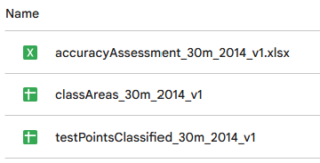

# Accuracy Assessment

This portion of the workshop will demonstrate how to do a weighted accuracy assessment in a spreadsheet using the testing points and classification map generated in Google Earth Engine.

Follow along by copying the files editing the spreadsheets based on each step in the lesson. At the end, you will have a working spreadhseet in your own Google Drive.

## Objectives
1. Understand the general process for weighted accuracy assessment
2. Adapt the provided workflow for a different LULC classifications with different available classes

## Setup     

Copy this [Accuracy Assessment Folder](https://drive.google.com/drive/folders/1rALEutPpR3BW9O0GWxZY7tcBBSb49ecY) into your own Google Drive. The files we will be using for this section are your classified testing points (.csv), your pixel areas (.csv), and an accuracy assessment worksheet (.xlsx).

If you want to work on your own computer in Microsoft Excel, make sure you have all relevant files downloaded to your computer. 