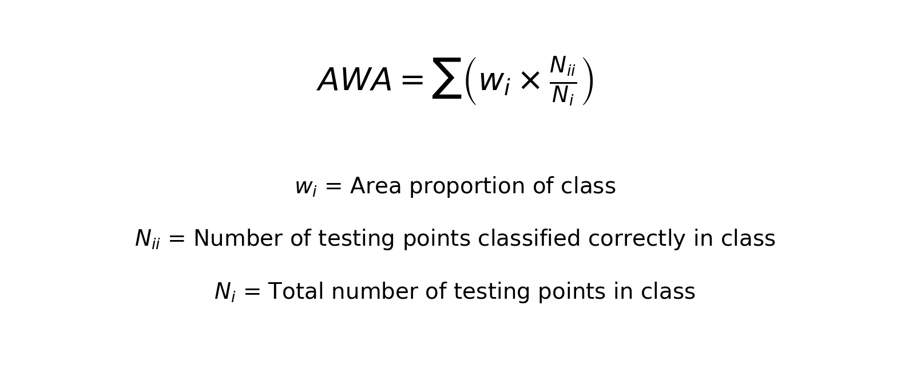
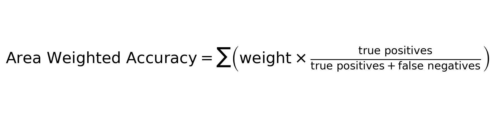
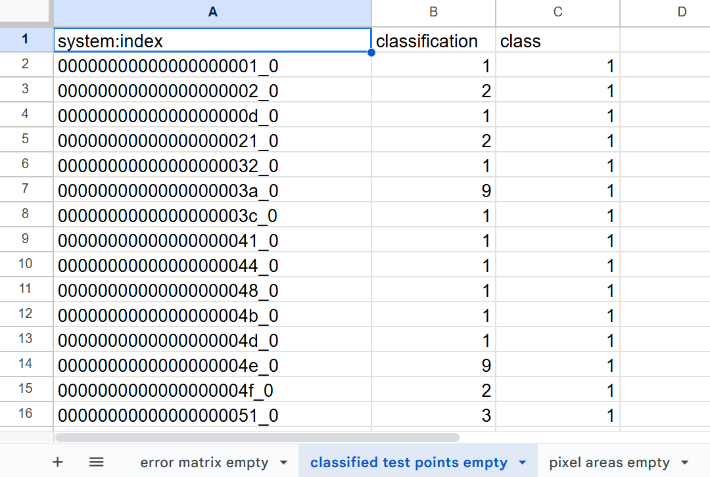
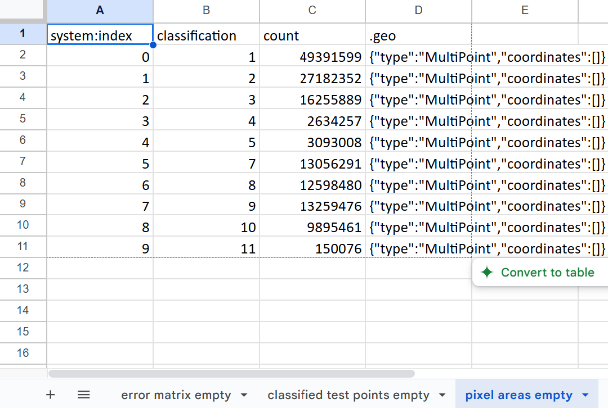
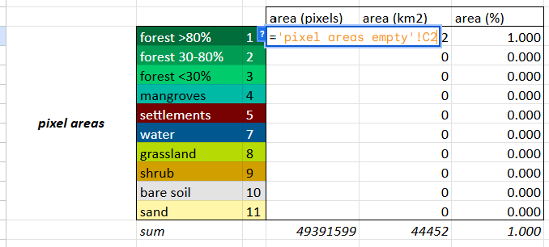
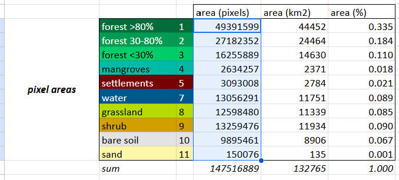
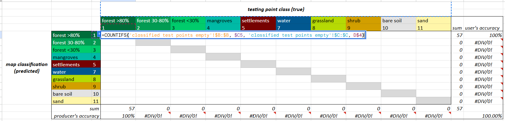
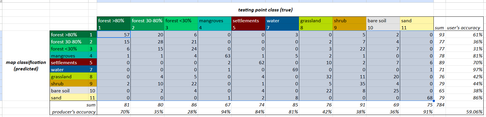
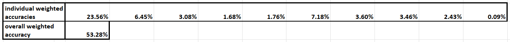

# Run Accuracy Assessment in Google Sheets

As mentioned earlier, it is most appropriate to do an **Area Weighted Accuracy (AWA) assessment** when we use a stratified random sample and there are large differences in area between the classes. Some classes cover a much smaller proportion of the AOI than other classes, so they are more rare and effectively harder to sample and predict. This must be factored into how we calculate accuracy, so we weight each class accuracy value by the class area, and calculate overall accuracy from these weighted class accuracies. 

This ensures that:
* larger land cover classes contribute more to overall accuracy
* bias toward small classes is reduced, unlike standard overall accuracy measures

Area weighted accuracy is calculated by multiplying each class's area proportion by its producer's accuracy (true positives divided by total number of testing points in the class). All the classes' weighted accuracies are then added up to produce the overall weighted accuracy. The equation is:




Or, in other terms:




Open the spreadsheets called 
1. `accuracyAssessment_30m_2014_v1.xlsx`
2. `classAreas_30m_2014_v1`
3. `testPointsClassified_30m_2014_v1`


# Let's try it
In your copy of the [Accuracy Assessment Folder](https://drive.google.com/drive/folders/1rALEutPpR3BW9O0GWxZY7tcBBSb49ecY) open the spreadsheets called:
1. accuracyAssessment_30m_2014_v1.xlsx
2. classAreas_30m_2014_v1
3. testPointsClassified_30m_2014_v1


In the accuracy assessment worksheet, you will work in the first three tabs labelled **empty**, copying and pasting data and code code into the appropriate cells. You can check your work by looking at the last three tabs, which have been filled out for you.


## Set Up 

Copy all data from `testPointsClassified_30m_2014_v1` and paste it into the tab labelled **classified test points empty**. *You may have your own version of this file, which is an export of the `02_classification` script in the GEE repository.*



Copy all data from `classAreas_30m_2014_v1` and paste it into the tab labelled **class areas empty**. *You may have your own version of this file, which is an export of the `02_classification` script in the GEE repository.*



## Class Areas

First, we bring in the LULC class areas.

Paste the following in cell `D23`, which pulls in the pixel counts directly from the **class areas empty** sheet:

```
='pixel areas empty'!C2
```



Highlight the cell and drag down to fill in the rest of the cells in that column.

*The pixel size of your classified map is assumed to 30m, but if this has changed for your annalysis, update cell H22.*



The other two columns have been set up automatically to convert the pixel count of each class into km2 and percentage of total area. 

## Class Accuracies

Next, we check which testing points were properly classified and misclassified. 

Paste the following in cell `D5`, which checks the **classified test points** sheet and counts how many points were originally forest ("true" values) and also classified as forest by the model ("predicted values"):

```
=COUNTIFS('classified test points empty'!$B:$B, $C5, 'classified test points empty'!$C:$C, D$4)
```
*COUNTIFS counts values, dependent on multiple criteria. Our equation checks if the classification in column B of your 'classified test points empty' tab (which are the map strata labels) is equal to the value in column C of the your confusion matrix, AND checks if the column C of your 'classified test points empty' tab (which are the assigned true reference labels) is equal to the value in row 4 of your confusion matrix. The equation counts the number of points for which both requirements are true.*



Highlight the cell and drag down and then across to fill in the rest of the cells in the entire table.

*The dollar signs in the equation will allow it to update by row and column as you drag it, but the referenced labels in column C and row 4 will remain the same.*



The rest of the cells outside of the confusion matrix have been set up automatically to calculate the user's and producer's accuracy of each class. 

The rows under the table show the weighted accuracies of each class, which are an intermediate step just calculated by multiplying the classes producer's accuracies by their area proportions. The weighted producer's accuracies are simply added up to produce the overall weighted accuracy.

**Weighted Overall Accuracy reflects the map's performance relative to the actual landscape, accounting for class imbalances.** The user's and producer's accuracies are fine as-is, and do not need to be weighted.



$$
AWA = \sum \left( w_i \times \frac{N_{ii}}{N_i} \right)
$$ 

$$
w_i = area\ proportion\ of\ class
$$

$$
N_{ii} = number\ of\ testing\ points\ classified\ correctly\ in\ class
$$

$$
N_{i} = total\ number\ of\ testing\ points\ in\ class
$$
$$
Overall\ Area\ Weighted\ Accuracy = \sum \left( weight \times \frac{true\ positives}{true\ positives + false\ negatives} \right)
$$ 

which is...

$$
 Overall\ Area\ Weighted\ Accuracy = \sum \left ( Weight_{i} * Producer Accuracy_{i} \right )
$$ 

