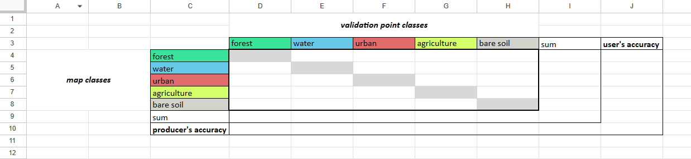
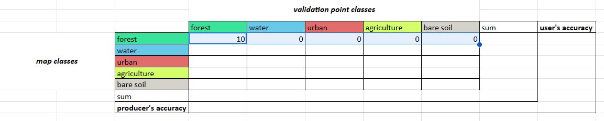
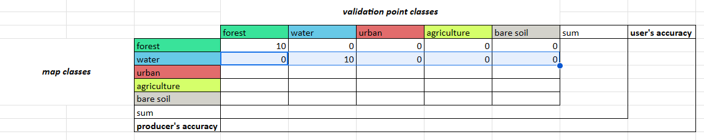
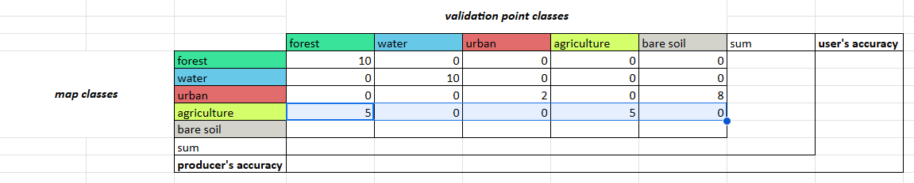
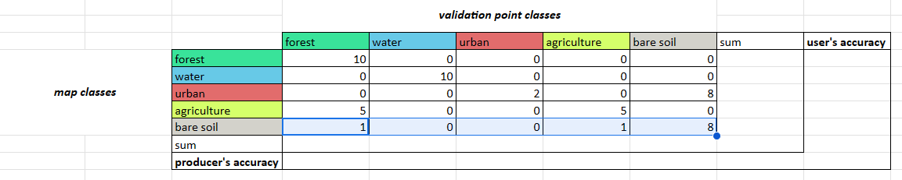
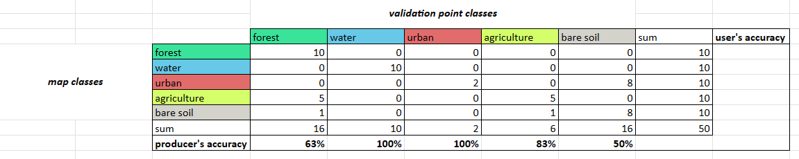
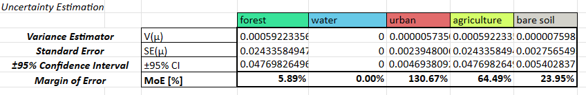

# Run Accuracy Assessment in Google Sheets

For this section, copy the files from the [Suriname workshop Google Drive](https://drive.google.com/drive/u/2/folders/1czeYS5ZdCimR7tlQg-dE7QK8d08mzzIX) to your own Google Drive and work in Google Sheets.  The files we will be using for this section are your CEO validation data (.csv) and your GEE pixel count data (.csv).

 If you want to work on your own computer in Microsoft Excel, make sure you have all relevant files downloaded to your computer. 

## Error Matrix

Open the CEO validation data .csv file in Google Sheets.  Open the sheet called `error matrix empty`.



Paste the following code into the top left cell, `D4`, and click enter.  Then select this cell and drag the blue selection box to cover the 4 cells to the left.

```
=COUNTIFS('ceo-Suriname-land-cover-map-val'!$N$2:$N$51, $C$4, 'ceo-Suriname-land-cover-map-val'!$O$2:$O$51, D3)
```



Do the same thing for the next cell below the top left cell, `D5`.

```
=COUNTIFS('ceo-Suriname-land-cover-map-val'!$N$2:$N$51, $C$5, 'ceo-Suriname-land-cover-map-val'!$O$2:$O$51, D3)
```



Then for `D6`.

```
=COUNTIFS('ceo-Suriname-land-cover-map-val'!$N$2:$N$51, $C$6, 'ceo-Suriname-land-cover-map-val'!$O$2:$O$51, D3)
```


Then for `D7`.

```
=COUNTIFS('ceo-Suriname-land-cover-map-val'!$N$2:$N$51, $C$7, 'ceo-Suriname-land-cover-map-val'!$O$2:$O$51, D3)
```



Then for `D8`.

```
=COUNTIFS('ceo-Suriname-land-cover-map-val'!$N$2:$N$51, $C$8, 'ceo-Suriname-land-cover-map-val'!$O$2:$O$51, D3)
```



### **Question 1**
* **What does this code do?**
* **What do the values in these cells mean?**

Now, in all the cells in the `sum` row (`D9:H9`), add up the samples that were categorized in each class by the **CEO validation data**.


In all the cells in the `sum` column (`I4:I9`), add up the samples that were categorized in each class by the **GEE classification map**.


*Hint: In cell `D9`, paste the following code.  Then select this cell and drag the blue selection box to cover the 4 cells to the left.*

```
=SUM(D4:D8)
```

*Hint: In cell `I4`, paste the following code.  Then select this cell and drag the blue selection box to cover the 5 cells below it.*

```
=SUM(D4:H4)
```

### **Question 2**
* **What does this code do?**
* **What do the values in these cells mean?**

In all the cells in the `producer's accuracy` column (`D10:H10`), divide the number of correctly categorized samples by the total number of samples in that class from the **CEO validation data**.



In all the cells in the `user's accuracy` column (`J4:J8`), divide the number of correctly categorized samples by the total number of samples in that class from the **GEE classification map**.


*Hint: In cell `D10`, paste the following code. You have to manually do this for each cell.*

```
=D4/D9
```

*Hint: In cell `J4`, paste the following code. You have to manually do this for each cell.*

```
=D4/I4
```

### **Question 3**
* **What does this code do?**
* **What do the values in these cells mean?**

In cell `J10`, add up all the correctly categorized samples and divide by the total number of samples.


*Hint: Paste the following code.*

```
=SUM(D4,E5,F6,G7,H8)/I9
```

### **Question 4**
* **What does this code do?**
* **What do the values in these cells mean?**

You now have a completed error matrix!  You can see what your final error matrix should look like in the `error matrix` sheet.

### **Question 5**
* **Which classes did our random forest classification do well with? Why did the model easily separate out these classes?**
* **Which classes did it struggle with? Why did the model have difficulty separating out these classes?**
* **Which areas were not well sampled in our stratified random sample? (e.g. were all different types of water bodies sampled? were all urban areas sampled well?)**

## Area Estimation

Open the CEO validation data .csv file in Google Sheets.  Open the sheet called `area estimation`.

The first section called `Sample Points Comparison Table` is where you input your data.  In `D4:H8`, you insert your error matrix values, and in `M4:M8` you insert your pixel count values (from your pixel count .csv).  You also calculate strata weights based on the percentage of total pixels that are in each stratum.


The second section called `Area Proportions Comparison Table` is where you calculate the "estimated area proportions" (the proportions of "true" area) for each class based on the number of correctly classified samples in that stratum, the total number of samples in that stratum, and the stratum weight.  You do this separately for each possible combination of classes between the classifiction map and validation points, and then add them all up for each validation point class.  The formula for this might change if your sample design is more complicated.  The area proportions should add up to 100%.


*Cochran, W. G. (1977). Sampling Techniques. New York, NY: Wiley*

The third section called `Uncertainty Estimation` is where you calculate measures of uncertainty, such as the variance, standard error, confidence interval, and margin of error. The formula for these might change if your sample design is more complicated.




*Cochran, W. G. (1977). Sampling Techniques. New York, NY: Wiley*

The fourth section called `Area Estimation` is where you calculate the "true" areas in real-world units.  You multiply the area proportions by the total area of interest and convert it to hectares.  You do the same with the confidence interval, since that is also calculated as a percentage in the previous step.


### **Question 6**
* **Do these area estimates make sense?**
* **How do these area estimated compare to the area estimates from the classification map?**
* **Why is using such a small sample size for validation points not very useful?**

In reality, you will probably use these tools with much more complex data, like land cover classifications with many classes or land cover change maps that capture changes over many years.  You may also have data where the strata in the validation data and the classification data are not exactly the same (e.g. there are more substrata captured in the CEO validation data) - and in this case, you will need to do these calculations in Google Sheets or Microsoft Excel.  SEPAL (the tool we mentioned earlier) can only handle data sets in which the strata are identical between them.

