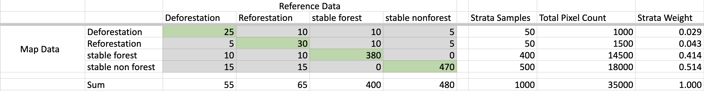
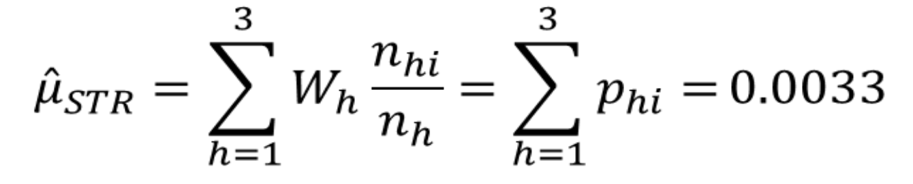
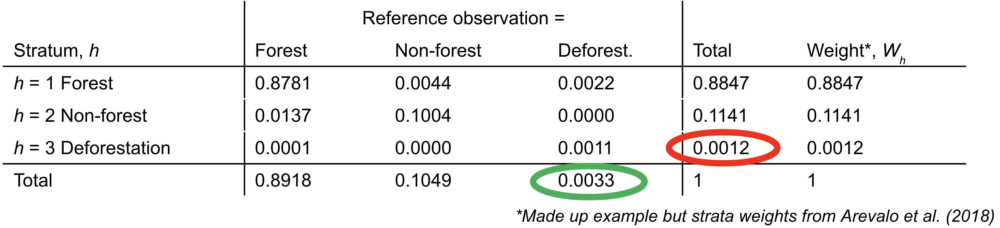
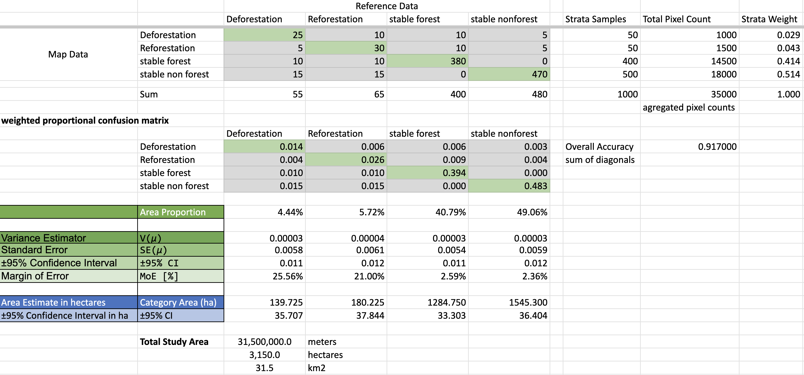

# Sample-Based Area Estimation and Uncertainty Analysis

The **confusion matrix** compares the mapped class with the labels assigned by interpreters at the reference points. It shows the agreement (green fields on the diagonal) and disagreement (grey fields off the diagonal) frequency between the two.



It provides insight into the quality of the mapping method and helps to identify areas that may need further refinement or a double check in CEO.


To **estimate the area of a target land cover change class** we can apply a stratified estimator by Cochran (1977, Eq. 5.1). It incorporates the confusion matrix and each stratum area to **estimate the true unbiased area of the target land cover change class**. This method accounts for accuracy variability in the land cover map, improving area estimation precision.





Use this template to do your own analysis. Make a copy and adjust the:
    -  columns to match your reference data labels
    -  rows to match your map strata
    -  pixel counts for your map strata (get this from AREA2 or QGIS)
    -  sample counts within the matrix (*see next sub-section*)
    
[Spreashsheet Template for Stratified Area and Uncertainty Estimation](https://docs.google.com/spreadsheets/d/1hCHuU13Rs7j2rj1Ll7IymBtGSSfZLOLg/edit?usp=sharing&ouid=113437415151435538893&rtpof=true&sd=true)


## Creating Your Confusion Matrix

The creation of the confuion matrix is something you can do in Google Sheets using your Samples file from CEO. We talked about doing this in the Accuracy section, using the COUNTIFS function in Google Sheets. As inputs you need:

- A samples data spreadsheet with (Sample file from CEO)
    - column 'A' of stratification map labels 
    - column 'B' of refrence data labels
- a matrix set up with:
    - row values that match those present in spreadsheet column 'A' (map labels)
    - column values that match those present in spreadsheet column 'B' (refernce labels)


Example from the last [10. Accuracy section](/10_accuracy/01_accuracy.md).: 
```
=COUNTIFS('classified test points empty'!$B:$B, $C5, 'classified test points empty'!$C:$C, D$4)
```

* COUNTIFS counts values, dependent on multiple criteria. Your equation should check if the classification in the column with the map strata labels is equal to the corresponding value of of the rows of your confusion matrix, AND checks if the values of your spreadsheet of assigned true reference labels is equal to the value in the columns of your confusion matrix. The equation counts the number of points for which both requirements are true (the row and column values are found).


# [Optional] Systematic or Random Sampling Analysis
If the team ends up deciding to use systematic or random sampling instead of stratified sampling, then here are some resources to guide that analysis. The process is more straight forward. These slides and templates are pulled from a workshop for The Gambia.

- [Slides on Sample Based Area Estimation with Simple Random/Systematic Sampling](https://docs.google.com/presentation/d/10F7c5-laA-iiWy_slMzaQz7RlCatxZ3LywfKCTS9xm0/edit?usp=sharing)
- [Spreadsheet Template for Systematic/Random Sampling Area Estimation](https://docs.google.com/spreadsheets/d/1DrMBMR11tGpUeHOy6VwA39VrYJI4CNyC/edit?usp=drive_link&ouid=113437415151435538893&rtpof=true&sd=true)


