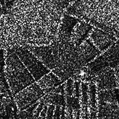

# Synthetic Aperture Radar (SAR) Background

# Theory and Concepts

## What is RADAR?
As a recap, remote sensing is the process of gaining information about an object or an area without directly being in contact with that object. Sensors take advantage of the electromagnetic radiation reflected or emitted from the Earth’s surface to monitor and map changes to the surface of the Earth over time. Thus far, we have worked with remote sensing data that uses energy in the visible and infrared portion of the electromagnetic spectrum. RADAR, which is actually an acronym that stands for Radio Detection and Ranging, uses energy that falls within the microwave portion of the spectrum. These longer energy wavelengths equip radar data with a number of advantages over optical remote sensing data that we will explore throughout this section.

 Electromagnetic spectrum. Image Source: Google sites. 

### Pros and Cons of Radar
Let’s start with the positive: what can radar achieve that optical remote sensing cannot?

1. **“All-weather” monitoring.** Microwaves can penetrate through cloud cover, fog, and smoke, which makes radars a more reliable and consistent source of imagery in any given location. A majority of the globe experiences at least 50% cloud cover during a year, so this increased monitoring ability is massively helpful. This advantage also creates an opportunity for better disaster and wildfire management.
2. **Day or night monitoring.** Radar doesn’t rely on energy from the sun to take its measurements, so imagery can be captured during the day or at night.
3. **Vegetation and soil penetration.**  Microwaves can also penetrate through dense vegetation and soil, allowing the sensors to capture characteristics of the Earth that optical sensors cannot.
4. **Minimal atmospheric effects.** Remember the many levels of processing optical remote sensing data must go through before it can be used? Radar data must also be pre-processed, but its longer wavelengths do not get affected by the same atmospheric conditions that can make optical imagery appear hazy or distorted.
5. **Dielectric and structural sensitivity.** Radar data can pick up on the dielectric and structural properties of an object, which can make it easier to distinguish between liquid and frozen water, for instance.

 Optical imagery (left) vs. radar imagery (right) of the Kliuchevskoi Volcano erupting. Source: Michigan Tech Volcanology 

These advantages are very powerful, though there are always multiple sides to consider when selecting the correct type of data for your research project. Let’s examine some of the cons of radar data.

1. **Challenging interpretation.** Unlike optical imagery, which most people can intuitively interpret as it appears very similar to a photograph taken with one’s cell phone, radar imagery is not as easy to understand immediately. It contains information about energy outside of the visible light spectrum, and so it often requires more training for a user to understand what they are looking at in a radar image.
2. **Speckling.** Radar images often appear grainier than optical imagery.
3. **Topographical effects.** Topography has a greater effect on radar imagery than optical imagery, as the terrain can reflect the energy radars measure and thus distort the image. 

Given these advantages and disadvantages, let’s understand why they exist in the first place. The major driver behind these differences is the way the data is collected. 

## Data Collection
### Passive vs. Active Measurements
This concept should sound familiar, as we briefly discussed it in the Introduction to Remote Sensing lesson. It is a key difference, however, so we will discuss it far more in depth here.

Optical sensors are called passive sensors because they rely solely on energy from an outside source (e.g, the sun) to capture their measurements. This reliance on outside energy sources limits these sensors by the effects of the atmosphere. Energy that is simply reflected from the surface of the Earth cannot penetrate things such as cloud cover or fog, and thus makes it difficult to gather data consistently in areas that experience this type of weather often.

 Diagram of passive remote sensing. *Source: NASA Applied Remote Sensing Training Program* 

Radar is a form of active remote sensing. These sensors provide their own artificial source of energy for illumination of the Earth’s surface, which can get through clouds, vegetation, and even soil depending on the type of signal they send down. Radars measure the energy that is reflected back from its own signal to generate an image of the surface of the Earth.

Imaging radars are side-looking, which means they transmit energy at a 90 degree angle in order to differentiate between two objects on the ground. By transmitting energy at an angle, it allows energy to bounce off of objects on the ground and reach the radar at different times so that the two objects can be distinguished. 

 Side-looking radar. Source: Side looking airborne radar, Charly Whisky. 

### What do radars measure?

**Radar components.** There are four primary parts of a radar system that allow it to collect information:
1. **Transmitter.** This device outputs short bursts of microwave energy at regularly scheduled intervals. (The “active” part of active remote sensing!)
2. **Antennae.** The antennae focuses the series of pulses from the radar into a beam that illuminates the surface at a right angle to the motion of the platform. 
3. **Receiver.** The antennae receives the energy that is reflected, or *backscattered*, from the Earth’s surface. The time at which the energy is received by the antennae allows the system to pinpoint the location of the object it reflected off of.
4. **Electronic processing system.** This system processes the backscattered signal to generate an image.

In addition to the time at which the signal is received, which is referred to as the phase (a point in time in the position of the waveform) of the signal, radars also measure the amplitude (strength) of the reflected signal. Amplitude is called the *backscatter coefficient*, or $\sigma_{0}$, and is expressed as the fraction of the energy that is backscattered to the radar per unit target area. The value is measured in decibels (dB) and can range from around -25 dB (very little energy reflected back) to 1 dB (high amount of energy reflected back).

### What is SAR?
Radars possess two types of resolution: (1) **Range (across track) resolution** defines the ability of the radar to distinguish between two targets perpendicular to the path of the sensor that are close in range. This type of resolution is determined by length of pulse sent out by the transmitter. (2) **Azimuth (along-track) resolution** defines the ability of the radar to distinguish between two objects parallel to the path of the sensor that are close together. This resolution is determined by the beam length, which is inversely proportional to the length of the antennae, or aperture. 

 SAR resolution. *Source: MathWorks* 

A longer antennae, then, results in a narrower beam and thus finer resolution. Sending extremely long antennas out into space, however, is highly unrealistic. Instead, scientists leveraged the Doppler shift associated with the motion of the aircraft to simulate a very long antennae. This simulation creates a “synthetic aperture.” Synthetic aperture radar, or SAR, is able to generate higher resolution images compared to the actual length of the antennae. 

### Choosing the Right Type of Radar
There are plenty of different characteristics that distinguish sensors from each other, but the three most common factors to consider are listed below. 

**Wavelength.** The length of the wave really determines how the beam will interact with the surface of the Earth, and thus what type of information you can ascertain from the image. The most significant aspect it affects is how far the beam can penetrate the surface. Longer wavelengths can penetrate through forest canopy or soil more effectively. The table below shows the different wavelength bands used, the name for each one, and some common applications. Note that the names of the wavelength bands are somewhat random and hard to follow – this is on purpose! For a long time radar data was used only by the military, so they selected names for the bands to hinder anyone from figuring out what each band represented. 

| Band | Wavelength (cm) | Application                              |
|------|-----------------|------------------------------------------|
| Ka   | 0.8 to 1.1      | high resolution data                     |
| K    | 1.1 to 1.7      |                                          |
| Ku   | 1.7 to 2.4      | glaciology, snow cover mapping           |
| X    | 2.4 to 3.8      | agriculture, ocean, high resolution data |
| C    | 3.8 to 7.5      | ocean, agriculture                       |
| S    | 7.5 to 15.0     |                                          |
| L    | 15.0 to 30.0    | agriculture, forestry, soil moisture     |
| P    | 30.0 to 100.0   | biomass, soil moisture, penetration      |

 Surface penetration based on wavelength. Source: SAR 101: An Introduction to Synthetic Aperture Radar, Daniel Hogan*

 Sensitivity to canopy per SAR band. *Source: [Geo For Good 2019](https://docs.google.com/presentation/d/e/2PACX-1vTT9Cw8ROlIPMgN3_k_M-zpPC97nrmuDf9dRy3q98xY-lLvi3HPlDaGbcR_pfbJNs4TBDZli9BC8WKL/pub?start=false&loop=false&delayms=3000&slide=id.g475b0deb4d_0_90)* 

**Polarization.** Radar signals are polarized and usually denoted as **horizontal (H)**, or **vertical (V)**. These polarizations affect the way that the signal is both transmitted and received and the physical properties of an object that are detected. There are four typical polarization combinations:
* HH: horizontal transmit, horizontal receive
* VV: vertical transmit, vertical receive
* HV: horizontal transmit, vertical receive
* VH: vertical transmit, horizontal receive

 Horizontal and vertical polarization of an electromagnetic wave horizontal polarization is defined as the state in which the electric vector propagates parallel to the earth's surface and vertical polarization is the propagation orthogonal to the direction of propagation. Souce: Lee & Pottier 2009.

**Incidence angle.** The final factor to consider is the incidence angle, &theta;, which is the angle between the direction of the radar beam and the plan perpendicular to the surface of the Earth.

 Incidence angle. Source: NASA Applied Remote Sensing Training Program 

The larger the incidence angle, the greater the sensitivity to surface roughness. These beams will be able to penetrate less deep than beams that have smaller incidence angles, and also result in lower levels of backscatter.

### Surface Effects
The factors we discussed above are all radar properties that will affect the backscatter received by the radar. There are also surface properties that have an effect on the backscatter. The combination of these effects makes an impact on the data the sensor collects, and thus the data provides information on the following two surface parameters. 

**Surface roughness.** Surface roughness is defined as the average height variations in the surface cover on the order of centimeters. This factor has the primary impact on the tones of a radar image and level of backscattering. Smooth surfaces, or surfaces where the variations in height are much smaller than the radar wavelength, appear darker in radar images while rough surfaces appear lighter. This difference is due to the type of **backscattering mechanism** that the type of surface triggers. There are four primary types of backscattering:
1. **Specular reflection.** Smooth surfaces tend to reflect all of the energy away from the radar. These areas appear very dark in radar images. Ex: open water
2. **Diffuse reflection.** Rough surfaces, where the level of roughness approaches the length of the microwave, start to reflect some of the energy back to the radar. These areas appear somewhat brighter. Ex: rocky open areas, grasslands.
3. **Double bounce reflection.** This type of reflection occurs when energy bounces off a smoother surface and then bounces again on a nearby, vertical object so that most of the energy scatters back to the radar. These areas appear very bright. Ex: urban areas, inundation
4. **Volume scattering.** This type of scattering occurs within a volume or medium. Energy bounces of a number of different elements within the medium to cause wide amounts of scattering, some of which returns to the radar. The brightness can vary, but is usually moderately bright. Ex: snowpack, forests.

 Backscattering mechanisms. Source: Advantages and Applications of Synthetic Aperture Radar as a Decision Support Tool, Molthan et al., NASA 

 9 Schematic sketch of the three main scattering types considered for SAR data. Source: SAR Handbook 

 Source: SAR Handbook 

**Dielectric properties.** The dielectric properties of a material have a big effect on the surface’s ability to absorb or reflect microwaves – so much so that the magnitude of the backscatter is proportional to the dielectric constant of the surface. Liquid water has a much higher dielectric constant than other materials including frozen water (a dielectric constant of 80 compared to a range of 0-10), and so the presence or absence of water defines a surface’s dielectric properties. For the most part, surfaces with high dielectric constants have higher reflectivity and thus appear brighter than those with lower dielectric constants.

### What does Radar measures?

Differently from a True color optical imagery, the brightness of the pixel is not indicative of the
color of the target object on the land. Instead, its intensity depends on a number of other
factors:
- the amount of energy transmitted from the satellite;
- the properties of the target;
- the shape of the target;
- the angle from which the target is viewed.

The satellite's receiver records the backscatter coefficient (o), given by the following formula:
o (dB) = 10.Log10 (energy ratio)

whereby the energy ration is the ration between the received energy by the sensor and the
energy reflected in an isotropic way.

 Source: [FAO](https://www.fao.org/3/cb9049en/cb9049en.pdf) 

## Radar Instruments

| Radar System    | Band | Wavelength (cm) | Spatial Resolution (m) | Temporal Resolution (days) | Timeframe                                | Provider  |
|-----------------|------|-----------------|------------------------|----------------------------|------------------------------------------|-----------|
| BIOMASS         | P    | ~69.0           |                        | 3                          | Launch 2024                              | ESA       |
| ALOS-2 PALSAR-2 | L    | ~23.5           | 3-10                   | 14                         | 2014 - present                           | JAXA      |
| NISAR-L         | L    | ~23.5           | 3-10                   | 12                         | Launch 2024                              | NASA/ISRO |
| NISAR-S         | S    | ~9.4            | 3-10                   | 12                         | Launch 2024                              | NASA/ISRO |
| Sentinel-1      | C    | ~5.6            | 25-800                 | 6                          | 2014 - present (1A), 2016 - present (1B) | ESA       |
| Radarsat-2      | C    | ~5.6            | 3-100                  | 1                          | 2007 - present                           | CSA       |
| TerraSAR-X      | X    | ~3.1            | 1-5m                   | 11-22 days                 | 2007 - present                           | ADS/DLR   |

# Data Processing
One of the challenges associated with remote sensing data is the processing steps a user must go through in order to make the data analysis-ready. Radar data, specifically the side-looking characteristic of its data collection mechanism, presents its own specific set of processing challenges. Let’s explore those challenges and required corrective steps here.

## Data Distortion
The data values collected by SAR systems can be distorted in two primary ways: geometric and radiometric. 

### Geometric
**Slant range.** This type of distortion is caused by the fact that the distance between the radar antenna and the target, known as the slant range, is not constant along the image. This happens because the radar antenna is not perpendicular to the ground, but rather it is pointed at an angle (side-looking). Thus, within a radar image, objects that are closer to the radar system appear compressed while objects farther away are more stretched out. The image does not represent the true horizontal, ground range distance on the surface of the Earth. In order to measure distances between objects, this distortion must be corrected.

 Slant range vs ground range. Source: Tiago Silva, Quantifying Antarctic Icebergs and their Melting in the Ocean. 

**Layover.** This type of distortion occurs more often in mountainous areas. This error will cause features to appear at the wrong location or in the wrong direction because of the timing in which the radar beam hits the object. For example, a radar beam may hit the top of a tall mountain before it hits the base of the mountain. Since it reached the top of the mountain first, it will receive the signal from the top of the mountain earlier than the signal from the base of the mountain, and will thus appear shifted towards the radar system and look as though the top of the mountain is *laid over* the base.

 Geometric distortion on synthetic aperture radar (SAR) imagery as the effect of terrain. Courtesy of Lillesand, T.M.; Kiefer, R.W.; Chipman, J.W. Remote Sensing and Image Interpretation, 7th ed.; John Wiley &Sons, Inc.: Hoboken, NJ, USA, 2015. 

 Examples of Geometric Effects in SAR Imagery. Source: ERS, ESA. 

**Foreshortening.** This type of distortion occurs when an object is tilted towards the radar system, as in mountainous areas. The angle between the base and the top of the object will appear compressed due to the timing in which the radar beam hits the object and the fact that radars have slant range distortions. Foreshortening severity can vary, and is most severe when the radar beam is directly perpendicular to the object’s slope. For example, if a radar beam hits the base of a mountain before it hits the top of the mountain, the distance between the base and the top of the mountain will appear much shorter than the actual physical distance because of slant range distortions. 

 Foreshortening before (left) and after (right) correction. Source: NASA Applied Remote Sensing Training Program

 Source: SAR Handbook. 

### Radiometric
**Antennae pattern and signal strength.** Radar beams emit more power in the middle of the swath rather than the near or far portions of the swath. This results in an image that has stronger results in the center rather than the near or far edges. This distortion is called the *antennae pattern*, and it varies significantly depending on the range of the image. Across an image swath, the strength of the return signal diminishes in the farther ranges of the swath. Part of the antennae correction may include a step to produce a uniform average brightness to correct for this effect. 

**Topographic effects.** Topography, especially complex topography, may skew the backscatter values received by the radar system. Steep slopes can, for instance, cause a brightening effect. These effects must be removed in order to capture data related to the characteristics of the Earth you are interested in studying, such as vegetation or soil moisture. 

 Radiometric correction: before (left) and after (right). Source: Alaska Satellite Facility 

### Additional Challenges
**Shadow.** This type of error is conceptually similar to that of clouds in optical imagery. When the radar beam illuminates a large or steep vertical object, such as a mountain or tall building, it may be unable to illuminate the ground on the farther side of the object, resulting in shadow effects on the image. The effect is particularly pronounced at the top of the vertical object, where the incidence angle is larger. Although you can apply some shadow corrections and attempt to fill in the data gaps using interpolation methods, many researchers choose to treat the shadows as missing data – just like the masked out portions of cloudy images.

 Shadow in SAR imagery. Source: Jolanda Patruno, Polarimetric RADARSAT-2 and ALOS PALSAR multi-frequency analysis over the archaeological site of Gebel Barkal (Sudan). 

**Speckle.** This error is the result of random noise and interference from the radar waves that occurs within the pixel cell. It results in a grainy, almost salt-and-pepper image appearance. There are lots of different gray tones that may appear within a single, uniform surface as the result of speckling.  These variations must be filtered in order to improve the visual quality of the data and make it easier to identify features. Unfortunately, the correction method often used to reduce speckling reduces the resolution, so you must balance the visual quality of the image with the resolution of data.

 Speckle in SAR imagery. Source: Natural Resources Canada 

# Sentinel-1 data in Earth Engine (from the Developers page)

Sentinel-1 is a space mission funded by the European Union and carried out by the European Space Agency (ESA) within the Copernicus Programme. Sentinel-1 collects C-band synthetic aperture radar (SAR) imagery at a variety of polarizations and resolutions.

Sentinel-1 data is collected with several different instrument configurations, resolutions, band combinations during both ascending and descending orbits. Because of this heterogeneity, it's usually necessary to filter the data down to a homogeneous subset before starting processing.

The Sentinel-1 mission provides data from a dual-polarization C-band Synthetic Aperture Radar (SAR) instrument at 5.405GHz (C band). This collection includes the S1 Ground Range Detected (GRD) scenes, processed using the Sentinel-1 Toolbox to generate a calibrated, ortho-corrected product. The collection is updated daily. New assets are ingested within two days after they become available.

This collection contains all of the GRD scenes. Each scene has one of 3 resolutions (10, 25 or 40 meters), 4 band combinations (corresponding to scene polarization) and 3 instrument modes. Use of the collection in a mosaic context will likely require filtering down to a homogeneous set of bands and parameters. See this article for details of collection use and preprocessing. Each scene contains either 1 or 2 out of 4 possible polarization bands, depending on the instrument's polarization settings. The possible combinations are single band VV or HH, and dual band VV+VH and HH+HV:

1. VV: single co-polarization, vertical transmit/vertical receive
2. HH: single co-polarization, horizontal transmit/horizontal receive
3. VV + VH: dual-band cross-polarization, vertical transmit/horizontal receive
4. HH + HV: dual-band cross-polarization, horizontal transmit/vertical receive

Each scene also includes an additional 'angle' band that contains the approximate incidence angle from ellipsoid in degrees at every point. This band is generated by interpolating the 'incidenceAngle' property of the 'geolocationGridPoint' gridded field provided with each asset.

Each scene was pre-processed with [Sentinel-1 Toolbox](https://sentinel.esa.int/web/sentinel/toolboxes/sentinel-1) using the following steps:

1. Thermal noise removal
2. Radiometric calibration
3. Terrain correction using SRTM 30 or ASTER DEM for areas greater than 60 degrees latitude, where SRTM is not available. The final terrain-corrected values are converted to decibels via log scaling (10*log10(x)).

For more information about these pre-processing steps, please refer to the [Sentinel-1 Pre-processing article](https://developers.google.com/earth-engine/sentinel1). For further advice on working with Sentinel-1 imagery, see [Guido Lemoine's tutorial on SAR basics](https://developers.google.com/earth-engine/tutorials/community/sar-basics) and [Mort Canty's tutorial on SAR change detection](https://developers.google.com/earth-engine/tutorials/community/detecting-changes-in-sentinel-1-imagery-pt-1).

This collection is computed on-the-fly. If you want to use the underlying collection with raw power values (which is updated faster), see [COPERNICUS/S1_GRD_FLOAT](https://developers.google.com/earth-engine/datasets/catalog/COPERNICUS_S1_GRD_FLOAT).

The different [Sentinel-1 Product Modes](https://sentinel.esa.int/web/sentinel/missions/sentinel-1/instrument-payload) are:

- Stripmap (SM)
- Interferometric Wide swath (IW)
- Extra-Wide swath (EW)
- Wave mode (WV).

## Stripmap Mode
Stripmap imaging mode is provided for continuity with ERS and Envisat missions. Stripmap provides coverage with a 5 m by 5 m resolution over a narrow swath width of 80 km. One of six imaging swaths can be selected by changing the beam incidence angle and the elevation beamwidth.

## Interferometric Wide Swath Mode
The Interferometric Wide swath (IW) mode allows combining a large swath width (250 km) with a moderate geometric resolution (5 m by 20 m). The IW mode images three sub-swaths using Terrain Observation with Progressive Scans SAR (TOPSAR). With the TOPSAR technique, in addition to steering the beam in range as in SCANSAR, the beam is also electronically steered from backward to forward in the azimuth direction for each burst, avoiding scalloping and resulting in a higher quality image. Interferometry is ensured by sufficient overlap of the Doppler spectrum (in the azimuth domain) and the wave number spectrum (in the elevation domain). The TOPSAR technique ensures homogeneous image quality throughout the swath.

The IW mode is the default acquisition mode over land.

## Extra Wide Swath Mode
The Extra Wide swath imaging mode is intended for maritime, ice and polar zone operational services where wide coverage and short revisit times are demanded. The EW mode works similarly to the IW mode employing a TOPSAR technique using five sub-swaths instead of three, resulting in a lower resolution (20 m by 40 m). The EW mode can also be used for interferometry as with the IW mode.

## Wave Mode
SENTINEL-1 Wave mode, in conjunction with global ocean wave models, can help determine the direction, wavelength and heights of waves on the open oceans.

Wave mode acquisitions are composed of stripmap imagettes of 20 km by 20 km, acquired alternately on two different incidence angles. Wave imagettes are acquired every 100 km, with imagettes on the same incidence angle separated by 200 km.

# Orbits

 Source: [Tre Altamira](https://site.tre-altamira.com/insar). 2022. In: InSar at a glance. 

# Data Analysis and Interpretation
Now that we have an analysis ready image, we can begin to do a bit of analysis and interpretation. Remember that radar imagery is not the same as optical imagery – you’re not looking at visible or infrared light, but rather the **amount, or level, of energy that scattered back to the radar system** that is taking the measurement. We went over these ideas in the introduction of this lesson, but I’ll review them again here to better be able to interpret radar imagery. 
* **Water**: Open, generally calm bodies of water (and other smooth surfaces) appear very dark in images due to the specular reflection they cause. 
* **Rough surfaces**: In general, the rougher the surface, the brighter it appears. Wet rough surfaces appear the brightest due to the dielectric properties of water. 
* **Urban areas**: These areas tend to appear brighter in images due to the double-bounce reflective effect that vertical structures cause. Buildings that are perpendicular to the flight path of the satellite will appear the brightest, while buildings that are not perpendicular will appear less so. 
* **Inundation**: Flooded areas appear brighter because of the double-bounce effect caused by the groundwater onto vegetation or other structures.