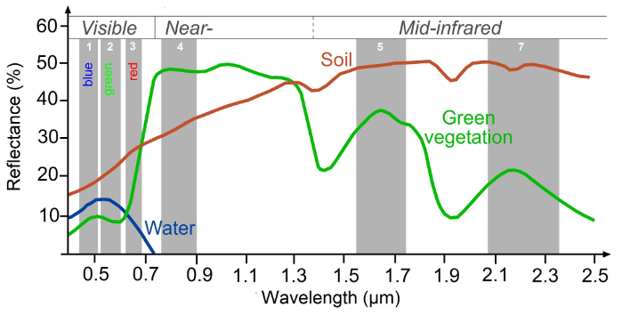
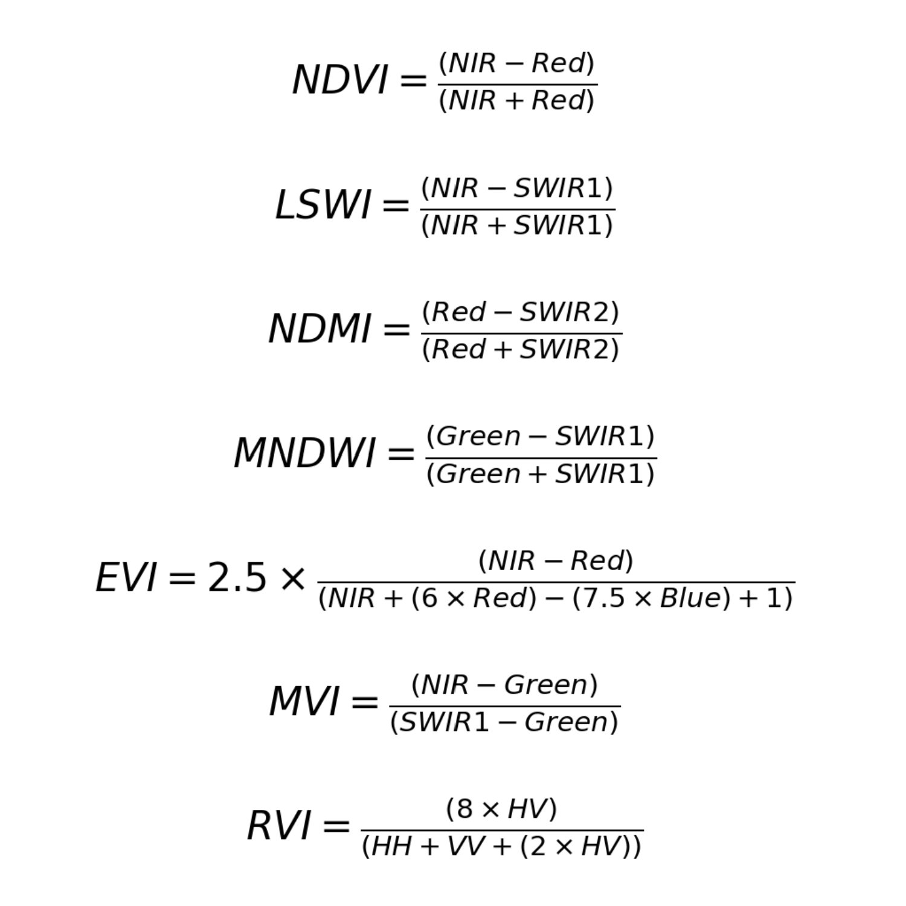

# Spectral Indices Background

All radiation, or electromagnetic energy, travels in waves or varying sizes. Those differences can be viewed on the electromagnetic spectrum below. 

Optical remote sensing instruments such as Landsat and Sentinel 2 measure the reflectance of light from the surface of the earth, capturing specific wavelengths on the spectrum of visible to infrared light. These are what we call "bands." We can plot out how much of different wavelengths of light are reflected and absorbed by different land surface types, giving us the "spectral signatures" of those objects.

A common example is healthy, green vegetation, where red and blue wavelengths are absorbed, while green and infrared wavelengths are reflected or emitted back. Soil, on the other hand, strongly reflects most wavelengths and has an especially strong reflectance in shortwave infrared wavelengths. The total amount of light that is reflected or emitted also differs between objects. Snow, for instance, reflects up to 90% of solar radiation, while the ocean only reflects around 6%. However, the ocean also emits far more infrared radiation than snow, since most of the energy that is absorbed gets re-emitted. All of these differences make up an object’s unique spectral signature that can be measured and used for further analysis.

Looking at the spectral signature curves of different land cover types, we can begin to pick out which wavelengths of light can be most useful in making indices that distinguish between these different objects.

We can do calculations with specific bands in order to highlight differences between them and normalize the noise between images from different dates or locations. These transformations are called spectral indices. 

Many of the most common ones are called "normalized difference" indices, in which the difference between two bands is divided by the sum of those bands, resulting in values between -1 and +1. Generally, a band with strong reflectance and a band with strong absorption are chosen for the calculation. These indices are usually developed for highlighting specific land cover types, with high values indicating a high likelihood of a land cover type or a certain characteristic of a land cover type.

For example, the Normalized Difference Water Index is good for mapping water level changes during flooding events; the Normalized Burn Ratio is good at detecting soil brightness; and the Normalized Difference Vegetation Index is good for tracking changes in vegetation (although this index does saturate quickly). In some cases, it is best to use derived band combinations that have been customized to represent the phenomenon of interest, such as using the Normalized Difference Fraction Index to monitor forest degradation.

In our LULC classification workflow, we calculate the following indices:

* **NDVI:** Normalized Difference Vegetation Index - highlights vegetation health and density; calculated using the NIR and red bands

* **LSWI:** Land Surface Water Index - highlights vegetation and soil water content; calculated using the NIR and SWIR1 bands

* **NDMI:** Normalized Difference Moisture Index - highlights vegetation water content; calculated with the red and SWIR2 bands

* **MNDWI:** Modified Normalized Difference Water Index - highlights open water; calculated using the geen and SWIR bands

* **EVI:** Enhanced Vegetation Index - highlights vegetation health and density; calculated using the NIR, red, and blue bands

* **MVI:** Mangrove Vegetation Index - highlights mangroves; calculated using the NIR, green, and SWIR1 bands

* **RVI:** Radar Vegetation Index - highlights vegetation density and structure; calculated using the HV, HH, and VV polarizations

