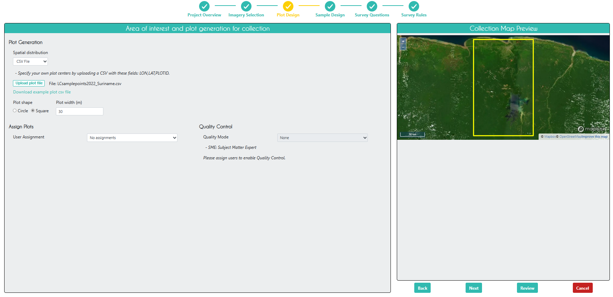
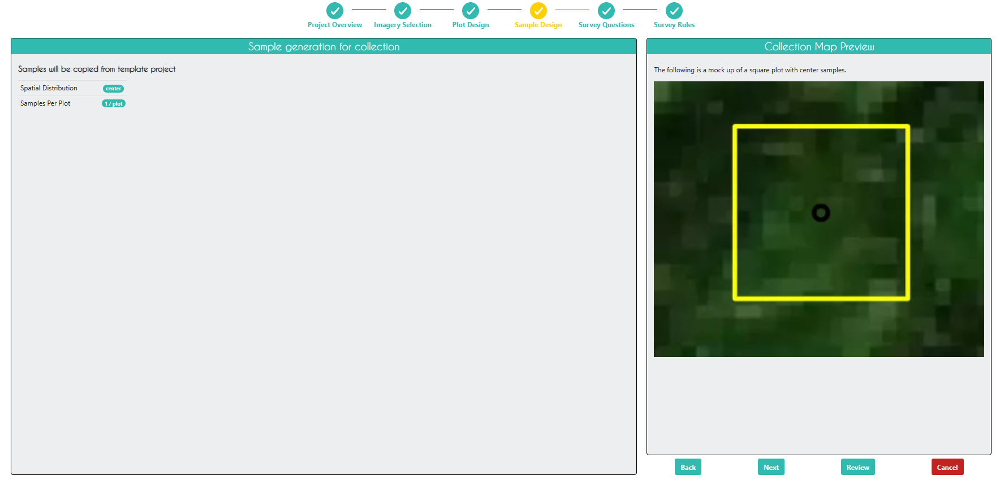
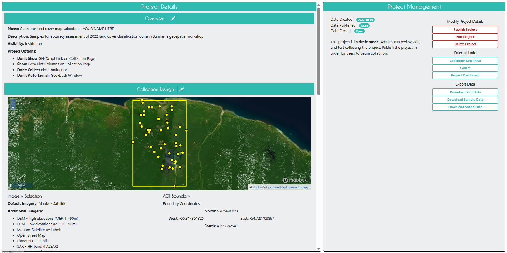
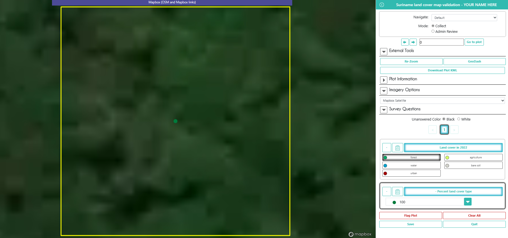

# Sample-Based Map Validation and Area Estimation (with GEE, CEO, & SEPAL)

# Overview

In this workflow, we will create a stratified random sample of a land cover map, and use to conduct an accuracy assessment and area estimate of the strata in the land cover map.  We will make the stratified random sample in GEE, collect validation data at those points in CEO, and then calculate error matrices and estimate the true area of each land cover stratum in SEPAL.

For this exercise, we will use System for Earth Observation Data Access, Processing, & Analysis for Land Monitoring (SEPAL). It is a cloud-based computing software designed by the United Nation’s Food and Agricultural Organization (FAO) to aid in remote sensing applications in developing countries. 

SEPAL is essentially a system for accessing, processing, & analyzing earth observation data for land monitoring.  It enables users to create image composites, process images, download files, create stratified sampling designs, and more.  SEPAL is part of the Open Foris suite of tools,, and it integrates with Collect Earth Online (CEO) and the Google Earth Engine (GEE). 

### **[Detailed instructions on pre-workshop setup](https://docs.google.com/document/d/16N5wXbWi767AG4k-BPusu9Gc0HXKrY9qACFN9JZkiAA/edit?usp=sharing)**    

1. Create a new script file in your own script repository - name it 'Area Estimation - Sample Design'. Keep in mind a master copy is available in the above script repository.
2. Check the full script - [https://code.earthengine.google.com/074c57c9a2487dc88f4cbad30669e5d7](https://code.earthengine.google.com/074c57c9a2487dc88f4cbad30669e5d7)
3. If you need to check any of the documents or data from this exercise, you can find them in this Google Drive folder - [https://drive.google.com/drive/folders/1MvRha9K4355wRICQs-jGy2Uw0BPBQ3Kr?usp=drive_link](https://drive.google.com/drive/folders/1MvRha9K4355wRICQs-jGy2Uw0BPBQ3Kr?usp=drive_link)

# Create Classification Map in GEE

At the end of the [Intermediate Google Earth Engine: Mangrove Use Case](https://servir-amazonia.github.io/guyana-training/gee-mangrove#intermediate-google-earth-engine-mangrove-use-case) module, you should have written code to export your random forest mangrove classification as a GEE Asset and a Google Drive file.  If you have not done this, please do so now.

Open your script titled "Mangrove Classification - Landsat", and make sure this code is in the script and run it.

```javascript
// Export classified map as a GEE Asset to use for further analysis
Export.image.toAsset({
  image: RFclassification,
  description: 'toasset_mangroveclassification_RF_Guyana',
  assetId: 'users/ebihari/GuyanaWS/images/mangroveclassification_RF_Guyana',
  region: aoi,
  scale: 30,
  crs:'EPSG:4326',
  maxPixels: 1e13
});

// Export classified map to Google Drive to use for further analysis
Export.image.toDrive({
  image: RFclassification,
  description: 'todrive_mangroveclassification_RF_Guyana',
  fileNamePrefix: 'mangroveclassification_RF_Guyana',
  region: aoi,
  scale: 30,
  crs:'EPSG:4326',
  maxPixels: 1e13
});
```

Now, when you run your code, these two export tasks should appear in the **Tasks** tab.  Run both of these tasks, filling out the names and locations you want the files to be put.


From your Google Drive, download this .tif of the classification to your computer.

# Create Validation Points in GEE

In the new GEE script you created called 'Area Estimation - Sample Design', import the magrove classification asset.

```javascript
//--------------------------------------------------------------
// Import Giri et al. Mangrove Map
//--------------------------------------------------------------

// // Load the mangrove extent image collection
// // clip to aoi, unmask, rename band
// var giriMangrovesTT = ee.ImageCollection("LANDSAT/MANGROVE_FORESTS")
// // .filterBounds(aoi)
// .mosaic()
// .unmask(0)
// // .clip(aoi)
// .rename('class')

// // Add image to map
// Map.addLayer(giriMangrovesTT,{min:0,max:1},
//             'Giri mangrove extent map',false)

//--------------------------------------------------------------
// Import Classification Map
//--------------------------------------------------------------

// import mangrove classification from previous activity
var mangrove = ee.Image('users/ebihari/mangroveclassification_RF_Guyana')

// define color palette for the classified image
var colorPalette = ['800000', 'c0ff33'];

// add classified image to map
Map.addLayer(mangrove, {min: 0, max: 1, palette: colorPalette}, 
            'RF mangrove classification');
```

Then, create a stratified random sample with 10 points in the areas classified as mangrove, and 10 points in the areas classified as not mangrove.  In a real project, you would want to collect many more validation points for this big of an AOI, but we will keep it simple for this exercise.

```javascript
//--------------------------------------------------------------
// Create Stratified Random Sample
//--------------------------------------------------------------

// create stratified random sample from the processed mangrove raster
// values in 'class' property: 0-Not Mangrove,  1-Mangrove
var samplePts = mangrove.stratifiedSample({
  // total # points
  numPoints:20, 
  classBand:'classification', 
  region:mangrove.geometry(), 
  scale:30, 
  projection:'EPSG:4326', 
  seed:1010, 
  classValues:[0,1],
  // # points in each class
  classPoints:[10,10], 
  dropNulls:true, 
  tileScale:2, 
  geometries:true});
print('Sample points:', samplePts);

// Add points to the map
Map.addLayer(samplePts,{},'sample points');
```


Export these sample points as both GEE Assets and Google Drive files.  You will need to do some extra formatting to get the data in a format that CEO and SEPAL will accept.  You need to add columns called `PLOTID`, `LON`, and `LAT`, `SAMPLEID`, and `classification_readable` (which is just a column for the classification values in a readable "mangrove"/"not mangrove" format, and will come in handy when doing our analysis in SEPAL)

```javascript
//--------------------------------------------------------------
// Export Stratified Random Sample
//--------------------------------------------------------------

// create a dictionary to store class names
// 0-Not Mangrove,  1-Mangrove
var classLookup = ee.Dictionary({
  0: 'not mangrove',
  1: 'mangrove'
});

// write a function to rename the columns 
// so that the format is accepted by CEO
function ceoClean(f){
  // LON,LAT,PLOTID,SAMPLEID, readable classification column
  var fid = f.id();
  var coords = f.geometry().coordinates();
  var classValue = f.get('classification');
  var className = classLookup.get(classValue);
  return f.set('LON',coords.get(0),
              'LAT',coords.get(1),
              'PLOTID',fid,
              'SAMPLEID',fid,
              'classification_readable', className);
}
print("First sample point:",ee.Feature(samplePts.map(ceoClean).first()));

// map that function to the sample points feature collection
var samplePts_CEO = samplePts.map(ceoClean);

print('Sample points with PLOTID:', samplePts_CEO);

print("Class labels and number of samples:",
      samplePts_CEO.aggregate_histogram('classification_readable'));

// Export points to Google Drive to use in further analysis
Export.table.toDrive({
  collection: samplePts_CEO,
  description: 'todrive_mangroveclassification_samplepoints_Guyana',
  fileNamePrefix: 'mangroveclassification_samplepoints_Guyana',
  selectors: 'LON,LAT,PLOTID,SAMPLEID,classification,classification_readable'
});
```

From your Google Drive, download this .csv of points to your computer.

Code Checkpoint: [https://code.earthengine.google.com/074c57c9a2487dc88f4cbad30669e5d7](https://code.earthengine.google.com/074c57c9a2487dc88f4cbad30669e5d7)

# Collect Validation Data in CEO

Log in to CEO.  On the main CEO page, in the search bar at the top left, search for an institution called “Guyana Geospatial Workshop.” Click `Visit`.


## Create a CEO Project

On the institution’s home page, go to the `Projects` tab and click `+ Create New Project`.  

The workflow for creating a new project should appear. On this first `Project Overview` page, under `Select Template`, select the "Mangrove map validation and are estimation" project that is already present in the insitution, and click `Load`.  All of the project parameters should now be identical to the project that has already been created.

You can also create a project from scratch, but for the sake of simplicity, we will use this project template that has already been made for you.  If you want to model a CEO project off of another project but create entirely new plots/samples, you can uncheck `Copy Template Plots and Samples`.

Then, **add YOUR NAME to the end of the project name**.  This way, everyone in the workshop will have their own project to work in.  


Click `Next`.

On the `Imagery Selection` page, you can change the imagery that will be available when collecting data.  You will see the default CEO imagery data sets under `Public Imagery`, as well as the imagery data sets you or someone else manually uploaded to your institution under `Private Institution Imagery `.  Here, we have already uploaded the Giri mangrove map we originally used to sample from when we were training our random forest mangrove classification model (we will return to how this was done in a bit).


On the `Plot Design` page, you cannot change the parameters because `Copy Template Plots and Samples` was checked on the `Project Overview` page.  There are 20 plots centered on our validation points exported from GEE.  They are square and 30m in width because the Landsat data used for our classification has a resolution of 30m.


If `Copy Template Plots and Samples` was not checked, this page would look like this, and you would need to upload the .csv file with the validation points that was exported from GEE.



Click `Next`.

On the `Sample Design` page, you also cannot change the parameters because `Copy Template Plots and Samples` was checked on the `Project Overview` page.  Each plot corresponds to a single sample located in the center of the plot.



If `Copy Template Plots and Samples` was not checked, this page would look like this, and you would be able to create multiple samples within each plot.


Click `Next`.

On the `Survey Questions` page, you can create various types of sruvey questions related to your plots and samples. You can create parent and child questions so that certain questions only appear if the parent question was answered in a certain way.  You can also organize your questions into survey cards that are presented separately, which is particularly helpful when looking at land use change for different time periods.

For this exercise, we have one simple survey question asking about whether the plot is mangrove or not.  On the right, you can see an example of what the survey question will look like when collecting data.


Click `Next`.

On the `Survey Rules` page, you can create rules related to your survey questions.  You can set the rules so that CEO does not accept certain answers if the other questions were answered in a certain way.


Click `Next`.

On the `Review` page, you can check that everything looks good and create the project.  Check the box agreeing to the terms and conditions, and click `Create Project`.


At this point, you can still edit the project.  In order to start collecting data, you will need to click `Publish Project` on the next page, but you will now lose your ability to edit the plot and sample design.



Go back to the institution home page, and click on `Imagery`.


Click on the `edit` button for the last imagery on the page called "Global Mangrove Forests Distribution".  Here, you can see how to add a new type of imagery to a project.  There are some data sets already available in CEO, like Sentinel and Planet, but you can also import any public GEE image/image Collection or any private GEE asset.  You just need its asset ID, a start and end date, and some parameters for its visualization.


## Collect Data in the CEO Project

Now that you have published your project, go back to the institution home page and click on your project you just created to start collecting data.  It should be red before you start collecting data, yellow after you start collecting data, and green when you finish collecting data for all plots.


Select `Collect` and click `Go to First Plot`.


It should take you to the first plot.  Here, you can view the original Giri et al. mangrove classifications in `Plot Information`, as well as all the imagery that was selected for this project in `Imagery Options`.  



If you want some more high resolution imagery to help in your decision, click `Download Plot KML`.  Now, open this file, and Google Earth Pro will open with the plot geometry already loaded in on top of Google Earth imagery.


Once you have opened Google Earth Pro, click on the clock icon on the toolbar at the top of the screen.  A bar showing a timeline of dates will appear at the top left corner of the screen.  You can use this bar to look at all historical and current Google Earth imagery available for this location. 


Go back to the CEO project.  In `Survey Questions`, select whether the plot was mangrove or not, and click `Save`.  

**It is very important to click `Save` after EVERY plot you finish!**  


When you click `Save`, it should take you to the next plot.  Go through all 20 plots and select whether it was mangrove or not.  When you are done (and have saved each plot individually), click `Quit` to exit data collection mode.

Now that you have finished collecting data in your project, go back to the institution home page and click the `S` button to the right of your project.  This will download the data as a .csv file.  The file you download will retain the original columns from the sample points we generated in GEE and uploaded to CEO as a .csv (with `pl_` added to the column name).


# Assess Accuracy and Estimate Area in SEPAL

Make sure you have all relevant files downloaded to your computer.  This includes your CEO validation data (.csv) and your GEE classification (.tif).

Log in to SEPAL.

## Upload GEE and CEO files

Go to the `Apps` tab at the far left side of the screen.  In the search bar, type "Jupyter" and click on `Jupyter Notebook`.


In the Jupyter Notebook screen that appears, click `Upload` at the top right.  Select the two files to upload from your computer - CEO validation data (.csv) and your GEE classification (.tif).


Now click `Upload` again for both files.


Now, if you go to the `Files` tab at the far left side of the screen, you can see all of the files you have uploaded or created in SEPAL.


## Calculate Strata Areas

Open a new tab by clicking the `+` at the top right of the screen. 


Now click on the `Apps` tab at the far left side of the screen.  In the search bar, type "Stratified" and click on `Stratified Area Estimator - Design`.  


This is an app you can use for creating validation sample points that you can import for plot locations in CEO, just like we did in GEE.  The benefit of this app is that is helps you choose the number of points you need in each strata based on expected user accuracy and desired standard error.  However, we are just going to use this tool to calculate strata areas, which will be needed for the accuracy assessment and area estimation.

Click on the `Map Input` tab at the left, and under `Data Type`, click `Input`.  Select the GEE classification map (.tif) you have uploaded into SEPAL.


Click on the `Strata Areas` tab at the left.  Click `Area calculation and legend generation`, then enter "not mangrove" for class 0 and "mangrove" for the other class, and then click `Submit legend`.  The calculated strata areas, along with their original class values and new names should appear under `Legend Areas` in the top left.  Rename the file and click `Download area file`.  This will download a .csv file of this info to your computer.


You will need to reupload this file again through Jupyter Notebook to use in the next step.

## Create Accuracy Assessment and Estimate True Strata Areas

Open a new tab by clicking the `+` at the top right of the screen, and then click on the `Apps` tab at the far left side of the screen.  In the search bar, type "Stratified" and click on `Stratified Area Estimator - Design`.  


This is an app you can use for creating error matrices and area estimates from your classification map and your validation points.  You can also do these things in Microsoft Excel or another spreadhseet software, but SEPAL simplifies the process and ensure the calculations are done correctly.

Click on the `Inputs` tab at the left. Click `Reference data`, and select the CEO validation points (.csv).  Click `Area data`, and select the GEE strata areas data (.csv) that you just created.  Under `Required input`, select the columns needed for the analysis:

1. the column in the CEO data with the answers to the question related about mangrove presence (mangrove/not mangrove)
2. the column in the CEO data with the original GEE mangrove classification values (mangrove/not mangrove)
3. the column in the SEPAL map areas data with the strata areas of the mangrove classification (# pixels)
4. the column in the SEPAL map areas data with the updated strata names that matche the CEO and GEE classes (mangrove/not mangrove)


Click on the `Check` tab at the left. Under `View Samples`, select the latitude and longitude columns from the CEO data, and check the map to make sure the sample points end up in the right place:

1. `X` should be `lon`
2. `Y` should be `lat`


Click on the `Results` tab at the left. Under `Confusion Matrix`, you can view and download the confusion matrix between the CEO validation data and the GEE classification data.  The classification classes are along the side and the validation classes are along the top.

How many points were classified correctly?  How many mangrove points were incorrectly classified as not mangrove by our radom forest classification?  How many not mangrove points were incorrectly classified as mangrove by our random forest classification?


Under `Area estimates`, you can view and download the area estimates of the strata, along with a confidence interval.  SEPAL calculates 2 area estimates - based on the assumption that the sample was a stratified random or simple random sample.  You can also view producer's and user's accuracy as a percentage.  

How many square kilometers are covered by mangrove and not mangrove in our study area?  What do producer's and user's accuracy mean in terms of this specific map?


Of course, in reality, you will use these tools with much more complex data, like land cover classifications with many classes or land cover change maps that capture changes over many years.  You may also have data where the strata in the validation data and the classification data are not exactly the same (e.g. there are more substrata captured in the CEO validation data) - and in this case, you will need to do these calculations in Excel.  SEPAL can only handle data sets in which the strata are identical between them.


