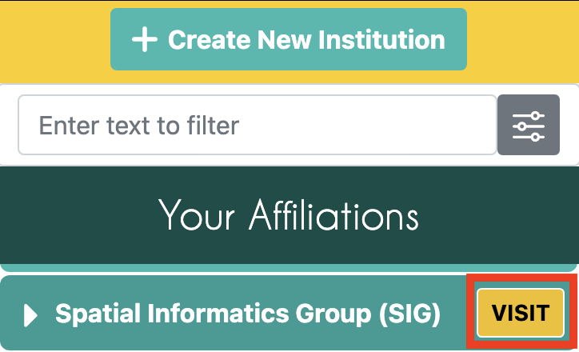
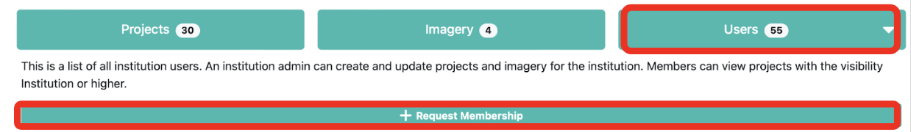
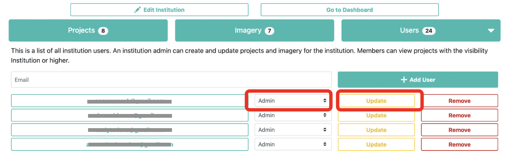

# Extra Resources

## Setting Up Your CEO Account  
1. In your browser window, navigate to https://collect.earth/. CEO supports Google Chrome, Mozilla Firefox, and Microsoft Edge.  
2. Click `Login/Register` on the upper right.  
3. To set up a new account, click on `Register` and follow the instructions. You will receive a welcome email if registration is successful. 
4. You will need to validate your email upon registration. 
5. When you have created an account, login with your email and password. 
6. If you forget your password, click on `Forgot your password?` and follow the instructions.

## Creating an Institution in CEO (pre-prepared)
If your institution is not yet signed up for CEO you can create a new institution which all your team members can join. (An institution has already been created for this workshop: **“Guyana Geospatial Workshop”**)
1. Log in to CEO.
2. Navigate to the Home page and click `Create New Institution’ on the left panel.
3. Enter your institution’s name, URL, and description.
4. Upload a logo from your computer for your institution by clicking `Browse…`.
5. Click `Create Institution` when you are finished.
6. Team members with CEO logins can be added manually to the institution via their email address or they can request to join the institution (see next section).

You can edit the elements of your institution later. If you ever decide to delete the institution all projects within it will be lost.

## Joining an Institution in CEO 
1. A list of all institutions is displayed on the home page 
2. If you are logged in, this list is broken into two: Your Affiliations and Other Institutions. Your Affiliations are institutions to which you belong.
3. Search for your institution’s name — for this workshop use the pre-created institution of **“Guyana Geospatial Workshop”**
4. Next to each institution’s name is a `VISIT` button. Clicking on this will open the Institution page. 
 

5. Click on the `Users` button and click the Request Membership button if you have not already joined the institution.  
 

6. An admin user can then convert all new users from Member to Admin
Admin status allows you to create/edit projects and review points in QA/QC mode
7. After switching the user to Admin you must hit the Update button
 