# Introduction

Welcome to Map Validation with Collect Earth Online (CEO)! This workshop will give an overview of CEO and how to use it for data collection (particularly for map validation).  For the hands-on portion of the activity, the workflow will also incorporate GEE and either Microsoft Excel or Google Sheets.

## Pre-Workshop Set Up   

**GEE**

1. Ensure you are logged into your Google Earth Engine account.
2. Click this link to accept the Suriname GEE script repository - [https://code.earthengine.google.com/?accept_repo=users/ebihari/SurinameWS](https://code.earthengine.google.com/?accept_repo=users/ebihari/SurinameWS)
3. Create a new script file in your own script repository - name it **Map Validation - Sample Design**. 
4. A master copy of the script is available in the script repository - [https://code.earthengine.google.com/?scriptPath=users%2Febihari%2FSurinameWS%3AMap%20Validation%20-%20Sample%20Design](https://code.earthengine.google.com/?scriptPath=users%2Febihari%2FSurinameWS%3AMap%20Validation%20-%20Sample%20Design)

**CEO**

1. Create a [CEO account](https://app.collect.earth/register). Remember the email address you used to make this account.
2. Join the CEO institution for this workshop **Suriname Geospatial Workshop**. If your organization already has a CEO Institution, request to join that institution. We will also cover this step in the workshop, and make an institution if your organization does not have one.
3. Install [Google Earth Pro](https://support.google.com/earth/answer/21955?hl=en) on your computer.

**Google Sheets**

1. Access all relevant .csv files in the Suriname Google Drive folder for training 9 - [https://drive.google.com/drive/u/2/folders/1czeYS5ZdCimR7tlQg-dE7QK8d08mzzIX](https://drive.google.com/drive/u/2/folders/1czeYS5ZdCimR7tlQg-dE7QK8d08mzzIX)

*For the accuracy assessment and area estimate portion of this exercise, we will use a spreadsheet tool such as Microsoft Excel or Google Sheets. However, you can also use a fantastic tool called the System for Earth Observation Data Access, Processing, & Analysis for Land Monitoring (SEPAL). It is a cloud-based computing software designed by the United Nation’s Food and Agricultural Organization (FAO) to aid in remote sensing applications in developing countries.*

*SEPAL is essentially a system for accessing, processing, & analyzing earth observation data for land monitoring.  It enables users to create image composites, process images, download files, create stratified sampling designs, and more.  SEPAL is part of the Open Foris suite of tools,, and it integrates with Collect Earth Online (CEO) and the Google Earth Engine (GEE). Instructions on how to do this kind of analysis in SEPAL can be found in the [SEPAL documentation](https://docs.sepal.io/en/latest/workflows/area_estimation.html#sample-based-estimation-of-area-and-accuracy).*

## Objectives
1. Understand the uses and benefits of CEO.
2. Get set up on CEO with an account and institution, and learn how to create a CEO project for data collection.
3. Understand sample design and interpretation best practices.
4. Learn how to do map validation and unbiased area estimation using CEO.

## What is CEO?
>Collect Earth Online (CEO) is a custom built, open-source, **satellite image viewing and interpretation platform** created to collect reference data needed to classify and monitor land cover / land use change. CEO aims to help organizations across the world gain **an accurate picture of what’s happening on the ground**, detecting the effects of deforestation, forest degradation, crop loss, and other changes in land use.

CEO marks a new approach to data collection. For any Earth observation inventory or mapping effort, gathering reference data is essential. Relying on local experts to interpret satellite imagery offers a cost-effective way to calibrate data and assess map accuracy, eliminating the need for time-consuming data collection in the field.

CEO can be used for a variety of projects related to remote sensing, map making, and resource inventories. Some of the most common uses for CEO are: 
* Producing reference data for map validation 
* Producing reference data for sample-based area estimation
* Producing training data for modeling methods

CEO brings science to non-specialists by providing a free, open-source, intuitive platform for interpreting satellite imagery and answering environmentally critical questions regarding land cover, land use, forestry, and agriculture. CEO has attracted a dedicated global community of users who rely on the platform to drive high-impact work monitoring deforestation and other types of land use change. Initially developed by SERVIR—a joint venture of the National Aeronautics and Space Agency (NASA) and the U.S. Agency for International Development (USAID)—CEO is now supported by a broad base of partners.  

Collect Earth Online (CEO) is available at https://collect.earth/. 

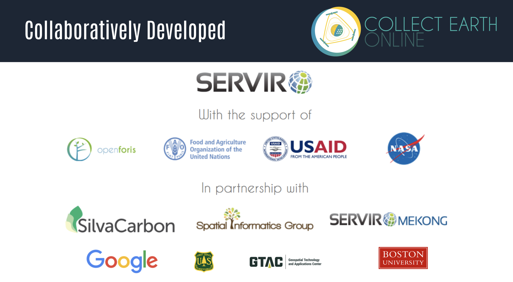 

## Benefits of CEO
* Easy to use even for those with a limited background in remote sensing 
* Implemented online, so users do not need to worry about desktop installation or data backups
* Cloud based software that is free and accessible to all
* Enables multiple users to work simultaneously on the same data collection project
* Software promotes consistency in locating, interpreting, and labeling reference data plots; along with automated quality control options to gauge interpreter agreement 
* Access to multiple sources of satellite imagery for any location on Earth, including datasets like the high-resolution Planet imagery from Norway’s International Climate & Forests Initiative (NICFI)
* Integrated with land cover classification and area estimation tools such as SEPAL and GEE
* Sample data can be used for area estimation required by REDD+ and similar initiatives

## Applications of CEO
* Map validation, reference data for accuracy calculations
* Reference data for model calibration
* Unbiased area and uncertainty estimation
* Monitoring reporting and verification
* Verification for near-real time monitoring models

## Quick tour of CEO

1. **Create a personalized project**: Select imagery options and choose your area of interest, sampling design, and questions to ask.
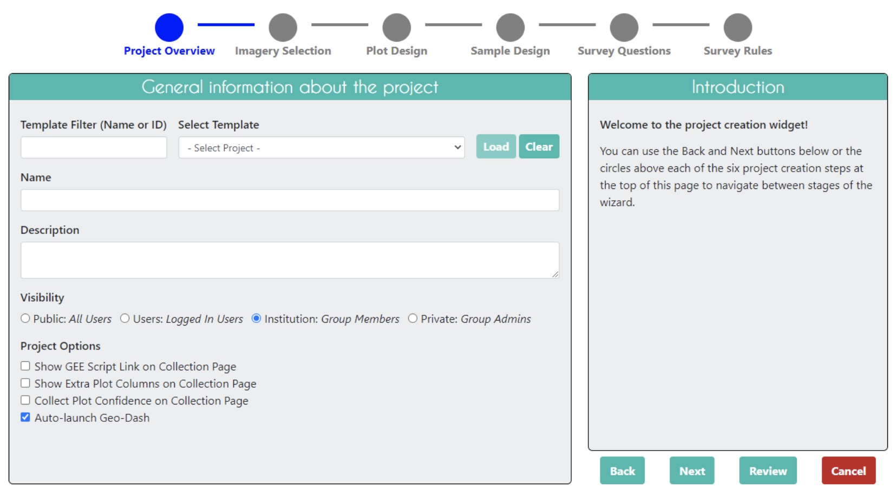 

2. **Collaborate**: Work with colleagues in your organization or with community scientists from around the world — the cloud makes collaboration easy. You can also use CEo to organize the work load for your team, assigning proportions of the samples to team member, and specifying how many samples need to be reviewed by more than one person.

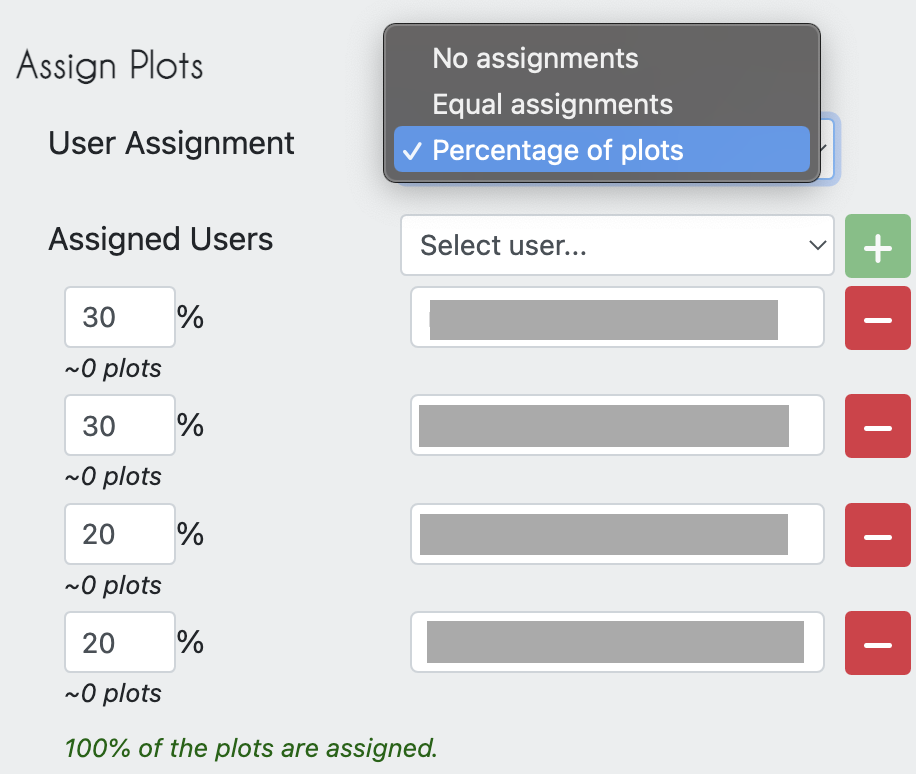 
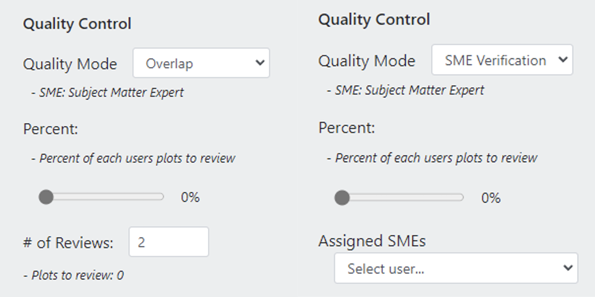 

3. **Collect data**: The intuitive interface makes it easy to collect standardized information about the landscapes you care about.

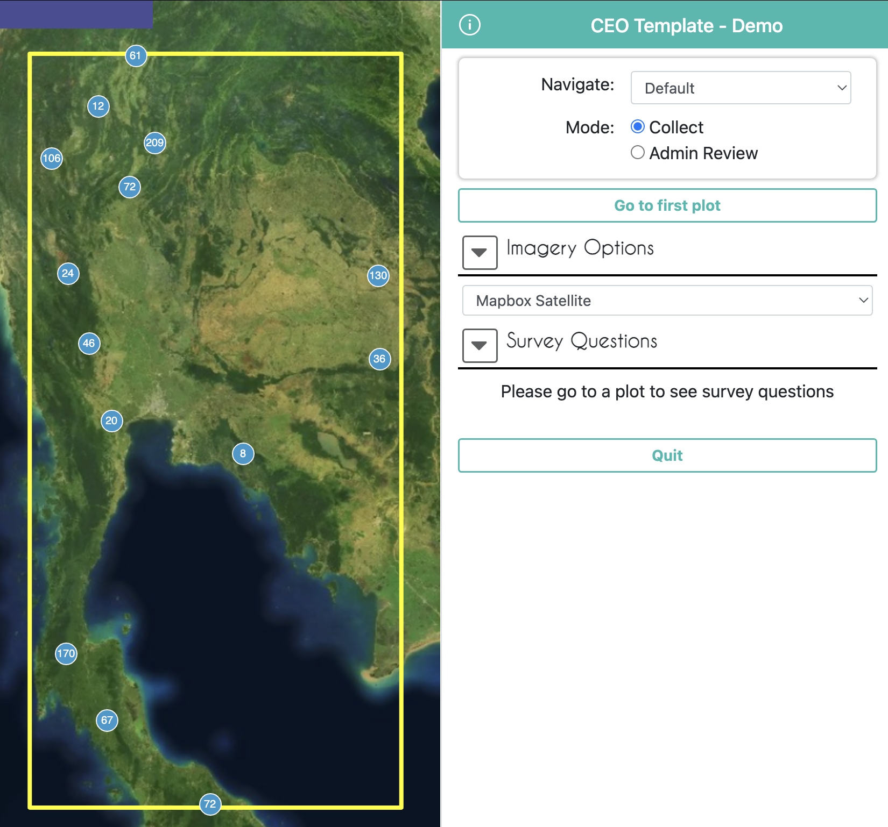 
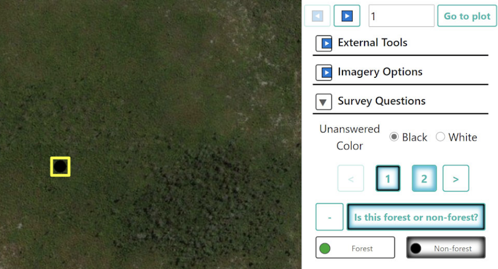 
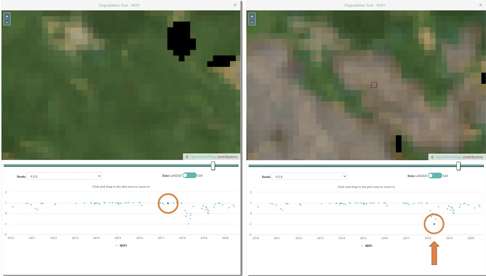

 
# An In-Depth Tour of CEO 

## General Help
*If you ever need help with your work in CEO a good place to start is with the `Support` and `Blog` pages linked at the top of the CEO website. Tutorials are provided for project creation and interpretation* 

## Institution Homepage
The Projects homepage of your institution will contain a list of your group’s projects. Completed projects will be outlined in green, partially completed in yellow, and those without any collected data in red. On the left the projects’ privacy levels will be indicated.
* **Public - All**: All users can see and contribute data to your project. Admins can use your project as a template.
* **Users - Logged in Users**: Any user logged into CEO can see and contribute to your project. Admins can use your project as a template.
* **Institution - Group Members**: Members of your institution can see and contribute to your project. Admins from other institutions cannot use your project as a template.
* **Private - Group Admins**: Only your Institution’s Admins can see and contribute to your project. Admins from other institutions cannot use your project as a template.

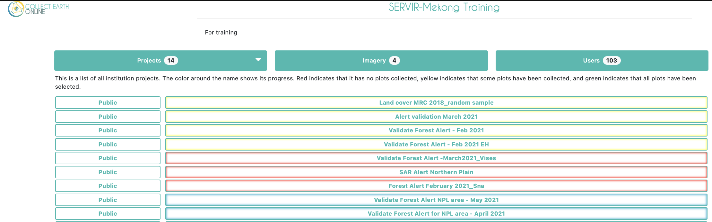 

If you are an administrator of your institution you will also see more buttons to the right of each project. The button with the pencil icon allows you to edit a project. You can edit everything about a project before it is published, but only a few things once it is published and open for official data collection. The trash can button will delete a project, which cannot be undone. The P and S buttons are for downloading collected data from a project. There are two data download options: Download Plot Data, which downloads your data summarized by plot, and Download Sample Data, which downloads your raw data, with information for each point within each plot as its own row. Both are downloaded in .csv, which can be opened in programs like Microsoft Excel or imported into data analysis software. Data downloaded from CEO will be in WGS84 EPSG:4326 format.

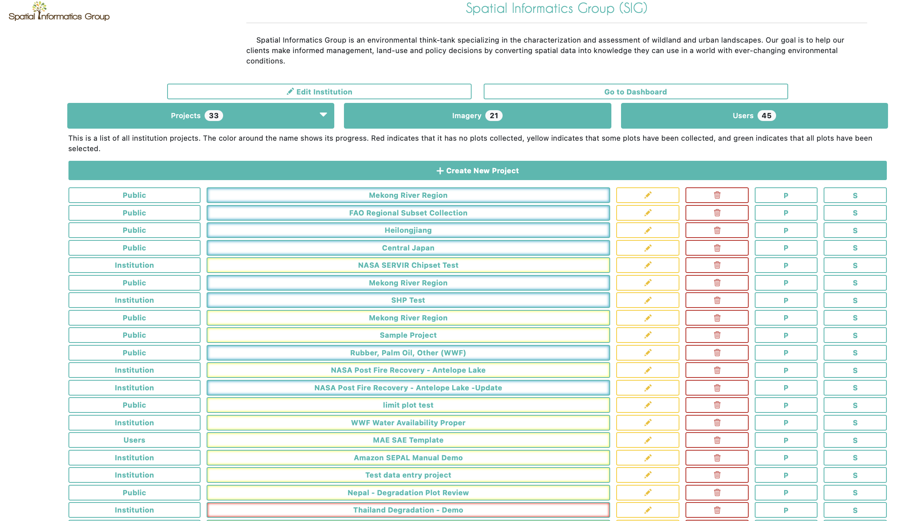 

If you click on the `Imagery` button near the top of the institution page you will see a list of imagery that is built-in to CEO, including MapBox and Planet NICFI data, and any other imagery that has been added to your institution. CEO provides two easy ways to add your own imagery to your projects. The first is by connecting your own imagery via Web Map Service (WMS) or Web Map Tile Service (WMTS), and the second is by connecting your imagery hosted in Google Earth Engine (GEE). More details on how to add your own imagery are available in this [CEO Blog](https://blog.collect.earth/index.php/2022/04/21/connecting-gee-raster-data/) and the [Project Creation Manual](https://www.collect.earth/ceo-guides/#:~:text=Institution%20%26%20Project%20Creation%20Manual%20(English)).

Under the `Users` tab will be a full list of all email addresses that are a part of your CEO institution. These users will have different permissions based on their status as an Admin or a Member of the institution. You can add more CEO users to your institution from this page.

## As an Admin User: What You Will Find Inside a CEO Project?
When creating a project an admin user will start on a page that looks like this.
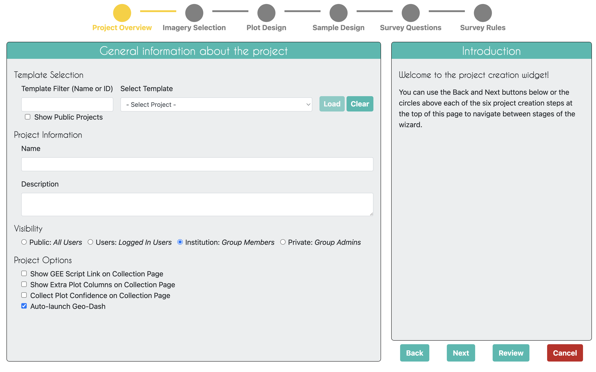 

## As an Interpreter: What You Will Find Inside a CEO Project?
You can begin collecting data under any published project by clicking on the button with that project’s name in your institutions project page. Multiple users can collect in the same project at the same time, as they will automatically be directed to different plots within the project.

This is an example of what a data collector will see at each sample interpretation.
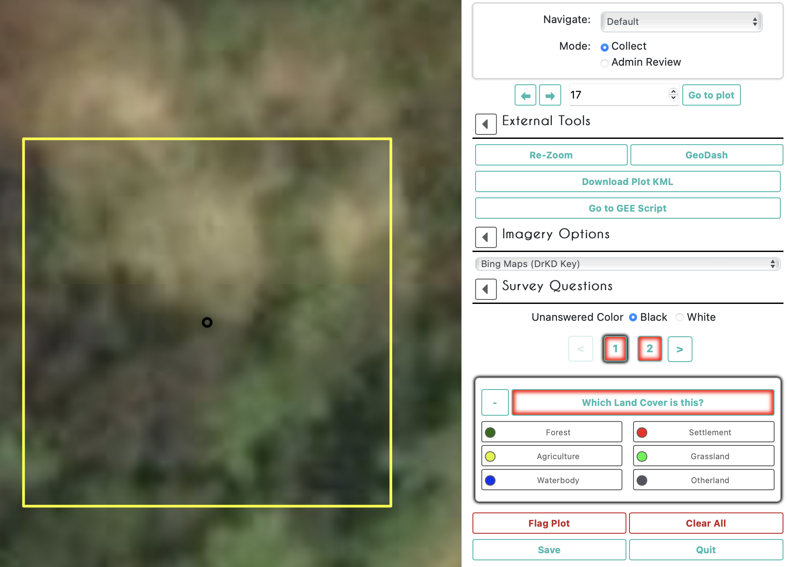 