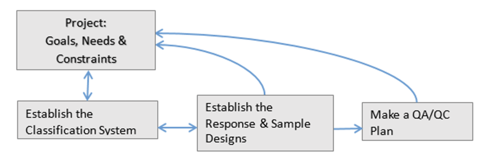
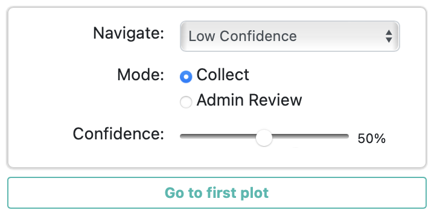

# Designing a CEO Project (& Data Collection Best Practices)

## General Project Planning Procedure

*The following project planning guidelines are available with more detail in this [Project Development Manual for Collect Earth Online](https://www.collect.earth/ceo-guides/#:~:text=Project%20Development%20Theory), which is linked under the CEO website’s Help page.*

You will need to prepare some information in preparation for designing and utilizing a project in CEO.

The recommended steps include: 
1. Identifying the project’s goals, needs, available resources, and constraints; 
    - Know the primary project objective and describe how CEO will support it. What will be measured? What data and/or tools are needed in CEO to make your interpretations?
2. Creating a system of land use and land cover (LULC) for your project
    - A LULC cover classification system needs to meet certain criteria in order to be useful and properly defined. The most important criteria are that the classification be exhaustive and exclusive; that is, all areas in the study area can be assigned to a category (exhaustive) and can only be placed in one category (exclusive). If a classification is not exhaustive, then some areas will be left unclassified at the end. This will create problems when it comes to estimating error and uncertainty. If the classification is not exclusive, then it may be ambiguous what category an area should be placed in, and this becomes a matter of individual interpretation.  
3. Creating a photo interpretation key
    - Keys are the collection of rules, imagery, and guidance used to classify land cover elements in earth observing imagery. Well made, comprehensive keys are the cornerstone of effective image interpretation work, and they allow for much more consistent and reliable results.  Keys most often include example images representing each class. These should be selected to show the variability of that class within the range of different areas the project will cover. 
4. Establishing your sample and response design 
    - Determine your desired total sample size, taking into account the time needed for reviewing these samples more than once. You also must determine how the samples will be distributed, such as in a grid or as a stratified sample, and whether the sample locations will be generated inside or outside of CEO.
5. Making a quality assurance and quality control (QA/QC) plan
    - Quality assurance is a system of practices that should be employed through the entire process of planning a project and collecting data to ensure a good result, and part of that process should be quality control or checks, that actively verify the status of data as good or bad.

This process may be presented as if it were strictly linear, beginning at step one and ending with data collection after step 5. In reality, each of these steps will influence the others. It’s often useful to have developed your response design and unit of assessment before producing a key, for instance. However, you may not be able to determine what your response design will be until after you’ve reviewed a lot of imagery during key creation. Ultimately, it’s best to consider the process presented here as one that is iterative; likely you’ll want to review each step again after you’ve gone through them once. You’ll arrive at a more sound, thoroughly considered project by iterating through the project creation process.  

At each stage, decisions are made and evaluated in terms of goals, needs and constraints. In some cases, goals may need to be revised. Because of this, it’s extremely useful to design a small pilot for your larger project. Running through the entire project creation process and collecting data will help to reveal any possible problems, unforeseen obstacles, and other considerations that will help you revise your approach to produce the best possible results. 

 

 
Iterative Collect Earth Online project planning process. (citation: CEO Theoretical Manual)

In this summary we are going to investigate more deeply Step 3 and Step 5 of the project planning process. These are especially important for ensuring high quality data is collected by your team when using CEO. The interpretation key will be intimately linked with the goals and design of your CEO project and should be the resource continually referenced by interpreters when collecting data in your project. This interpretation key document is part of the QA/QC for your data collection, but there are also some QA/QC features built into CEO that you can utilize. 

## Creating an interpretation key in CEO
Being able to identify land cover types using remote sensing data and time series information is an important skill for creating training data, verifying algorithm outputs, and creating sample-based estimates of area. An interpretation key is important to support all of these tasks and serves multiple purposes, including:
1. Creating consensus. The interpretation key helps your team build a shared understanding of what each land cover type is and how to identify it. This means that if you have multiple interpreters, they should be able to classify land cover categories in the same way.
2. Creating documentation. The key records what your team considers the land cover types in your region and what each type looks like. This is important for funding and publishing.
3. Creating institutional knowledge. An interpretation key allows new team members to understand what existing team members consider to be defining characteristics of each land cover type. This helps your new team members start collecting data and contributing to your project quickly and accurately.

Additionally, the development of the key itself encourages discussion and critical thinking about how the interpretation will be done. If the interpretation process is repeated at a later date, in order for the key to be useful it should be reviewed, updated as needed to reference newly available information, and used to train new interpreters.

> We are not spending much time on the topic of developing an Interpretation Key during this workshop, but this step is **VERY IMPORTANT** and time should be taken to do this well. Collaboratively develop this resource so it is useful to your team and can be **repeatedly referenced and improved** throughout your data collection.

## Planning QA/QC in CEO 
Remember these built-in CEO tools for quality control. Will you use one or a combination of these tools? 

    
     
     

