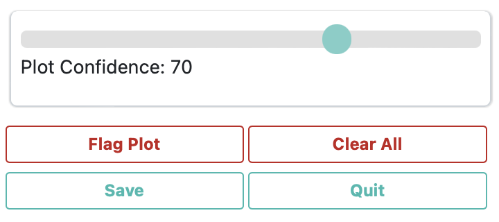

# Creating a CEO project

## CEO Imagery
Before you start making a project take a look at what imagery is established for your CEO institution. Determine whether you would like to add any more imagery options to your institution so they can be utilized in your project. Some imagery is already built into CEO, and some (BingMaps, Planet Monthly, Planet Daily, Planet NICFI, SecureWatch, and the MapBox products) will require an API key. You will be asked to provide this key in the CEO imagery setup panel. can be accessed if you have. You can add your own imagery to CEO via Web Map Service (WMS) / Web Map Tile Service (WMTS), or by connecting to your publicly shared imagery hosted in Google Earth Engine (GEE).

*Note, we have created an extensive how-to and troubleshooting guide for adding GEE Image Assets and Image Collection Assets to CEO. It is available in CEO’s blog [here](https://blog.collect.earth/index.php/2022/04/21/connecting-gee-raster-data/). General directions on how to add your own imagery using GEE are provided below, which you can try out after this workshop.*

&nbsp;

>*Bonus Material for After Workshop* - Adding a GEE Image Asset

>* Google Earth Engine (GEE) Assets include user’s uploaded assets along with assets provided by other users and GEE. Information on Assets can be found [here](https://developers.google.com/earth-engine/guides/asset_manager). More detail on uploading your own assets is below. Note that Image Asset refers to a single image (e.g. a GeoTIFF layer) while ImageCollection Asset refers to a stack of images (e.g. GeoTiff layers of the same location over different dates).
>* **Title**: This will be the displayed name of the imagery.
>* **Asset ID**: The Asset ID for your image asset. Will have a format similar to: USDA/NAIP/DOQQ/n_4207309_se_18_1_20090525
>* **Visualization Parameters (JSON format)**: Any visualization parameters for your layer. For example, {"bands":["R","G","B"],"min":90,"max":210}
>* If you want to add this imagery source to all of your institution’s projects, check the box next to Add Imagery to All Projects When Saving.
?6. When all fields are filled out, click on `Add New Imagery`.

> 

If you are unfamiliar with GEE, directions for uploading your own image assets to GEE are provided below. You must have a GEE account to complete this process.

&nbsp;

>*Bonus Material for After Workshop* - Adding a GEE ImageCollection Asset

>* Google Earth Engine (GEE) Assets include user’s uploaded assets along with assets provided by other users and GEE. Information on Assets can be found here: https://developers.google.com/earth-engine/guides/asset_manager. More detail on uploading your own assets is below. Note that Image Asset refers to a single image (e.g. a GeoTIFF layer) while ImageCollection Asset refers to a stack of images (e.g. GeoTiff layers of the same location over different dates).
>* *Title*: This will be the displayed name of the imagery.
>* Asset ID: The Asset ID for your image asset. Will have a format similar to: LANDSAT/LC08/C01/T1_SR
>* **Start Date**: The default start date of imagery to display.
>* **End Date**: The default end date of imagery to display.
>* **Visualization Parameters (JSON format)**: Any visualization parameters for your layer. For example, {"bands":["B4","B3","B2"],"min":0,"max":2000}
If you want to add this imagery source to all of your institution’s projects, check the box next to Add Imagery to All Projects When Saving.
>* When all fields are filled out, click on [Add New Imagery].
>* Note that to display the GEEImageCollection, CEO uses the “mean” reducer in Earth Engine. This takes the mean of any images in the image collection during the time period specified.

&nbsp;

## Creating a CEO Project Without a Template
* Login to your CEO account. If you are already the administrator, navigate to your institution’s landing page by typing in the institution’s name and then clicking on the Visit button.
* If you are not an admin, you will need to request admin privileges from others in your team that are registered as admin for your CEO institution. Only admins can make CEO projects.
* When you are on the institution’s page, on the Projects tab, you can click on the “Create New Project” button to make a new project. It is located at the top of the page, followed by the list of existing projects belonging to the institution. 
 

* This will direct you to the Create Project interface. We will now talk about what each of the sections on this page does.

&nbsp;

### Project Overview Page
 

1. Skip over the Select Template feature for now. We will try that in the next demonstration.
2. Next enter the project’s Name and Description. The Name should be short but informative so you can distinguish it from other projects in your institution. The Description should also be short yet informative.
    - *Note, if you are making this CEO project for practice alongside other teammates it is a good idea to include your first name and ‘TEST’ in the title. You should be sure to delete the project you create later, if you are only making it for practice, so your organization’s CEO institution does not become cluttered.*
3. Select the project’s Visibility. The Privacy Level radio button changes who can view your project, contribute to data collection, and whether admins from your institution or others creating new projects can use your project as a template.
    - **Public: All**: All users can see and contribute data to your project. Admins can use your project as a template.
    - **Users**: Logged in Users: Any user logged into CEO can see and contribute to your project. Admins can use your project as a template.
    - **Institution**: Group Members: Members of your institution can see and contribute to your project. Admins from other institutions cannot use your project as a template.
    - **Private**: Group Admins: Only your Institution’s Admins can see and contribute to your project. Admins from other institutions cannot use your project as a template.
4. Select Project Options.
    - The first option is **Show GEE Script Link on the Collection Page**. This allows users in Data Collection to click on a button labeled Go to GEE Script. This button will take them to a GEE website tool with additional information about the plot, including annual imagery and time series graphs. An example is shown here:
             

    - The second option is **Show Extra Plot Columns on Collection Page**. This option is only useful if you are using .csv or .shp files to define your Plot Design and that file has extra columns of information. Data collectors will be able to see them on the Data Collection page under Plot Information.  
             
            
    - The third option is **Collect Plot Confidence on Collection Page**. If you want users to be able to tell you how certain they are of their answers to the survey questions, the confidence slider will allow them to assign a value 1-100, where 100 is completely confident of their answers; this value applies to the entire plot. This info will be included in your plot and sample CSV downloads. It can also be used during QA/QC, as you can use this to filter the plots in CEO and only review those with confidence below a certain value.
    

     
     
    

    - The fourth option is **Auto-launch Geo-Dash**. This will automatically open the Geo-Dash interface in a new window or new tab when the data collector navigates to a new plot. Unchecking this option means that data collectors will need to click on the Geo-Dash icon under `External Tools` in the 'Data Collection' interface.
5. Click `Next` when you are finished.

&nbsp;

### Imagery Selection
1. Click the checkbox next to each imagery source you would like to have available for your project. Your users can switch between all the available imagery layers during analysis. 
2. You can change the Default Imagery, which specifies the default imagery that users will see when they begin data collection on your project. 
    - You may choose any of the imagery options available to your institution. The default (public) options are MapBox Satellite, Mapbox Satellite w/Labels, and Planet NICFI Public. PlanetMonthly, PlanetDaily, and SecureWatch do not allow for large area data pulls, so it should not be your default basemap (users will just see a white screen). 

&nbsp;

### Plot Design
1. The Plot Design page will look slightly different based on what Spatial Distribution type (Random, Gridded, CSV File, or SHP File) you have selected. 

     
     
    

2. If you are using CEO’s built-in plot distribution options of Random or Gridded your plot locations will be auto generated given an area of interest (AOI). 
    - The easiest way to select your project AOI is by drawing a box in the map window in the right hand pane (Collection Map Preview). 
        - Locate your area of interest by zooming in/out using the scroll wheel of your mouse, or the + and – boxes in the map window. You can pan the map by clicking on it and dragging the map window. 
        - Hold the CRTL-key (command key on a Mac) down and draw a box while keeping the left mouse key pressed down. 
        - Hold the SHIFT-key down and draw a box to zoom in.
        - The coordinate boxes will populate once the box is drawn and you let your mouse key go. Coordinates are displayed in lat/long using WGS84 EPSG:4326.
    - You can also manually enter your Boundary Coordinates into the boxes provided.
    - The third approach is to upload a project boundary shapefile. To use this option, click on `Upload project boundary`. Navigate to your file, and click `Open` . Your shapefile should be a zipped folder with the requisite shapefile component pieces (.shp, .prj, etc.). Once you click open, you should see the File: text populate with your file name and your project boundary appear in the Collection Map Preview pane.
        - *Note, if you have multi-part polygons each one will be assigned the number of plots indicated. This is indicated in the green text.*
        - This is different from using the SHP File option for the Spatial Distribution, where each point or polygon in your shape file will be a different Plot, which can contain one or more sample points that will be interpreted by one individual.
3. Given your selections for the details of the auto generated distribution, such as plot number, plot spacing, and plot width, CEO will provide an estimate of how many plots will be generated for your project based on your sampling design.
    - Using CEO’s sampling, the maximum number of plots for a project is 5,000. For gridded sampling, you may need to increase the space between plots to avoid exceeding 5,000 plots.
4. If you would like to upload known locations for your plots you would instead select the CSV or SHP File options for Spatial Distribution. Your file must be in the WGS84 EPSG:4326 coordinate system.
    - *Example CSV and SHP files are available for download. When used, the plots should spell out “OK” when used to create a project.*
        - If you are using a CSV file you will be able to automatically generate random or gridded sample points within each plot in the next section. If you are using a SHP file these built-in sample generation features are not available. With either option, you will be able to have one point per plot or provide another CSV file or SHP file in the next section on Sample Generation.
        - If you download the example SHP file, you will notice it is actually a zip file containing (containing SHP, SHX, DBF, and PRJ files). This zip format is required.
    - CSV or SHP file plot locations can be generated in a separate program such as GEE, ArcGIS, or QGIS.
    - **For this tutorial we will use the CSV File pre-downloaded from GEE [link](https://drive.google.com/file/d/1pkTgPXJFrJp7FePiz8UwcB6xEoFEWfYr/view?usp=share_link).** Download it to your computer and take a look at it. **The CSV file you upload must at least contain columns with the specific names of PLOTID, LON, and LAT, like this one**. You can have additional columns with metadata.
        - If you are using a CSV file format it is often easiest to use one file. So you would have one file with the PLOTID, SAMPLEID, LON, and LAT columns. See the next step about Samples Design.
5. Upload the Example CSV File. The file name will appear next to the [Upload plot file] button to indicate when it has uploaded successfully.
    - You will need to specify the 'Plot Shape' and corresponding 'Diameter'. 
6. This is also the point in the project where you can choose to utilize plot assignments and quality control features.
7. Assign Plots – There are three options: No assignments, Equal assignments, and Percentage of plots. 
    - **No assignments** allows all the users to complete as many plots as they want until all plots have been interpreted.
    - **Equal assignments** splits the total number of plots evenly between users.
    - **Percentage of plots** allows for uneven splits.

         
8. Quality Control –  this feature is set to None by default and cannot be implemented unless users have been assigned to the project by their email address (‘Equal assignments’ or ‘Percentage of plots’ options for User Assignment). The following Quality Control options allow multiple users to collect data for the same plot for QA/QC purposes. If this feature is enabled, the project can no longer support User Drawn samples (see next section).
    - **Overlap**: A certain percentage of each users’ plots are reviewed by the other users.
    - **Subject Matter Expert Verification (SME Verification)**: A percentage of each users’ plots are reviewed by one or more SMEs. For example, the SME might be someone with deep knowledge of the local landscape, or a project administrator.

         

&nbsp;

### Sample Design
1. Here we determine how many sample points are within each plot, and whether they are sampled using random sampling, gridded sampling, just a center point, or with predefined locations with a CSV file or SHP file. Using CEO’s built-in sampling, the maximum number of sample points per plot is 200 and the maximum number of sample points for the whole project is 50,000, but you can have more if you are uploading sample locations via a CSV file or SHP file.
2.  For this demonstration we can just choose  **‘Center’** from the Spatial Distribution drop down.

&nbsp;

### Survey Questions 
1. In this section you design the questions that your data collectors/photo interpreters will answer for each of your survey plots. Each question creates a column of data populated with the interpreters’ answers.
2. General recommendations when designing your survey questions:
    - Keep the questions and answers short. It can be difficult to see a long block of text on a smaller screen.
    - Avoid using commas and punctuation in your questions and answers if possible, as this can sometimes cause problems depending on how you are analyzing the resulting CSV file.
    - Think about being the interpreter and what general questions you would want to answer first to familiarize yourself with the sample before answering more in-depth questions. 
    - To save time during interpretation, utilize sub-questions for those questions that would only be necessary to ask if a previous survey question is answered a certain way. (E.g. Only as what year a forest loss happened if the interpreter said a forest loss event did occur, but not if they said no disturbance occurred in the time period of interest)
    - Try to avoid questions that would allow contradictory data in your final results due to human error, or utilize the Survey Rules tool to combat these problematic contradictions from occurring. (e.g. Do not allow an interpreter to say a forest loss occurred, if they had previously said the land cover at the beginning of the time period of interest was non-forest. Either make the forest loss question a sub-question or add a Survey Rule to send the user a warning message if they tried to enter this combination of answers.) 
3. For the Survey Question tab, the left panel allows you to enter questions while the right panel provides a preview of how these questions will appear to your data collectors.
4. Survey Cards are the basic unit of organization. Each survey card creates a page of questions on the Data Collection interface. The basic workflow is: 
    - Create new top-level question (new survey card)  
    - populate answers 
    - create any child questions & answers 
        - *child questions are only asked if a specified answer is given for an earlier question*
    - move to next top-level question (new survey card) and repeat

5. There are several different types of survey questionsThese Component Types include combinations of four question types and three data types. The button-text option is one of the most commonly used. 

*The four question types are:* 

>   - **Button**: This creates clickable buttons, allowing users to select one out of many answers for each sample point.
>   - **Input**: Allows users to enter answers in the box provided. 
>   - **Radiobutton**: This creates radio buttons, allowing users to select one out of many answers for each sample point. 
>   - **Dropdown**: Allows users to select from a list of answers.

*The three data types allowed are:*
>    - **Boolean**: Use this when you have two options for a question (yes/no).
>    - **Text**: Use this when you have multiple options which are text strings. They may include letters, numbers, or symbols.
>    - **Number**: Use this when you have multiple options that are numbers, which do not contain letters or symbols.

6. To create a question, 
    - Select your question type. Try button-text for now.
    - Type your question in the “Question Text” box. Remember to keep it short and avoid special characters if possible.
    - Add an answer, adjust the color of the rectangle if you wish, and click the green plus sign to add that answer before making another answer option.
    - You can delete or edit your questions and answers after you create them, but you must click the green Save icon button next to each edited question or answer.

     
     
    

7. To create a child question, next to Parent Question select the question you want using the drop-down menu.
    - You can then assign one or more 'Parent Answers' through the dropdown menu. Hold down the ctrl button to select multiple answers. When one of the parent answers is chosen, the child question will appear. If you want to have the child question appear regardless of the answer, select all of the answers for 'Parent Answer'.
    - Once you have finished adding child questions with their answers, you can create a second survey card by setting the 'Parent Question' field to None.
    - You can have multiple child questions contingent on different answers from the parent question.

&nbsp;

### Survey Rules
1. This section is optional. Survey rules help ensure users collect logical and correct answers. If you do not want to add any rules, you can just click Next.
2. There are several options for survey rules.  
     

    >- **Text Regex Match**: This rule applies only to Input—text questions & their answers. It allows you to verify if the entered value fits, using regular expressions. However, unless you have a specific reason to use the Input—text question type, consider using Button—text or Radiobutton—text instead. These options are easier for users and will always provide exact text. This rule uses the JavaScript RegExp function, documentation for writing a regular expression can be found [here](https://developer.mozilla.org/en-US/docs/Web/JavaScript/Guide/Regular_Expressions). 
    >- **Numeric Range**: This rule applies to Input—number questions & their answers. With this rule, you can verify that the numeric input falls within a predefined range. 
    >- **Sum of Answers**: This rule applies to any number type questions & their answers. You select multiple questions (2 or more) and specify what the questions should sum to. 
    >- **Matching sums**: This rule applies to any number type questions & their answers. With this rule, you specify two sets of multiple questions (2 or more) that should have equal sums. 
    >- **Incompatible answers**: This rule can apply to any type of question. It allows the user to define incompatible sets of answers. 
     >   - This one can be especially useful when you have lots of multiple choice questions and need to prevent logically impossible combinations that can occur due to user error.

&nbsp;

### Review Project
1. Once the project set up is complete, click on 'Review' in the bottom right-hand corner. 
2. You will now see an overview of your project details. 
3. Scroll through to check that everything is correct.
4. If everything is correct, click Create Project. You will need to accept CEO’s terms and conditions. If you notice a mistake, click Continue Editing to fix it.
5. After you click Create Project, a pop-up window will ask ‘Do you REALLY want to create this project?’ Click OK.
6. Once you are totally satisfied with your project and do not think any more changes will be needed. You can click [Publish Project]. Only a few project edits are possible once it has been published. Official data collection is now possible.

## Creating a CEO Project Using a Template
Creating a CEO project from a template is the same as the previous section except many or all of the pieces will be pre-filled and you only need to make your desired alterations. For example, maybe you made a mistake in the creation of a project and just want to duplicate it so you can alter a few survey questions. Or maybe you were happy with a previous project and want to use the exact same format but collect data for a new set of plots.

1. Login to your CEO account. If you are already the administrator, navigate to your institution’s landing page by typing in the institution’s name and then clicking on the Visit button.
2. If you are not an admin, you will need to request admin privileges from others in your team that are registered as admin for your CEO institution. Only admins can make CEO projects.
3. When you are on the institution’s page, on the Projects tab, you can click on the “Create New Project” button to make a new project. It is located at the top of the page, followed by the list of existing projects belonging to the institution. 
4. To use a template, under the Project Overview section you can use the drop down menu under ‘Select Template’ to see all of the projects owned by your institution. You can click the ‘Show Public Projects’ option if you are looking for a public project created by another institution. 
5. You can use the ‘Template Filter’ to search using a key word or project ID for either public projects or your institution’s projects.

     

6. Once you have selected a project click [Load] and all parts of that project will auto-fill into your new project. See example below where a public project with the partial keywork of “temp” in its title was selected and loaded.

     
7. If you select the ‘Copy Template Plots and Samples’ option the point and sample locations will be pre-loaded. Uncheck this if you want to upload your own new plot locations.
    - For this workshop, uncheck this option so you can try uploading the pre-prepared CSV file from the GEE stratified random sampling script.
8. If you select the ‘Copy Template Widgets’ then the Geo-Dash widgets will be copied. Uncheck this if you want a blank Geo-Dash.
    - You can also load a Geo-Dash template from another project when you get to the [Configure Geo-Dash] on the final project review page, or even after it is published.
9. Make sure you update the name and description of the project so you can distinguish if from the one which you are copying.
10. Make any adjustments you need to the CEO project as needed.
    - Upload any new Plot and Sample Design files. – For this workshop, try using the pre-prepared plot design CSV file exported from GEE on both the Plot Design and Sample Design tabs.
    - If you adjust any survey questions or survey question answers make sure you click the Save icon next to each change you make.
11. When finished, click `Create Project` and then `Publish Project`.

