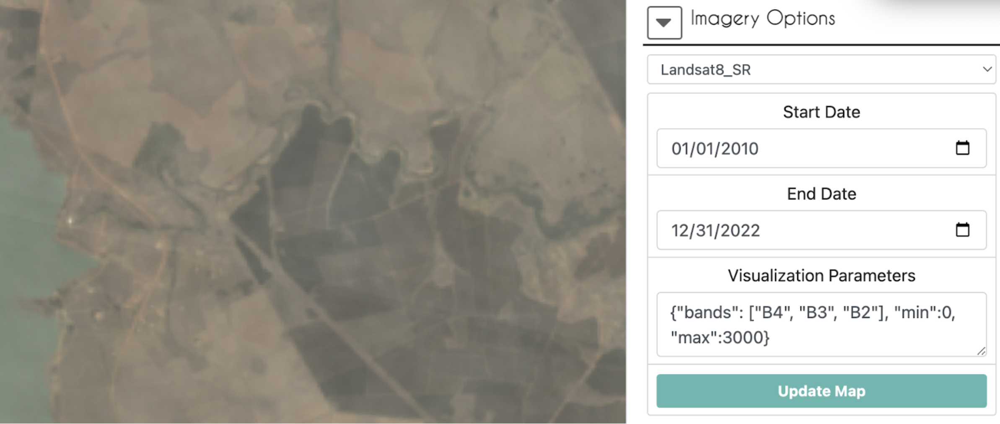

# Image Interpretation in a CEO Project (& Interpretation Best Practices)

*Video on [CEO Sample Interpretation](https://www.youtube.com/watch?v=ldmvBI965WM) - available on CEO website*

The following steps are some general guidelines for sample interpretation. However, these should be updated to match your individual project. In general, it is a good idea to:
* Get a general idea of your sample’s location in the environmental context in space and time by zooming out and by looking at the location over time in Google Earth Pro.
* Utilize multiple sources of information in order to answer the survey questions, including using time-series graphs in the Geo-Dash and imagery options with known observation dates (such as Planet NICFI data, not MapBox).
* Refer to your interpretation key throughout the interpretation process.
* Then be sure to leave a note of the confidence in your interpretation and the reasoning behind your interpretation for later reference 

Below is a more detailed recommendations for a step-by-step interpretation procedure that encourages quality and consistency.

1. Click on the buttons to open the Geo-Dash, go to the GEE script, and download the KML file. Leave these to load and proceed with the other steps.
2. In the main window, zoom out and in to look at the plot in context using Mapbox imagery.
3. Next look at the high resolution imagery in Google Earth Pro using the time slider from the historical imagery tool.  Scan to a date within or close to the time period of interest using the historical imagery tool.

     
    
4. If not enough information is available in Google Earth Pro to answer all the questions, next use the imagery drop down menu in CEO. (Planet and Sentinel data are only available in recent years.)
    - Planet NICFI mosaics to help you interpret the land cover type. Make sure to use the Update Map button each time you change the date. 
    - If still unsure, try using the Sentinel-2 imagery option or look at the Landsat 8 imagery in the GeoDash or GEE too.
    - The Sentinel-1 imagery option may be useful in areas with significant cloud cover difficulty. Note that in addition to land cover, the look-angle of the satellite and degree of moisture can also impact radar imagery.
5. Answer the first survey questions about land cover / land use type. *(Update to match your survey question and delete if not relevant to your project)* For LU/LC determinations try looking at optical imagery from Planet, Sentinel-2, Sentinel-1, and Landsat under Imagery Options. You can also use the time-series graphs in the Geo-Dash and/or GEE Tool. Reference examples of the imagery and patterns for each LU/LC type in your interpretation key.
    - You will need to click [Update Map] each time you change the imagery type, date, or band combination. There are several ways to observe the data.
        - Natural/true color band combinations are simple to use, displaying the image as you would see it with your natural eyesight. Most of the pre-loaded imagery options have the option for true color as a button.
         
             

              
        - Some imagery options may need you to set the visualization parameters for your desired band combination.
            - E.g. True color for Landsat 8: {"bands": ["B4", "B3", "B2"], "min":0, "max":3000}. Note that you only see the most recent image from the time period selected, like the top card in a stack of cards. In this Landsat 8 example 01/01/2010-12/31/2020 is selected, but what you are seeing is a scene from late 2022.
                
        - False-color infrared band combination is meant to emphasize healthy and unhealthy vegetation, and can be used to assess plant density or plant health. Vegetation is red, denser plant growth is darker red, urban areas and exposed ground are gray or tan, and water appears blue or black.

                   
    - The Sentinel-2 imagery option has many other pre-loaded lesser-used band combinations in its drop down menu.
        - General guidelines for identifying types of surfaces with SAR:
            - **Water**: Open, generally calm bodies of water (and other smooth surfaces) appear very dark in images due to the specular reflection they cause.
            - **Rough surfaces**: In general, the rougher the surface, the brighter it appears. Wet rough surfaces appear the brightest due to the dielectric properties of water.
            - **Urban areas**: These areas tend to appear brighter in images due to the double-bounce reflective effect that vertical structures cause. Buildings that are perpendicular to the flight path of the satellite will appear the brightest, while buildings that are not perpendicular will appear less so.
            - **Inundation**: Flooded areas appear brighter because of the double-bounce effect caused by the groundwater onto vegetation or other structures
        - If you are using the band combination VV, VH, VV/VH (false color SAR) then (Note, the stretching of the bands may not be adequate for your area if using the built-in Sentinel-1 option, but you can use an imported composite imagery - See imagery examples in this [resource](https://pro.arcgis.com/en/pro-app/latest/help/analysis/image-analyst/interpret-sar-data-for-flood-mapping.htm)):
            - **Water**: Permanent water bodies will typically appear a very dark blue.
            - **Vegetation**: Plants will cause scattering of the signal and appear green or yellow-green.
            - **Urban areas**: Buildings will appear yellow or pink.
            - **Inundation**: Flooded areas will appear pink due to double-bounce scattering. Looking at these areas over time can be helpful to see the change from a different signal, like green from volume scattering of vegetation, to the strong pink signal.
    - The time-series graphs in the Geo-Dash may also help with questions about LU/LC because they can show patterns of stability, seasonal changes, or changes from harvesting. *(Be sure to add examples of these patterns for LU/LC from your region of interest to your interpretation key)*
6. In order to answer questions on whether land cover change occurred and at when, it is helpful to use the time series graphs, Google Earth Pro, and CEO’s imagery in tandem. Try not to only use one source to answer the questions about the timing of an event unless one source provides a definitive and justifiable answer. *(Update this section so it is relevant to your project and remove if you have no questions about change events)*
    - First go to the Geo-Dash and see if there were any notable changes in the NDFI, NDVI, or NDWI graphs (all these graphs may not be present or necessary for your project). Outlier values that last longer than one observation are more likely a true change. Make note of these dates of interest so you can examine them in the imagery.
        - If the Geo-Dash takes a while to load, refresh the whole page. Sometimes the plots will load faster this way.
        - Within the NDFI graph, if you click on a point measurement, the corresponding Landsat image will appear in the map panel above. This is a good way to see potential land cover changes vs outliers due to clouds, missing data, or temporary events like flooding.  
               
    - Go to the GEE Script, if needed, and use the slider on the Landsat 5 and Landsat 7 time series to examine changes in the yearly mosaics 2000-2010. You can also look at individual Landsat images by clicking on a particular date in the graphs on the right. The maps will automatically update to the selected date for whichever Landsats were available during that time. Make note of the dates where you suspect a change occurred so you can cross reference those dates in the imagery.
        - Time sliders on annual mosaics  
               
        - Individual image selected by clicking date in time on a graph, Dec. 11, 2004 

            
    - Scan through historical imagery in Google Earth Pro and/or the Imagery Options again, cross referencing the dates you noted from the time series graphs to see if a change is evident in the imagery.
    - If your images are unclear or not available at the exact event time in which you are interested, use context clues to make your decision.
        - E.g. If you think a deforestation event happened because of a drop in the NDFI graph, but no image is available in Google Earth Pro until 3 years later, then look for young recovering growth, or evidence nearby of human-caused deforestation such as logging roads or other clearings.
7. In the survey question where you can leave notes, provide information on your reasoning and/or points of confusion in the short answer box and click ‘Save’. Include anything you might want to remember later to justify your reasoning if another interpreter disagreed.  
    

8. If available, be sure to indicate in the slider your level of confidence in your answers, so those with low confidence can be reviewed by the group or another interpreter.  
    

9. Click `Save` at the end of all the questions, making all the numbered boxes have turned blue to signify you have completed them. You can then proceed to another point for interpretation.
10. You should only click [Flag Plot] if the sample point is for some reason unusable. Any answers you provided for this plot will not be saved.
11. If you want to go back to a previously analyzed plot to adjust your answers, change the “Navigate through” option at the top right of the screen from “Unanalyzed plots” to “My analyzed plots” and go to the desired plot number.  
    
