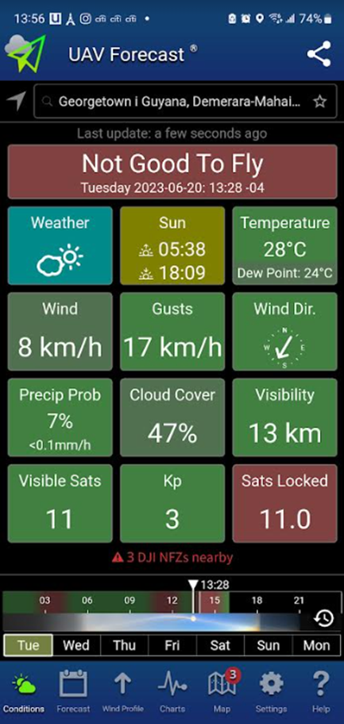
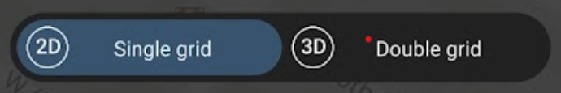

# Part 1 - Drone Flight

In this exercise, we will go over the steps to plan a drone flight and create a flight plan in Pix4Dcapture.

# Overview 

*Flowchart made by Paula A. Paz​, Jhon Jairo Tello​, Louis Reymondin​ in Alliance Bioversity CIAT for the Terra-i project*

# Pre-Flight Planning

## Check drone regulations

Check the drone regulations of the country you are flying in.  In Guyana (and many countries), you need to get a drone permit to fly many kinds of drones.  Here are some highlights from the [GCAA’s regulations](https://www.gcaa-gy.org/drones.html):

* If your drone weighs 7 kilograms (15 pounds) or less, is not being used for commercial purposes, and is not equipped with telemetry devices, you do not need to obtain a permit. Drone pilots must maintain a direct visual line of sight with their drone while flying.
* Do not fly at night or in low visibility conditions.
* Do not fly your drone farther than 500 meters (1,640 feet) away.
* Do not fly higher than 150 meters (492 feet) above ground level.
* Do not fly over or within 150 meters (492 feet) of any congested area.
* Do not fly closer than 100 meters (328 feet) from any objects or buildings.
* Do not fly closer than 50 meters (164 feet) from any person not associated with the drone’s operation.
* Do not fly over or near to private or public property without prior permission from the owner.
* Do not fly within any airport or airfield without prior permission of the respective Air Traffic Control unit.

https://www.gcaa-gy.org/drones.html

## Check the weather

You should not fly your drone in high wind or rain.  [UAV Forecast](https://www.uavforecast.com/) can help tell you whether conditions are ok to fly a drone.  They also have an app you can download onto your phone with a nicer interface.

 

## Assemble and calibrate the drone

For each type of drone, you can search for pre-flight checklists that tell you in detail what needs to be done to assemble and calibrate the drone before flying it.

### **Assembly:**
Make sure that the drone and phone are fully charged (and take battery packs with you for longer flights), and that an SD card is inserted into the drone.  Assemble all the drone components (e.g. propellers, remote controller, battery), and check that everything is working properly (e.g. the camera is free of debris and is pointing down at 90 degrees, the camera is producing an image, the motors are working).  Make sure that the drone is connected to the controller and has a strong GPS signal.

[DJI Tutorials - Phantom 4 Pro - Pre-Flight Checklist - YouTube](https://www.youtube.com/watch?v=77t6uc2gVvU)

### **Calibration:**
Calibration happens in the DJI Go 4 app. There are several calibration steps that should be done every time you fly the drone.  These include setting the maximum altitude and distance (based on your country’s regulations) and calibrating the compass (especially if you have not used it for a long time or are using it at a new site).  

*Note: DJI Go 4 has become a bit difficult to download because it is no longer in phone app stores.  However, you can download it to your phone using the link provided on the DJI website: [DJI GO 4 - Download Center - DJI](https://www.dji.com/downloads/djiapp/dji-go-4).  You may have to change permissions on your phone to allow it to download apps from outside of the app store.*

### **Maintenance:**
A full calibration of all sensors should be done about every 10 flights.  The drone’s engine, propellers, and camera should be kept clean and free of debris by regularly cleaning with brushes/pressurized air.  These procedures and their frequency are detailed in each drone type’s manual.

# Flight Planning

## Decide on flight parameters

There are several important flight parameters you must decide on before planning your flight.  Flight planning and flight happens in the Pix4Dcapture app.

[DJI Tutorials - Phantom 4 Pro - How to Fly - Debut Flight/Flight Modes - YouTube](https://www.youtube.com/watch?v=ag6NgumueAU)

### **Mission type:**

The type of flight pattern the drone will follow.  This depends on the type of landscape or object you are imaging, and for most land cover related projects, you will want to choose either Grid or Double Grid.  Orbit and Cylinder are mainly for imaging single and stationary objects like buildings or towers.  Grid is best for making 2D models, such as DSMs and orthomosaics, and works well for large areas with flat surfaces (it takes significantly less time, since it only passes over the AOI once).  Double Grid is best for making 3D models, such as point clouds and meshes, and works well for smaller areas with uneven surfaces (it takes significantly more time, since it passed over the AOI twice).  If you are just producing orthomosaics, using Double Grid will not improve your results a lot.

[Types of mission / Which type of mission to choose - PIX4Dcapture](https://support.pix4d.com/hc/en-us/articles/209960726-Types-of-mission-Which-type-of-mission-to-choose-PIX4Dcapture)

### **Terrain Awareness:**

 The drone’s ability to follow variations in terrain (go up and down accordingly) to create consistent overlap and resolution between all images taken in a flight.  This parameter should be turned on if you are flying in a very hilly area. It is very important to know that buildings, trees, towers, and other objects that are ABOVE the ground are NOT considered part of terrain awareness.  Terrain awareness is based purely on elevation information from Pix4D’s existing maps, and these might not be 100% accurate or precise in your flight AOI.  Leave plenty of buffer between your drone and the surfaces you are flying over to account for these issues.  Not all drones have terrain awareness capability, and offline maps have to be downloaded in Pix4Dcapture to activate terrain awareness.  
 
 [Terrain awareness - PIX4Dcapture Pro](https://support.pix4d.com/hc/en-us/articles/8804601034013-Terrain-awareness-PIX4Dcapture-Pro)

### **Height:**

The height of the drone as it flies.  This is dictated by the type of landscape you are imaging and the drone flying regulations in your country.  A good rule of thumb is to keep the Ground Sampling Distance (GSD - essentially the resolution) around at least 1 inch (2-3 cm) per pixel.  For landscapes with many repeating/homogenous features (like forests or fields), it is best to increase flight height so that you achieve a GSD higher than 10 cm/pixel.  There is less perspective distortion when taking images from further away, making it easier to detect visual similarities (keypoints) between overlapping images.

[Step 1. Before Starting a Project > 1. Designing the Image Acquisition Plan > b. Computing the Flight Height for a given GSD - PIX4Dmapper](https://support.pix4d.com/hc/en-us/articles/202557469-Step-1-Before-Starting-a-Project-1-Designing-the-Image-Acquisition-Plan-b-Computing-the-Flight-Height-for-a-given-GSD-PIX4Dmapper)

[How to improve the outputs of dense vegetation areas using PIX4Dmapper?](https://support.pix4d.com/hc/en-us/articles/202560159-How-to-improve-the-outputs-of-dense-vegetation-areas-using-PIX4Dmapper)

### **Front and side overlap:**

The amount of overlap between drone images.  Higher overlap produces more key point matches between images (which are turned into 3D points) and thus better 2D/3D models from the images.  Generally, front overlap should be at least 70%, and side overlap should be at least 65%.  However, for landscapes with many repeating/homogenous features (like forests or fields), it is best to increase front and side overlap to 85%.   In these types of homogenous landscapes, the image processing software has a harder time finding visual similarities (keypoints) between overlapping images, so it has more opportunities to do so with greater image overlap.

[Step 1. Before Starting a Project > 1. Designing the Image Acquisition Plan > a. Selecting the Image Acquisition Plan Type - PIX4Dmapper](https://support.pix4d.com/hc/en-us/articles/202557459-Step-1-Before-Starting-a-Project-1-Designing-the-Image-Acquisition-Plan-a-Selecting-the-Image-Acquisition-Plan-Type-PIX4Dmapper)

### **Camera Angle:**

The tilt of the drone camera.  Generally, it should be kept at 90 degrees (pointed directly at the ground).  However, when flying a double grid mission type, this angle can be adjusted to between 45 - 80 degrees to better capture the sides of vertical structures for a more accurate reconstruction.

### **Speed:**

The speed of the drone as it flies.  Slower speeds reduce the blurriness of images/missing images (and take a longer time), and faster speeds optimize the accuracy of the reconstruction of objects in the software (and take a shorter time).  The speed should fluctuate between 2 and 8 m/s and is not constant during the flight since the drone slows down to trigger pictures.

## Plan the Flight

Open the Pix4Dcapture app on your phone and log in with your Pix4D account info.

This will take you to the home screen.

From here, you can change the type of drone you want to connect/fly in the upper left corner, and you can change other general settings in the upper right corner (such as units and language).  For this flight, select Phantom 4 from DJI.

You can also create a new flight plan or access an existing flight plan.  Create a new flight plan by clicking `New plan`.

You will be given options for the type of flight, including grid, orbit, and cylinder.  Select `Grid` and click `Next`.

This will take you to the project, and you will be given options for specific flight parameters.  There will be some default parameters already set, including a small square AOI.  At the top of the parameters tab, you will see the area and Ground Sampling Distance (GSD - essentially the resolution) of the final drone imagery you will get - these will change as you change the settings.  A good rule of thumb is to keep the GSD around at least 1 inch (2-3 cm) per pixel.

Drag the vertices of the flight area to create the AOI you want.  Rotate the flight path grid to the flight path you want.

Select `Single grid`.

To activate terrain awareness, you will need to download Offline Maps.  Click save and then the back arrow.

This will take you to the project folder. Click `Offline maps`

This will take you to a screen where you can choose the area for which you want to download offline maps.  Zoom in or out to cover your entire AOI, and click `Download`.

Now, go back into the project you were working on.

Select `Terrain Awareness`.  

This will take you to a screen where you can turn on terrain following and preview the terrain and the drone flight elevation as it follows the terrain.  Turn `Terrain Awareness` on and exit out.

Set the rest of your parameters according to the terrain, land cover type, airspace regulations, and image qualities that you want.

For `Flight height`, select 100 m.

For `Front overlap`, select 80 %.

For `Side overlap`, select 70 %.

For `Camera angle`, select -90 degrees.

For `Drone speed`, select 6 m/s.

Start the flight by clicking `Start mission`.

