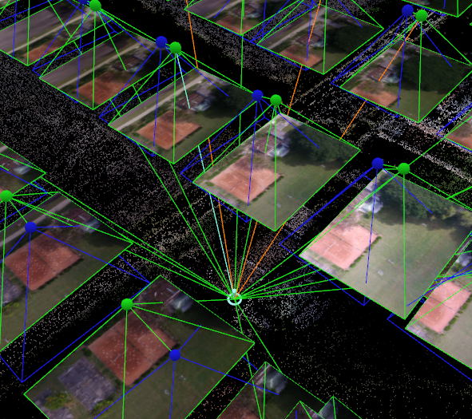
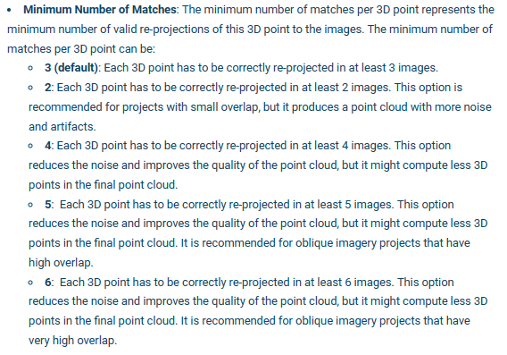

# Part 2 - Drone Image Processing

In this exercise, we will go over the steps to analyze drone images in Pix4Dmapper.

Download the all the images from this folder onto your computer: .

Download this zipped folder onto your computer and unzip it: .

# 1. Project Setup

The project creation process is the same for all imagery, regardless of the platform and sensor the data was collected with. The purpose of the initial project setup phase is to create the project, import and align photos using geolocated camera positions, and select the output coordinate system (either detected from imagery or custom). When you first open Pix4D, you will be presented with the screen shown below.  This screen presents you with several options. It shows your four most recent projects, along with an option to open other projects. 

*Note: If you create/work on a project in a newly updated version of Pix4D, then try to go backwards and load the project into an older version of Pix4D that is NOT updated, you will NOT be able to open the project. Make sure all computers you work on share the same version of Pix4D.*

## 1.1 Create a New Project

The first thing you will be asked to do is save the project. The default is the Pix4D folder on the computer, but you can change it.  It will be faster to process all the imagery on the the computer itself, instead of any external hard drives (so the computer doesn't need to shuffle processing between its internal drive and external drives). 

This goes with the location of the imagery as well. Make sure it is located on the computer itself, not an external drive. If your imagery and project files need to be transferred somewhere else (to another drive or online), do it after processing is complete and make sure the original imagery is moved WITH the project file. The easiest way to do this is to put the Pix4D project  and the images in the same folder and zipping it into a .zip file.

Select `New Project`

Name the project `CIAT Campus`

Create a folder called `Drone Training`

## 1.2 Select Images

The next thing you must do is select the images you want to use for this project. It is essential to select all the images for all bands in order for the processing to go well. The top of the screen will have a navigation bar to navigate to the folder where the images are located. 

Click `Add Images`

Select ALL images taken in your drone flight

## 1.3 Image Properties 

Next, you will see the image properties editor. This screen shows the image geolocation, which shows the coordinate system, geolocation, and orientation (automatically detected). The software is extremely good at selecting the accurate datum, but it is good practice to double-check so you do not run into issues down the line. Keeping the geolocation accuracy as `Custom` is recommended. The camera model is also automatically selected, double-check this as well. Each image should be listed, along with its band group, the camera model, location, altitude, etc. The `Enabled` column shows the images that are selected for use in the processing. Make sure ALL of these are selected. 

## 1.4 Select Output Coordinate System 

Next you will see a screen showing the output coordinate system. This will automatically place the images into a certain UTM zone. 

## 1.5 Processing Options Template

After this option is finished, you will see a final screen presenting some templates that can be used for processing. If you intend to use a template, you want to choose one that is appropriate for your project type. If you are working with RGB imagery, you will want to choose 3D Maps. However, if you are interested in creating a vegetation index map from multispectral imagery, you may want to use Ag Multispectral instead.

Select `3D Maps`

Before you continue, you want to consider: 
1. the type of imagery you are processing
2. your desired final products

The type of imagery you are processing will determine which workflow you use and which products you can generate.  Here are some products you can make with various types of imagery:

RGB 
* Orthomosaics
* DSM/DTM 
* Point Cloud 

Multispectral 
* Reflectance maps 
* Vegetation indices 

Thermal 
* Thermal IR indices 
* Temperature indices 

Also keep in mind that the specific sensor you used to collect your imagery will determine your process. Some sensors calibrate while in flight (such as the senseFly ThermoMAP), while many others do not and will require calibration in Pix4D. Also, you will need to know if your sensor is recording absolute temperature (senseFly ThermoMAP) or relative temperature (FLIR Vue Pro), as this will determine how thermal indices are calculated.

## 1.6 Main Screen
 
When you press `Finish` you will see the main screen come up. The red dots represent individual image captures from the drone, while the green lines represent the flight path. If you scroll out, you can see where these images are within the larger landscape.

At the bottom left of the screen, there is a set of options that you can click. `Log Output` will show all the processing actions the program is making, along with any errors and warnings that may come up. This is very important! If you encounter an issue and cannot figure out what the error means, click `Help` at the top left and simply copy and paste the entire error message into the Pix4D support search bar. This yields good results most of the time. 

Just below `Log Output` is `Processing Options`. This is where you can set your processing parameters.

Open `Processing Options`

# 2 Initial Processing

The first screen that comes up is `Initial Processing`. You will see three tabs: `General`, `Matching`, and `Calibration`. If you do not have the `Advanced` box checked, you will only see the `General` window. `Advanced` should be checked, especially if you intend on calibrating your images (i.e. for multispectral imagery).

Make sure that `Advanced` is selected (at the very bottom of the window)

## 2.1 General 

Pix4D documentation: 
[Menu Process > Processing Options... > 1. Initial Processing > General (pix4d.com)](https://support.pix4d.com/hc/en-us/articles/202557759-Menu-Process-Processing-Options-1-Initial-Processing-General)

* `Keypoints Image Scale` is the image size at which keypoints are extracted, compared to the original image size. You can select `Custom` to change it. Varying your keypoint image scale will affect the density of the sparse point cloud and subsequent products. Anything under 1 (original image size) will reduce accuracy, but is ideal for images that are blurry or low in texture. Quarter (¼) image scale is recommended for projects with high overlap because it helps to speed up the processing.  A lower image scale is also better if there are many homogenous/flat surface types in your image that look very similar (e.g. a very uniform forest/field).  In areas of dense vegetation, processing at half (½) image scale can yield a higher number of calibrated images (if some are left uncalibrated at full (1) image scale).  

* `Generate Orthomosaic Preview in Quality Report` is the default. It is helpful, as you can check out how the orthomosaic looks when the quality report is generated after the initial processing step. If the results are awful, you can cancel the process and begin to figure out your errors.

Here are some tips from Pix4D on how to improve drone image products in areas with dense vegetation (e.g. forests):
[How to improve the outputs of dense vegetation areas using PIX4Dmapper?](https://support.pix4d.com/hc/en-us/articles/202560159-How-to-improve-the-outputs-of-dense-vegetation-areas-using-PIX4Dmapper)

Set the parameters to the following:

*From Pix4D:*

## 2.2 Matching

Pix4D Documentation: 
[Menu Process > Processing Options... > 1. Initial Processing > Matching (pix4d.com)](https://support.pix4d.com/hc/en-us/articles/205433155-Menu-Process-Processing-Options-1-Initial-Processing-Matching)

* Check `Aerial Grid or Corridor` if you used an automated grid approach for your flight. 

* Choosing the `Use Geometrically Verified Matching` strategy is useful when images have many similar features, however this option increases processing time. `Use Geometrically Verified Matching` is always active when using the `Alternative` calibration method.

Set the parameters to the following:

*From Pix4D:*

## 2.3 Calibration 

Pix4D Documentation:
[Menu Process > Processing Options... > 1. Initial Processing > Calibration (pix4d.com)](https://support.pix4d.com/hc/en-us/articles/205327965-Menu-Process-Processing-Options-1-Initial-Processing-Calibration)

During the calibration process, the raw images are adjusted based on the actual camera settings and environmental conditions that occurred during the flight based on the location of the keypoint images. 

* Adjusting the `Calibration Method` defines how the software optimizes the internal and external camera parameters based on geolocation accuracy. The `Standard` calibration setting is default and the `Alternative` and `Accurate` settings are used when the geolocation accuracy is high and very high, respectively. For this exercise, use the `Alternative` calibration setting, as it favors projects with less oblique imagery with good accuracy and low texture.

Set the parameters to the following:

*From Pix4D:*

## 2.4 Run Initial Processing

Select `OK` (at the bottom of the window)

Now, at the bottom left of the main screen, you can see the `Processing` window. All of the text will appear red initially, but will turn green after each processing step is complete. You are able to cancel at any time during processing to stop the process if your results are poor or you receive errors. You can then correct any errors that and start the process again, but any part of the process that was previously completed will be overwritten. 

* It can take a long time to process imagery in Pix4D, especially if you are using high settings or are generating a 3D textured mesh. For example, one trial with all settings on high can take 5+ hours using all the processors in the CPU on a laptop. Also, due to the intense computational activities of this program, your CPU will be almost completely occupied during processing. For the majority of the processing, Pix4D will occupy 90% to 98% of the CPU. Some projects may overwhelm the capabilities of your processor (and may even damage or destroy damage), so you may want limit the amount CPU processors and RAM Pix4D uses. This is located under `Resource and Notifications` in the `Processing Options` tab. If you choose to place limits on RAM and CPU threads, though, the processing will take longer.

Select `1. Initial Processing` and deselect the other 2 process steps

Press `Start`

This step will generate a sparse point cloud and a quality report, which you will use to check if there are any issues associated with your data. The sparse point cloud will look somewhat like the environment you imaged. 

Before you proceed to making the point cloud, orthomosaic, and DSM, you want to check the quality of your images and tie points.  You can do this with the quality report.
   
# 3 Check Project Quality

Before you proceed to making the point cloud, orthomosaic, and DSM, you want to check the quality of your images and tie points.

## 3.1 Quality Report 

Pix4D Documentation: 
[Quality Report Help - PIX4Dmapper](https://support.pix4d.com/hc/en-us/articles/202558689-Quality-Report-Help-PIX4Dmapper#label5)

After Initial Processing is complete, a Quality Report will be generated. This Quality Report will show you basic information such as a summary, a quality check, and a preview of the orthomosaics for each band and the DSM. 

You can click on the PDF icon in the top left corner to open it as a PDF. Additionally, it is saved to your project folder as a PDF. You can also open it via the `Processing` tab at the very top of the main screen.

There are several components of the Quality Check you will want to examine. 

* First, check the Quality Check if you received any warnings. The Quality Check is one of the most important components because you can quickly assess how your project is going. In the right hand column, you will see either green circles with check marks (this means everything is going great!) or you may get warnings that are shown as red or yellow triangles depending on the severity of the warning. To find out more about the warnings, click on each of the question mark icons as shown on the left side of the report. This will give you additional information about the Quality Check parameters: Images, Dataset, Camera Optimization, Matching, Georeferencing, and Preview. Most importantly, it will tell you why you received each warning and provide tips on how to fix the issues. Because you have not yet implemented GCPs, you will receive a warning message about this.

* Next, take a look at your Orthomosaic and DSM Previews. Do they look like you expect them to? If there were images that were not successfully calibrated, you may notice that the quality of your outputs is suffering. If this is the case, you may want to look at why this is occurring. Are there any issues with the quality of the individual images? If everything looks great and you got a high percentage of calibrated images as in the example above, you can proceed. 

* Then, check the Calibration Details, including how many images were successfully calibrated. You can also see the Initial Image Positions and the order in which they were acquired during the flight. Do these look like what you might have expected based on your flight plan?

* Next, check the Computed Image/GCPs/Manual Tie Points Positions. Are there any uncalibrated or diables images (these should be red dots)? 

* Then, check the Overlap of your images, which is usually lower along the edges in most projects.  Do you have good overlap between your images?

* Last, check the number of 3D points from 2D Keypoint Matches, which will also be lower along the edges. The graph should consist of one block, not multiple blocks. 

There are several other components of the report which you may want to examine now or after you have implemented GCPs. The components shown here were chosen because they allow you to quickly assess the quality of your project and if it is worth completing the rest of the processing. As long as there are no serious issues, you can proceed.

## 3.2 Ray Cloud

After Initial Processing is complete, you can access the `rayCloud` view from the tab on the left side of the main screen. This is called a “ray cloud” and it contains lots of important features that you should become familiar with. Each of the spheres at the top of the pyramid-like structures represents a camera position. The blue spheres are the initial camera position from GPS coordinates the camera recorded during the flight. The green spheres are optimized camera positions the program calculates. The red spheres are the initial camera positions for uncalibrated cameras which Pix4D could not find optimized positions for. Because imagery relating to uncalibrated cameras will have generated potential warnings in the quality report and affected your output negatively, you may want to disable cameras or remove the bad images. 

Attached to the bottom of the pyramid-like shapes are the actual images associated with the camera position. The four bands are stacked on top of each other in a multispectral camera like the Parrot. The 3D colored points represent Automatic Tie Points (ATPs).

The image depicts rays coming from each of the cameras. These rays can be displayed by clicking on any of the 3D colored points that are shown below the ray cloud. The rays are coming from multiple images and are tied at this one 3D point. The green rays are connected to the 3D point and the calibrated cameras where the 3D point was visible but not marked, while the orange rays are connected to the 3D point and the calibrated cameras where the 3D point was marked (per Pix4D support). To the right is a screen which shows the images from the various cameras which are connected to this 3D point. If you click on the image in this panel, you can scroll in and out to see the exact location of the point within that image.

## 3.3 Disable Uncalibrated Images

To disable a camera manually, click on the red dot. The red color changes to pale red and you can see the image on the right side of the screen that is causing issues. Select `Disable` and it will no longer consider the image in the process. 

After disabling a camera, it will be a translucent red as opposed to an opaque red.

Alternatively, you can address calibration issues by clicking the red sphere, figuring out which image is related to the uncalibrated camera, and removing that image from the project data folder. You will then need to begin another processing run with these images removed. Once problem images are removed, you should not have an issue with uncalibrated cameras again for that group of images.  

## 3.4 Manual Tie Points

Pix4D Documentation: 
[How to add / import and mark manual tie points (MTPs) in the rayCloud (pix4d.com)](https://support.pix4d.com/hc/en-us/articles/202560349-How-to-add-import-and-mark-manual-tie-points-MTPs-in-the-rayCloud)

You can add Manual Tie Points (MTPs) to help align your drone images better.  You should add MTPs in problematic areas where there is little overlap or misalignment. To know where to add a MTP, you should verify the re-projection of a point. Open the `rayCloud` view from the main screen.

Click different locations in the point model and check on the images in the thumbnails in the right sidebar.  Here, you can check if the point is re-projected at the correct location on all images.

If you want to add a MTP, click the `New Tie Point` button and select the place you want to place the MTP in each of the images.

After adding MTPs, you will need to reoptimize the internal and external camera parameters according to your new MTPs. You should also reoptimize after any changes made *after* the Initial Processing step.

* Adding GCPs
* Adding Manual Tie Points
* Adding Check Points
* Changing coordinate systems
* Disabling images

To do this, select `Reoptimize` from the `Process` tab at the very top of the main screen.  This will begin the Initial Processing step again and overwrite any results you have already generated.

# 4 Point Cloud and Mesh

Open `Processing Options` again and go to `Point Cloud and Mesh`

## 4.1 Point Cloud

Pix4D documentation: 
[Menu Process > Processing Options... > 2. Point Cloud and Mesh > Point Cloud (pix4d.com)](https://support.pix4d.com/hc/en-us/articles/202557799-Menu-Process-Processing-Options-2-Point-Cloud-and-Mesh-Point-Cloud)

After determining the coordinates of the same point in two images of an object, the 3D position of that point can be calculated using knowledge of camera data and relative orientation. The first screen is the `Point Cloud` option screen. Under here is `Point Cloud Densification`, which is where the major settings for this section are contained.

* `Image Scale` defines the scale of the images at which additional 3D points are created. The default is 1/2 (half image size), where half size images are used to create the 3D points. Other options are possible too, such as 1 (original image size), which yields good results, but is very slow. 1/4 (quarter) image size yields fairly good results and is quite fast. It uses quarter size images to compute the 3D points. Fewer points are computed at this setting than at 1/2 or 1, but more points are computed in areas with features that cannot be matched easily, such as vegetated areas. Thus, it is recommended for projects involving vegetation. 1/2 or 1 scale tends to produce the best results, with 1/2 being the faster of the two.  In areas of dense vegetation, Pix4D recommends using ¼ to ⅛ image scale in areas of only dense vegetation, and ½ image scale with `Multiscale` selected in areas of dense vegetation with roads/buildings (to improve the point cloud and orthomosaic).  

* `Point Density` defines the density of the point cloud. There are three options, Optimal (the default), high, and low. Optimal calculates a 3D point for every 4/image scale of the pixel, so if ½ image scale is chosen, one 3D point is computed for every 4/(.5)=8 pixels in the original image. High computes a 3D point for each image scale pixel, but the Pix4D support site notes that this may produce an oversampled point cloud, but not significantly better results. Low computes a 3D point for every 16/image scale of the pixel. This will make one 3D point for every 32 pixels of the original image, if 1/2 image scale is used. Optimal and high yield good results and are recommended over Low. High produces very good results, but the processing is very slow. 

* `Minimum Number of Matches` is the minimum number of valid reprojections of this 3D point in the images. The default is 3, meaning that each 3D point has to be correctly re-projected in at least 3 images. This setting is recommended for most projects. Higher numbers reduce noise and improves the overall quality of the point cloud, but fewer 3D points may be in the final point cloud due to the more stringent number of matches required. A dense point cloud will look similar to the sparse point cloud, but the increase in detail is very apparent.

* Checking `Classify Point Cloud` significantly improves the DTM, as the software is more capable of discerning between objects such as trees or buildings and the actual Earth surface. Below is an example of how Pix4D uses color coding to represent different land cover types

* The export options can be left at default, a LiDAR LAS file, with the `MergeTiles` option selected. Choosing this option produces a single file with all the points, rather than multiple files which would need to be merged later in an external program. There are other file types that you could consider using, such as: 

    * LAS (default): LiDAR LAS file with X,Y,Z position and color information for each point of the Point Cloud. 
    * LAZ: Compressed LiDAR LAS file with X,Y,Z position and color information for each point of the Point Cloud.
    * PLY: PLY file with X,Y,Z position and color information for each point of the Point Cloud. 
    * XYZ: ASCII text file with the X,Y,Z and color information for each point of the Point Cloud. 

Here are some tips from Pix4D on how to improve drone image products in areas with dense vegetation (e.g. forests):
[How to improve the outputs of dense vegetation areas using PIX4Dmapper?](https://support.pix4d.com/hc/en-us/articles/202560159-How-to-improve-the-outputs-of-dense-vegetation-areas-using-PIX4Dmapper)

Set the parameters to the following:

*From Pix4D:*

## 4.2 3D Textured Mesh

Pix4D Documenation: 
[Menu Process > Processing Options... > 2. Point Cloud and Mesh > 3D Textured Mesh (pix4d.com)](https://support.pix4d.com/hc/en-us/articles/208194103-Menu-Process-Processing-Options-2-Point-Cloud-and-Mesh-3D-Textured-Mesh)

The second screen is the `3D Textured Mesh` screen. A 3D textured mesh is a surface composed of triangles and is created from the point cloud. The vertices of the triangles are made in a way that minimizes the distance between points of the point cloud and the surface.  

* If you want to generate a 3D textured mesh, keep the `Generate 3D Texture Mesh` option selected, then select the desired resolution and the export options. 

Set the parameters to the following:

*From Pix4D:*

## 4.3 Run Point Cloud and Mesh

Select `OK` (at the bottom of the window)

Select `2. Point Cloud and Mesh` and deselect the other 2 process steps

Press `Start`

This step will generate a dense point cloud, a classified point cload, and a 3D textured mesh, which will be used in the next steps.

You can view these products and change their visualization parameters in the `rayCloud` tab at the left of the main screen.

You can clearly see where the software had difficulty generating 3D points and surfaces.

* the leafless tree with dense, bare branches in the southeast corner of the AOI where key points/tie points were probably hard to find
* the lake, which has a very homogenous surface, making key points/tie points hard to find

You can also clearly see where the software had difficulty classifying the points.  

* the field of low-lying crops at the northwest corner of the AOI, where the height, structure, and spectral signature of the plants and underlying dirt was difficult to distinguish
* the mix of buildings and paved surfaces in the southeast corner of the AOI, where the height, structure, and spectral signature of the man-made objects was difficult to distinguish

# 5 DSM, Orthomosaic, and Index

Open `Processing Options` again and go to `DSM, Orthomosaic, and Index`

## 5.1 DSM and Orthomosaic

Pix4D Documentation:
[Menu Process > Processing Options... > 3. DSM, Orthomosaic and Index > DSM and Orthomosaic (pix4d.com)](https://support.pix4d.com/hc/en-us/articles/202557769-Menu-Process-Processing-Options-3-DSM-Orthomosaic-and-Index-DSM-and-Orthomosaic)

The first screen is `DSM and Orthomosaic`.  A digital surface model, or DSM, is a model of Earth’s surface and any objects on it (trees, buildings, etc). An orthomosaic is a series of individual images which are programmatically matched up so they form a composite image. The orthomosaic is obtained from the DSM and corrected for perspective. The value of each pixel is obtained as a weighted average of the pixels in the original images that correspond to that particular pixel. Color balancing is used to adjust the intensity of colors so images fit together better. The goal is to create a visually pleasing, cohesive image. 

* For `Resolution`, `Automatic` is the default and is recommended. 

* For the `DSM filters`, `Noise Filtering` and `Surface Smoothing` should usually be selected. `Noise Filtering` corrects the altitude of noisy, erroneous points by using the median altitude of neighboring points to calculate a better position, while `Surface Smoothing` corrects errors in the surface that appear as bumps, thus flattening them. `Sharp` is the default, and it tries to preserve the orientation of the surface, along with retaining sharp features in the image. `Smooth` attempts to smooth areas under the assumption that sharp features only exist due to noise, which leads to areas that are not planar becoming planar. `Medium` is between the two. The type of project you are working on will determine the best settings. The figures below show the difference in the resulting surface when DSM filters are applied.

* For `Raster DSM`, selecting `GeoTIFF` is recommended. 

* There are two DSM generation methods, `Inverse Distance Weighting` and `Triangulation`. `Inverse Distance Weighting` (IDW) uses an inverse distance weighted algorithm to interpolate between points. It assumes that things that are close together are more alike than things that are further apart. It is recommended by Pix4D for buildings. `Triangulation` uses 2D Delaunay Triangulation to create a triangulated irregular network (TIN) that is then rasterized into a grid. This is recommended for flat areas and vegetated areas, because of increased capabilities of resolving gaps in tree canopies and areas beneath these canopies.  According to the Pix4D documentation, `Triangulation` may also be up to 10x faster than `Inverse Distance Weighting`. The figures below show how the detail in the vegetation and building structures is representated differently with triangulation and IDW. 

    Here are some additional resources on IDW and triangulation:

    [Fundamentals of Surfaces—ArcMap | Documentation (arcgis.com)](https://desktop.arcgis.com/en/arcmap/latest/extensions/3d-analyst/fundamentals-of-3d-surfaces.htm)

    [Inverse Distance Weighting (IDW) Interpolation - GIS Geography](https://gisgeography.com/inverse-distance-weighting-idw-interpolation/)

    [How inverse distance weighted interpolation works—ArcGIS Pro | Documentation](https://pro.arcgis.com/en/pro-app/latest/help/analysis/geostatistical-analyst/how-inverse-distance-weighted-interpolation-works.htm)

    [What is a TIN surface?—ArcMap | Documentation (arcgis.com)](https://desktop.arcgis.com/en/arcmap/latest/manage-data/tin/fundamentals-of-tin-surfaces.htm)

* `Merge Tiles` is recommended so your output is one DSM of your study area,rather than multiple tiles. 

* For `Orthomosaic`, it is also recommended to check `GeoTIFF` and `Merge Tiles`. `Google Maps Tiles` and `KML` are other file types and are useful if you wish to share this project with anyone who may not have access to advanced GIS software (such as ArcGIS).  

Set the parameters to the following:

*From Pix4D:*

## 5.2 Additional Outputs

Pix4D Documentation:
[Menu Process > Processing Options... > 3. DSM, Orthomosaic and Index > Additional Outputs (pix4d.com)](https://support.pix4d.com/hc/en-us/articles/202558419-Menu-Process-Processing-Options-3-DSM-Orthomosaic-and-Index-Additional-Outputs)

The second screen is the `Additional Outputs`. A digital terrain model or DTM represents bare ground (buildings and vegetation have been removed). This is where having that classified point cloud is useful – the DTM will be better if the software already knows what is a tree or building and what is not. Contour lines join points of equal elevation and give an indication of surface slope. You are also able to produce contour lines if you wish, but this can also be done in a program such as ArcGIS. 

* If you wish to create a `Ratser DTM` output, make sure the appropriate boxes are checked. 

Set the parameters to the following:

## 5.3 Index Calculator

Pix4D Documentation:
[Menu Process > Processing Options... > 3. DSM, Orthomosaic and Index > Index Calculator (pix4d.com)](https://support.pix4d.com/hc/en-us/articles/202558419-Menu-Process-Processing-Options-3-DSM-Orthomosaic-and-Index-Additional-Outputs)

The third screen is `Index Calculator`, which only really applies to multispectral and thermal data processing, but you can try to create indeces from the reflectances in RGB images as well. Most often when using RGB imagery, you will select `No Correction`.

## 5.4 Run DSM, Orthomosaic, and Index

Select `OK` (at the bottom of the window)

Select `3. DSM, Orthomosaic, and Index` and deselect the other 2 process steps

Press `Start`

This step will generate a DSM, DTM, orthomosaic, and index rasters. 

You can view these products and change their visualization parameters in the `Mosaic Editor` tab at the left of the main screen.  Then, select `Visualization` from the `Mosaic Editor` tab at the very top of the screen, and select `View`, which will give you options of viewing either the orthomosaic, DSM, or DTM.

You can clearly see where the software had difficulty interpolating between points to create the DSM.

* the leafless tree with dense, bare branches in the southeast corner of the AOI where key points/tie points were probably hard to find
* the lake, which has a very homogenous surface, making key points/tie points hard to find
* complex 3D objects such as trees at the edge of the AOI where there is probably lower image overlap

You can also clearly see where the software had difficulty piecing together images to create the orthomosaic.  

* complex 3D objects such as trees at the edge of the AOI where there is probably lower image overlap

You can also see that the orthomosaic seems to have some lighter and darker banding (where the uncorrected reflectance is different between individual images). This is probably due to changes in sun brightness during the flight (because of clouds casting shadows or sunlight reflecting off of specific objects/surfaces), and is very hard to correct for.  This complicates the calculation of indeces, because reflectance should be normalized for these effects so they don't influence the index values.

* the eastern half of the dirt plot, which appears brighter than the western half (this might falsely influence the index values)  

You can also clearly see where the software had difficulty classifying and interpolating between ground points for the DTM.  DTMs and classified point clouds should not be derived from RGB data, but rather from LiDAR data, which can capture object complexity and elevation with much more precision/accuracy.

* the southeast corner of the AOI, where there are barely any ground points so the terrain is predicted to be very high

