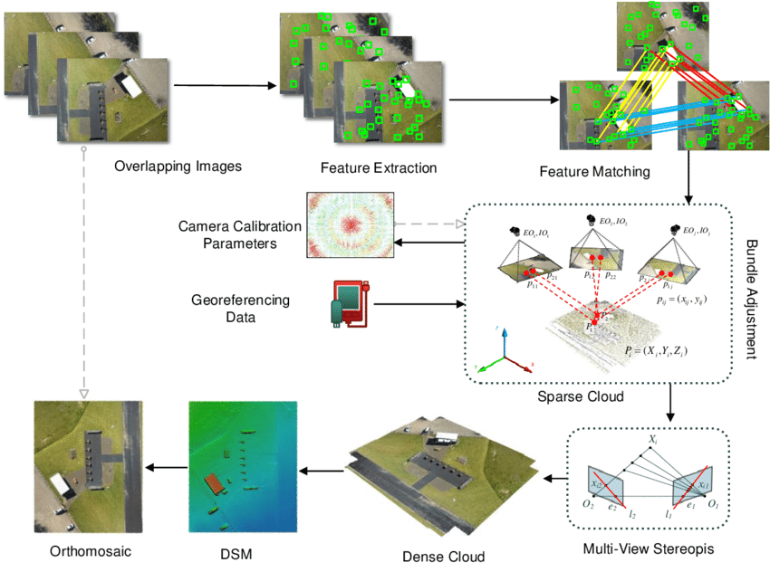
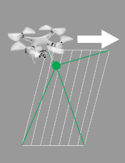
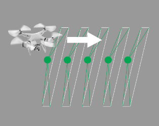
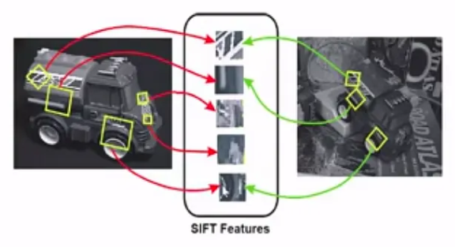
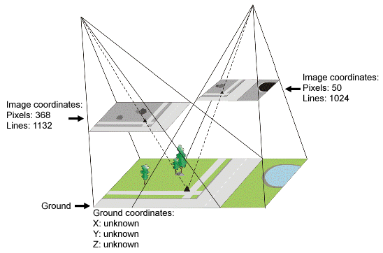
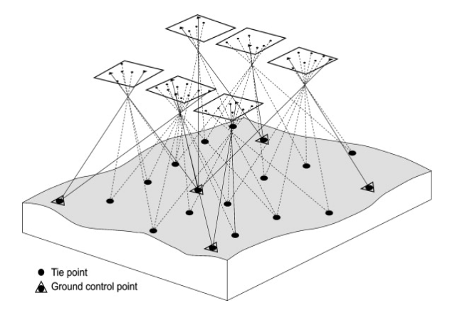

# Introduction

Welcome to Drone Flight and Image Processing! In this workshop, we will discuss the steps in the drone flight planning process and then plan our own drone flight in Pix4Dcapture.  We will also do a short drone flight as a demonstration.  Finally, we will use example drone images from the CIAT campus to conduct drone image processing in Pix4Dmapper, producing an orthomosaic and a digital surface model (DSM).

*The imagery we use in this workshop has been provided by Paula A. Paz from the CIAT Campus.*

## Pre-workshop Set-up

### **[Detailed instructions on pre-workshop setup](https://docs.google.com/document/d/16N5wXbWi767AG4k-BPusu9Gc0HXKrY9qACFN9JZkiAA/edit?usp=sharing)**  

1. Make sure you have [Pix4Dmapper](https://www.pix4d.com/download/pix4dmapper/) installed on your computer.
2. Make sure you have [Pix4Dcapture](https://play.google.com/store/apps/details?id=com.pix4d.capturepro) installed on your phone.
3. Make sure you have made a Pix4D account and activated your [14-day free Pix4Dmapper trial](https://support.pix4d.com/hc/en-us/articles/202560729-How-to-get-a-trial-of-Pix4Dmapper).
4. Download all the files from this Google Drive folder onto your computer -[https://drive.google.com/drive/folders/1D306CvHz0vIgXtWKXkIn5_z_TuYh4B7n?usp=drive_link](https://drive.google.com/drive/folders/1D306CvHz0vIgXtWKXkIn5_z_TuYh4B7n?usp=drive_link).

## Objectives 
1. Understand the basics of the drone flight planning process, including safety, logistics, and flight parameters.
2. Understand the basics of conducting a drone flight.
3. Understand the basics of doing drone image processing, including making orthomoasics and digital surface models.

# Background 

## RGB image processing workflow:

Structure from motion (SfM) is a remote sensing technique for estimating three-dimensional structures from two-dimensional image sequences. It uses multiple photographs of an object to create a three-dimensional set of points corresponding to the surface of the feature (each with X, Y, Z coordinates), called a point cloud.  Most drone imagery processing software uses SfM to create outputs.

1. Keypoint extraction
2. Keypoint matching (creating tie points)
3. Point cloud creation
4. Mesh creation
5. DSM creation
6. Orthomosaic creation

First, the software finds key points in the images, which it then turns into tie points.  Then, in a step called bundle adjustment, the tie points, camera parameters, and camera positions are used to construct a low density point cloud from the images.  Next, it creates a high density point cloud from the low density point cloud.  Last, it creates a 3D mesh from the high density point cloud, which can be turned into a digital surface model.

Javadnejad, F. (2018). Small Unmanned Aircraft Systems (UAS) for Engineering Inspections and Geospatial Mapping.

*Read more about SfM in this paper:
Westoby, M.J. et al., 2012. ‘Structure-from-Motion’ photogrammetry: a low-cost, effective tool for geoscience applications, Geomorphology 179, 300-314.*

# Vocabulary

## Photogrammetry:

the use of photography in surveying and mapping to measure distances between objects

## Global (Mechanical) Shutter:

A type of drone camera that exposes all the pixels in an image at once (the sensor opens, takes the picture, and closes).  This type of shutter allows you to fly faster and still get high quality images.  Thus, it is best for photogrammetry.  DJI Phantoms have global shutters.  You can fly faster with a global shutter.

https://www.pix4d.com/blog/rolling-shutter-correction/

## Rolling (Electronic) Shutter:

A type of drone camera that exposes pixels in an image one row at a time.  This type of shutter forces you to fly slower and is more prone to image distortion (because the camera is at different locations when it is capturing the first row and the last row).  Thus, it is best for capturing still images.  DJI Mavics have rolling shutters.  You need to fly slower with a rolling shutter, and the drone should ideally stop fully when taking each picture.

https://www.pix4d.com/blog/rolling-shutter-correction/

## Keypoints:

Keypoints are points in the images that stand out in the image. They are important because no matter how the image changes, you should be able to find the same points in each image.  They are used to correctly align overlapping images with each other.  Pix4d extracts many keypoints from your images, scores them based on certain criteria, and chooses the best ones to use.

A common technique for extracting keypoints is the Scale Invariant Feature Transformation (SIFT) algorithm (Lowe, 1999). SIFT identifies features in an image scale space that are invariant to image scaling and rotation, and are partially invariant to illumination changes and 3D projection.

*Read more about SIFT in this article:
Lowe, D.G., 1999. Object recognition from local scale-invariant features, Proceedings of the International Conference on Computer Vision, Corfu, September 1999.*

Tyagi, D. (2020, April 7). Introduction to SIFT( Scale Invariant Feature Transform). Data Breach. https://medium.com/data-breach/introduction-to-sift-scale-invariant-feature-transform-65d7f3a72d40

## Tie Points:

Keypoint matching (creation of tie points) is the process of finding the corresponding keypoint of one image in another image. The more keypoint matches that are computed, the higher the degree of confidence that a point is placed correctly; fewer keypoint matches will yield less confidence.

Keypoint matches are used to create tie points (in this case Automatic Tie Points, or ATPs). ATPs are 3D points and their corresponding 2D keypoints (which were automatically detected in the images and used to compute 3D position of points). This is what allows the software to go from 2D to 3D, and it is also used in the calibration of the images. ATPs cannot provide the absolute position of the images (known ground coordinates), but they do provide the relative positions of your images to each other.

Goodbody, T. R. H., Coops, N. C., & White, J. C. (2019). Digital Aerial Photogrammetry for Updating Area-Based Forest Inventories: A Review of Opportunities, Challenges, and Future Directions. Current Forestry Reports, 5(2), 55–75. https://doi.org/10.1007/s40725-019-00087-2

https://catalyst.earth/catalyst-system-files/help/COMMON/concepts/TiePoint_explain.html

## Bundle Block Adjustment:

Bundle block adjustment (BAA) is a step in the analysis process that refines the 3D positions of features captured in your imagery. BAA uses the internal relationship between overlap images, keypoints or ground control points, and the internal and external camera parameters, and applies the adjustment to images within a specific block. Simply put, it uses ATPs to create a mathematical model, which it then uses to generate the sparse point cloud.

Aber, J. S., Marzolff, I., & Ries, J. B. (2010). Chapter 3—Photogrammetry. In J. S. Aber, I. Marzolff, & J. B. Ries (Eds.), Small-Format Aerial Photography (pp. 23–39). Elsevier. https://doi.org/10.1016/B978-0-444-53260-2.10003-1

##