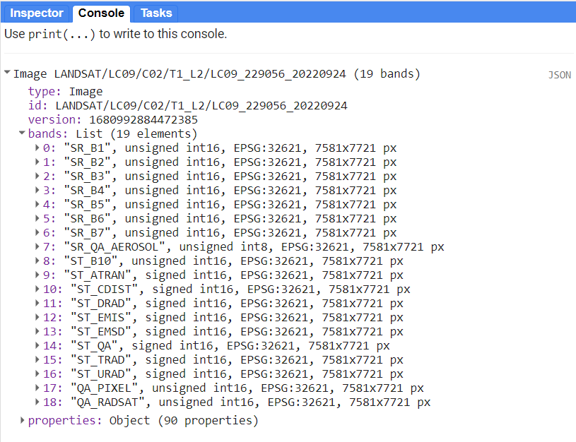
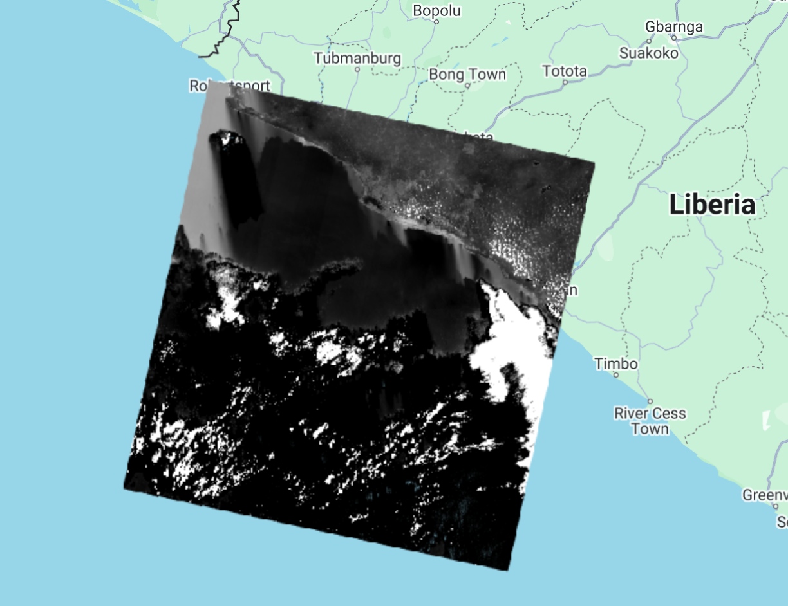
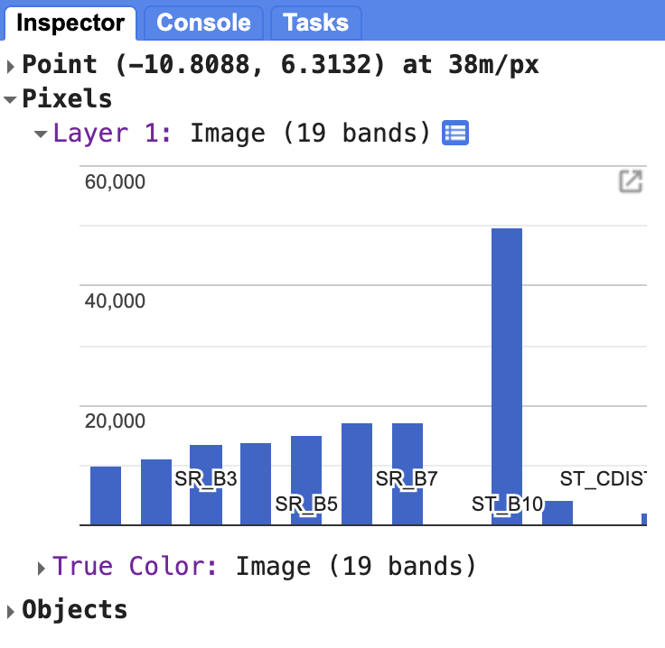
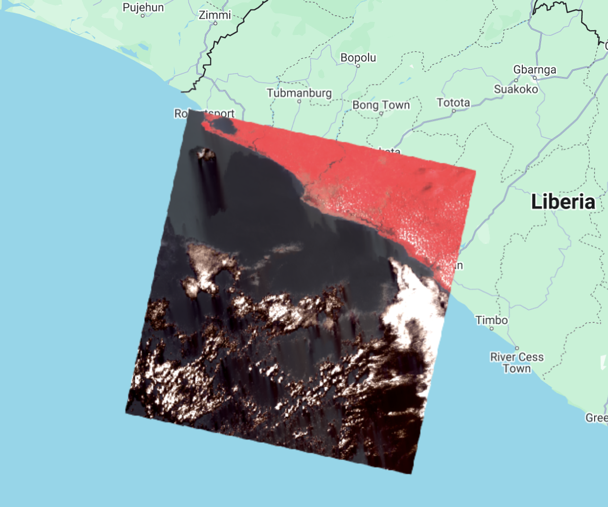
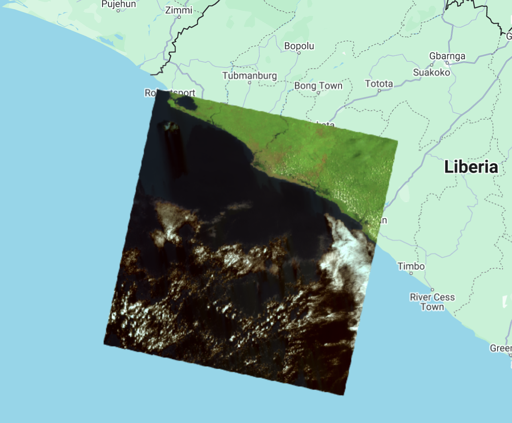
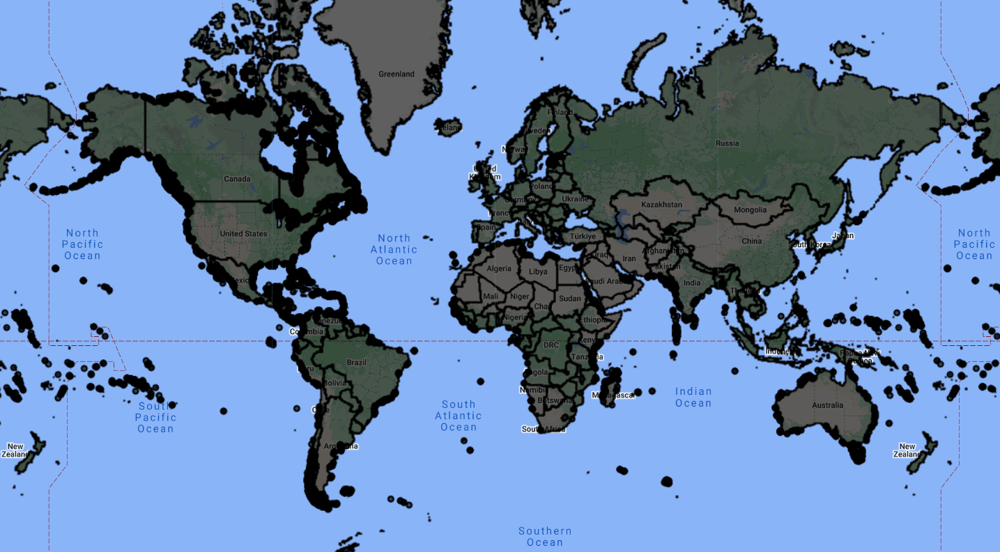
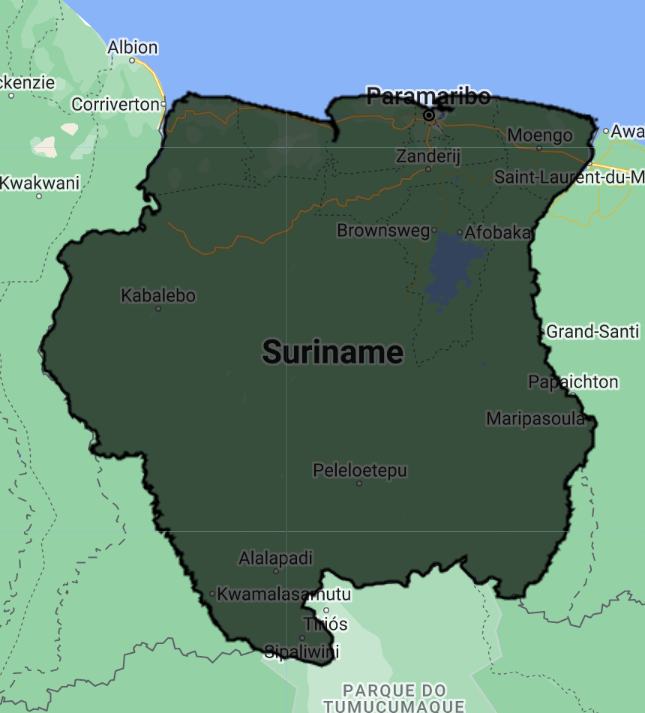
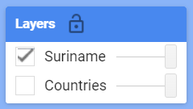
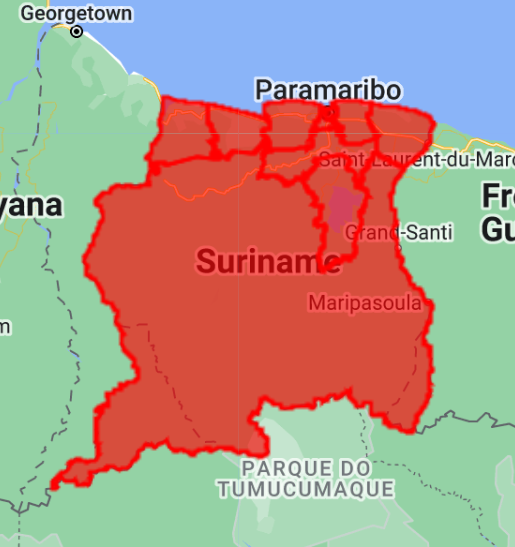

# Images and Vector data in Earth Engine

Earth Engine's public data catalog includes more than forty years of historical imagery and scientific datasets, updated and expanded daily.

## Satellite images

Satellite imagery is at the heart of the power of Google Earth Engine. This section teaches you how to inspect and view data stored in image bands. We first display individual bands as separate map layers and then explore a method for displaying three different bands on a single composite layer. We compare different types of composites for satellite bands that measure electromagnetic radiation in the visible and non-visible spectrum.

First we are going to visualize a Landsat 9 image of September 24, 2022 over Paramaribo. You can explore the image in several ways. To get started, you can retrieve metadata (descriptive data about the image) by printing the image.

```javascript
var firstImage = ee.Image('LANDSAT/LC09/C02/T1_L2/LC09_229056_20220924');
print(firstImage);
```

In the `Console`, you must click on the expansion arrows to display the information. We see that this image consists of 19 different bands. For each band, the metadata lists four properties, but for now let's just note that the first property is a name or label for the band in quotes. For example, the name of the first band is “SR_B1”.



Now let's add one of the bands to the map as a layer so we can see it.

```javascript
Map.addLayer(
    firstImage, // data to visualize
    {
        bands: ['SR_B1'], //  image band to visualize
        min: 6000, //  range of values for visualization (0-255)
        max: 11000
    },
    'First Image' //  layer name that appears under "Layers"
);
```

The code here uses the `addLayer` method of the map (`Map`). There are four important components of the above command:

- `firstImage`: this is the dataset that will be displayed on the map.
- `bands`: These are the particular bands of the data set to display on the map. In our example, we show a single band called "SR_B1".
- `min`, `max`: these represent the lower and upper limits of the values of "SR_B1" to display on the screen. By default, the minimum provided value (6000) is assigned to black and the maximum provided value (11000) is assigned to white. Values between minimum and maximum are mapped linearly to a grayscale between black and white. Values below 6000 are drawn in black. Values above 11000 are drawn in white. Together, the band, minimum, and maximum parameters define display parameters or instructions for displaying data.
- `'First Image'`: This is a label for the map layer to display in the Layer Manager. This label appears in the layer dropdown at the top right of the map.

When you run the code, you may not notice the image displayed unless you scroll and find it. To do this, click and drag the map over to Suriname (You can also jump there by typing "Suriname" in the search panel at the top of the Code Editor, where the indicator says "Search places and datasets".. .) Use the zoom tool to increase the zoom level and make the square appear larger.



Can you recognize any features in the image?

Let's explore this image with the `Inspector` tool. When you click on the `Inspector` tab on the right hand side of the Code Editor, your cursor should now look like a crosshair. When you click on a location on the image, the `Inspector` panel will report data for that location in three categories as follows:



- Point: data about the location on the map. This includes geographic location (longitude and latitude) and some information about the map display (zoom level and scale).
- Pixels: data about the pixel in the layer. If you expand this, you'll see the name of the map layer, a description of the data source, and a bar chart. In our example, we see that `"First Image"` is extracted from an image dataset that contains 19 bands. Below the layer name, the graph shows the pixel value at the location you clicked for each band in the dataset. When you hover over a bar, a panel will appear to display the name of the band and the "band value" (pixel value). To find the pixel value for "SR_B1", hover over the first bar on the left. Alternatively, clicking on the small blue icon to the right of `"First Image"` (B. in the image above) will change the display from a bar graph to a dictionary reporting the pixel value for each band .
- Objects: data about the source dataset. Here you will find metadata about the image that closely resembles what you retrieved earlier when you told Earth Engine to print the image to the `Console`.

We can use color to compare these visual differences in pixel values of each band layer at a time as an RGB composite. This method uses the three primary colors (red, green, and blue) to display the values of each pixel in three bands.

To test this, add this code and run it.

```javascript
Map.addLayer(
    firstImage,
    {
        bands: ['SR_B4', 'SR_B3', 'SR_B2'],
        min: 7000,
        max: 12000
    },
    'True Color');
```

The result resembles the world we see and is called a natural color composite, because it naturally matches the spectral ranges of the bands in the image to display colors. This image, also called a true-color composite, shows the red spectral band with shades of red, the green band with shades of green, and the blue band with shades of blue. We specify the pairing simply through the order of the bands in the list: B4, B3, B2. Because Landsat 9 bands 4, 3, and 2 correspond to the real-world colors of red, green, and blue, the image resembles the world we would see outside an airplane window or from a low-flying drone.


Now, we can add two more layers, but with false colors, using the `SR_5`, `SR_4`, `SR_3` and `SR_6`, `SR_5`, `SR_4` bands.

```javascript
Map.addLayer(
    firstImage,
    {
        bands: ['SR_B5', 'SR_B4', 'SR_B3'],
        min: 6000,
        max: 18000
    },
    'False Color');

Map.addLayer(
    firstImage,
    {
        bands: ['SR_B6', 'SR_B5', 'SR_B3'],
        min: 7000,
        max: 27000
    },
    'False Color SWIR');
```

What coverages stand out in these band combinations?




### Complete code

"`4 Image Visualization - Landsat 9`" script from repository and `T1 & T2` folder or direct link:
[https://code.earthengine.google.com/86e9cf5640f967eae536df99349b2c65](https://code.earthengine.google.com/86e9cf5640f967eae536df99349b2c65).

### Example with Landsat 9 and Sentinel-2

"`4 Image Visualization - L9 & S2`" script from repository and `T1 & T2` folder or direct link:
[https://code.earthengine.google.com/8909f4360f49c80071c830c2fd66738a](https://code.earthengine.google.com/8909f4360f49c80071c830c2fd66738a).

## Vector data

There are also other types of data in Earth Engine, such as vector data. We are going to use a dataset from the Food and Agriculture Organization of the United Nations (FAO) to select the administrative limits of the Suriname (extract a polygon). This dataset contains boundary vectors of all the countries in the world and is a collection of features (`ee.FeatureCollection`). Note that this might not correspond to official national boundaries defined by each country. However, we can use it as an example. Creating a new script:

```javascript
var countries = ee.FeatureCollection('FAO/GAUL_SIMPLIFIED_500m/2015/level0');

Map.addLayer(countries, {}, 'countries');
```



One of the properties of this data set is called `ADM0_NAME` which corresponds to the name of the country. We are going to filter this data set to obtain the geometry of Suriname. For that, we will use the `filter` function and choose the `ee.Filter.eq` filter since we want to search for the `ee.Feature` that has the name equal to "Suriname" (`eq` for equality). Look in the `Docs` for more information on the `filter` function below `ee.FeatureCollection` and on the `ee.Filter` object.

Before, change the last line of the code so that the `countries` variable is not loaded into the map automatically - we do that by adding the `false` parameter to the end of `Map.addLayer`.

```javascript
Map.addLayer(countries, {}, 'countries', false);
```

Thus, the layer will be available in the Layer Manager but is not loaded to the map once the code is run.

Now, we can filter the collection of features. We are also going to use the `Map.centerObject` function to center the map to Suriname. The first argument to this function is the object we want to center the map to (in this case, the `suriname` variable, our polygon). The second argument is the zoom level, which ranges from 1 to 24. We chose a zoom level of 7.

```javascript
var suriname = countries.filter(ee.Filter.eq('ADM0_NAME', 'Suriname'));
Map.centerObject(suriname, 7);
Map.addLayer(suriname, {}, 'Suriname');
```



Notice that the "countries" layer is in the Layer Manager but turned off.



You can change the color of the feature by adding the `color` parameter and choosing a color (example for red): `Map.addLayer(suriname, {color: 'red'}, 'Suriname')`;

Now we are going to use vector data in conjunction with images.

In other to use the official Suriname boundary, we can import a Google Earth Engine asset which is a shapefile that was uploaded.

Comment out or erase the first lines before `Map.centerObject` and add:

```javascript
var suriname = ee.FeatureCollection('projects/caribbean-trainings/assets/suriname-2023/boundary');
```



### Complete code

Script "`5 Vector data`" in the repository and folder `T1 & T2` or direct link: [https://code.earthengine.google.com/9ee6d2160b2ea3ff546b2648f35e6752](https://code.earthengine.google.com/9ee6d2160b2ea3ff546b2648f35e6752).
