# Introduction

Welcome to an Introduction to Google Earth Engine (GEE)! This workshop will provide an overview of the Google Earth Engine cloud-based geospatial platform, its benefits over desktop geospatial software, access to a large catalog of remote sensing datasets, applications in GEE, the basics of programming language and main concepts. Much of the content is based on the [EEFA](https://eefabook.org) book .

## Pre-configuration

Create a [Google Earth Engine account](https://code.earthengine.google.com/register). You need a [Google account](https://accounts.google.com/signup). Create a GEE account for non-commercial purposes.

## Objectives

1. Familiarize yourself with the GEE platform and its programming environment.
2. Understand the fundamentals of programming using the JavaScript language.
3. Learn the main objects, commands and procedures for retrieving, geoprocessing, visualizing and exporting images.

## What is Google Earth Engine?

“A planetary-scale platform for Earth science data & analysis”.

Google Earth Engine combines a multi-petabyte catalog of satellite imagery and geospatial datasets with planetary-scale analysis capabilities. Scientists, researchers, and developers use Earth Engine to detect changes, map trends, and quantify differences on the Earth's surface. Earth Engine is now available for commercial use, and remains free for academic and research use.

The processing infrastructure automatically parallelizes analysis across many processors on many computers in Google data centers. That results in reduction of processing times by orders of magnitude through the use of cloud-based and distributed computing power. In addition, the data is all centralized in the cloud.

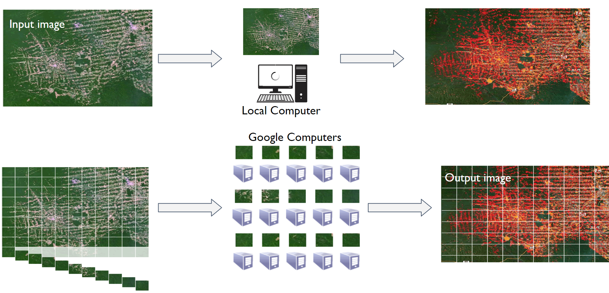

<font size=2> Source: Google </font>

Goals:

"Our mission is to organize the world's geospatial information and make it universally accessible and useful."

- Facilitate
- Scalable, script sharing
- Access to all

Focused on current problems:

- Logging
- Disasters
- Climate change
- Drought
- Diseases
- Sustainability

## Data Catalog

Earth Engine's public data archive includes more than forty years of historical imagery and scientific data sets, updated and expanded daily.

- More than 800 public data sets
- More than 70 petabytes of data
- More than 100 data sets added annually
- 1+ PB of new data every month

(These numbers are always being updated)

Types of data:

- Images from different satellites
- Geophysical data (topography, hydrology)
- Land use and cover
- Climate and weather
- Vector data (Basins, transportation network, etc.)

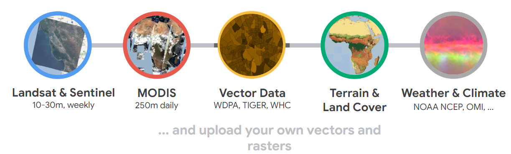

<font size=2> Source: Google </font>

To explore all datasets:

- [https://developers.google.com/earth-engine/datasets](https://developers.google.com/earth-engine/datasets)
- [https://developers.google.com/earth-engine/datasets/catalog](https://developers.google.com/earth-engine/datasets/catalog)

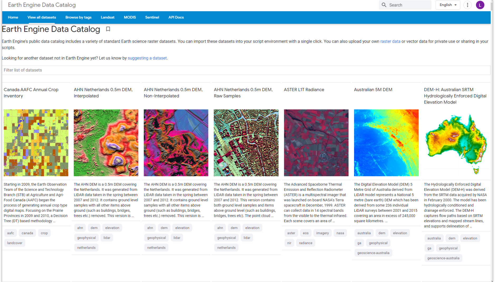

<font size=2> Source: Google </font>

## Application Programming Interface (API)

An Application Programming Interface (API) is a way to communicate with Earth Engine servers. It allows you to specify which calculation you would like to do and then receive the results. The API is designed so that users don't have to worry about how the computation is distributed across a group of coputers and how the results are assembled. API users simply specify what should be done. This greatly simplifies the code by hiding implementation details from users. It also makes Earth Engine very accessible to users who are not familiar with writing code.

The Earth Engine API is designed to be language independent. Google provides official client libraries for using the API from JavaScript and Python. The API remains pretty much the same no matter what programming language you use. The main difference is the syntax used to call the API functions. Once you learn the syntax of the programming languages, your code can be easily adapted because they all use the same API functions.

## Apps

Codes can be converted into applications maintained on Google Earth Engine. You can also use the Python API to develop a web application, with great control over the app's interface.

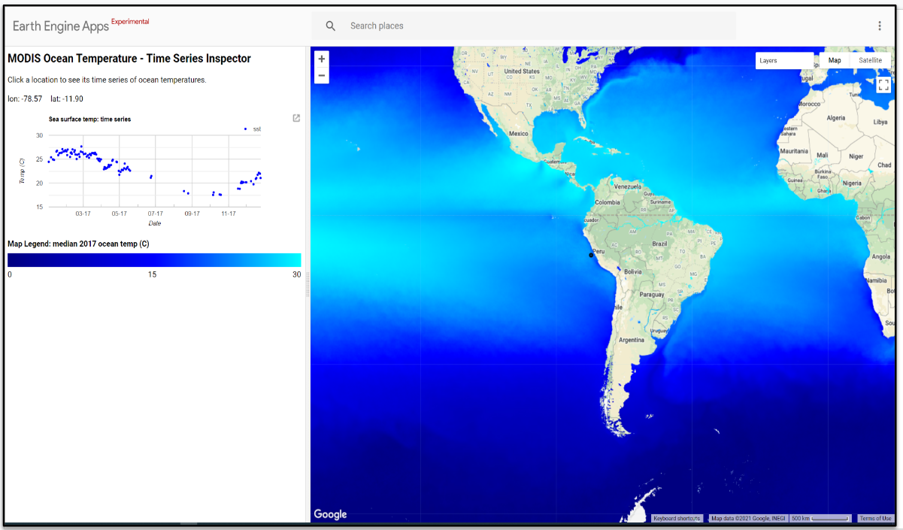

<font size=2> Earth Engine Application: MODIS Ocean Temperature - Time Series Inspector. Source: https://google.earthengine.app/view/ocean. </font>

Some of GEE's applications include:

- Land Use Land Cover Classification
- Forest loss mapping
- Land Use Land Cover Change Detection
- Crop mapping
- Fire mapping
- Air quality monitoring
- Surface water mapping

Examples of applications developed by SERVIR based on or using GEE:

- [RAMI](https://rami.servirglobal.net/) - SERVIR-Amazon
- [RLCMS](https://landcovermapping.org/en/landcover/) - SERVIR-Mekong & SERVIR-HKH
- [Collect Earth Online](https://collect.earth) - SERVIR Global
- [HYDRAFloods](https://hydrafloods-servir.adpc.net/map/) - SERVIR-Mekong
- [EcoDash](http://ecodash-servir.adpc.net/) - SERVIR-Mekong
- [Wheat Mapping](http://geoapps.icimod.org/afwheat/) - SERVIR-HKH
- [Fire Forecasting](https://servir-amazonia.earthengine.app/view/aptitud-incendios) - SERVIR-Amazonia

General examples:

- [Fire Monitoring in the Amazon](https://gis-acca.users.earthengine.app/view/amazon-fire-tracker) - Monitoring of the Andean Amazon Project
- [Global Forest Change](https://glad.earthengine.app/view/global-forest-change) - University of Maryland
- [Global Forest Watch](https://www.globalforestwatch.org/) - World Resources Institute
- [Global Surface Water](https://global-surface-water.appspot.com/map) - Joint Research Center (JRC)
- [Tiger Habitat Monitoring](https://www.science.org/doi/10.1126/sciadv.1501675) - University of Minnesota and others
- [Map of Life](https://species.mol.org/species/map/Perdix_dauurica)
- [Malaria Risk Mapping](http://www.shrinkingthemalariamap.org/) - University of California San Francisco
- [MapBiomas](https://mapbiomas.org)

## Interface

The Code Editor is an integrated development environment for the Earth Engine JavaScript API. It offers an easy way to write, debug, run, and manage code. Once you have followed Google's documentation on registering an Earth Engine account, you can open the [Code Editor](https://code.earthengine.google.com/). When you first visit the Code Editor, you'll see a screen like the one below.

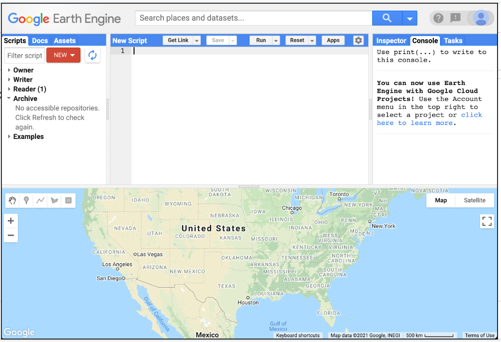

The menu on the left consists of three tabs: `Scripts`, `Docs`, `Assets`: In the `Scripts` section you have all your code stored and organized in repositories, folders, subfolders and files. You can organize your scripts by project, and you can also share access or editing permissions with other GEE users. `Docs` is the [API Documentation](https://developers.google.com/earth-engine/) with functions and their explanations. In `Assets` you can store and organize files that you upload from your computer or download from GEE. In the center, you'll find the web-based code editor where you can insert your JavaScript code without any prior software installation. With the `Apps` button, you can develop small automated applications to process and display data in a more user-friendly manner and interface, while the `Run` button executes the code. On the right, we have three main panels: `Inspector`, `Console` and `Tasks`. In the Console area we can see code errors or printed values, this allows us to debug our script. We'll see the functionality of these as we go through the next few exercises.

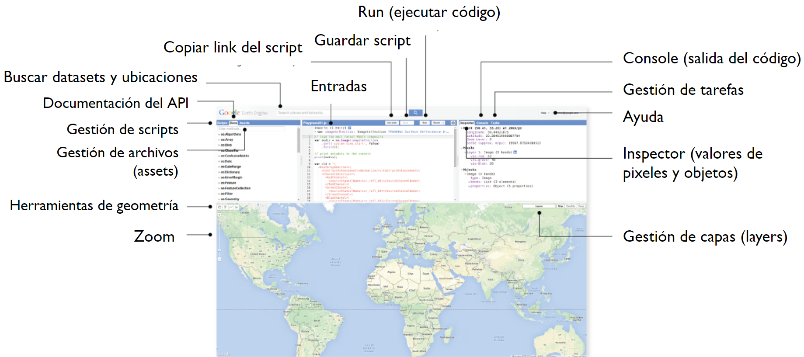

## Exercise: my first script

The Code Editor allows you to write JavaScript code and run it. When you are learning a new language for the first time and getting used to a new programming environment, it is customary to make a program to display the words "Hello World". This is a fun way to start coding that shows you how to give input to the program and how to run it. We can also see where the program displays the output. Doing this in JavaScript is pretty simple. Copy the following code in the middle panel.

```javascript
print('Hello World');
```

The above line of code uses the JavaScript print function (`print`) to print the text "Hello World" to the screen. Once you enter the code, click the `Run` button. The output will be displayed in the top right panel under the `Console` tab.

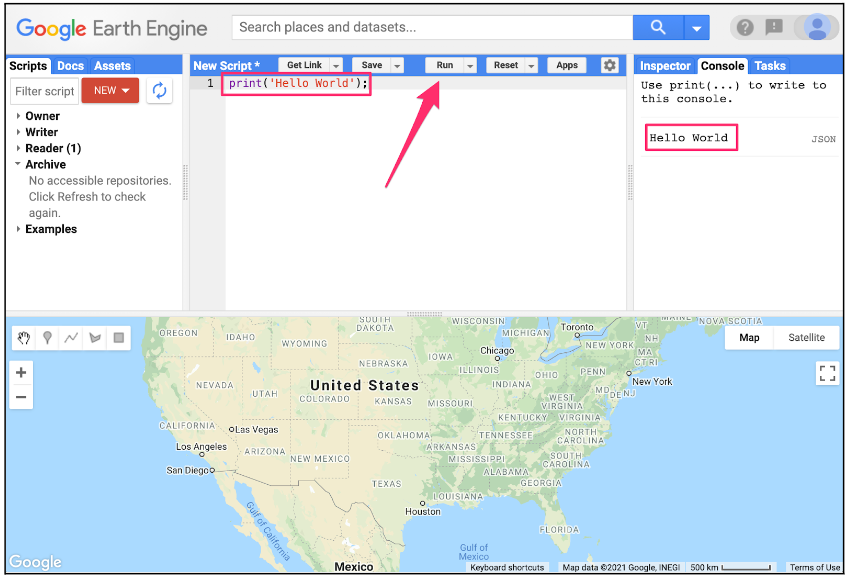

Now you know where to write your code, how to run it, and where to look for the result. You've just written your first Earth Engine script, so let's save it. Click the `Save` button.

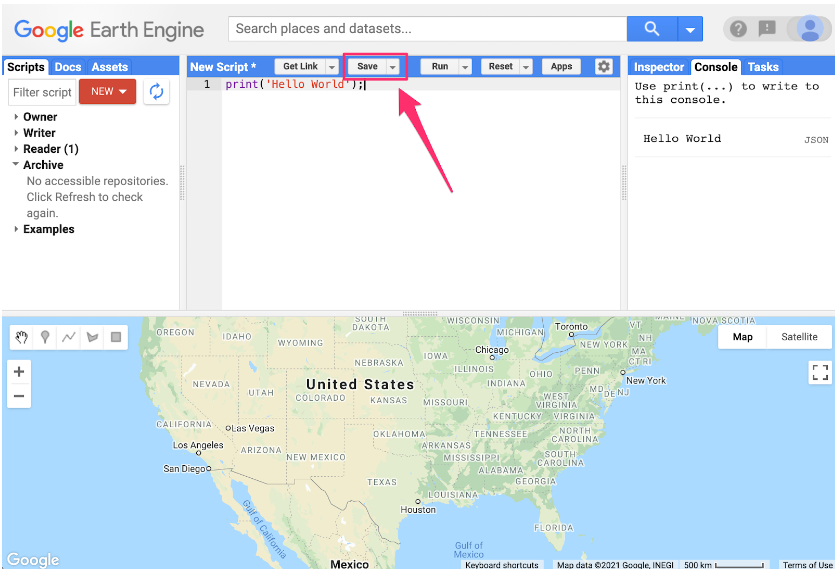

If this is your first time in Code Editor, a screen will appear to create your home directory: Your home directory is a unique ID. From here you can create folders and code repositories. You can choose a name of your choice, but remember that it cannot be changed and will always be associated with your account. A good choice for the name would be the username of your Google account.

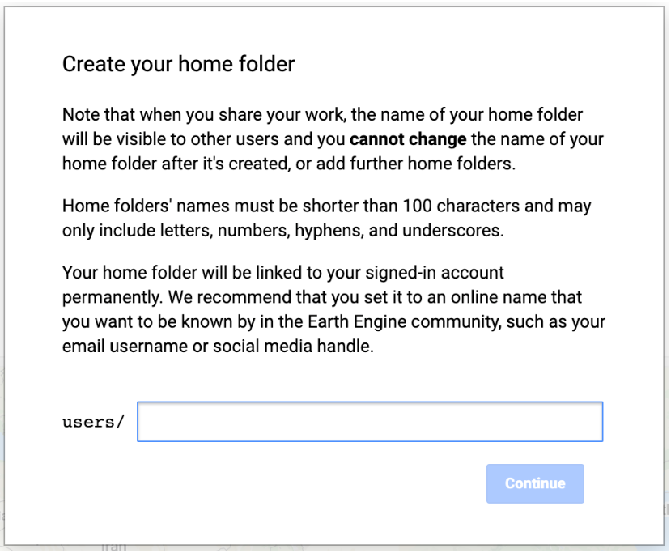

Once your home folder is created, you will be prompted to enter a new repository. A repository can help you organize and share code. Your account can have multiple repositories and each repository can have multiple scripts inside it.

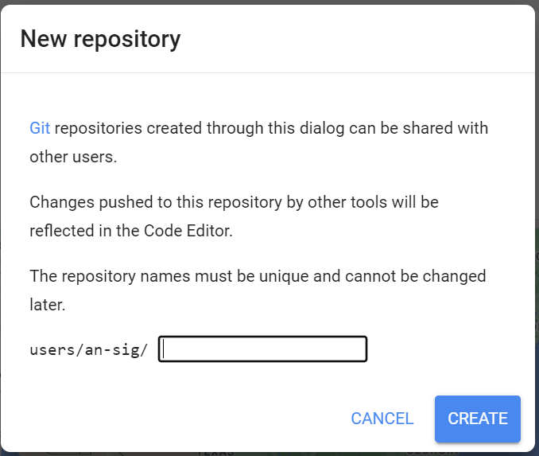

Finally, you will be able to save your script inside the newly created repository. Enter the name of your choice and click `OK`.

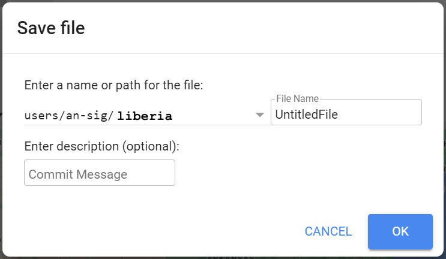

Once the script is saved, it will appear in the script manager panel (under `Owner`). Scripts are saved in the cloud and will always be available to you when you open the Code Editor.

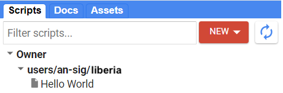

Congratulations! You have created your first script.

# Repository

All the codes created in this workshop are available in this repository: [https://code.earthengine.google.com/?accept_repo=users/an-sig/suriname](https://code.earthengine.google.com/?accept_repo=users/an-sig/suriname).
