# Introduction to JavaScript and Earth Engine Concepts

In order to build a script for your analysis, you will need to use JavaScript. This section covers JavaScript syntax and basic data structures in Earth Engine.

## Javascript

### Variables

In a programming language, variables are used to store data values. In JavaScript, a variable is defined using the keyword `var` followed by the name of the variable. The following code assigns the text "Paramaribo" to the variable named `city`. Note that the text string in the code must be enclosed in quotes. You can use ' (single quotes) or " (double quotes), and they must match at the beginning and end of every string. It's a good idea to be consistent: use single quotes or double quotes throughout a given script. Every code line should normally end with a semicolon, although Earth Engine's code editor does not require it.

```javascript
var city = 'Paramaribo';
```

If you print the variable `city`, you will get the value stored in the variable (Paramaribo) printed to the Console.

```javascript
print(city);
```

When you assign a text value, the variable is automatically assigned the type *string*. You can also assign numbers to variables and create variables of type *number*. The following code creates a new variable called `population` and assigns a number to it as its value.

```javascript
var population = 250000;
print(population);
```

### Lists

It is useful to be able to store multiple values in a single variable. JavaScript provides a data structure called a "list" that can contain multiple values. We can create a new list by using the brackets [] and adding multiple values separated by a comma.

```javascript
var cities = ['Paramaribo', 'Lelydorp', 'Brokopondo', 'Nieuw Nickerie'];
print(cities);
```

If you look at the output in the Console, you'll see "`List`" with an expand arrow (▹) next to it. Clicking on the arrow will expand the list and show you its contents. You'll notice that along with the four list items, there is a number next to each value. This is the index of each article which allows you to reference each item in the list by a numeric value indicating its position in the list.

### JavaScript Objects

Lists allow you to store multiple values in a single container variable. While useful, it's not appropriate for storing structured data. It is useful to be able to refer to each element by its name instead of its position. Objects in JavaScript allow you to store key-value pairs, where each value can be referred to by its key. You can create a `dictionary` using the braces {}. The following code creates an object called `cityData` with information about Paramaribo.

Please note some important things about JavaScript syntax here. First, we can use multiple lines to define the object. Only when we put the semicolon (;) the command is considered complete. This helps format the code to make it more readable. Also note the choice of the variable name `cityData`. The variable contains two words. The first word is in lower case and the first letter of the second word is in upper case. This type of naming scheme of joining multiple words into a single variable name is called a "camel case." While it is not mandatory to name your variables using this scheme, it is considered a good practice to follow. The functions and parameters in the Earth Engine API follow this convention, so your code will be much more readable if you also follow it.

```javascript
var cityData = {
    'city': 'Paramaribo',
    'coordinates': [-55.2038, 5.8520],
    'population': 250000
};
print(cityData);
```

The object will be printed to the `Console`. You can see that instead of a numeric index, each element has a label. This is known as the key and can be used to retrieve the value of an object.

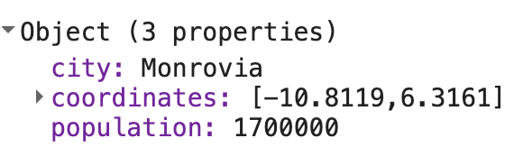

### Functions

While using Earth Engine, you will need to define your own functions. The functions take user input, use it to perform some calculations, and send an output. Functions allow you to group a set of operations and repeat the same operations with different parameters without having to rewrite them each time. Functions are defined using the `function` keyword. The following code defines a function called `greeting` that takes input called `name` and returns a greeting prefixed with `Hello`. Note that we can call the function with different inputs and generate different outputs with the same code.

```javascript
var greet = function(name) {
    return 'Hallo ' + name;
};
print(greet('Wereld'));
print(greet('Deelnemers'));
```

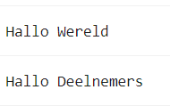

### Comments

As you type the code, it's helpful to add some text to explain the code or leave a note for yourself. It is good programming practice to always add comments in your code explaining each step. In JavaScript, you can prefix any line with two forward slashes // to make it a comment. The interpreter will ignore the comment text and will not execute.

```javascript
// This is a comment!
```

The Code Editor also provides a shortcut (Ctrl + / on Windows, Cmd + / on Mac) to comment or uncomment multiple lines at once. You can select multiple lines and press the key combination to make them all comments. Press again to reverse the operation. This is useful when debugging code to stop the execution of certain parts of the script.

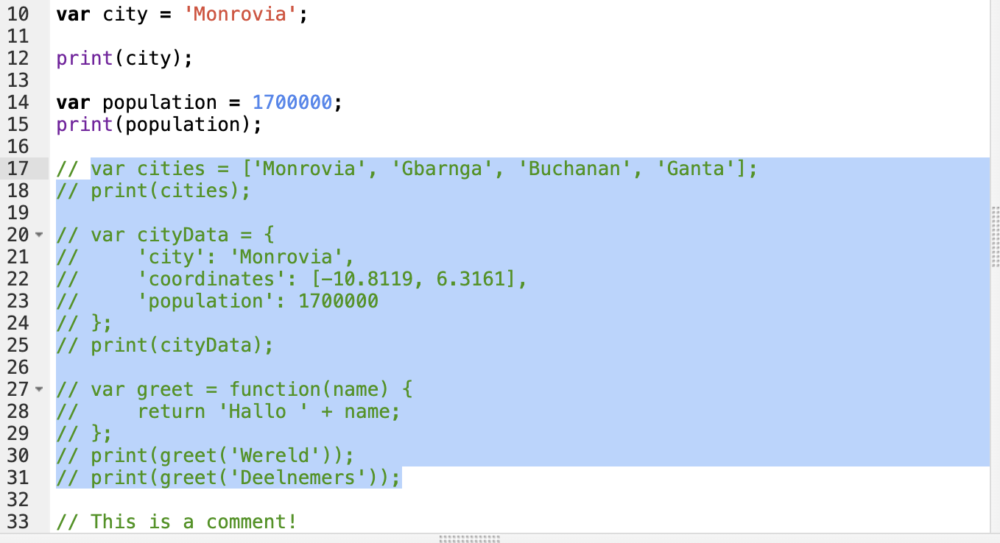

### Complete code

"`2 Introduction to JS`" script from the repository and the `T1 & T2` folder or direct link:
[https://code.earthengine.google.com/5f07daa42a251db03cf84bc5ebe99716](https://code.earthengine.google.com/5f07daa42a251db03cf84bc5ebe99716)

## Earth Engine API Basics

The Earth Engine API is extensive, providing objects and methods to do everything from simple math to advanced algorithms for image processing. In the Code Editor, you can switch to the `Docs` tab to see the API functions grouped by object types (or in the [Earth Engine documentation](https://developers.google.com/earth-engine/apidocs)). API functions are prefixed with `ee` (for Earth Engine).

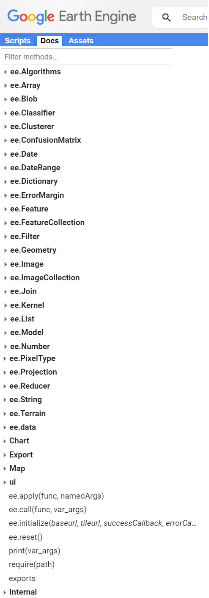

Fundamental Earth Engine Concepts regarding remote sensing include:

- Image (`ee.Image`): The fundamental raster data type in Earth Engine. Image with a stack of georeferenced bands. Each band has its own Mask, Projection, Resolution, and a list of properties including date, bounding box, etc.

     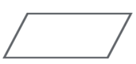

- Image Collection (`ee.ImageCollection`): A collection of images

     

- Geometry (`ee.Geometry`): The fundamental vector data type in Earth Engine. Line / Point / Polygon / etc.

     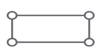

- Feature (`ee.Feture`): A geometry with properties. Line/Point/Polygon/etc,
Property List

     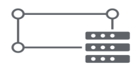

- Features Collection (`ee.FeatureCollection`): A collection of Features (geometries with properties)

     

- Reducers (`ee.Reducer`): Object used for aggregations and numerical calculations (for bands, time series, features...)

     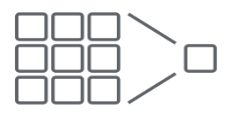
     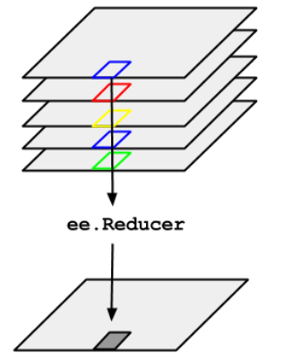

For more information access the [EE objects and methods site](https://developers.google.com/earth-engine/guides/objects_methods_overview).

Let's learn how to use the API. Suppose you want to add two numbers, represented by the variables a and b , as shown below. Create a new script and enter the following:

```javascript
var a = 1;
var b = 2;
```

Earlier, you learned how to store numbers in variables, but not how to do any calculations. This is because when you use Earth Engine, you don't do addition using JavaScript operators. For example, you would not write `var c = a + b` to add the two numbers. Instead, the Earth Engine API gives you functions to do this, and it is important that you use the API functions whenever you can. It may seem cumbersome at first, but using functions, as we'll describe next, will help you avoid timeouts and create efficient code.

Looking at the `Docs` tab, you will find a group of methods that can be called on an `ee.Number`. Expand to see the various functions available for working with numbers. You will see the function `ee.Number` which creates an Earth Engine number object from a value. In the function list, there is an addition function (`add`) to add two numbers. That's what you use to add `a` and `b`.

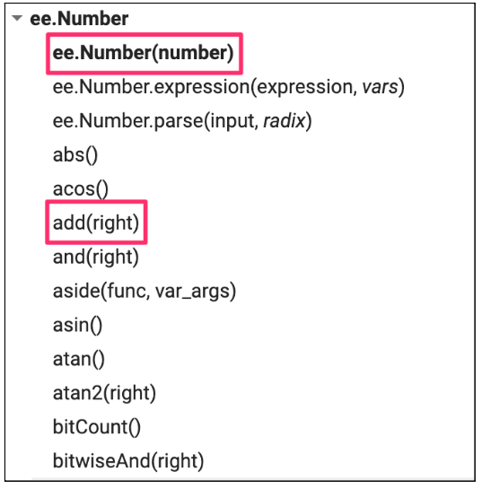

To add `a` and `b`, we first create an `ee.Number` object from the variable a with `ee.Number(a)`. And then we can use the `add(b)` call to add the value of `b` to it. The following code shows the syntax and prints the result, which of course is the value 3.

```javascript
var result = ee.Number(a).add(b);
print(result);
```

You may have already realized that when you learn to program on Earth Engine, you don't need to learn JavaScript or Python in depth, they are just ways to access the Earth Engine API. This API is the same whether it is called from JavaScript or Python.

Here is another example to drive this point home. Let's say you're working on a task that requires you to create a list of years from 1980 to 2020 with an interval of five years. If you are faced with this task, the first step is to switch to the `Docs` tab and open the `ee.List` module. Browse through the features and see if there are any features that can help. You will notice a function `ee.List.sequence`. Clicking on it will bring up the documentation for the function.

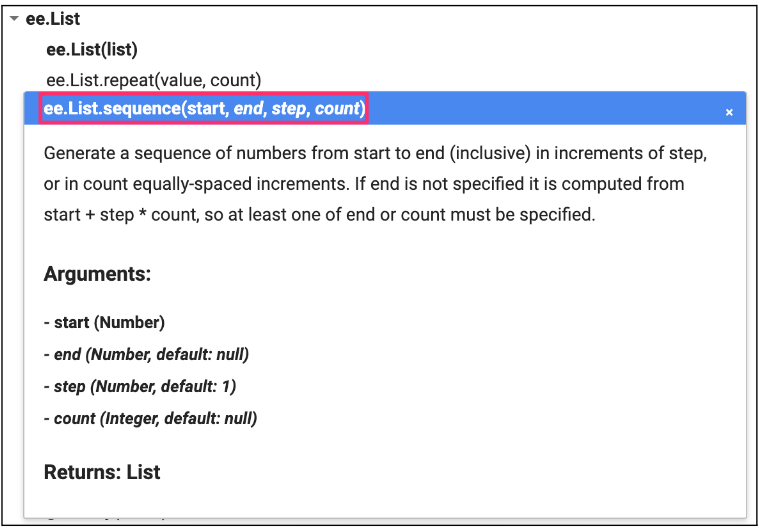

The `ee.List.sequence` function can generate a sequence of numbers from a given start value to the end value. It also has an optional parameter step to indicate the increment between each number. We can create an `ee.List` of numbers representing the years from 1980 to 2020, counting by 5 by 5, by calling this built-in function with the following values: `start` = 1980, `end` = 2020 and `step` = 5.

```javascript
var yearsList = ee.List.sequence(1980, 2020, 5);
print(yearsList);
```

The output printed to the `Console` will show that the yearList variable contains the list of years with the correct interval.

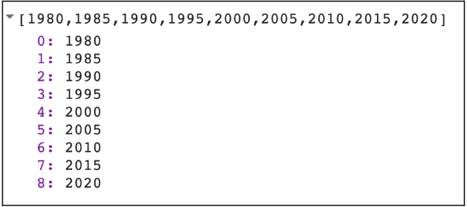

Now let's look at an example of reduction (`ee.Reducer`). As we saw, `ee.Reducer` is the object used for aggregations and calculations. We create a list with numbers from 1 to 5 and we want to calculate the average of these numbers. For that, we use the `reduce()` function for lists and choose the `ee.Reducer` (look in the `Docs` for the `ee.Reducer.mean()` reducer). Note that we can use the same `ee.List.sequence` function to create the list but without the need to define the `step` since `step` has the value 1 by default.

```javascript
var numbersList = ee.List.sequence(1, 5);

var mean = numbersList.reduce(ee.Reducer.mean());
print(mean);
```

You have just completed a moderately complex programming task with the help of the Earth Engine API.

### Challenge 1

Suppose you have the following two string variables defined in the code below. Use the Earth Engine API to create a new string variable called `result` by combining these two `Strings`. Print it in the `Console`. The printed value should say "Sentinel2A".

```javascript
var mission = ee.String('Sentinel');
var satellite = ee.String('2A');
```

*Hint*: Use the `cat` function of the `ee.String` module to "concatenate" (join) the two `strings`. You will find more information about all the functions available in the `Docs` tab of the Code Editor.

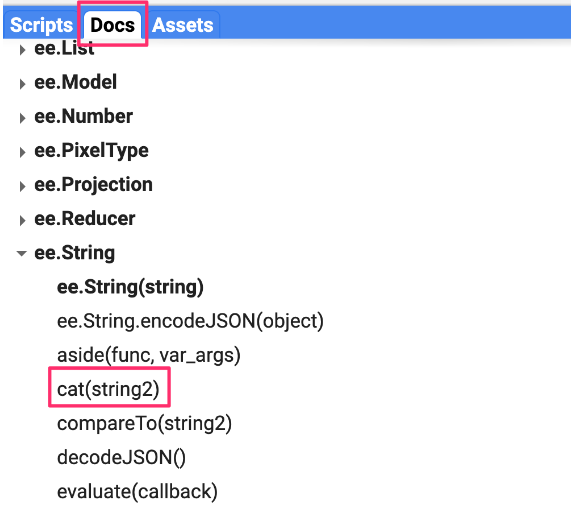

### Challenge 2

Create a dictionary called `myInformation` using the `ee.Dictionary` object with your personal information: `name`, `age`, and a list of your 3 favorite movies `movies`. Print it in the `Console`.

### Challenge 3

Get the value stored in `age` and save it in a variable with a new name (example: `myAge`). Print it in the `Console`.

*Hint*: Use the `get()` function of the `ee.Dictionary` object.

Notice that the value printed is of type `Computed Object`. That means it's not an EE object yet. If you were to perform a mathematical operation on this number, you would need to "cast" it to the `ee.Number` object.

### Challenge 4

Get the second value from the list below and save it in a variable (example: `secondValue`).
Divide that number by 2 and save it in a variable (example: `result1`). Print this result to the `Console`.

*Hint*: look up information for the `get()` function of `ee.List`. Note that indexing starts at 0.

*Hint*: Search for the `divide()` function of `ee.Number`. The values of `myList` need to be cast to an `ee.Number` first, before the number functions can be used. Note that we do not need to cast the number 2 in `divide()` - Earth Engine already casts that number to `ee.Number` once we are using an API function (`divide()`).

```javascript
var myList = ee.List([1, 2, 5, 4]);
```

### Challenge 5

Multiply the second value of `myList` by 5 and store it in a variable (example: `result2`). Print it in the `Console`.

*Hint*: Search for the `multiply()` function of `ee.Number`. The values of `myList` need to be cast to an `ee.Number` first, before the number functions can be used. Note that we do not need to cast the number 5 in `multiply()` - Earth Engine already casts that number to `ee.Number` once we are using the API function (`multiply()`).

### Challenge 6

Multiply each number in `myList` by 3. Save the result in a new variable called `newList` and print it.

*Hint*: Complete the `triplicate` function below. Use `map()` to apply the function to each item in the list. Don't forget about the casting.

```javascript
function triplicate(number) {
   return ; // complete this function.
}
```

### Challenge 7

Calculates the sum of all Numbers in `newList`. Save and print that value as `sum`.

### Complete code

"`3 Earth Engine API`" script from repository and `T1 & T2` folder or direct link:
[https://code.earthengine.google.com/fc67eeca8496c9647ea68c1dd235f3cd](https://code.earthengine.google.com/fc67eeca8496c9647ea68c1dd235f3cd).
