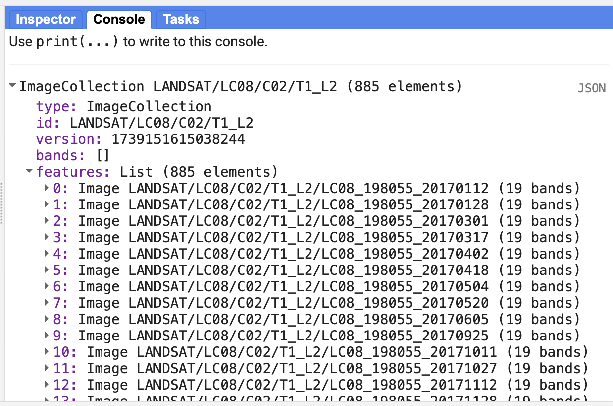
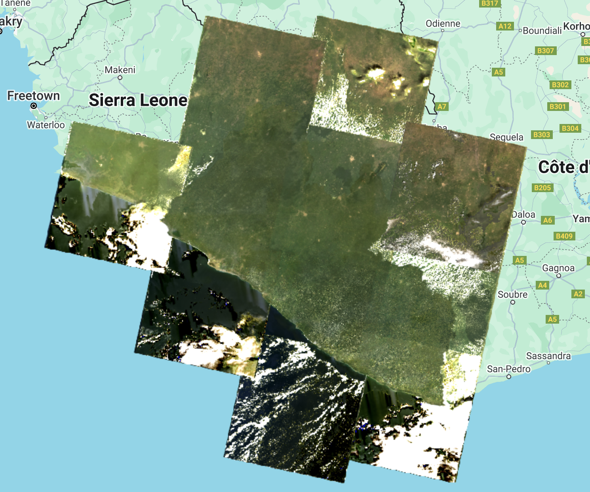
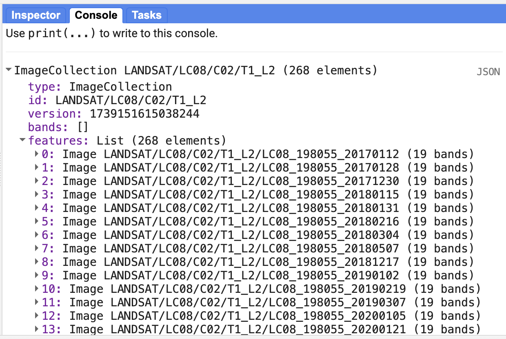
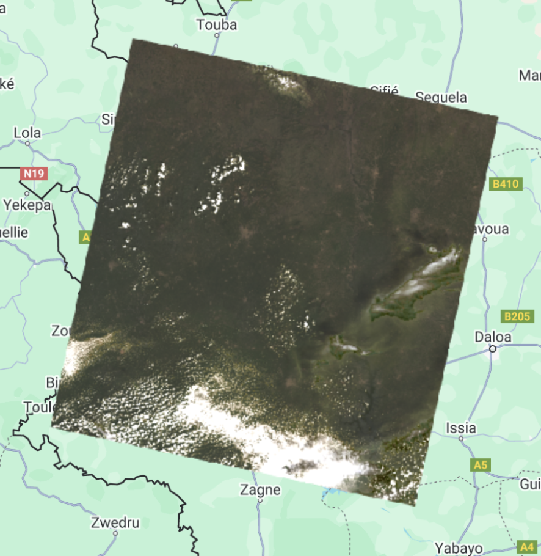
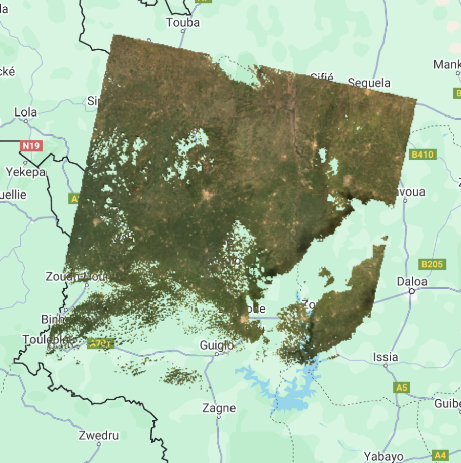
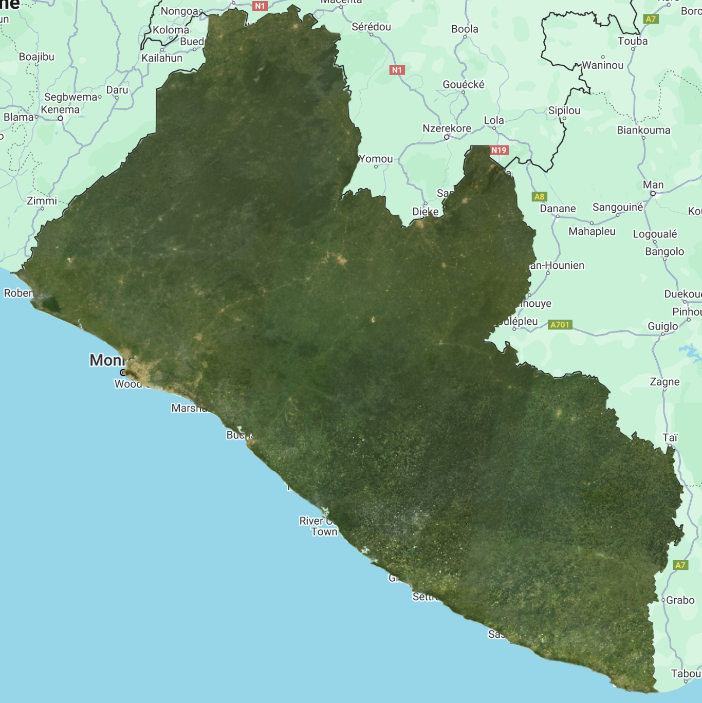

# Image Collections & Composites in Earth Engine

Depending on how long a remote sensing platform has been in operation, there may be thousands or millions of images collected from the Earth (e.g. Landsat). In Earth Engine, these are organized into `ee.ImageCollection`, a specialized data type that has specific operations available in the Earth Engine API. Like individual images, they can be viewed with `Map.addLayer`, filtered using the `filter` function, and mapped functions with `map`.

We are going to filter the Landsat 8 Collection 2, Tier 1, Level 2, to the limits of Suriname, using the `filterBounds` function and by dates to obtain images from January 2017 to December 2021, using the `filterDate` function.

```javascript
//--------------------------------------------------------------
// Define area of interest (vector data)
//--------------------------------------------------------------

var suriname = ee.FeatureCollection('projects/caribbean-trainings/assets/suriname-2023/boundary');
// TIP: Centering the map before adding a layer is more efficient 
// than adding it afterward.

//--------------------------------------------------------------
// Define raster data
//--------------------------------------------------------------

// We will work with Landsat 8 data.
// Search in the search bar for 'Landsat 8 Collection 2 Level 2 Tier 1'.
// Collection 2 -> More advanced level of processing.
// https://www.usgs.gov/landsat-missions/landsat-collection-2
// Level 2 -> Surface reflectance data.
// Tier 1 -> Highest quality data.

var landsat8 = ee.ImageCollection('LANDSAT/LC08/C02/T1_L2');

var collection = landsat8
    .filterDate('2017-01-01', '2022-01-01')
    .filterBounds(suriname);

Map.addLayer(collection, {bands: ['SR_B4', 'SR_B3', 'SR_B2'], min: 7000, max: 12000}, 'Landsat 8 Collection');

print(collection);
```

The result is images superimposed on each other and a total of 887 images. Take into account that the images that appear at the top are in accordance with the order of the images within the collection. In the `Console` you can look at the order of the images.




We can filter the collection by cloud cover as well. For that, we add one more filter on the `landsat8` variable and use the `CLOUD_COVER` property that contains cloud cover percentage information per image. Change the `collection` variable:

```javascript
var collection = landsat8
    .filterDate('2017-01-01', '2022-01-01')
    .filterBounds(suriname)
    .filter(ee.Filter.lt('CLOUD_COVER', 30));
```

We use the `ee.Filter.lt` to get images that have cloud cover "less than" 30%. Notice that we now have 200 images.





Now, we are going to apply a cloud masking function. Clouds and cloud shadows reduce the view of the optical sensors and completely block or obscure the spectral response of the Earth's surface. Working with pixels that are contaminated by clouds can significantly influence the accuracy and information content of products derived from a variety of remote sensing activities, including land cover classification, vegetation modeling, and especially change detection, where undetected clouds can be mapped as false changes. Therefore, the information provided by cloud detection algorithms is essential to exclude clouds and cloud shadows from subsequent processing steps.

First, we scale the images as it is recommended by the developer ([https://developers.google.com/earth-engine/datasets/catalog/LANDSAT_LC08_C02_T1_L2](https://developers.google.com/earth-engine/datasets/catalog/LANDSAT_LC08_C02_T1_L2)). A scale factor must be applied to both Collection 1 and Collection 2 Landsat Level-2 surface reflectance and surface temperature products before using the data. Please note: Landsat Collection 1 and Collection 2 Tier 2 science products have different scale factors, fill values, and different data types ([https://www.usgs.gov/faqs/how-do-i- use-scale-factor-landsat-level-2-science-products](https://www.usgs.gov/faqs/how-do-i-use-scale-factor-landsat-level-2-science-products)).

We create a function for the application of the scale factors:

```javascript
//--------------------------------------------------------------
// Time series preprocessing
// (Scaling and cloud masking)
//--------------------------------------------------------------

// Preprocess time series using functions that are applied
// to each and every image in the collection.

// Function to apply scale factors.
// To get surface reflectance values between 0 and 1
// (fraction of input solar radiation), we need to use
// scale factors provided by NASA/USGS.
function applyScaleFactors(image) {
  var opticalBands = image.select('SR_B.').multiply(0.0000275).add(-0.2);
  var thermalBands = image.select('ST_B.*').multiply(0.00341802).add(149.0);
  return image.addBands(opticalBands, null, true)
              .addBands(thermalBands, null, true);
}
```

And a function for cloud masking:

```javascript
// Cloud masking function.
// The quality band 'QA_PIXEL' provides information about the presence of clouds
// and other aspects of image quality.
// The information is stored in bits and we use the 'bitWiseAnd' function
// to extract it.
// The quality band 'QA_RADSAT' provides quality information about
// radiometric saturation.
function maskL8sr(image) {
  // Bit 0 - Fill
  // Bit 1 - Dilated Cloud
  // Bit 2 - Cirrus
  // Bit 3 - Cloud
  // Bit 4 - Cloud Shadow
  var qaMask = image.select('QA_PIXEL').bitwiseAnd(parseInt('11111', 2)).eq(0);
  var saturationMask = image.select('QA_RADSAT').eq(0);

  // Replace the original bands with the scaled ones and apply the masks.
  return image.updateMask(qaMask)
              .updateMask(saturationMask);
}
// Because we are dealing with bits, in the maskL8sr function,
// we use the bitwiseAnd and parseInt functions.
// These are functions that are used to unpack
// the bit information. A bitwise AND is a binary operation
// which takes two binary representations of equal length and
// perform logical AND operation on each pair of
// corresponding bits. Therefore, if both bits in the comparator
// positions have the value 1, the bit in the result
// binary representation is 1 (1 × 1 = 1); otherwise,
// the result is 0 (1 × 0 = 0 and 0 × 0 = 0). The parseInt
// the function parses a string argument (in our case, five characters
// string '11111') and returns an integer of the specified
// numbering system, base 2.
```

Now, we apply the two functions to the collection:

```javascript
// Apply preprocessing functions to the images in the collection.
var preprocessed = collection.map(applyScaleFactors)
                             .map(maskL8sr);
```

We can compare the effects of cloud masking by comparing the same image before and after the process:

```javascript
// ---------------------------------------------------------------
// Display the first image unprocessed and preprocessed
//---------------------------------------------------------------

// Select the first unprocessed image.
var firstUnprocessed = collection.first();

// Define visualization parameters.
var unprocessedVisParams = {
  bands: ['SR_B4', 'SR_B3', 'SR_B2'],
  min: 4380,
  max: 22300
};

// Add image to the map.
Map.addLayer(firstUnprocessed, 
             unprocessedVisParams, 
             'First unprocessed image');


// Select the first preprocessed image.
var firstPreprocessed = preprocessed.first();

var preprocessedVisParams = {
  bands: ['SR_B4', 'SR_B3', 'SR_B2'],
  min: 0,
  max: 0.15
};


// Agregar imagen al mapa.
Map.addLayer(firstPreprocessed, 
             preprocessedVisParams, 
             'First preprocessed image');
```





Now, we can create a median composite:

```javascript
//--------------------------------------------------------------
// Create a composite
//--------------------------------------------------------------
// Use the following functions to compare different aggregations:
// .min(); .max(); .mean(); .median()

// We will work with the Median composite.
var composite = preprocessed.median().clip(suriname);

// Add the composite to the map.
Map.addLayer(composite, preprocessedVisParams, 'Median Composite');
```

Note that the `median` function is shorthand for `reduce(ee.Reducer.median())`.



And finally, export this image to Google Drive or as a GEE Asset:

```javascript
//--------------------------------------------------------------
// Export composite to Google Drive or as a EE Asset
//--------------------------------------------------------------

// Export to Google Drive.
Export.image.toDrive({
  image: composite.toFloat(),
  description: 'medianL8composite_2017-2021',
  fileNamePrefix: 'medianL8composite_2017-2021',
  region: suriname,
  scale: 30,
  maxPixels: 1e13
});

// Export as a GEE Asset.
Export.image.toAsset({
  image: composite,
  description: 'medianL8composite_2017-2021',
  assetId: 'projects/caribbean-trainings/assets/suriname-2023/images/medianL8composite_2017-2021', //! UPDATE TO YOUR OWN PATH.
  region: suriname,
  scale: 30,
  maxPixels: 1e13
});
```

## Complete code

Script "`6 ImageCollections & Composite`" in the repository and folder `T3` or direct link: [https://code.earthengine.google.com/56778dd1a508c78473589e3045840577](https://code.earthengine.google.com/56778dd1a508c78473589e3045840577)
